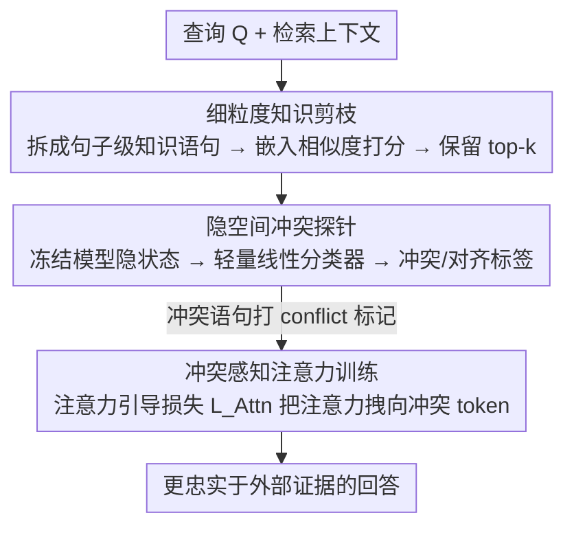

# Beyond Black-Box Interventions: Latent Probing for Faithful Retrieval-Augmented Generation

**会议**: ACL 2026 Findings  
**arXiv**: [2510.12460](https://arxiv.org/abs/2510.12460)  
**代码**: [GitHub](https://github.com/XMUDeepLIT/ProbeRAG)  
**领域**: Information Retrieval / RAG  
**关键词**: RAG忠实性, 知识冲突, 隐空间探测, 注意力引导, 上下文剪枝

## 一句话总结

提出 ProbeRAG，通过发现 LLM 隐空间中冲突/对齐知识的线性可分性，设计三阶段框架（细粒度知识剪枝→隐空间冲突探测→冲突感知注意力），从模型内部机制解决 RAG 忠实性问题。

## 研究背景与动机

**领域现状**: RAG 系统通过外部知识增强 LLM，有效缓解幻觉问题。但在实践中，RAG 常面临上下文忠实性挑战：生成内容与检索上下文不一致，或未充分利用外部证据。

**现有痛点**: 现有方法均将 LLM 视为黑箱，通过外部干预改善忠实性：(1) 提示方法对提示敏感，泛化性差；(2) 解码校准方法在噪声上下文下脆弱；(3) DPO 偏好优化需要大量高质量偏好数据。这些方法无法诊断冲突"何时"和"为何"发生。

**核心矛盾**: 外部干预是相关性的而非因果性的——可以统计性地关联输入与忠实输出，但不能诊断特定冲突实例中模型失败的原因。

**本文目标**: 超越黑箱干预，从模型内部隐空间分析和解决知识冲突问题。

**切入角度**: 分析 LLM 隐空间发现冲突/对齐知识在隐状态中线性可分，上下文噪声系统性增加隐状态熵。

**核心 idea**: 训练轻量探针检测隐空间中的冲突特征，然后通过注意力引导 loss 让模型更关注冲突知识。

## 方法详解

### 整体框架

ProbeRAG 不把 LLM 当黑箱去外部干预，而是顺着"冲突知识在隐空间线性可分"这一观察，从模型内部机制下手解决 RAG 忠实性。给定查询和检索上下文，框架分三阶段串行处理：先把上下文拆成细粒度知识语句并滤掉无关项以降噪，再用一个轻量探针在隐状态里检出哪些语句与模型参数知识冲突，最后给冲突语句打上 `<conflict>` 标记并训练模型在注意力层向它们倾斜，最终输出更忠实于外部证据的回答。

### 关键设计

**1. 细粒度知识剪枝：先降噪，保住冲突特征的可分性**

预备研究发现上下文噪声会系统性抬高隐状态熵，把冲突/对齐知识的分界线糊掉，所以第一步必须降噪。本文用 LLM 把上下文拆成句子级的独立知识语句 $\{K_1, K_2, ..., K_n\}$，再用嵌入相似度 $f(Q, K_i) = \langle q, k_i \rangle$ 给每条语句和查询打分，只保留 top-k。剪枝既减轻了后续探针的负担，又把残留噪声压下去，让隐空间里那条线性边界重新变清晰——后面的消融也证实，不剪枝则探针准确率明显下滑。

**2. 隐空间冲突探针：用一个线性分类器读出冲突信号**

t-SNE 可视化加 JSD 分析显示，冲突知识与对齐知识在 LLM 隐状态中是线性可分的，这条性质可以反过来利用。本文在 MQuAKE 知识编辑数据集上训练一个轻量分类器 $\mathcal{P}(\mathcal{M}(K_i)) \in \{0, 1\}$，输入是冻结模型对知识语句 $K_i$ 的隐状态，输出冲突/对齐二分类标签。探针本身极轻（一个简单分类器），却能精准定位上下文里"和模型记忆打架"的语句，而且虽然只在 MQuAKE 上训练，迁移到 RAG 领域数据仍泛化良好。

**3. 冲突感知注意力训练：把注意力显式拽向冲突知识**

模型天然倾向用参数记忆、忽视外部上下文，光检出冲突还不够，得逼它在生成时真正去看冲突知识。为此引入注意力引导损失 $\mathcal{L}_{\text{Attn}} = \frac{1}{|P|}\sum_{(i,j) \in P}(1 - \alpha_{ij})$，对每个"后续 token→冲突知识 token"的位置对 $P$ 惩罚过低的注意力权重 $\alpha_{ij}$，强制模型给冲突 token 分配更多关注。它与交叉熵以 $\mathcal{L} = (1-\lambda)\mathcal{L}_{CE} + \lambda\mathcal{L}_{Attn}$ 联合优化，$\lambda$ 调节"答得对"与"看得准"之间的权衡，从注意力层面直接纠正模型对参数知识的过度依赖。

### 损失函数 / 训练策略

联合目标为交叉熵加注意力引导损失，由 $\lambda$ 控制二者权衡。探针在 MQuAKE 数据集上训练但保持对 RAG 领域数据的泛化性；冲突知识在序列中用 `<conflict>` / `</conflict>` 特殊 token 包裹，供注意力引导损失定位目标位置。

## 实验关键数据

### 主实验

| 模型 | 方法 | FaithEval F1 | ConFiQA F1 | SQuAD F1 |
|------|------|-------------|-----------|----------|
| LLaMA-3.1-8B | No-Context | 27.7 | 5.0-6.1 | 8.9 |
| LLaMA-3.1-8B | Baseline RAG | ~59% | - | - |
| LLaMA-3.1-8B | ProbeRAG | **显著提升** | **显著提升** | **显著提升** |

### 关键分析

| 分析 | 发现 |
|------|------|
| 隐状态 JSD 随层深度增加 | 深层捕获更抽象的冲突特征，更大模型 JSD 更显著 |
| 噪声影响 | 上下文噪声系统性模糊冲突/对齐边界 |
| 探针泛化性 | 在 MQuAKE 上训练，在 RAG 数据上泛化良好 |
| 注意力 vs ICL | 注意力引导显著优于纯 in-context learning |

### 关键发现

- 冲突和对齐知识在隐空间中线性可分（所有模型大小均验证）
- 冲突特征主要在中后层出现，与 Transformer 层级表示假说一致
- 细粒度知识剪枝是关键——不剪枝则探针准确率显著下降
- 注意力引导比 DPO 等外部干预更有效且数据需求更低

## 亮点与洞察

- 从黑箱干预转向内部机制分析，范式转换意义重大
- "冲突特征"的发现具有理论价值——解释了 LLM 为何倾向参数知识
- 三阶段框架各司其职：降噪→检测→引导，逻辑清晰
- 探针轻量化（简单分类器），易于部署

## 局限与展望

- 知识分解依赖外部 LLM（GPT-4o），增加成本
- 探针需要冲突/对齐标注数据训练
- 注意力引导训练需要微调模型
- 未来可探索无需微调的推理时冲突缓解方案

## 相关工作与启发

- 线性表示假说（Park et al., 2023）：隐空间中语义概念的线性可分性
- 知识编辑（MQuAKE, Zhong et al., 2023）：提供冲突/对齐知识对
- RAG 忠实性方法：Self-RAG、CRAG 等
- 隐空间探测是理解和干预 LLM 行为的有力工具

## 评分

- 新颖性: ⭐⭐⭐⭐⭐ 从隐空间角度解决 RAG 忠实性，发现冲突特征
- 实验充分度: ⭐⭐⭐⭐ 多模型多数据集，预备研究和消融充分
- 写作质量: ⭐⭐⭐⭐⭐ 从发现到方法的逻辑链极其清晰
- 价值: ⭐⭐⭐⭐⭐ 对 RAG 忠实性问题提供了机制性理解和解决方案

<!-- RELATED:START -->

## 相关论文

- [\[ACL 2026\] CiteGuard: Faithful Citation Attribution for LLMs via Retrieval-Augmented Validation](citeguard_faithful_citation_attribution_for_llms_via_retrieval-augmented_validat.md)
- [\[ACL 2025\] FaithfulRAG: Fact-Level Conflict Modeling for Context-Faithful Retrieval-Augmented Generation](../../ACL2025/information_retrieval/faithfulrag_fact_level_conflict.md)
- [\[ACL 2026\] Language-Coupled Reinforcement Learning for Multilingual Retrieval-Augmented Generation](language-coupled_reinforcement_learning_for_multilingual_retrieval-augmented_gen.md)
- [\[ACL 2026\] Feedback Adaptation for Retrieval-Augmented Generation](feedback_adaptation_for_retrieval-augmented_generation.md)
- [\[ACL 2026\] MASS-RAG: Multi-Agent Synthesis Retrieval-Augmented Generation](mass-rag_multi-agent_synthesis_retrieval-augmented_generation.md)

<!-- RELATED:END -->
