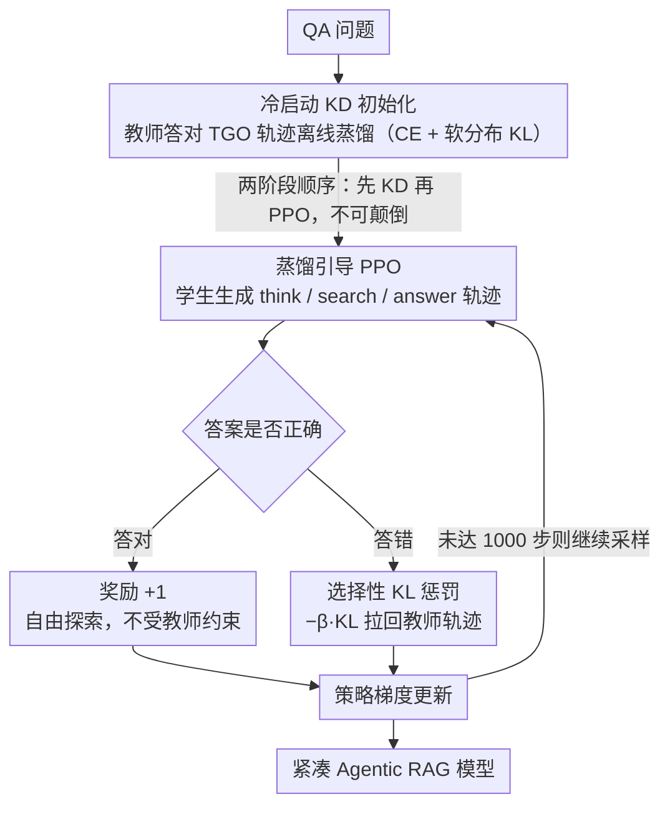

# Can Compact Language Models Search Like Agents? Distillation-Guided Policy Optimization for Preserving Agentic RAG Capabilities

**会议**: ACL 2026  
**arXiv**: [2508.20324](https://arxiv.org/abs/2508.20324)  
**代码**: https://github.com/omron-sinicx/dgpo  
**领域**: 信息检索 / LLM Agent  
**关键词**: Agentic RAG, 知识蒸馏, 强化学习, 紧凑模型, PPO

## 一句话总结
本文提出 DGPO：用教师 demonstration 做冷启动 KD 初始化，再在 PPO 阶段对"错误样本"施加 KL 蒸馏惩罚，让 0.5B 紧凑模型获得 Agentic RAG 能力，在 7 个 QA benchmark 上平均 EM 从 0.006 提升到 0.329，部分数据集甚至反超 3B 教师。

## 研究背景与动机

**领域现状**：Agentic RAG（如 Search-R1、ReAct）已成为 LLM 调用外部检索的主流范式，模型需要交错执行 `<think>`、`<search>`、`<answer>` 三类动作完成多跳问答。这类系统对 LLM 的推理能力要求很高，因此现有工作几乎都依赖数十亿参数以上的大模型。

**现有痛点**：作者尝试把 Search-R1 那一套 PPO 训练直接搬到 0.5–1B 的紧凑模型上，发现两条主流路径都失效。一是 RL 路径——紧凑模型初始 EM 几乎为 0（Qwen2.5-0.5B 在 7 个数据集上平均仅 0.006），导致 PPO/GRPO 长期拿不到正奖励，要么收敛极慢要么早期就崩溃；二是 KD 路径——纯 TGO 蒸馏存在 exposure bias，纯 SGO on-policy 蒸馏又被噪声样本带偏，DistiLLM/TAID 等动态调度方法对学生–教师 capacity gap 也很敏感。

**核心矛盾**：紧凑模型的 SGO 质量太差，既不能支撑 RL 的探索（无奖励信号），又不能支撑 on-policy 蒸馏（噪声目标）；而离线 TGO 蒸馏又解决不了训练–推理分布不一致问题。**根本矛盾是「冷启动质量」与「探索能力」无法兼得**。

**本文目标**：把 0.5–1B 紧凑模型训练成能像 agent 一样多轮搜索的检索模型，同时保证训练稳定性，并提供一套细粒度评估指标，定位 agentic 能力的具体短板。

**切入角度**：作者重新思考 PPO 中 reference model 的作用——传统 PPO 把它当作 KL 正则锚点（防止策略漂移），而本文把教师模型变成"主动指导者"：学生答对时让它自由探索，学生答错时用 KL 蒸馏把它"拉回"教师轨迹。

**核心 idea**：用「KD 冷启动 + 选择性 KL 蒸馏惩罚」把蒸馏融进 PPO 内部，让 reference model 从被动的正则化器变成主动的教学者，从而在紧凑模型上获得稳定且超越教师的 agentic RAG 能力。

## 方法详解

### 整体框架
DGPO 的输入是一个 QA 问题，输出是交错 `<think>/<search>/<answer>` 的 agentic 轨迹，难点在于 0.5B 学生初始性能近乎为 0，既拿不到 RL 奖励也学不动 on-policy 蒸馏。它把整套训练拆成首尾相接的两段：先用教师答对的 TGO 轨迹离线蒸馏，把学生顶到能稳定产出合理行为骨架的起点；再以这个学生为初始策略跑 PPO，但重新设计奖励——答对给标量 +1，答错则把奖励替换成对教师的 KL 蒸馏惩罚 $-\beta D_{\text{KL}}[\pi_\theta(y\mid x;\mathcal{R})\|\pi_g(y\mid x;\mathcal{R})]$，让错误样本也能从模仿教师中拿到密集信号。整个衔接靠一个性能阈值触发，不需要 TAID/DistiLLM 那种手工调 $\alpha$ 插值系数的调度器。

### 关键设计

**1. 冷启动 KD 初始化：先把学生顶过零性能门槛**

紧凑模型最致命的问题是初始 EM 几乎为 0，PPO 长期拿不到正奖励，要么收敛极慢要么早期崩溃。DGPO 用教师答对的 TGO 轨迹做离线蒸馏，损失是硬标签与软分布的混合 $\mathcal{L}_{\text{distill}} = \mathcal{L}_{\text{CE}}(\pi_g,\pi_\theta) + \lambda D_{\text{KL}}[\pi_g(\cdot\mid x)\|\pi_\theta(\cdot\mid x)]$，$\lambda$ 平衡两项。这里刻意只保留答对的轨迹，因为错误轨迹会把错误的检索决策也一并传给学生。

之所以用完整 KD 而非 SFT warm-start，是因为 SFT 只能学硬标签（实验里 SFT→PPO 仅 0.289），而软分布额外携带了"教师在歧义处如何权衡"这种细粒度信息——单靠这步 KD 初始化就能到 0.298，已经反超 SFT warm-start。

**2. 选择性 KL 惩罚：让教师从正则锚点变成错误纠正者**

标准 PPO 的奖励是 $r_{\text{answer}}=\mathbb{1}[y=y^*]$，错误样本奖励恒为 0、毫无学习信号；DGPO 把它改成答对给 1、答错给 $-\beta D_{\text{KL}}[\pi_\theta(y\mid x;\mathcal{R})\|\pi_g(y\mid x;\mathcal{R})]$，等于只对错误样本施加蒸馏惩罚。这样答对的样本保留自由探索空间不受教师约束，答错的样本被强力拉回教师轨迹，本质是用 dense 蒸馏奖励去填补 sparse 二值奖励的空白。

关键在于"选择性"：消融里把它改成对所有样本统一施加蒸馏（uniform KL），平均 EM 从 0.329 掉到 0.314；完全去掉教师 guidance 退回普通 PPO 则掉到 0.306。这说明只纠正错误样本既保住了 RL 的探索能力，又避免了被噪声 SGO 带偏。

**3. KD→PPO 的两阶段顺序：先有合理行为再做策略梯度**

两阶段的先后不能颠倒——先跑 5 个 epoch KD 初始化，再跑最多 1000 步 distillation-guided PPO。一旦反过来让 PPO 在尚未成形的弱策略上起步，奖励会长期为 0 并迅速陷入退化策略，之后再补 KD 也救不回来。消融中 invert pipeline（PPO→KD）平均 EM 仅 0.286，比完整 DGPO 低 4.3 个点，印证了初始化顺序对紧凑模型尤其敏感。

### 损失函数 / 训练策略
KD 阶段取 $\lambda=1.0$ 平衡 CE 与 KL；PPO 阶段取 $\beta=0.001$ 控制错误样本的蒸馏强度，最多 4 轮对话、每轮 top-3 文档检索（E5 retriever，2018 Wiki dump）。token masking 只在 LLM 生成 token 上回传梯度，`<information>` 段不算梯度。训练在 NVIDIA 8×H200 上约 1 天完成。

## 实验关键数据

### 主实验
Qwen 2.5（3B 教师 → 0.5B 学生）在 7 个 QA benchmark 上的 EM 对比：

| 方法 | NQ | TriviaQA | HotpotQA | MuSiQue | Bamboogle | Avg | 备注 |
|------|------|----------|----------|---------|-----------|------|------|
| Student-0.5B | 0.004 | 0.006 | 0.007 | 0.000 | 0.000 | 0.006 | 未训练 |
| Teacher-3B | 0.365 | 0.569 | 0.340 | 0.135 | 0.298 | 0.353 | 上限参考 |
| PPO (Search-R1) | 0.306 | 0.444 | 0.205 | 0.041 | 0.073 | 0.238 | RL baseline |
| SFT→PPO | 0.338 | 0.415 | 0.296 | 0.088 | 0.250 | 0.289 | warm start |
| KD (Hinton) | 0.331 | 0.431 | 0.286 | 0.091 | 0.290 | 0.298 | 离线蒸馏 |
| DistiLLM | 0.333 | 0.442 | 0.288 | 0.095 | 0.209 | 0.287 | 自适应蒸馏 |
| TAID | 0.325 | 0.427 | 0.290 | 0.079 | 0.218 | 0.282 | 调度蒸馏 |
| **DGPO** | **0.378** | **0.481** | **0.342** | 0.120 | 0.274 | **0.329** | 在 NQ/HotpotQA 等反超 3B 教师 |

跨模型族也验证了通用性：Qwen 7B→0.5B 平均 EM 从 PPO 的 0.238 提升到 0.323；Llama-3 8B→1B 从 0.250 提升到 0.389，仅差 8B 教师 4.9 个点。

### 消融实验

| 配置 | Avg EM | 说明 |
|------|--------|------|
| DGPO 完整 | 0.329 | KD 冷启动 + KD→PPO + 选择性 KL |
| w/o 冷启动初始化 | 0.320 | 训练在 step 800 后崩溃，取崩前最高分 |
| w/o 选择性 KL（改 uniform） | 0.314 | 对正确样本也蒸馏，约束过强 |
| w/o 教师 guidance（标准 PPO） | 0.306 | 错误样本无学习信号 |
| invert pipeline（PPO→KD） | 0.286 | 顺序颠倒，PPO 阶段已崩坏 |

### 关键发现
- **冷启动 KD 是稳定性关键**：去掉后训练在 step 800 崩溃，说明紧凑模型不能裸跑 PPO；但崩前的最高分（0.320）跟 DGPO 差距不大，说明性能主要来自蒸馏，**稳定性** 来自 KD 初始化。
- **选择性 KL > 统一 KL**：把蒸馏只施加在错误样本上比对所有样本都施加好 1.5 个点，证明"自由探索 + 错误纠正"的组合优于纯模仿。
- **细粒度 ARCap 拆解**：在 NQ（单跳）上 Query Rewriting Hit ratio 反而是普通 PPO 最高（0.711 > 教师 0.682），DGPO 0.682 与教师持平；MuSiQue（多跳）上 DGPO 的 Hit ratio（0.583）和搜索步数（2.64）都最高，说明紧凑模型靠"多次搜索补偿单次推理弱"来达成多跳推理。
- **GRPO 不适合紧凑模型**：GRPO 收敛快但早崩，即使加上 KD 初始化和教师 guidance 也不稳定，作者全文实验都用 PPO。

## 亮点与洞察
- **重新定义 reference model 的角色**：从 KL 锚点（被动）变成教学者（主动）。这一观念迁移到任何 PPO-style 微调都可能有用——只要存在一个比当前策略强的 reference，就可以把它从「正则项」升级为「错误纠正项」。
- **"分类讨论 reward"是个简单又强力的 trick**：答对给标量、答错给蒸馏惩罚，本质上是用 dense distillation reward 填补 sparse binary reward 的空白。
- **ARCap 评估框架可复用**：把 agentic 行为拆成 thinking / query rewriting / source referencing 三维度，并设计了"提供 ground-truth context 测纯回答能力"、"测首轮 query 的 Hit ratio"等隔离实验，这种"控制变量地评估 agent 子能力"的设计思路值得借鉴。
- **0.5B + CPU 可跑**：把 agentic RAG 从云端搬到笔记本/手机，55× 性能提升后已经接近 3B 教师。

## 局限与展望
- 模型族仅在 Qwen2.5 和 Llama-3 上验证，没扩展到 Mistral/Phi 等其他紧凑模型族。
- 教师上限是 8B，超大教师（70B+）下 capacity gap 是否仍能被 KD 弥补未知；作者承认这是算力限制。
- 蒸馏引入约 9.5% 额外训练时间（教师 inference），虽小但在更大教师下会显著增加。
- 仅在 QA 任务验证 agentic 行为，对 code、math、tool use 等其他 agentic 场景的迁移性留作 future work。
- 个人补充：选择性 KL 的"正确/错误"边界依赖 EM，而 EM 在 free-form generation（如摘要、对话）里不适用，迁移这套方法到非 QA 任务时需要重新定义 reward 切分逻辑。

## 相关工作与启发
- **vs Search-R1 (Jin et al. 2025)**：Search-R1 在 7B+ 上跑 PPO 没问题，但在 0.5B 上 reward 太稀疏；本文用蒸馏给错误样本补 dense reward，专门解决紧凑模型问题。
- **vs DistiLLM (Ko et al. 2024) / TAID (Shing et al. 2025)**：他们用 $\alpha$ 插值在 teacher/student 分布间做动态调度，对超参敏感；DGPO 用两阶段 + 选择性 KL，无需调度器。
- **vs GKD (Agarwal et al. 2024)**：纯 on-policy SGO 蒸馏，但紧凑模型 SGO 噪声大，所以 GKD 平均仅 0.240；DGPO 把 on-policy 探索和 off-policy KD 解耦到两阶段。
- **vs DeepSeek-R1 cold-start**：R1 用 SFT 做 cold-start，本文用完整 KD（含 soft distribution）替换 SFT，证明在小模型上 soft target 比 hard target 更值钱。

## 评分
- 新颖性: ⭐⭐⭐⭐ 「reference model 当老师」这个视角清新，但单独的 KD 初始化和选择性 KL 都不是首创。
- 实验充分度: ⭐⭐⭐⭐⭐ 7 个 QA 数据集 × 3 个模型配置 × 5 个 ablation 维度，还配了 ARCap 子能力评估，相当完整。
- 写作质量: ⭐⭐⭐⭐ 图 1/图 5 把 idea 讲得很清楚，Limitations 也诚实；个别公式（如 Eq.2 的 PPO objective）排版有点挤。
- 价值: ⭐⭐⭐⭐⭐ 把 agentic RAG 拉到 0.5B 尺度可以跑端侧，实际意义大；方法可直接复用到其他 PPO-on-small-model 场景。

<!-- RELATED:START -->

## 相关论文

- [\[ACL 2026\] Enhancing LLM-based Search Agents via Contribution Weighted Group Relative Policy Optimization](enhancing_llm-based_search_agents_via_contribution_weighted_group_relative_polic.md)
- [\[ACL 2026\] Is Agentic RAG Worth It? An Experimental Comparison of RAG Approaches](is_agentic_rag_worth_it_an_experimental_comparison_of_rag_approaches.md)
- [\[ACL 2026\] Agentic Conversational Search with Contextualized Reasoning via Reinforcement Learning](agentic_conversational_search_with_contextualized_reasoning_via_reinforcement_le.md)
- [\[ACL 2026\] End-to-End Optimization of LLM-Driven Multi-Agent Search Systems via Heterogeneous-Group-Based Reinforcement Learning](end-to-end_optimization_of_llm-driven_multi-agent_search_systems_via_heterogeneo.md)
- [\[ACL 2026\] GIFT: Guided Fine-Tuning and Transfer for Enhancing Instruction-Tuned Language Models](gift_guided_fine-tuning_and_transfer_for_enhancing_instruction-tuned_language_mo.md)

<!-- RELATED:END -->
