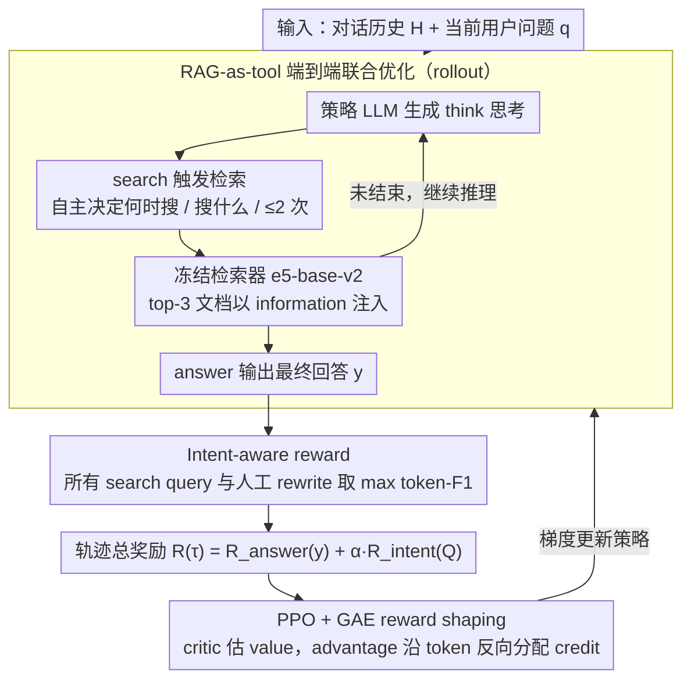

# ChatR1: Reinforcement Learning for Conversational Reasoning and Retrieval Augmented Question Answering

**会议**: ACL 2026  
**arXiv**: [2510.13312](https://arxiv.org/abs/2510.13312)  
**代码**: https://github.com/SimonLupart/ChatR1  
**领域**: 强化学习 / 对话 RAG  
**关键词**: 对话式问答、检索增强生成、意图奖励、PPO、多轮推理

## 一句话总结
作者把 Search-R1 / R1-Searcher 这类"搜索 + 推理"RL 框架从单轮问答扩展到**多轮对话问答**，提出 ChatR1：用 PPO 端到端联合优化 reasoning / search / answer，并设计"intent-aware reward"——用历史人工 rewrite 与模型自发 search query 的 token-F1 作为 turn-level dense reward，在 5 个 CQA 数据集上以 3B 主干击败 ChatGPT/Claude，并大幅提升域外迁移能力。

## 研究背景与动机

**领域现状**：(1) RL 推理代理（Search-R1、R1-Searcher、ReSearch、DeepResearcher）在**单轮 knowledge-intensive QA** 上取得突破，用 GRPO/PPO 训练 LLM 学到"何时搜索、搜索什么、整合证据"的动态行为。(2) 对话问答（CQA）这边几乎全用 SFT 范式——UniConv、ChatRetriever、ChatQA 等都做"query rewrite → retrieve → SFT generate"的静态流水线。(3) 商业产品（Perplexity、ChatGPT search、Gemini Grounding）走向 multi-turn 对话搜索，但黑盒不可知。

**现有痛点**：(1) 单轮 RL 框架假设"问题是完整 self-contained"，无法直接处理"one"指代 European countries、"wind"指代 wind energy 这种对历史依赖的省略和指代；(2) SFT 学到的对话技能只能模仿示范数据，跨域（topic shift / mixed-initiative / multi-doc / faithfulness）泛化差——TopiOCQA 训练的模型在 INSCIT 上往往掉点严重；(3) RL 在多轮场景的最大障碍是 outcome-based reward 过于稀疏：一段对话要走 reasoning → 多次 search → integrate → answer，最终 F1 reward 之间的 credit assignment 极难。

**核心矛盾**：用 RL 的 generalization 优势必须解决 reward sparsity；但传统的 process reward 要么靠 step-level label（贵）、要么靠 retrieved-passage relevance（label 不完整且离散）。CQA 这个 setting 有一个独特的 free lunch：**每个用户 turn 在数据集里有 human-authored query rewrite**（用于 resolve 上下文指代得到 self-contained query），这正是"用户意图"的强代理信号——而以往的 CQA 工作只把它用作 SFT 输入，几乎没人当 RL 监督信号用。

**本文目标**：(1) 构建第一个用 RL 训练的 CQA 框架，让模型自主决定 reasoning / search / answer 调度；(2) 设计一个 dense、retrieval-agnostic、计算便宜的"turn-level intent reward"，缓解 PPO 在多轮场景的 reward sparsity；(3) 验证 RL 在多个 CQA 数据集上是否真比 SFT 更好泛化（in-domain + out-of-domain + LLM-judge 三轴评估）。

**切入角度**：直接复用 CQA 数据集自带的人工 query rewrite $q^{rw}$ 作为意图 ground truth，对 trajectory 中模型生成的所有 search query $q^k$ 计算 max F1，作为 RL 的中间奖励——既稠密、又便宜（数据已有）、又跟 retriever 无关（避免被检索器错误污染）。

**核心 idea**：把"用户意图"显式量化为"模型生成的 search query 是否接近黄金 rewrite"，让 PPO 在每一轮都获得意义明确的中间反馈。

## 方法详解

### 整体框架
ChatR1 是一个用 PPO 训练的 policy LLM $\pi_\theta$（Qwen2.5-3B/7B-Instruct），每个 turn 输入对话历史 $\mathcal{H}$ 和当前 user query $q$，自主输出一条交错 reasoning / search / answer 的轨迹：`<think>` 思考后用 `<search>q^k</search>` 触发 retriever（e5-base-v2，300M，zero-shot，top-3，至多 2 次），检索结果以 `<information>d^k</information>` 注入下一轮推理，最终给出 `<answer>y</answer>`。它的核心难点是多轮对话里 outcome reward 太稀疏，于是把轨迹总奖励拆成答案奖励加意图奖励 $R(\tau) = R_{\text{answer}}(y) + \alpha R_{\text{intent}}(Q)$，再用 PPO+GAE 把它沿所有生成 token 反向分配 credit。训练覆盖 TopiOCQA / QReCC / INSCIT / MultiDoc2Dial / FaithDial 五个数据集，分别对应 topic shift、大语料、mixed-initiative、多文档 grounding、faithfulness 五类挑战。下面三个关键设计按"先架构、再奖励、后优化"的训练数据流逐一展开。

### 关键设计

**1. RAG-as-tool 的端到端联合优化：让检索行为本身可被优化**

ChatR1 把搜索器当外部 tool，由 `<search>` 特殊 token 调起，模型自主决定何时搜、搜什么、搜几次（≤2 次），retriever 全程 frozen（e5-base-v2，300M）。因此所有"检索质量提升"都来自 actor 学到的 query formulation 而非微调检索器——Table 5 显示 ChatR1-7B 的 retrieval R@10 在 TopiOCQA 达 46.9、QReCC 达 61.1，已超过 ConvDR、QuReTeC 等需要 contrastive 微调检索器的强 baseline。

这套设计的好处是三重的：检索端用 300M 编码器，比 UniConv/ChatRetriever 的 7B 编码器便宜得多；actor 与 retrieval/generation 在端到端训练中互相 co-adapt；推理时还能即插即用地换 retriever（BM25 / Dense / Dense+Reranker）做 ablation。

**2. Intent-aware reward：把人工 rewrite 当 dense 监督信号**

上面的 rollout 在多轮场景下暴露出 RL 最大的障碍——reward 稀疏：一段对话要走 reasoning → 多次 search → integrate → answer，最终只有一个 F1 奖励，credit assignment 极难。ChatR1 抓住 CQA 数据集自带 human rewrite $q^{rw}$（用于 resolve 上下文指代）这个 free lunch，把整条轨迹里模型自主生成的所有 search query $Q=\{q^1,...,q^K\}$ 与 $q^{rw}$ 做 token-F1 并取 max：$R_{\text{intent}}(Q) = \max_{q^k \in Q} \mathrm{F1}(q^k, q^{rw})$。取 max 是为了允许"粗查 + 精修"的探索，只要任意一次查询命中意图即获奖，总奖励里 $\alpha=0.2$ 最佳。

这个 reward 之所以好，在于它同时稠密、便宜、且与 retriever 解耦：相比 StepSearch 用检索 hit@k 当中间奖励，F1 是连续值而非二值、又不会被检索器误差污染；相比以往 CQA 只把 rewrite 当 SFT 输入，这里把它升格为 RL 监督，逼模型学会"自主生成接近黄金的 query"而非被动被喂 rewrite；而 passage-level relevance 标注本身既稀疏又有盲点（漏标会造成 hit@k 假阴）。

**3. PPO + GAE 的 trajectory-level reward shaping：把末端奖励铺到中间步骤**

有了 $R(\tau) = R_{\text{answer}}(y) + \alpha R_{\text{intent}}(Q)$ 这个轨迹总奖励，还得让它传回 reasoning 和 search 的中间 token 才能学得动。ChatR1 的 actor 与 critic 用同一 LLM 独立初始化，critic $V_\psi$ 以 squared 误差学每个 token 位置的 value baseline，再算 advantage $\hat{A}_i = \delta_i + (\gamma\lambda)\delta_{i+1} + \cdots$；取 $\gamma=\lambda=1$ 时退化为 REINFORCE 形式 $\hat{A}_i = R(\tau) - V_\psi(\tau_i)$。检索得到的文档 token 沿用 Search-R1 的 loss masking 排除出 policy loss，防止 retriever 输出误导 actor，最大 prompt 3500 token、lr=1e-6、clip $\epsilon=0.2$。

选 PPO 而非 GRPO 是经过对比的——后者在多轮 CQA 上常在 100–200 步 collapse，作者给出的训练曲线显示 PPO 配 critic baseline 在 long-horizon 场景显著更稳。

## 实验关键数据

### 主实验：5 个 CQA 数据集 × 多种 baseline 的回答质量

| 方法 | RAG | LLM | TopiOCQA F1 | QReCC F1 | INSCIT F1 | MD2Dial F1 | FaithDial F1 |
|------|-----|-----|-------------|----------|-----------|-----------|--------------|
| GPT-3.5 (DI) | No | GPT-3.5 | 25.5 | 22.6 | 22.8 | 21.6 | 12.9 |
| Claude (DI) | No | Claude | 27.2 | 25.0 | 27.0 | – | – |
| Qwen-Instr. (RAG) | RAG | Qwen-3B | 8.8 | 15.5 | 13.0 | 18.8 | 12.3 |
| UniConv | RAG | Mistral-7B | 29.6 | 26.2 | 33.2 | – | 11.6 |
| ChatRetriever+Mistral | RAG | Mistral-7B | 28.3 | 26.3 | 30.3 | – | – |
| SFT | No | Qwen-3B | 18.0 | 23.3 | 16.9 | 25.4 | 18.6 |
| QR Search R1 | RAG | Qwen-3B | 20.1 | 20.4 | 27.5 | 23.1 | 14.4 |
| ChatR1 w/o $R_{\text{int.}}$ | RAG | Qwen-3B | 24.4 | 27.0 | 31.3 | 26.4 | 15.5 |
| **ChatR1-3B** | RAG | Qwen-3B | **29.4** | **28.0** | **33.2** | **26.0** | **19.2** |
| **ChatR1-7B** | RAG | Qwen-7B | **30.6** | **31.0** | 32.8 | **31.2** | 18.1 |

ChatR1-3B 击败 GPT-3.5 / Claude 的 DI baseline，retrieval 仅 300M（vs UniConv/ChatRetriever 用 7B 检索器）。`† / ‡` paired t-test p<0.05。

### 消融实验

| 配置 | 关键指标 | 说明 |
|------|---------|------|
| ChatR1-3B (Full) | 29.4 F1 (TopiOCQA) | 完整方法 |
| w/o $R_{\text{intent}}$ | 24.4 F1 (TopiOCQA) | **-5.0**，意图奖励是最大单点贡献 |
| Intent reward 用 hit@3 替代 F1 | 性能明显低于 F1 query reward | 验证 query-level 比 passage-level 更稠密、更鲁棒 |
| $\alpha=0.0$ vs $\alpha=0.2$ vs $\alpha=1.0$ | $\alpha=0.2$ 最佳 | 平衡 reward shaping 与 answer reward |
| 训练 rewrite 来源：T5 / Mistral / GPT-4.1 | F1=24.7 / 27.7 / 29.4 (TopiOCQA) | 更好的 rewrite → 更好的下游性能（一致单调） |
| Optimizer：PPO vs GRPO | PPO 更稳定，GRPO 100–200 步常 collapse | 多轮设置下 PPO 优 |
| Retrieval @ inference：Dense / BM25 / Dense+Rerank | 7B: 30.6 / 22.8 / 32.1 (TopiOCQA F1) | Dense+Reranker 一致最佳；7B 比 3B 更鲁棒（-7.8 vs -11.8 BM25 掉点） |
| OOD: QReCC→其他 4 个 | MD2Dial 仅 -0.2 F1，其他数据集掉点小于 baseline | 跨域泛化强，多数据集上仍超过 ChatGPT |

### 关键发现
- **Intent reward 提供超过 RL 框架本身的增益**：ChatR1 w/o intent reward 已经超过纯 RL baseline，但加入 intent reward 还有 +5 F1（TopiOCQA），说明 dense intermediate signal 在多轮 RL 中是关键瓶颈。
- **Query-level F1 reward > Passage-level hit@k reward**：(i) F1 更稠密、(ii) 与 retriever 解耦，避免检索误差污染策略学习、(iii) passage relevance 标注有 gap，hit-based 假阴噪声多。
- **3B Qwen 击败 GPT-3.5/Claude DI**：单纯靠优秀的 RL + RAG 训练，3B 模型可超过 175B+ 闭源模型（在 CQA 任务上）；说明对话 QA 是"小模型 + 工具 + RL"能显著弥补参数差距的典型场景。
- **域外泛化强**：QReCC 训练的 ChatR1-3B 在 MD2Dial 上仅掉 0.2 F1，4 个 OOD 数据集上有 3 个仍超过 ChatGPT。
- **PPO > GRPO 在多轮场景**：GRPO 经常 100–200 步 collapse；与 Search-R1 实验结论一致。
- **GPT-judge 与 F1 Pearson $r=0.83$**：两种 metric 主结论一致，给 F1 这个 cheap metric 提供可信度背书；同时 zero-shot 模型即使 F1 低但 LLM-judge 不差，说明 fine-tune 模型同时学到了 reference 答案的 word distribution。
- **跨 retriever 鲁棒**：训练时用 dense，推理换 BM25 仅掉 7.8 F1（7B），加上 reranker 还能再提 +1.5 F1，说明 ChatR1 学到的 query 本身就是 retriever-agnostic 的有效 reformulation。

## 亮点与洞察
- **首次把 RL 推理代理范式从单轮扩展到多轮 CQA**：是 Search-R1 系列在对话场景的自然延伸，但解决了 reward sparsity 这个真正困难的新问题——给后续"对话深度研究"（Perplexity/ChatGPT search 风格）打开了一扇学术研究的门。
- **Intent-aware reward 是优雅的"free lunch"设计**：CQA 数据集本就包含 query rewrite 标注（为了 evaluate query rewriting），过去只当 input，本文把它升级为 RL supervision 信号——零额外标注成本、稠密、retrieval-agnostic。这种"复用已有 annotation 当 RL reward"思路可迁移到 entity linking、code generation、agentic tool use 等任何"有 ground-truth intermediate signal"的任务。
- **3B + 小 retriever 击败 7B baselines**：揭示 chat RAG 的瓶颈不在参数量也不在 retriever 容量，而在端到端联合优化——"小模型 + 强工具 + 好 reward"是 cost-effective 部署模式。
- **PPO 显著比 GRPO 稳定在多轮场景**：与 Search-R1 同方向结论形成证据合流，给 long-horizon 对话 RL 选 optimizer 提供清晰建议；同时 critic 与 actor 用同一 LLM 独立初始化是简洁有效的 setup。
- **Query-F1 vs Hit@k 的对比是教科书级 reward shaping 案例**：用同一作者明确比较两种 intermediate reward，给"如何为 multi-step RL 设计稠密 reward"提供方法论参考——优先选与底层 tool 解耦的 reward，避免错误传播。

## 局限与展望
- 只用 PPO/GRPO，未尝试 off-policy 或 curriculum-based 训练；样本效率提升空间大。
- 仅在 10–20 轮的"中等长度"对话上验证；真实对话往往更长，需要更强的 memory 与 context 建模。
- 没探索 personalization、user-specific adaptation、proactive 与 mixed-initiative 对话（用户主动提问、模型主动澄清）。
- RL 训练成本仍重（4×H100，500 步）；推理时 token 数也比纯 generation 多。
- Intent reward 需要 query rewrite——TopiOCQA 这种数据集没有人工 rewrite 时只能用 GPT-4.1 生成（Table 7 显示 silver rewrite 会带来明显性能折损，T5 vs GPT-4.1 差 4.7 F1）。
- 改进思路：(1) 引入 simulated user 做对话级 preference learning；(2) 把 intent reward 推广到 multi-aspect intent（不止 single rewrite）；(3) 探索 curriculum——先单轮 → 浅多轮 → 深多轮；(4) 把 ≤2 次搜索限制放开，看是否能学出更深的 multi-hop 行为。

## 相关工作与启发
- **vs Search-R1 / R1-Searcher / ReSearch (Jin et al. 2025、Song et al. 2025、Chen et al. 2025)**：他们在单轮 QA 上用 RL 训练 search 行为；本文是 multi-turn 直接扩展，新增 intent reward 解决稀疏 reward 问题。
- **vs StepSearch / SearchR1++ (Wang/Jin 2025)**：他们都做 step-level reward，但 reward 形式是 passage hit@k；本文 query-F1 reward 更稠密且不依赖检索器。Figure 5 给出直接对比 + 可解释解释。
- **vs CALM (Acikgoz et al. 2025)**：CALM 也做 multi-turn tool-use，但全靠 SFT；本文用 RL 训练，泛化优于 SFT。
- **vs UniConv / ChatRetriever / ChatQA (Mo 2025、Mao 2024、Liu 2025)**：他们做"contrastive retrieval + SFT generation"两阶段；ChatR1 端到端 + 用 300M retriever 即超越他们 7B retriever 的效果。
- **vs ConvSearch-R1 (Zhu et al. 2025)**：他们也用 RL 但只优化 query rewriting，本文把 reasoning + retrieval + answer 联合优化。
- **vs CONQRR (Wu et al. 2021)**：早期工作把 RL 用于 query rewriting；本文把 RL 推到完整 RAG pipeline。
- 启发：(1) 任何"有黄金中间产物"的 RL 任务都该考虑把这些产物升格为 dense reward 来源；(2) 多轮 RL 选 PPO 优先；(3) 小模型 + RL + 工具的组合在垂直应用上有巨大商业价值——尤其对话客服、deep research 等长尾场景；(4) 推理时 retriever 可换、reranker 可叠加，工程友好。

## 评分
- 新颖性: ⭐⭐⭐⭐ 把 RL 推理范式扩展到多轮 CQA 是自然但首次的工作；intent reward 设计巧妙但属于经典 reward shaping 的扩展。
- 实验充分度: ⭐⭐⭐⭐⭐ 5 个数据集 × 3 个 metric × 14+ baseline × 多种消融（reward 形式、optimizer、retriever、rewrite 质量、OOD），覆盖度极高。
- 写作质量: ⭐⭐⭐⭐ 公式齐全、Table/Figure 信息密度高、代码与 checkpoint 全开源；个别讨论稍微跳跃但总体清晰。
- 价值: ⭐⭐⭐⭐⭐ 在工业最迫切的"对话搜索"赛道给出了可复现的开源 RL 方案，3B 击败 GPT-3.5/Claude 的实用价值非常高。

<!-- RELATED:START -->

## 相关论文

- [\[ACL 2026\] Agentic Conversational Search with Contextualized Reasoning via Reinforcement Learning](agentic_conversational_search_with_contextualized_reasoning_via_reinforcement_le.md)
- [\[ACL 2026\] Learning to Extract Rational Evidence via Reinforcement Learning for Retrieval-Augmented Generation](learning_to_extract_rational_evidence_via_reinforcement_learning_for_retrieval-a.md)
- [\[ACL 2026\] DQA: Diagnostic Question Answering for IT Support](dqa_diagnostic_question_answering_for_it_support.md)
- [\[ACL 2026\] Language-Coupled Reinforcement Learning for Multilingual Retrieval-Augmented Generation](language-coupled_reinforcement_learning_for_multilingual_retrieval-augmented_gen.md)
- [\[ACL 2026\] FinRAG-12B: A Production-Validated Recipe for Grounded Question Answering in Banking](finrag-12b_a_production-validated_recipe_for_grounded_question_answering_in_bank.md)

<!-- RELATED:END -->
