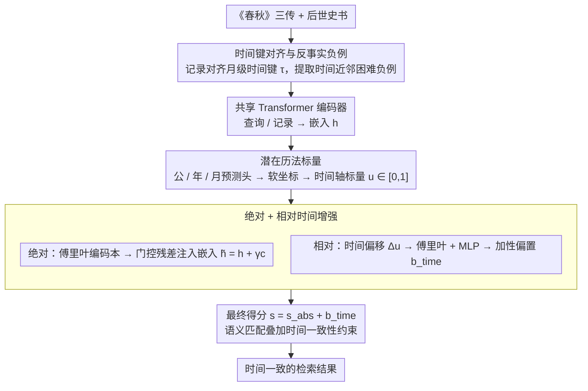

# ChunQiuTR: Time-Keyed Temporal Retrieval in Classical Chinese Annals

**会议**: ACL 2026  
**arXiv**: [2604.06997](https://arxiv.org/abs/2604.06997)  
**代码**: [https://github.com/xbdxwyh/ChunQiuTR](https://github.com/xbdxwyh/ChunQiuTR)  
**领域**: 信息检索 / 时序检索  
**关键词**: 时间检索, 古典中文, 历法编码, 双编码器, RAG

## 一句话总结
提出 ChunQiuTR，首个基于非格里历的时间键检索基准，从《春秋》及其注疏传统中构建，并设计了 CTD（历法时间双编码器），通过傅里叶绝对历法上下文和相对偏移偏置实现时间感知检索，显著优于纯语义基线。

## 研究背景与动机

**领域现状**：RAG 系统中检索是 LLM 获取和定位知识的关键接口。在历史研究中，检索目标不是任意相关段落，而是特定纪年月份的精确记录——时间一致性与主题相关性同等重要。

**现有痛点**：古典中文编年体使用简洁隐含的非格里历年号表述（如"元年春"、"夏五月"），时间信息省略绝对年份，需从上下文推断。语义相似的段落可能在时间上完全不对——例如查询"庄公二年十二月"可能检索到同一日期短语的注疏评论（重复日期但未回答事件），或相邻月份的高度相似事件。

**核心矛盾**：语义相似性不等于时间一致性。现有神经检索方法将相关性建模为语义相似度，无法区分"时间近邻混淆器"——措辞高度相似但发生在不同月份的记录。

**本文目标**：在非格里历、王朝纪年体系下实现时间一致的检索，作为下游历史 RAG 的关键前提。

**切入角度**：利用《春秋》及其三传（左传、公羊传、穀梁传）的多层结构——所有层共享同一纪年时间线但以不同措辞描述相同事件，天然产生"近乎重复"的困难负例。

**核心 idea**：在语义匹配之上引入历法位置感知——学习连续历法轴，注入绝对历法上下文并添加相对时间偏置。

## 方法详解

### 整体框架
ChunQiuTR 由基准和方法两部分组成，要解决的是"语义相似但时间不一致"的检索失败：输入一条带时间键 $\tau=(gong, year, month)$ 的查询，输出应是同一纪年月份的精确记录，而不是措辞相似却发生在邻月的混淆器。基准侧把《春秋》记录对齐到月级时间键，设计点查询 / 间隙查询 / 窗口查询三类，并从后世史书中提取时间近邻反事实困难负例；方法侧 CTD 在标准双编码器之上学习一条连续历法轴，先把绝对历法上下文注入嵌入，再用相对时间偏移给最终得分加偏置，从而在语义匹配里叠加时间一致性约束。

### 关键设计

**1. 时间键对齐与反事实负例：让基准包含真实的时间近邻陷阱**

历史检索最常见的失败正是时间近邻混淆——措辞高度相似但发生在不同月份的记录被误检，普通语料无法暴露这一点。基准把编年记录全部对齐到月级时间键，得到 20,172 条记录和 16,226 条查询，再从顾栋高《大事表》等后世史书中提取对同一事件的改写，作为时间近邻反事实困难负例：它们与目标记录共享时间键、措辞高度相似，却并非正确的检索目标。正因为这类困难负例构成了真实的失败模式，基准必须显式纳入它们，检索器才会被逼着学习区分时间而非只看语义。

**2. 潜在历法标量：把离散王朝纪年映射成连续可度量的位置**

王朝纪年（公/年/月）是离散标识符，不提供位置度量，也无法表达跨朝距离，因此时间关系无从量化。CTD 在共享 Transformer 编码器的嵌入上附加三个轻量预测头分别预测公、年、月，对输出概率分布取期望得到软坐标 $g_x, y_x, m_x$，再线性化为统一时间轴上的标量 $u_x = \frac{g_x \cdot (Y \cdot M) + y_x \cdot M + m_x}{G \cdot Y \cdot M - 1} \in [0,1]$。有了这条连续轴，任意两段文本的时间远近才变成可计算、可比较的距离，为后续注入和惩罚提供基础。

**3. 绝对 + 相对时间增强：让嵌入知道位置、让得分惩罚错位**

光有连续坐标还不够，需要把它真正作用到检索打分上，绝对和相对两条信号互补地完成这件事。绝对部分用傅里叶编码本把软预测映射成时间上下文向量，经门控残差注入嵌入 $\tilde{h}_x = h_x + \gamma c_x$，让嵌入本身"知道"文本在历法中的位置；相对部分计算查询-记录的时间偏移 $\Delta u_{ij}$，过傅里叶特征和 MLP 生成加性偏置 $b_{ij}^{time}$，最终得分为 $s_{ij}^{CTD} = s_{ij}^{abs} + b_{ij}^{time}$，对时间距离远的匹配直接扣分——即使它语义高度相似。消融显示单用任一信号都有提升，组合后改进最显著。

### 损失函数 / 训练策略
主损失用区间重叠多正例 InfoNCE：把时间区间重叠作为弱监督来标记批内正例，缓解严格单正例下的时间泛化不足。辅助损失训练三个时间预测头（公 / 年 / 月分类交叉熵 + 时间标签平滑），保证软坐标的可靠性。

## 实验关键数据

### 主实验

| 方法 | P-Time R@1 | G-Time R@1 | W-Time R@1 | 平均 |
|------|-----------|-----------|-----------|------|
| BM25 | 基线 | 基线 | 基线 | - |
| DPR | 语义基线 | 语义基线 | 语义基线 | - |
| CTD (ours) | **最优** | **最优** | **最优** | 显著提升 |

### 消融实验

| 配置 | 效果 | 说明 |
|------|------|------|
| Semantic only | 基线 | 无时间感知 |
| + Absolute context | 提升 | 嵌入携带历法位置信息 |
| + Relative bias | 进一步提升 | 惩罚时间距离远的匹配 |
| + Multi-positive | **最优** | 区间重叠监督增强时间泛化 |

### 关键发现
- 时间近邻混淆是纯语义检索最大的失败模式——相邻月份措辞高度相似的记录频繁被误检
- CTD 在时间近邻和相邻月份混淆器场景下改进最显著
- 绝对和相对时间信号互补——单独使用任一都有提升，组合效果更好

## 亮点与洞察
- **问题定义非常精准**：将"时间一致性"从"语义相关性"中分离出来，揭示了 RAG 系统在历史文本中的核心失败模式
- **傅里叶历法编码**的设计可以推广到任何非标准时间系统（如农历、伊斯兰历、日本年号等），不限于《春秋》
- **基准构建方法论**（LLM 辅助提议 + 人工验证）在文化遗产数字化领域有良好的可推广性

## 局限与展望
- 仅在《春秋》语料上验证，其他编年体（如《资治通鉴》）的推广性未知
- 月级是最细粒度，日级时间信息在《春秋》中太稀疏无法系统化
- 评估了检索质量但未进一步验证下游 RAG 生成的忠实度改善

## 相关工作与启发
- **vs 标准 TIR**：标准时间检索假设现代时间戳和开放检索，本文处理非格里历微粒度编年体，挑战完全不同
- **vs BM25/DPR**：纯语义方法在时间近邻混淆器面前系统性失败

## 评分
- 新颖性: ⭐⭐⭐⭐⭐ 首个非格里历时间键检索基准，问题极具特色
- 实验充分度: ⭐⭐⭐⭐ 基准构建严谨，消融充分
- 写作质量: ⭐⭐⭐⭐⭐ 历史背景介绍与技术方法结合得非常好
- 价值: ⭐⭐⭐⭐ 对数字人文和历史 RAG 有独特价值

<!-- RELATED:START -->

## 相关论文

- [\[ACL 2026\] Benchmarking and Enabling Efficient Chinese Medical Retrieval via Asymmetric Encoders](benchmarking_and_enabling_efficient_chinese_medical_retrieval_via_asymmetric_enc.md)
- [\[ACL 2026\] Test-Time Training for Zero-Resource Dense Retrieval Reranking](test-time_training_for_zero-resource_dense_retrieval_reranking.md)
- [\[ACL 2026\] CounterRefine: Answer-Conditioned Counterevidence Retrieval for Inference-Time Knowledge Repair in Factual Question Answering](counterrefine_answer-conditioned_counterevidence_retrieval_for_inference-time_kn.md)
- [\[AAAI 2026\] Towards Inference-Time Scaling for Continuous Space Reasoning](../../AAAI2026/information_retrieval/towards_inference-time_scaling_for_continuous_space_reasoning.md)
- [\[NeurIPS 2025\] Retrieval is Not Enough: Enhancing RAG Reasoning through Test-Time Critique and Optimization](../../NeurIPS2025/information_retrieval/retrieval_is_not_enough_enhancing_rag_reasoning_through_test-time_critique_and_o.md)

<!-- RELATED:END -->
