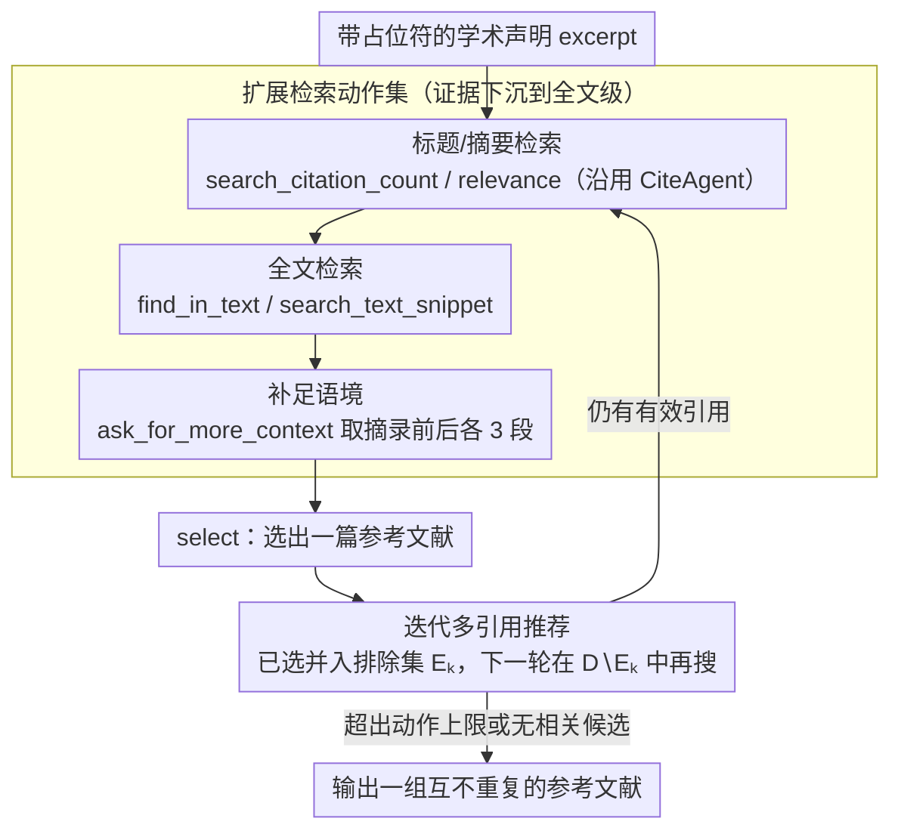

# CiteGuard: Faithful Citation Attribution for LLMs via Retrieval-Augmented Validation

**会议**: ACL 2026  
**arXiv**: [2510.17853](https://arxiv.org/abs/2510.17853)  
**代码**: [https://github.com/KathCYM/CiteGuard](https://github.com/KathCYM/CiteGuard)  
**领域**: 科学引用验证  
**关键词**: 引用归属, 检索增强验证, 科学写作, 幻觉缓解, Agent

## 一句话总结

CiteGuard 提出了一个检索增强的智能体框架，通过扩展的检索动作（包括全文搜索和上下文检索）为科学引用归属提供更忠实的基础，在 CiteME 基准上相对基线提升 10 个百分点，达到 68.1% 准确率，接近人类表现（69.2%）。

## 研究背景与动机

**领域现状**：LLM 越来越多地被用于科学写作辅助，但引用幻觉问题严重（LLM 可生成高达 78-90% 的虚构引用）。ICLR 2026 提交的 300 篇论文中发现了超过 50 个引用幻觉。

**现有痛点**：(1) LLM-as-a-Judge 在引用验证中召回率极低（仅 16-17%），因为 LLM 对术语的微小变化过于敏感；(2) CiteAgent 等现有方法的准确率仍远低于人类；(3) 现有方法缺乏对论文全文内容的搜索能力。

**核心矛盾**：仅基于标题和摘要的检索不足以确认引用关系，往往需要深入到论文全文进行交叉验证。

**本文目标**：设计一个更忠实、更泛化的引用归属 Agent。

**切入角度**：扩展检索动作集，特别是增加全文搜索和上下文检索能力。

**核心 idea**：引用验证需要超越标题/摘要级别的信息，通过全文搜索和上下文检索提供更强的证据基础。

## 方法详解

### 整体框架

CiteGuard 把"判断一句学术声明该引用哪篇论文"建模成一个检索增强的 Agent 任务：给定一段带占位符的声明文本，Agent 在 Semantic Scholar 之上反复执行检索动作、读取候选论文证据，最终输出一个（或多个）参考文献。它沿用 CiteAgent 的循环骨架（搜索 → 阅读 → 决策），但把检索动作集从"只能看标题/摘要"扩展到"能钻进论文全文和上下文"，让证据基础从浅层元数据下沉到正文级别，从而把召回率极低的 LLM-as-a-Judge 换成有据可查的迭代验证。

### 关键设计

**1. 扩展检索动作集：把证据从摘要级下沉到全文级**

引用关系常常藏在论文正文的实验、方法或讨论段落里，只对比标题和摘要极易误判——这正是 CiteAgent 准确率受限的根因。CiteGuard 在原有动作之外新增三种全文级检索动作：`find_in_text` 在一篇指定论文的全文里搜索查询片段，`ask_for_more_context` 把命中摘录的前后各 3 段一并取回以补足语境，`search_text_snippet` 则在整个数据库范围内做跨论文的全文片段检索。三者合力让 Agent 能像人类审稿人一样翻到正文交叉核对，而不是停留在元数据层面猜测。

**2. 迭代检索支持多引用推荐：一条声明可对应多个有效来源**

许多学术声明本身就有多篇等价的可引文献，强行只给一个答案会人为压低正确率。CiteGuard 把推荐做成可迭代的流程：每轮只输出一个参考 $P^{(k)}$，并把已选集合并入排除集 $E_k = E_{k-1} \cup \{P^{(k)}\}$，使下一轮的搜索动作只在 $D \setminus E_k$ 上执行，从而逐步补全一组互不重复的参考；当超出动作上限或过滤后已无相关候选时，Agent 主动拒答停止，而不是赌单一最优解。

### 损失函数 / 训练策略

CiteGuard 不涉及任何模型训练，全程靠提示驱动的 Agent 推理实现；基础模型可换用 GPT-4o 或 DeepSeek-R1，性能差异完全来自检索动作设计与底座推理能力。

## 实验关键数据

### 主实验

**CiteME 基准结果**

| 方法 | 所有难度准确率 |
|------|------------|
| CiteAgent + GPT-4o | 35.4% |
| CiteGuard + GPT-4o | 45.4% (+10pp) |
| CiteGuard + DeepSeek-R1 | **68.1%** |
| 人类表现 | 69.2% |

### 消融实验

- CiteGuard 能识别基准中未覆盖的替代有效引用
- 新增的检索动作（尤其是 find_in_text）对性能提升贡献最大
- 跨领域实验显示方法具有泛化潜力

### 关键发现

- 全文搜索能力对引用验证至关重要
- 接近人类表现的 68.1% 准确率证明了方法的有效性
- LLM-as-a-Judge 在引用验证中不可靠，需要检索增强

## 亮点与洞察

- 解决了科学写作中的真实痛点，实用价值高
- 接近人类表现是重要里程碑
- 扩展的 CiteMulti 基准填补了跨领域评估的空白

## 局限与展望

- 依赖 Semantic Scholar API，可能不覆盖所有领域
- 全文搜索需要论文可访问，部分论文可能无法获取
- 迭代检索增加了推理成本
- 未来可探索将方法集成到学术写作工作流中

## 相关工作与启发

- 对 CiteAgent 的扩展显示了全文搜索的关键价值
- 为科学引用质量控制提供了实用工具

## 评分

- 新颖性: ⭐⭐⭐⭐ 全文搜索和迭代多引用推荐是实用创新
- 实验充分度: ⭐⭐⭐⭐ 跨领域评估 + 人工标注 + 多模型对比
- 写作质量: ⭐⭐⭐⭐ 问题定义清晰，实验设计合理

<!-- RELATED:START -->

## 相关论文

- [\[ACL 2026\] Beyond Black-Box Interventions: Latent Probing for Faithful Retrieval-Augmented Generation](beyond_black-box_interventions_latent_probing_for_faithful_retrieval-augmented_g.md)
- [\[ACL 2025\] VISA: Retrieval Augmented Generation with Visual Source Attribution](../../ACL2025/information_retrieval/visa_retrieval_augmented_generation_with_visual_source_attribution.md)
- [\[ACL 2026\] Context Attribution with Multi-Armed Bandit Optimization](context_attribution_with_multi-armed_bandit_optimization.md)
- [\[ICLR 2026\] Attribution-Guided Decoding](../../ICLR2026/information_retrieval/attribution-guided_decoding.md)
- [\[ICLR 2026\] Attributing Response to Context: A Jensen-Shannon Divergence Driven Mechanistic Study of Context Attribution in Retrieval-Augmented Generation](../../ICLR2026/information_retrieval/attributing_response_to_context_a_jensen-shannon_divergence_driven_mechanistic_s.md)

<!-- RELATED:END -->
