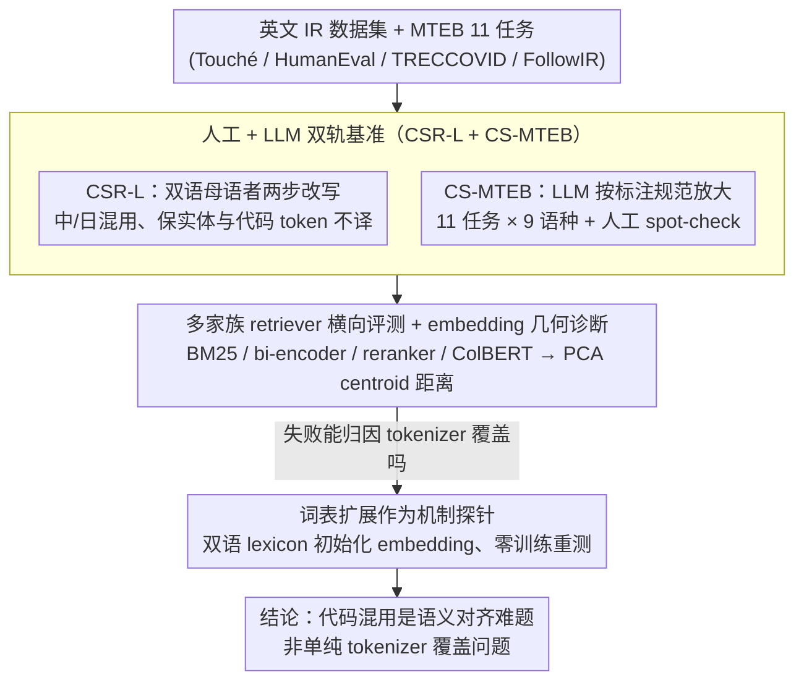

# Code-Switching Information Retrieval: Benchmarks, Analysis, and the Limits of Current Retrievers

**会议**: ACL 2026  
**arXiv**: [2604.17632](https://arxiv.org/abs/2604.17632)  
**代码**: GitHub + HuggingFace 数据集 (有)  
**领域**: 信息检索 / 多语言  
**关键词**: 代码混用, 多语言检索, MTEB 基准, 词表扩展, embedding 空间

## 一句话总结
论文首次系统评估"代码混用查询"对现代 IR 系统的冲击，提出人工标注的 CSR-L 基准和 LLM 生成的 11 任务 CS-MTEB 套件，发现即使 8B 多语言强模型在 query-side code-switching 下也会掉 4–13 个 nDCG@10、reranker 甚至从 60 暴跌到 25；并证明 lexicon-based 词表扩展能缓解但无法补齐单语基线的差距。

## 研究背景与动机

**领域现状**：现代 IR 已从 BM25 演进到 dense bi-encoder（e5, bge-m3, Arctic-Embed, Qwen3-Embedding）、cross-encoder reranker 和 ColBERT v2 这类 late-interaction 架构；MTEB、BEIR、MMTEB 等基准也已把评测扩展到上百种语言、几百个任务。

**现有痛点**：所有这些 benchmark 都默认 query 是单一语言。但全球 ~70% 人口是双语者，Bing 日志显示娱乐域代码混用 query 占比约 27%（Gupta 2014），实际线上检索场景下"英文技术词 + 中文 framing"的混用 query 极其普遍。整套 IR 的有效性在这块完全没被系统测过。

**核心矛盾**：embedding 模型靠对比学习把语义相近的句子拉到同一片向量空间，但 code-switching 等于在同一条 query 里同时塞入两个 token 分布，可能把 query 表征"撕成两半"，落到原本不相关的子空间。再加上 tokenizer 词表覆盖不均，混用 query 会被切成大量低频 subword，进一步加重表征噪声。

**本文目标**：(1) 建一个能反映自然 code-switching 习惯的 IR benchmark（人工标注）；(2) 把评测扩展到更大规模、更多任务类型，看 code-switching 影响是不是仅限 retrieval；(3) 看一个低成本的"词表扩展" intervention 能不能堵住差距。

**切入角度**：作者不去构造对抗 query，而是请双语母语者按真实搜索行为重写 query，保留信息需求；同时在 embedding 空间用 PCA 可视化 query 表征，回答"模型为什么会失败"这个机制层面问题，而不是仅给一张性能下降的表。

**核心 idea**：把 code-switching 当成一种被长期忽视的 query 分布偏移，用自然标注 + 大规模 LLM 生成两套互补基准把现象量化出来，再用 vocabulary expansion 做 mechanism probing —— 把 IR 的 robustness 短板钉死在"代码混用"上。

## 方法详解

### 整体框架

这篇论文的"方法"不是一个新模型，而是一条"测—诊断—干预"的三段式流水线，目的是把代码混用对 IR 系统的冲击量化清楚并解释成因。先用人工标注的 CSR-L 在 4 个英文 IR 数据集上把 query 改写成中/日混用版，保证语言学自然度；再用 LLM 把这套标注规范放大成覆盖 11 任务 × 9 语种的 CS-MTEB，换取任务与语言广度；最后对英文中心模型做一次零训练的词表扩展干预，看代码混用的失败到底是 tokenizer 覆盖问题还是更深的表征对齐问题。

### 关键设计

**1. 人工 + LLM 双轨基准（CSR-L + CS-MTEB）：用两套数据在自然度和规模之间互补**

代码混用数据没有可信的自动指标来评估"自然度"，社会语言学（Poplack、Myers-Scotton）也只给定性定义，所以小规模必须人工、大规模必须借 LLM。CSR-L 由三位中-英-日多语作者两步法（一人重写、一人校验）改写 Touché 2020 / HumanEval / TRECCOVID / FollowIR 的 query，严格控制 ±20% 长度变化、保留实体名与代码 token 不翻译、要求两种语言都贡献内容；CS-MTEB 则把这套规范固化成 prompt 模板的 ground truth，用 MiMo-V2-Flash 把 MTEB 的 11 个任务（涵盖 instruction reranking、retrieval、clustering、classification、STS、reranking、pair classification 共 7 类）批量改写成 9 语种 × 英文的混用版，再补 50 条人工 spot-check 兜底质量。两者结合既能在小规模上把现象量化得无可辩驳，又能在任务与语言维度上做泛化检验。

**2. 多家族 retriever 横向评测 + embedding 空间几何诊断：既定位损伤的共性，又解释失败机制**

只报性能下降只能说明"掉了"，回答不了"为什么掉"。评测覆盖四类 IR 范式——统计（BM25）、bi-encoder（e5 / mE5 / bge-m3 / Arctic-Embed / Qwen3-Embedding 0.6/4/8B）、cross-encoder reranker（jina-reranker-v3、bge-reranker-v2-m3、Qwen3-Reranker）、late-interaction（ColBERT v2）——确认代码混用是跨范式的共性短板。在此之上，作者在 Touché 2020 和 TRECCOVID 上用 PCA 把 e5-large-v2 与 Qwen3-Embedding-0.6B 的"原始 vs 混用"query 嵌入投到 3 维并量化 centroid distance：英文中心模型让两类 query 完全裂成两团（centroid 距离约 0.25），多语模型重合更多（约 0.20），几何上的偏移与性能差距高度对应，等于把 robustness gap 的物理形式坐实为 embedding manifold 的位移。

**3. 词表扩展作为机制探针而非解药：用一个零训练干预区分"覆盖问题"和"对齐问题"**

如果一个只改 tokenizer 的低成本干预就能补齐单语性能，说明问题在词表覆盖；如果只能部分缓解，说明问题更深。具体做法是用 Conneau 2018 的双语 lexicon，把目标语 word $w_t$ 的嵌入用源语 subword 嵌入的平均来初始化：先对源语词 $w_s$ 求其子词嵌入均值 $v_{w_s}=\frac{1}{|T(w_s)|}\sum_{k\in T(w_s)} e_k$，再把映射到 $w_t$ 的各源语词聚合成 $e_{w_t}=\frac{1}{|N(w_t)|}\sum_{w_s\in N(w_t)} v_{w_s}$，无映射的 token 用 $\mathcal{N}(0,\sigma^2)$ 初始化；主体模型不动，只换 tokenizer 与 embedding layer，零额外训练后在 CSR-L 上重测。结果是"部分缓解"（all-MiniLM 在 CSR-L-Chinese 从 30.09 升到 37.73，e5-large-v2 从 35.32 升到 43.50，但都仍距单语基线约 4 分），既证明 tokenizer 确实是失败的一部分，也证明代码混用是一个无法靠 surface-level patch 闭合的语义对齐难题——这种"用 negative result 做诊断"的写法格外清醒。

### 评测指标

论文不训练新模型，全靠现成指标量化：IR 用 nDCG@10、FollowIR 用 p-MRR、clustering 用 V-measure、classification 用 Accuracy、STS 用 Cosine Spearman、reranking 用 MAP@1000、pair classification 用 mean AP；词表扩展阶段同样没有 gradient update，只改 embedding 初始化。

## 实验关键数据

### 主实验 (CSR-L 英-中, nDCG@10, p-MRR)

| 方法家族 | 模型 | Touché Orig | Touché CSR-L | TRECCOVID Orig | TRECCOVID CSR-L | Avg Drop |
|---|---|---|---|---|---|---|
| 统计 | BM25 | 60.32 | 37.68 | 55.62 | 46.43 | **−6.56** |
| Bi-encoder (英) | e5-large-v2 | 42.52 | 22.88 | 66.64 | 50.42 | **−11.90** |
| Bi-encoder (英) | all-MiniLM-L12-v2 | 49.22 | 23.85 | 51.17 | 39.51 | **−12.36** |
| Bi-encoder (多) | mE5-large | 49.32 | 42.75 | 71.56 | 56.54 | −6.90 |
| Bi-encoder (多) | Arctic-Embed-l-v2.0 | 64.05 | 54.91 | 83.63 | 76.99 | −4.54 |
| Bi-encoder (多) | Qwen3-Embedding-8B | 75.77 | 68.55 | 94.68 | 89.72 | **−3.68** |
| Cross-encoder | Qwen3-Reranker-8B | 40.91 | 32.01 | 84.58 | 69.88 | −6.67 |
| Late-interaction | ColBERT v2 | 61.62 | 29.30 | 69.30 | 53.74 | **−11.31** |

CS-MTEB（e5-large-v2）跨语种下降：中文 −15.21、日文 −12.70、德文 −12.27、西文 −10.91。Reranking 任务尤其惨烈 —— e5-large-v2 在日文 code-switching 下从 60.17 暴跌到 25.75。

### 词表扩展实验 (CSR-L-Chinese 平均)

| 模型 | 原始 model + CSR-L-Chinese | adapted model + CSR-L-Chinese | 涨幅 | Gap to monolingual |
|---|---|---|---|---|
| all-MiniLM-L12-v2 | 30.09 | 37.73 | +7.64 | 仍距 42.45 单语原始 |
| e5-large-v2 | 35.32 | 43.50 | +8.18 | 仍距 47.22 单语原始 |

日文 adapted 收益更小（all-MiniLM 29.94→34.34；e5-large-v2 34.70→39.80）。说明：(1) tokenizer 确实是 part of failure；(2) 词表扩展无法完全闭合差距。

### 关键发现
- **英文中心 vs 多语模型差距显著**：e5-large-v2 平均掉 11.90，多语 Qwen3-Embedding-8B 仅掉 3.68，多语预训练有用但远不够。
- **模型 scale 帮助有限**：Qwen3-Embedding 从 0.6B (-4.74) → 4B (-4.39) → 8B (-3.68) 改善缓慢；scale 不能解决 code-switching。
- **任务类型差异巨大**：Reranking 最脆弱（e5-large-v2 日文 60→25），pair classification 最稳健（>54 都能保住），原因是 reranking 要求精确的排序对齐，对 embedding manifold 偏移极其敏感。
- **embedding 几何 = 性能差距**：英文中心模型的原始/混用 query 在 PCA 空间完全分裂成两团，centroid 距离与性能下降强相关；多语模型能让两团重叠更多。
- **vocabulary expansion 仅部分有效**：能补一半左右的差距（e5-large-v2 中文：+8.18 但离单语还差 ≈4 分），说明 code-switching 不是单纯的 tokenizer 覆盖问题。

## 亮点与洞察
- **把"代码混用"从社会语言学议题拉进 IR robustness 主流**：用一套人工 + LLM 双轨基准把现象量化得无可辩驳，给后续 retriever 训练显式列出新短板。
- **embedding 几何诊断 + vocabulary expansion 探针的组合**：把"为什么掉" 和"靠 surface-level fix 能不能补"两个问题在同一篇论文里回答，方法论比单纯发 benchmark 高一档。
- **Pair classification vs reranking 对比给出 task-dependent robustness 假设**：要求 fine-grained 排序的任务在 CS 下崩盘，要求 coarse 语义判断的任务受影响小，这一假设可以直接指导后续 CS-aware reranker 的设计方向（如显式 token alignment loss）。
- **CS-MTEB 是直接可复用的资产**：覆盖 7 类 11 任务 × 9 语种，给评估"多语 robustness"的方法提供了一个 ready-made stress test，门槛低、数据公开。

## 局限与展望
- 作者承认：(1) code-switching 实际包括 romanization、transliteration、社区俗语、混合语 document 等，本文只覆盖 query-level、自然 phrase-level 混用；(2) 人工 + LLM 生成都会有少量风格漂移，靠 spot-check 控质。
- 自己看到的局限：CSR-L 规模偏小（Touché 49 query、HumanEval 158 query、TRECCOVID 50 query），统计显著性有限；只测中/日（CSR-L）+ 9 语种（CS-MTEB），低资源语对（如东南亚、非洲语）未覆盖；vocabulary expansion 只在两个英文中心模型上验证，未在 Arctic-Embed、Qwen3-Embedding 这种多语强模型上做。
- 改进思路：在多语强 retriever 上加 CS-aware 对比学习（混用 query 与原始 query 拉到同一表征）；把 cross-lingual alignment 训练改为显式 token-level alignment；或让 reranker 在 CS query 下显式输出"切换点检测"作为辅助监督。

## 相关工作与启发
- **vs MMTEB / MTEB (Enevoldsen 2025, Muennighoff 2023)**：经典多语 benchmark 假设 query 是单语；CS-MTEB 在同一 task 集上加 code-switching 维度，提供 robustness 评测。
- **vs MINERS (Winata 2024) / Litschko 2023**：前者只测 bitext mining / 跨方言，本文系统覆盖 4 类 IR 范式 + 7 类 MTEB 任务，且强调 query-side 混用。
- **vs ContrastiveMix (Do 2024)**：ContrastiveMix 用 code-switching 数据训练增强 cross-lingual 检索；本文把 code-switching 评测变成独立 dimension，并明确指出训练侧 ContrastiveMix 风格方法是必要 next step。
- **vs Zuo 2025 跨语言检索评估**：Zuo 的发现是 LLM rerankers 在直接处理多语 bi-encoder 输出时崩塌；本文把这条结论延伸到 query-内部混用，二者拼起来表明 LLM 类系统对"语言混合"几乎全面脆弱。

## 评分
- 新颖性: ⭐⭐⭐⭐ benchmark 类工作单点新意有限，但把"代码混用 IR"这条几乎空白的赛道完整开起来了。
- 实验充分度: ⭐⭐⭐⭐⭐ 16 个模型 × 4 任务 + 11 MTEB 任务 × 9 语种 + embedding 几何分析 + vocabulary expansion 干预，立体得近乎奢侈。
- 写作质量: ⭐⭐⭐⭐ 结构清晰，限制章节诚恳，附录把 annotator instruction、prompt template 都公开。
- 价值: ⭐⭐⭐⭐ 直接给搜索/RAG 系统设计列出新短板，数据公开复用门槛低；预计会成为 CS-aware retriever 论文的默认评测集。

<!-- RELATED:START -->

## 相关论文

- [\[ACL 2026\] MTR-Suite: A Framework for Evaluating and Synthesizing Conversational Retrieval Benchmarks](mtr-suite_a_framework_for_evaluating_and_synthesizing_conversational_retrieval_b.md)
- [\[ACL 2025\] CoIR: A Comprehensive Benchmark for Code Information Retrieval Models](../../ACL2025/information_retrieval/coir_a_comprehensive_benchmark_for_code_information_retrieval_models.md)
- [\[ACL 2026\] CodePromptZip: Code-specific Prompt Compression for Retrieval-Augmented Generation in Coding Tasks with LMs](codepromptzip_code-specific_prompt_compression_for_retrieval-augmented_generatio.md)
- [\[ACL 2026\] UnIte: Uncertainty-based Iterative Document Sampling for Domain Adaptation in Information Retrieval](unite_uncertainty-based_iterative_document_sampling_for_domain_adaptation_in_inf.md)
- [\[ICML 2026\] Understanding LoRA as Knowledge Memory: An Empirical Analysis](../../ICML2026/information_retrieval/understanding_lora_as_knowledge_memory_an_empirical_analysis.md)

<!-- RELATED:END -->
