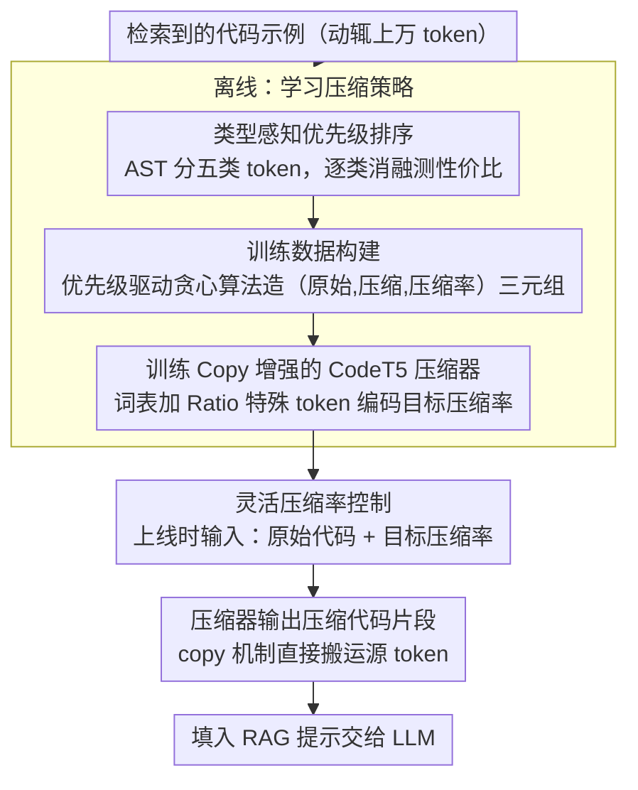

# CodePromptZip: Code-specific Prompt Compression for Retrieval-Augmented Generation in Coding Tasks with LMs

**会议**: ACL 2026  
**arXiv**: [2502.14925](https://arxiv.org/abs/2502.14925)  
**代码**: 无  
**领域**: 信息检索  
**关键词**: 代码提示压缩, RAG, 类型感知优先级, copy机制, 编码任务

## 一句话总结

提出 CodePromptZip，首个面向代码的提示压缩框架，通过类型感知优先级排序构建训练数据并训练带 copy 机制的小模型压缩器，在三个编码任务上分别比最佳基线提升 23.4%、28.7% 和 8.7%。

## 研究背景与动机

**领域现状**：RAG 通过检索相关代码示例增强 LLM 在编码任务上的表现，但检索到的代码往往长达数万 token，受限于 LLM 上下文窗口和 API 调用成本。

**现有痛点**：现有提示压缩技术（LLMLingua、RECOMP 等）都针对自然语言设计，忽略了代码的独特特征——不同 token 类型（如 Identifier、Symbol、Invocation）对生成质量的影响差异巨大。

**核心矛盾**：自然语言压缩方法用启发式信息熵或知识蒸馏来判断 token 重要性，但这些指标未考虑代码的类型结构信息，压缩效果不理想。

**本文目标**：设计首个代码专用的提示压缩框架，能在指定压缩率下最大程度保留对下游任务有用的代码信息。

**切入角度**：利用程序分析将代码 token 按类型分类，通过消融分析建立类型级别的移除优先级，再用此指导训练数据构建和压缩模型学习。

**核心 idea**：不同类型的代码 token 对任务的影响不同，按影响从小到大的优先级顺序移除 token，并训练带 copy 机制的 CodeT5 模型来学习这种压缩策略。

## 方法详解

### 整体框架

CodePromptZip 要解决的是：在 RAG 编码任务里，检索回来的代码示例动辄上万 token，既撑爆上下文窗口又抬高 API 成本，需要在指定压缩率下尽量保住对下游任务有用的代码信息。它的做法是先离线学一套"哪些 token 类型该先删"的优先级，再用它造训练数据并训练一个带 copy 机制的小压缩器；上线时压缩器同时接收原始代码和目标压缩率，吐出压缩后的代码片段填进 RAG 提示。整条链路把"代码该怎么删"从自然语言压缩的信息熵启发式，换成了基于代码类型结构的、可控压缩率的学习式压缩。

### 关键设计

**1. 类型感知优先级排序：按代码 token 类型决定删除次序**

自然语言压缩用信息熵或蒸馏判断 token 重要性，但完全无视代码里不同 token 类型对生成质量的悬殊影响。CodePromptZip 先用 JavaParser 做 AST 分析，把 token 归为 Symbol、Signature、Invocation、Identifier、Structure 五类，再逐类做消融，测量每类的性价比 $\text{Priority}(T) = \text{压缩率} / \text{性能退化率}$——优先级越高代表删掉它换来的压缩收益相对性能损失越划算，因而越该先删。一个关键观察是这套优先级层级跨模型一致但任务特异（如 Invocation 在 Assertion Generation 中优先级最高，在 Code Suggestion 中却最低），说明代码 token 的重要性是任务驱动而非模型驱动的，这也正是它能指导后续数据构建的依据。

**2. Copy 增强的 CodeT5 压缩器：让压缩贴合"输出全部来自输入"的本质**

代码压缩本质是抽取式任务——压缩结果里的每个 token 都来自原始代码，而非凭空生成。CodePromptZip 在 CodeT5 的编码器-解码器上加一个 copy module：每步算一个生成概率 $p_{gen}$ 决定该从词表生成还是从源序列复制，最终输出分布为 $P(y) = p_{gen}\cdot P_{vocab} + (1-p_{gen})\cdot P_{copy}$。这让模型天然倾向于直接搬运源 token，既贴合抽取式压缩的形态，又能处理无法被 AST 解析的不完整代码片段——而依赖解析的 Oracle 方法在这种片段上直接失效。

**3. 灵活压缩率控制：让用户指定任意目标压缩率**

不同场景对压缩力度的需求不同，固定压缩率无法适配成本/质量的多样权衡。CodePromptZip 扩展词表引入 `<Ratio>` 等特殊 token，把目标压缩率显式编码进输入，让同一个模型自适应学习不同压缩级别下该删到什么程度。配合 copy 机制，实际压缩率能与指定压缩率紧密对齐；而去掉 copy 后这种可控性会明显退化。

### 损失函数 / 训练策略

压缩器用交叉熵损失训练，优化器 AdamW，batch=16，lr=5e-5，warmup=1000 步，共训练 10 epoch；训练样本由优先级驱动的贪心算法（Algorithm 1）按不同目标压缩率自动构建——即按上面学到的类型优先级从低到高逐步移除 token，生成不同压缩级别的（原始代码，压缩代码，压缩率）三元组监督信号。

## 实验关键数据

### 主实验

| 方法 | Assertion (EM%) | Bugs2Fix (CB%) | Code Suggestion (CB%) |
|------|-----------------|----------------|----------------------|
| w/o retrieval | 23.9 | 41.7 | 14.2 |
| LLMLingua | 33.8 | 41.9 | 21.8 |
| LongLLMLingua | 34.1 | 42.1 | 21.2 |
| LLMLingua-2 | 21.2 | 48.1 | 21.7 |
| RECOMP | 23.4 | 45.3 | 21.0 |
| CodePromptZip (w/o Copy) | 40.9 | 56.7 | 20.5 |
| **CodePromptZip** | **42.1** | **61.9** | **23.7** |
| Oracle (AST) | 46.2 | 66.8 | 23.8 |
| w/o compression | 50.5 | 81.4 | 24.7 |

*τ_code=0.3, 1-shot, 使用 GPT-3.5-turbo*

### 消融实验

| 组件 | Assertion (EM%) | Bugs2Fix (CB%) | Code Suggestion (CB%) |
|------|-----------------|----------------|----------------------|
| CodePromptZip w/o Copy | 40.9 | 56.7 | 20.5 |
| CodePromptZip (full) | 42.1 (+1.2) | 61.9 (+5.2) | 23.7 (+3.2) |

**压缩率控制**：CodePromptZip 的实际压缩率与指定压缩率紧密对齐，而无 copy 机制的版本控制能力显著变差。

### 关键发现

- 在三个任务上分别比最佳基线提升 23.4%（42.1 vs 34.1）、28.7%（61.9 vs 48.1）、8.7%（23.7 vs 21.8）
- Copy 机制对压缩率控制至关重要，同时在三个任务上均带来性能提升
- 权衡分析显示：在固定 token 预算下，使用更少的低压缩率示例优于更多的高压缩率示例
- 跨模型泛化：在 CodeLlama-13B 和 Gemini-1.0-Pro 上同样优于所有基线
- 不可解析代码：移除末尾 1-3% token 后性能仅微降（42.1% → 42.0%/41.7%），证明了学习型方法的鲁棒性

## 亮点与洞察

- 首次提出代码专用的提示压缩问题和解决方案，填补了 NL 压缩和代码压缩之间的空白
- 类型感知优先级排序的发现具有启发性：移除优先级跨模型一致但跨任务不同，说明代码 token 重要性是任务驱动而非模型驱动的
- 基于学习的方法优雅解决了 Oracle（需 AST 解析）无法处理不完整代码的限制
- 压缩率可控性设计使框架可适应不同成本/质量权衡需求

## 局限与展望

- 目前仅支持 Java 代码（依赖 JavaParser 构建训练数据），其他语言的泛化性未验证
- 压缩器基于 CodeT5-775M，模型大小和推理延迟需要考量
- 消融分析中的优先级排序需要对每个新任务重做，自动化/自适应的优先级发现是未来方向
- 未考虑多语言代码混合场景

## 相关工作与启发

- 对 LLMLingua 系列的改进方向明确：信息熵指标不适合代码，需要利用代码的类型结构信息
- RECOMP 用 GPT-3.5 蒸馏的方式成本高且压缩率不可控，CodePromptZip 的优先级驱动方法更高效可控
- 对 RAG 系统优化的启示：不同模态的检索内容应使用专门的压缩策略

## 评分

- 新颖性: ⭐⭐⭐⭐ 首个代码专用提示压缩框架，类型感知优先级排序思路新颖
- 实验充分度: ⭐⭐⭐⭐ 三个任务、多个基线、跨模型泛化、不可解析代码测试
- 写作质量: ⭐⭐⭐⭐ 问题定义清晰，方法论述完整，实验结论明确

<!-- RELATED:START -->

## 相关论文

- [\[ACL 2026\] Domain-Specific Data Generation Framework for RAG Adaptation](domain-specific_data_generation_framework_for_rag_adaptation.md)
- [\[ACL 2026\] Feedback Adaptation for Retrieval-Augmented Generation](feedback_adaptation_for_retrieval-augmented_generation.md)
- [\[ACL 2025\] EXIT: Context-Aware Extractive Compression for Enhancing Retrieval-Augmented Generation](../../ACL2025/information_retrieval/exit_context-aware_extractive_compression_for_enhancing_retrieval-augmented_gene.md)
- [\[ACL 2026\] Disco-RAG: Discourse-Aware Retrieval-Augmented Generation](disco-rag_discourse-aware_retrieval-augmented_generation.md)
- [\[ACL 2026\] Code-Switching Information Retrieval: Benchmarks, Analysis, and the Limits of Current Retrievers](code-switching_information_retrieval_benchmarks_analysis_and_the_limits_of_curre.md)

<!-- RELATED:END -->
