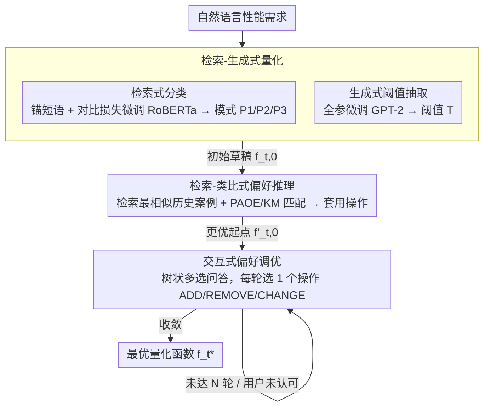

# Conjecture and Inquiry: Quantifying Software Performance Requirements via Interactive Retrieval-Augmented Preference Elicitation

**会议**: ACL 2026  
**arXiv**: [2604.21380](https://arxiv.org/abs/2604.21380)  
**代码**: 待确认  
**领域**: 信息检索  
**关键词**: 需求量化, 偏好获取, 检索增强生成, 交互式系统, 软件性能需求

## 一句话总结

提出IRAP方法，通过交互式检索增强偏好获取（Interactive Retrieval-Augmented Preference Elicitation）将自然语言描述的软件性能需求量化为数学函数，在4个真实数据集上相比10种SOTA方法取得最高40倍的性能提升，且仅需5轮交互。

## 研究背景与动机

**领域现状**: 软件性能需求（如响应时间、吞吐量、可用性等）通常以自然语言形式记录在需求文档中，但软件工程中的性能分析、测试和优化需要将其转化为可计算的数学形式（如效用函数、约束条件）。

**现有痛点**: 性能需求的自然语言描述通常含糊不清（如"系统应该快速响应"、"延迟应在可接受范围内"），加上人类认知中的不确定性，使得同一需求文本可能被不同利益相关者解读为完全不同的数学形式。这种高度不确定的歧义性使得自动化量化成为一个未被充分解决的难题。

**核心矛盾**: 一方面需要将模糊的自然语言转化为精确的数学函数，另一方面利益相关者的偏好具有高度个人化和上下文依赖性，传统的NLP方法无法从文本中直接推断出精确的量化参数。

**本文目标**: 形式化性能需求量化问题，并提出一种通过检索领域特定知识来推理偏好、同时引导与利益相关者进行渐进式交互的方法，在减少认知负担的同时实现高精度量化。

**切入角度**: 将问题建模为"猜想与质询"（Conjecture and Inquiry）——系统先基于检索到的领域知识形成量化猜想，然后通过有针对性的交互向利益相关者求证和修正。

**核心idea**: 与其试图从文本中一步到位地推断数学函数，不如利用检索增强的方式获取问题特定的领域知识来初始化猜想，然后通过少量交互轮次逐步精化偏好参数。

## 方法详解

### 整体框架

IRAP 把"自然语言性能需求 → 数学函数"建模成一个**有限状态转移**过程。作者先观察到性能需求的满意度只呈三种分段线性模式：P1（值越大越好、低于阈值有容差，如"吞吐量需大于 100 req/s"）、P2（值越小越好，如"响应时间小于 5s"）、P3（恰好某值最好）；每种模式由阈值 $T$ 和容差 $\Delta$ 刻画。量化的目标就是从一个初始函数 $f_{t,0}$ 出发，通过若干次 ADD/REMOVE 模式点（控制精度 precision）、CHANGE 阈值/容差/满意度（控制难度 difficulty）等操作，用尽量少的轮数到达利益相关者真正认可的函数 $f_t^*$。

围绕这个目标，IRAP 串起三个相互衔接的阶段：先用**检索-生成式量化**（retrieval-generative quantification）把一句模糊的需求文本转成初始函数草稿 $f_{t,0}$；再用**检索-类比式偏好推理**（retrieval-analogical preference reasoning）借该用户的历史量化案例，把草稿挪到更接近其真实偏好的起点 $f'_{t,0}$；最后用**交互式偏好调优**（interactive preference tuning）通过树状问答逐轮微调，直到收敛成可直接计算的分段函数 $f_t^*$。

### 关键设计

**1. 检索-生成式量化：把需求文本转成初始函数草稿**

直接让 LLM 从"系统应该快速响应"一步生成完整数学函数极易幻觉，因为不是文本里的每个数字都是阈值、也难一次定准模式。IRAP 把第一阶段拆成两个子任务并行求解：（1）**检索式分类**——为每种模式从已知性能需求里抽 10 个锚短语（anchor，如 P1 的"at least / no less than"、P2 的"at most / less than"、P3 的"exactly / equivalent to"），用一个由 InfoNCE 扩展来的对比损失微调 RoBERTa，把需求语句和锚短语嵌到同一语义空间，再取余弦相似度最高的锚所属模式作为分类结果；（2）**生成式阈值抽取**——全参微调一个轻量 GPT-2（774M）从语句里识别真正的阈值 $T$。两者合成初始草稿 $f_{t,0}$（$\Delta$ 默认取 $10\%\times T$，留待后续调）。这里特意用对比损失而非标准微调，是因为"at least"(P1) 和"at most"(P2) 这类反义锚常出现在几乎相同的上下文里，标准微调分不开，需要把匹配模式拉近、非匹配推远的强约束才能区分。

**2. 检索-类比式偏好推理：借历史案例把交互起点挪近真实偏好**

如果直接拿 $f_{t,0}$ 让用户开始交互，草稿可能离其真实偏好很远，徒增轮数和认知负担。由于同一用户会提很多需求，IRAP 从该用户过去已量化的案例里，检索与当前需求语义最相似、且初始函数点数相同的案例 $s_k=\{f_{k,0}, f_k^*\}$，把"当初从 $f_{k,0}$ 改到最终认可的 $f_k^*$"那串操作当作类比，套用到 $f_{t,0}$ 上得到更优起点 $f'_{t,0}$。难点是同一对函数间的改法不唯一、代价也不同，IRAP 用**路径感知操作抽取**（PAOE）解决：把两个函数的点列建成二部图、边权取负欧氏距离，用 Kuhn-Munkres（KM）算法求最大权匹配——匹配不上的点对应 ADD/REMOVE，值不同的点对应 CHANGE，并强制 ADD/REMOVE 排在 CHANGE 之前以保证操作序列合法。这样就把该用户的个人化主观偏好从历史里迁移过来，让交互从一个更贴近其偏好的位置开始。

**3. 交互式偏好调优：树状问答逐轮收敛到最满意函数**

获取真实偏好的瓶颈在于人，开放式提问（"请描述您对延迟的数学偏好"）认知负担过重。IRAP 以 $f'_{t,0}$ 为起点，采用**树状多选问答**做偏好调优：问题树共 5 层、含 7 个候选问题，每一轮从根走到一个叶子，叶子对应有限状态转移里的一步操作——调精度的 ADD/REMOVE，或调难度的 CHANGE（按小步增减 $T$、$\Delta$ 或满意度），轮末把该操作应用到当前函数。用超参 $N$ 限制最大交互轮数（实验中 5 轮即足够），从而在尽量低的认知门槛下逐步逼近用户最认可的 $f_t^*$。把每轮判断降到"在几个选项里点一个"，正是它能在极少轮数内收敛的原因。

## 实验关键数据

### 主实验

| 数据集 | 指标 | IRAP | 最优Baseline | 提升倍数 |
|--------|------|------|-------------|---------|
| 数据集1 | 量化精度 | 最优 | 次优 | 最高40x |
| 数据集2 | 量化精度 | 最优 | 次优 | 显著 |
| 数据集3 | 量化精度 | 最优 | 次优 | 显著 |
| 数据集4 | 量化精度 | 最优 | 次优 | 显著 |

（注：4个真实世界数据集，对比10种SOTA方法，IRAP在所有案例上取得最优，最大提升达40倍，仅需5轮交互）

### 消融实验

| 配置 | 关键指标 | 备注 |
|------|---------|------|
| 无检索增强 | 精度下降 | 缺乏领域知识导致猜想偏差 |
| 无交互 | 精度下降显著 | 纯自动化无法处理偏好歧义 |
| 减少交互轮次 | 精度随轮次增加而提升 | 5轮是精度-效率的甜点 |
| 不同检索策略 | 精度有所差异 | 检索质量影响初始猜想准确性 |

### 关键发现

- IRAP在4个真实数据集上全面超越10种SOTA方法，证明了检索增强+交互式偏好获取范式的有效性
- 仅需5轮交互即可达到最高40倍的精度提升，表明渐进式交互设计在效率和精度之间取得了很好的平衡
- 检索增强模块提供的领域先验对初始猜想的质量至关重要，直接影响后续交互的效率
- 相比纯自动化方法（如直接用LLM从文本生成函数），交互式方法在处理偏好歧义方面有根本性优势

## 亮点与洞察

- **问题定义的价值**：首次形式化了"性能需求量化"这一实际但被忽视的问题，为软件工程和NLP的交叉研究提供了新方向
- **"猜想与质询"范式**：与"一次性生成"不同，IRAP的渐进式交互设计更符合人类决策的渐进认知模式
- **认知负担最小化**：交互设计避免开放式提问，用封闭式问题引导利益相关者，大幅降低参与门槛
- **40倍提升的实用意义**：在需求量化这种精度敏感的任务上，40倍的精度提升意味着从"不可用"到"可用"的质变

## 局限与展望

- 摘要未详细说明4个数据集的具体领域和规模
- 5轮交互虽少但仍需人类参与，在完全自动化场景下的适用性有限
- 领域知识库的构建成本和覆盖面可能影响方法在新领域的冷启动性能
- 未讨论当利益相关者的偏好本身存在内部矛盾时如何处理
- 未来可将IRAP扩展到其他类型的需求量化（如安全性需求、可靠性需求）

## 相关工作与启发

- **vs 传统需求工程**: 传统方法依赖领域专家手工建模，IRAP通过检索+交互实现半自动化，大幅降低专家依赖
- **vs RAG方法**: IRAP不仅用检索来增强文本生成，更创新地将检索结果用于偏好推理和交互设计，是RAG范式在需求工程中的新应用
- **vs 偏好学习**: 不同于从大量比较数据中学习偏好，IRAP通过少量有针对性的交互高效获取偏好，更适合低数据场景

## 评分

- 新颖性: ⭐⭐⭐⭐ 首次形式化并解决性能需求量化问题，检索增强+渐进交互的范式设计新颖
- 实验充分度: ⭐⭐⭐⭐ 10种SOTA方法对比，4个真实数据集，结果具有说服力
- 写作质量: ⭐⭐⭐ 基于摘要信息，标题虽有文学感但主题跨软件工程和NLP可能稍显小众
- 价值: ⭐⭐⭐⭐ 解决了真实的工程痛点，40倍提升具有实际应用价值

<!-- RELATED:START -->

## 相关论文

- [\[ACL 2026\] Quantifying and Improving the Robustness of Retrieval-Augmented Language Models Against Spurious Features in Grounding Data](quantifying_and_improving_the_robustness_of_retrieval-augmented_language_models_.md)
- [\[ACL 2026\] Why Mean Pooling Works: Quantifying Second-Order Collapse in Text Embeddings](why_mean_pooling_works_quantifying_second-order_collapse_in_text_embeddings.md)
- [\[ICLR 2026\] AMemGym: Interactive Memory Benchmarking for Assistants in Long-Horizon Conversations](../../ICLR2026/information_retrieval/amemgym_interactive_memory_benchmarking_for_assistants_in_long-horizon_conversat.md)
- [\[ACL 2025\] GainRAG: Preference Alignment in Retrieval-Augmented Generation through Gain Signal Synthesis](../../ACL2025/information_retrieval/gainrag_preference_alignment.md)
- [\[ACL 2026\] ChatR1: Reinforcement Learning for Conversational Reasoning and Retrieval Augmented Question Answering](chatr1_reinforcement_learning_for_conversational_reasoning_and_retrieval_augment.md)

<!-- RELATED:END -->
