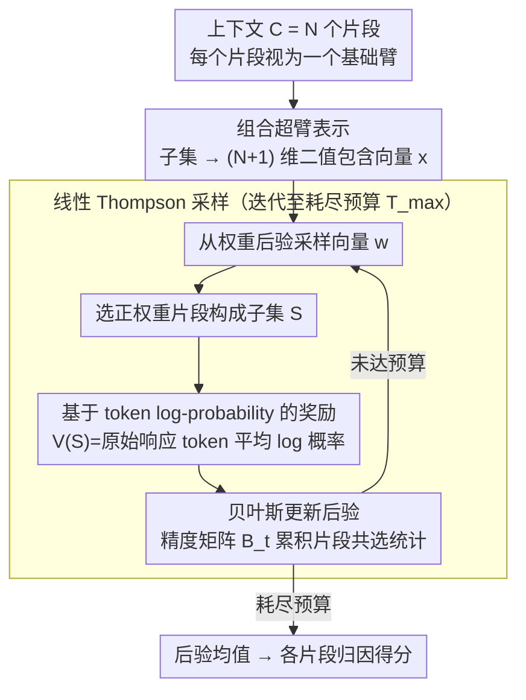

# Context Attribution with Multi-Armed Bandit Optimization

**会议**: ACL 2026 (Findings)  
**arXiv**: [2506.19977](https://arxiv.org/abs/2506.19977)  
**代码**: [https://github.com/pd90506/camab](https://github.com/pd90506/camab)  
**领域**: 信息检索 / 可解释性  
**关键词**: 上下文归因, 多臂赌博机, Thompson采样, 检索增强生成, 查询效率

## 一句话总结

本文提出 CAMAB，将 RAG 中的上下文归因（识别哪些上下文片段对生成答案有贡献）建模为组合多臂赌博机（CMAB）问题，使用线性 Thompson 采样自适应地探索上下文子集空间，在 HotpotQA、CNN/DM、TyDi QA 上比 SHAP 和 ContextCite 减少最多 30% 的模型查询次数同时匹配或超越归因质量。

## 研究背景与动机

**领域现状**：RAG 增强了 LLM 的事实准确性，但验证生成答案确实基于检索上下文仍然困难。LLM 经常产生幻觉或混入无根据信息，需要精确归因哪些上下文片段对答案有贡献。

**现有痛点**：(1) 训练模型显式引用上下文的方法无法保证引用确实反映了推理依据；(2) SHAP 和 ContextCite 等后验扰动方法需要大量模型查询（均匀采样或完整特征选择），计算成本在长上下文场景中不可接受；(3) 在预算严格受限时，现有方法性能急剧下降。

**核心矛盾**：精确归因需要测试大量上下文子集组合，但 LLM 推理成本高，查询预算有限。均匀采样是浪费的——很多测试的子集信息量很低。

**本文目标**：在有限查询预算内实现高质量的段级别上下文归因。

**切入角度**：将归因问题转化为 CMAB——每个上下文片段是一个"臂"，选择子集是一个"动作"，用 Thompson 采样自适应地优先探索信息量大的子集。

**核心 idea**：用线性 Thompson 采样在上下文子集的指数级空间中高效探索，利用贝叶斯后验估计自适应地平衡探索与利用，比均匀随机扰动更快地收敛到高质量归因。

## 方法详解

### 整体框架

CAMAB 将上下文 $C = \{s_1, ..., s_N\}$ 的 $N$ 个片段作为赌博机的基础臂。每轮迭代：(1) 从后验分布采样权重向量；(2) 选择正权重片段构成子集；(3) 用该子集查询 LLM 获取奖励（目标响应的平均 log 概率）；(4) 贝叶斯更新后验。如此循环直到耗尽查询预算，最终以后验均值作为各片段的归因得分。

### 关键设计

**1. 基于 token log-probability 的奖励函数：用模型内部信号直接度量子集支持度**

归因的核心是判断"某个上下文子集能多好地支撑住原始响应"，文本匹配等外部指标无法捕捉这种因果支持关系。CAMAB 给定子集 $S$ 后定义奖励 $V(S) = \frac{1}{T}\sum_{t=1}^{T}\log P_M(r_t|Q, S, r_1,...,r_{t-1})$，即在该子集条件下原始响应 token 的平均 log 概率。这是模型内部对支持程度的直接度量——子集越能支撑响应，token 概率越高、奖励越大。由于只需要 log-probability 接口，该奖励对开源模型和黑盒 API 模型同样适用。

**2. 线性 Thompson 采样（LinTS）：用贝叶斯后验把探索花在信息量大的子集上**

SHAP 的均匀采样会把大量预算浪费在低信息子集上，预算一紧性能就崩。CAMAB 假设奖励服从线性结构 $V(S) = \mathbf{w}^\top \mathbf{x} + \epsilon$（$\mathbf{x}$ 是片段的二值包含向量），并维护权重的高斯后验 $\mathcal{N}(\hat{\boldsymbol{\mu}}_t, \mathbf{B}_t^{-1})$；每轮从后验采样一组权重、选出正权重片段构成子集、查询 LLM 拿到奖励、再贝叶斯更新后验。这种自适应采样让算法在指数级子集空间里更快锁定重要片段，是探索效率最高的赌博机策略之一，相比 SHAP 均匀采样和 ContextCite 的 Lasso 回归在小预算下优势明显。

**3. 组合超臂表示：把指数级子集空间压成可处理的线性形式**

直接在 $2^N$ 个子集中搜索不可行，必须有一种紧凑编码。CAMAB 把每个子集表示为 $(N+1)$ 维二值向量（第一维是偏置项），线性假设据此把组合问题分解为各片段边际贡献的估计。关键在于精度矩阵 $\mathbf{B}_t$：它在迭代中积累片段的共选统计，非对角元素隐式捕获片段间的替代性与互补性。线性假设虽然简化了高阶交互，但精度矩阵的相关结构部分补偿了这一限制，使方法在大幅降维的同时仍能反映片段间的相互作用。

### 损失函数 / 训练策略

CAMAB 是推理时方法，不涉及模型训练。算法在给定查询预算 $T_{max}$ 内迭代运行。先验设为 $\mathbf{w} \sim \mathcal{N}(\hat{\boldsymbol{\mu}}_0, \sigma_p^2 \mathbf{I})$，噪声方差 $\sigma^2$ 为超参数。$O(N^3)$ 的后验更新相比 LLM 推理开销可忽略。

## 实验关键数据

### 主实验

**LLaMA-3.1-8B 上归因性能（查询预算 40）**

| 数据集 | 指标 | CAMAB | SHAP | ContextCite | Random |
|--------|------|-------|------|-------------|--------|
| HotpotQA | Log-P Drop@5 ↑ | **0.717** | 0.648 | 0.632 | 0.103 |
| HotpotQA | BERTScore@5 ↓ | **0.407** | 0.453 | 0.496 | 0.703 |
| CNN/DM | Log-P Drop@5 ↑ | **1.129** | 1.041 | 1.025 | 0.389 |
| TyDi QA | Log-P Drop@5 ↑ | **0.893** | 0.872 | 0.631 | 0.373 |

### 消融实验

| 查询预算 | CAMAB BERTScore@1 | SHAP | ContextCite |
|---------|-------------------|------|-------------|
| 20 | **0.525** | 0.668 | 0.605 |
| 40 | **0.509** | 0.562 | 0.601 |
| 60 | **0.511** | 0.527 | 0.598 |

**与人工标注的对齐（HotpotQA, 200 样本）**

| 方法 | P@1 | AUROC | AP |
|------|-----|-------|-----|
| **CAMAB** | **0.780** | **0.855** | **0.688** |
| SHAP | 0.680 | 0.806 | 0.598 |
| Random | 0.055 | 0.516 | 0.162 |

### 关键发现

- CAMAB 在预算 40 时已超过 SHAP 在预算 60 时的表现，采样效率提升约 30%
- 在极低预算（20）时优势最大——SHAP 性能急剧下降，CAMAB 仍保持高保真度
- CNN/DM 上差距较小（~1%），因为新闻摘要的头部偏置让所有方法都能快速收敛
- 与人工标注的金标准支持事实高度对齐（P@1=0.780, AUROC=0.855）
- 精度矩阵的相关结构确实能捕获片段间交互——同主题片段聚类显示替代性

## 亮点与洞察

- 问题形式化精妙——将归因转化为 CMAB 是自然且有效的框架迁移
- LinTS 的自适应探索是关键——不是"更多探索"而是"更聪明的探索"带来了效率提升
- 仅需 log-probability 接口，适用于黑盒 API，实用性强

## 局限与展望

- 线性假设可能遗漏强交互效应（如两个片段联合才有意义的情况）
- 需要 token-level log-probability 接口，非所有 API 都提供
- 在高噪声或高歧义场景中可能收敛到次优解
- 未来可探索非线性 bandit 或注意力引导的初始化策略

## 相关工作与启发

- **vs ContextCite**: ContextCite 用 Lasso 回归做特征选择，在高维空间中需要更多样本；CAMAB 的贝叶斯方法在小样本下更稳健
- **vs SHAP**: SHAP 的均匀随机采样不利用历史信息；CAMAB 自适应学习指导后续采样
- **vs LIME**: LIME 需要局部线性近似，CAMAB 的全局线性假设在归因场景中更合适

## 评分

- 新颖性: ⭐⭐⭐⭐ CMAB 形式化是巧妙的问题重构，但线性 Thompson 采样本身是已有算法
- 实验充分度: ⭐⭐⭐⭐ 三个数据集、两个模型、多预算对比，加人工标注验证
- 写作质量: ⭐⭐⭐⭐⭐ 问题定义清晰，算法描述简洁
- 价值: ⭐⭐⭐⭐ 为 RAG 归因提供了高效实用的方案

<!-- RELATED:START -->

## 相关论文

- [\[ACL 2026\] MAB-DQA: Addressing Query Aspect Importance in Document Question Answering with Multi-Armed Bandits](mab-dqa_addressing_query_aspect_importance_in_document_question_answering_with_m.md)
- [\[ICLR 2026\] Attributing Response to Context: A Jensen-Shannon Divergence Driven Mechanistic Study of Context Attribution in Retrieval-Augmented Generation](../../ICLR2026/information_retrieval/attributing_response_to_context_a_jensen-shannon_divergence_driven_mechanistic_s.md)
- [\[ACL 2026\] IF-GEO: Conflict-Aware Instruction Fusion for Multi-Query Generative Engine Optimization](if-geo_conflict-aware_instruction_fusion_for_multi-query_generative_engine_optim.md)
- [\[ACL 2026\] End-to-End Optimization of LLM-Driven Multi-Agent Search Systems via Heterogeneous-Group-Based Reinforcement Learning](end-to-end_optimization_of_llm-driven_multi-agent_search_systems_via_heterogeneo.md)
- [\[ICLR 2026\] Attribution-Guided Decoding](../../ICLR2026/information_retrieval/attribution-guided_decoding.md)

<!-- RELATED:END -->
