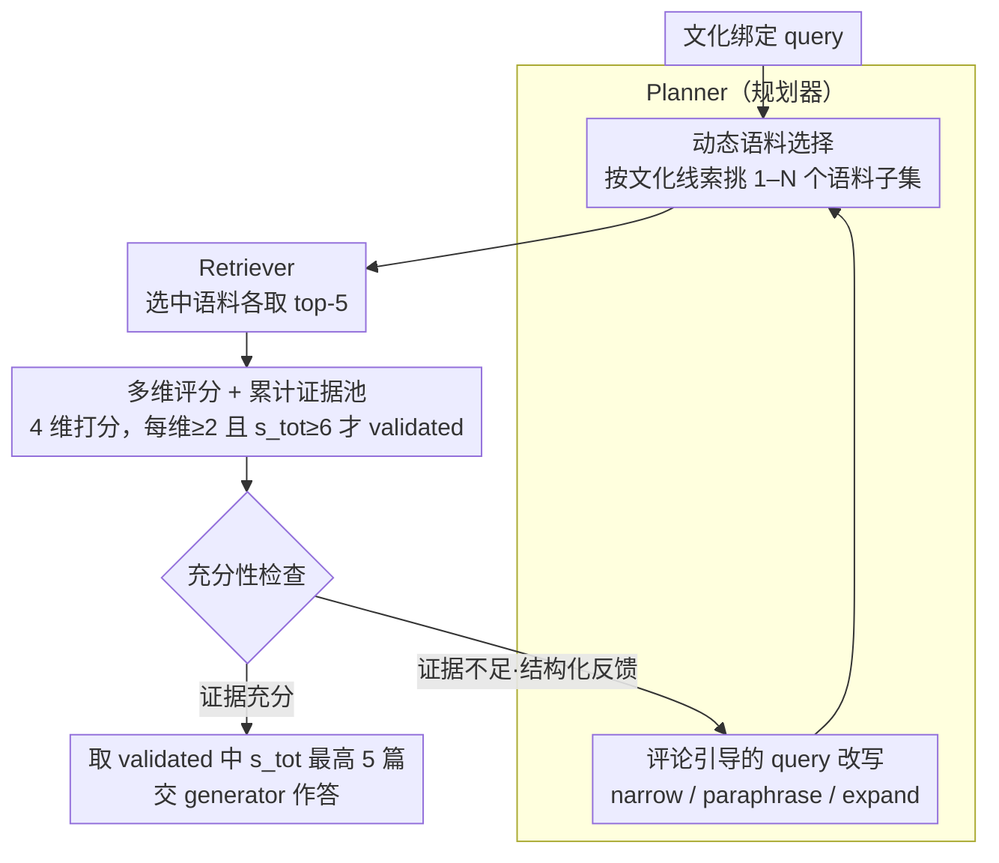

# CORAL: Adaptive Retrieval Loop for Culturally-Aligned Multilingual RAG

**会议**: ACL 2026 Findings  
**arXiv**: [2604.25676](https://arxiv.org/abs/2604.25676)  
**代码**: 论文未明确开源链接（实验细节附录提供）  
**领域**: 信息检索 / 多语言 RAG / Agentic RAG  
**关键词**: 多文化 RAG、planner-critic 循环、动态语料选择、查询改写、低资源语言

## 一句话总结
CORAL 把多语言 RAG 失败重新定位成"retrieval condition misalignment"——不仅要改写 query，更要动态切换检索的语料库——通过 planner + critic 两个 agent 形成"选语料 → 检索 → 评分过滤 → 充分性检查 → 改语料 + 改 query"的闭环，在两个文化基准上对低资源语言相对最强 baseline 提升 3.58pp，对 CLIcK 韩国文化 QA 提升 3.91pp。

## 研究背景与动机

**领域现状**：多语言 RAG（mRAG）通常用 query 翻译或多语言嵌入做共享检索空间，假设"只要语言对齐就够了"。

**现有痛点**：(1) 文化绑定的 query（韩国节日、印尼习俗）经常拿到"语义相关但文化错位"的证据——例如关于韩国传统节日的问题，从英文 Wikipedia 检索得到"Korean tourism"这种泛泛信息；(2) 已有 agentic mRAG（Self-RAG、ReAct、IRCoT）只关注"怎么搜"——query reformulation、多跳推理——但**检索空间始终是固定的**，再聪明的 query 改写也无法补偿"在错误语料里搜索"；(3) 单纯堆更多语言到 corpus pool（multiRAG）反而引入更多噪声。

**核心矛盾**：现有 mRAG 把多语言当作 representation 问题（让所有语言映射到同一空间），但文化 QA 真正缺的是**locale-specific 知识**——把它和 globally aggregated 内容混在一起会让 retrieve 阶段被主流文化淹没。

**本文目标**：(1) 把"retrieval condition"（语料库范围 + query 表述）当成 first-class、可在 test time 修改的决策；(2) 用 feedback loop 让证据质量驱动 retrieval 条件更新；(3) 在低资源语言上证明这种"adaptive retrieval condition"比"adaptive query"更有效。

**切入角度**：与其让 planner 在固定 corpus 里换说法，不如让 planner 同时决定"在哪些 corpus 里搜 + 怎么搜"，并由 critic 判断证据是否足够、不够时反馈给 planner 重选语料。

**核心 idea**：动态语料选择 + 评论引导的 query 改写 + 显式 sufficiency 检查，三件事在 planner-critic loop 中迭代。

## 方法详解

### 整体框架

CORAL 把多语言 RAG 的失败重新定位为"retrieval condition misalignment"——既不是 query 没写好，也不是模型不够强，而是"在错误的语料库里搜索"，于是它让"检索条件"（语料范围 + query 表述）成为 test-time 可修改的一等决策。整个系统不训练任何模型，仅靠两个 LLM agent（planner 与 critic）配合外部 retriever（Qwen3-Embedding-8B + FAISS）跑一个反馈闭环：planner 根据 query 的文化线索挑选语料子集并改写 query，retriever 在选中语料里检索，critic 用多维评分过滤文档并判断证据是否充分，不充分就把结构化反馈交还 planner 重选语料、再改 query。输入是一条文化绑定的问题，中间经过约 1–2 轮迭代积累 validated 证据，输出是得分最高的 5 篇文档交给 generator 作答。

### 关键设计

**1. Query-conditioned 动态语料选择：让"在哪搜"随文化线索变化，而非固定大池**

本文的核心论点是 mRAG 的瓶颈不在 query 表述而在 retrieval 空间——把 locale-specific 知识和 globally aggregated 内容混在一个大池里，检索阶段就会被主流文化淹没。CORAL 让 planner 根据 query 动态挑选 1–N 个目标语料库（13 种 Wikipedia 语言子集）：默认先选 query 自身语言对应的 corpus，遇到文化线索（地方机构、习俗、region 实体）则扩展到文化邻近语料，例如 BLEnD-su（印尼 Sundanese 文化）的 query 会同时选 Sundanese 和 Indonesian 语料；critic 反馈后还能补 regional 高资源邻居或剔除无关源。Figure 3 显示 planner 选的语言分布远超 query 语言本身（英文 query 也会触发 su/id/fa/ar），说明它真在做"文化路由"而非简单语言匹配。

**2. 多维评分 + 累计证据池 + 显式 sufficiency 检查：把"语义对但语境错"显式量化**

单一 relevance 排序正是文化 QA 的弱点所在——一篇关于韩国旅游的文档对韩国传统节日问题可能"语义相关但文化错位"。CORAL 让 critic 给每篇文档打 4 维 0–5 分（relevance $s_\text{rel}$、usefulness $s_\text{use}$、specificity $s_\text{spec}$、compatibility $s_\text{comp}$），按 $s_{tot} = s_{rel} + 0.5(s_{use} + s_{spec} + s_{comp})$ 聚合，只有每维 $\geq 2$ 且 $s_{tot} \geq 6$ 的文档才算 validated 并跨迭代累积。新增的 compatibility 维度专门捕捉语言/文化/领域是否对齐，相当于把以往隐性的"软偏见"翻译成可计算的 reranking 信号；每轮 critic 还给出"现有证据是否足够"的二元决定，让分维度评分变成 planner 下一轮精准改进的结构化反馈，而非笼统的"再搜一次"。

**3. Critique-guided query rewriting：让 query 改写由失败信号驱动，而非只换语言**

纯 translation-based 改写（tRAG / crossRAG）在文化任务上失败，因为它只改语言、不改"信息需求结构"。CORAL 让 planner 按 critic 指出的失败原因做三类改写：narrow（加约束/消歧）、paraphrase、expand。作者人工标注 100 个 CLIcK 样本的 158 个 rewrite，发现 53.8% 是 narrow、32.9% 是 paraphrase、其余是 expand——narrow 通常发生在"检索到话题相关但信息不足"时，planner 把 critic 指出的缺失 context cue 补进 query，让下一轮检索更聚焦。本质上是把"信息缺口"翻译成具体的检索约束，而不是换一种说法重搜。

### 一个完整示例

以 BLEnD-su 中一条关于 Sundanese 传统习俗的英文 query 为例：planner 先识别出其中的文化线索，除 English 语料外主动加入 Sundanese 和 Indonesian 语料；retriever 在这几个语料里各取 top-5；critic 对返回文档打 4 维分，发现英文 Wikipedia 的命中虽 relevance 高但 compatibility 仅 1 分（文化不对齐）被滤掉，Sundanese 命中信息又偏薄、判定证据不足；critic 把"缺少具体仪式步骤"的反馈交给 planner，planner 据此做一次 narrow 改写补上缺失约束、并保留 Sundanese/Indonesian 语料重检索；第二轮拿到 compatibility 达标的文档后 sufficiency 通过，取累计 validated 文档中 $s_{tot}$ 最高的 5 篇喂给 generator 作答。

### 损失函数 / 训练策略

完全 inference-time，无任何训练：planner / critic 温度 0.6 + reasoning effort high，generator 温度 0 + reasoning effort low。critic 负责 4 维评分 + sufficiency 决策，planner 负责 corpus 选择 + query rewrite 决策；迭代有上限，sufficiency 满足即停（BLEnD 平均 1.34 轮、CLIcK 平均 1.52 轮）。

## 实验关键数据

### 主实验（cultural QA accuracy，generator = LLaMA-3.2-3B-Instruct）

| 方法 | BLEnD-low | BLEnD-mid | BLEnD-high | BLEnD-avg | CLIcK |
|------|-----------|-----------|------------|-----------|-------|
| Non-RAG | 58.04 | 55.65 | 62.09 | 62.13 | 48.10 |
| monoRAG | 57.69 | 56.80 | 65.03 | 63.93 | 53.53 |
| tRAG (translate-then-retrieve) | – | – | – | – | 56.06 |
| multiRAG (all corpus pool) | 61.89 | 56.48 | 67.97 | 63.49 | 50.78 |
| crossRAG (multi + 翻译文档) | 62.59 | 57.83 | 67.32 | 64.27 | 53.75 |
| **CORAL (GPT-OSS-120B)** | **68.18** | 60.47 | 70.92 | 67.14 | 58.66 |
| **CORAL (Qwen3-235B)** | 66.78 | **61.83** | **72.22** | **67.84** | **58.88** |

最大改进：BLEnD-low 上 +3.58pp（Sundanese 单语言达 +5.59pp），CLIcK 上 +3.91pp；对比 Self-RAG 提升达 +12.14pp。

### 消融实验

**(a) 固定 corpus scope vs CORAL（即"如果只死板加上 English 作为 fallback 够不够"）：**

| 方法 | BLEnD-low | BLEnD-mid | BLEnD-high | CLIcK |
|------|-----------|-----------|------------|-------|
| Non-RAG | 55.65 | 63.06 | 69.29 | 48.10 |
| RAG-$C_\text{own}$（oracle 单语料） | 51.89 | 60.77 | 67.43 | 53.53 |
| RAG-$C_\text{all}$（全 pool） | 56.55 | 65.92 | 69.84 | 50.78 |
| RAG-$C_\text{own} \cup C_\text{en}$ | 56.06 | 65.94 | 71.22 | 54.20 |
| **CORAL** | **61.83** | **70.41** | **72.78** | **58.88** |

**(b) 组件 ablation（multiRAG baseline 逐步加 CORAL 组件，GPT-OSS-120B planner）：**

| 配置 | BLEnD-low | BLEnD-mid | BLEnD-high | CLIcK |
|------|-----------|-----------|------------|-------|
| multiRAG（fixed pool + 原 query） | 56.55 | 65.92 | 69.84 | 50.78 |
| + Dynamic Corpus Selection | 58.11 | 70.06 | 72.76 | 57.25 |
| **+ Query Rewriting (full CORAL)** | **60.47** | 69.10 | **73.51** | **58.66** |

### 关键发现
- 单纯加英文 fallback（$C_\text{own} \cup C_\text{en}$）远不如动态选择——证明 CORAL 的提升不是"靠英语兜底"，而是真在做 query-conditioned 文化路由。
- Oracle 固定语料 $C_\text{own}$（给出真实文化标签后只查对应语言）在 BLEnD 上甚至低于 Non-RAG，说明文化 QA 不能依赖单一语言源——很多答案需要 proxy evidence。
- Dynamic Corpus Selection 单独贡献最大（multiRAG → +5.78pp on BLEnD-mid，+6.47pp on CLIcK），证明"在哪搜"比"怎么搜"更关键。
- Query rewriting 在加上语料选择后再叠加 +1–3pp，且 53.8% 是 narrow 类——主要功能是把 critic 发现的语境缺失补回去，而非翻译。
- 跨 3 个 generator（Llama-3.2-3B, Ministral-3-8B, Qwen3-1.7B）一致受益，说明改进源于 retrieval condition 而非 generator 能力。

## 亮点与洞察
- "Retrieval condition misalignment"是个清晰且可操作的失败模式命名——它把"为什么 mRAG 失败"从模糊的"hallucination"具体化为"在错误的 corpus 里搜了语义对但文化错的内容"，并对应明确的修复路径。
- Critic 的"compatibility"维度专门捕捉文化匹配，把以往按 relevance 排序的弱点显式化——相当于把"软性偏见"翻译成可计算的 reranking 信号。
- Planner 选择的语料分布（Fig 3）显示英文 query 也会触发 Sundanese/Indonesian 语料——这说明 planner 真在做"文化推断"而非"语言匹配"，是 emergent behavior 的有力证据。
- 整个框架不训练任何模型，纯靠两个 LLM agent 闭环，可立即部署到任意 LLM 上；这种 inference-time agentic 设计是低资源语言场景的实用方案。

## 局限与展望
- Wikipedia 子集限制了 corpus 多样性——很多 procedural / experiential / 地方政策类知识不在 Wikipedia，对真实文化 QA 仍有盲区。
- 当前只评 MCQ，不覆盖开放式生成 / 多轮 / partially correct 等失败模式。
- planner / critic 同模型同时担任，未消融它们解耦的影响；理论上一个 strong planner + 一个 lightweight critic 可能更高效。
- 高冲突场景（NQ-Swap 风格）未评，CORAL 是否需要 suppression 机制补强未知。
- Iterative inference 算力开销：CLIcK 平均 21,548 tokens/sample，对大规模部署是成本因素，需要缓存/早停优化。

## 相关工作与启发
- **vs Self-RAG / IRCoT / Self-Ask**：他们做 iterative query 改写但保持 corpus 固定；CORAL 把"retrieval space"也变成可适应变量，在 BLEnD 上比 Self-RAG 高 12.14pp。
- **vs multiRAG / crossRAG（Ranaldi et al. 2026）**：他们把多语料合并或翻译；CORAL 选择性 retrieval + critique 过滤，避免"indiscriminate corpus expansion"的噪声。
- **vs MAFeRw / RQ-RAG（query 改写专家）**：他们只优化 query；CORAL 同时优化 corpus + query，并把"信息缺失"反馈到 query 改写。
- **vs MIRAGE-bench / BLEnD（文化基准）**：本文不只是评估，而是给出 retrieval-side 改进，证明"评测发现问题 → 解法应在 retrieval 而非 generation"。

## 评分
- 新颖性: ⭐⭐⭐⭐⭐ "retrieval condition 是 first-class 决策"这个 reframing + 文化路由实证是新颖贡献
- 实验充分度: ⭐⭐⭐⭐⭐ 6 generator × 2 benchmark × 13 语言 + 3 类 ablation + 人工标注 rewrite 类型分析，相当扎实
- 写作质量: ⭐⭐⭐⭐ 故事清晰、消融充分；但部分 prompt 细节和算法步骤偏附录化
- 价值: ⭐⭐⭐⭐⭐ 对低资源语言 RAG 部署立刻可用，且不需训练，对国际化产品团队有直接价值

<!-- RELATED:START -->

## 相关论文

- [\[ACL 2026\] Enhancing Multilingual RAG Systems with Debiased Language Preference-Guided Query Fusion](enhancing_multilingual_rag_systems_with_debiased_language_preference-guided_quer.md)
- [\[ACL 2025\] Multilingual Retrieval Augmented Generation for Culturally-Sensitive Tasks: A Benchmark for Cross-lingual Robustness](../../ACL2025/information_retrieval/multilingual_retrieval_augmented_generation_for_culturally-sensitive_tasks_a_ben.md)
- [\[ACL 2026\] Language-Coupled Reinforcement Learning for Multilingual Retrieval-Augmented Generation](language-coupled_reinforcement_learning_for_multilingual_retrieval-augmented_gen.md)
- [\[ACL 2026\] All Languages Matter: Understanding and Mitigating Language Bias in Multilingual RAG](all_languages_matter_understanding_and_mitigating_language_bias_in_multilingual_.md)
- [\[CVPR 2026\] M4-RAG: A Massive-Scale Multilingual Multi-Cultural Multimodal RAG](../../CVPR2026/information_retrieval/m4-rag_a_massive-scale_multilingual_multi-cultural_multimodal_rag.md)

<!-- RELATED:END -->
