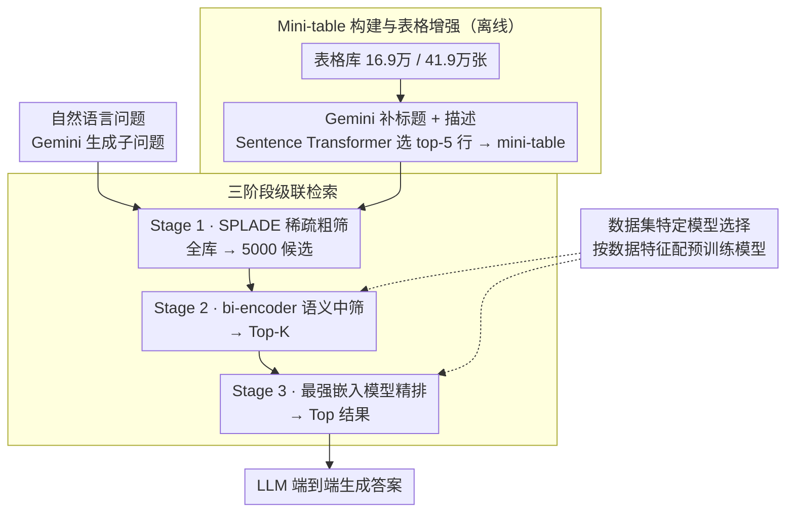

# CRAFT: Training-Free Cascaded Retrieval for Tabular QA

**会议**: ACL 2026  
**arXiv**: [2505.14984](https://arxiv.org/abs/2505.14984)  
**代码**: [项目页面](https://coral-lab-asu.github.io/CRAFT/)  
**领域**: 信息检索 / 表格问答  
**关键词**: 表格检索, 级联检索, 零样本, 表格问答, 训练免

## 一句话总结

本文提出 CRAFT，一个无需数据集特定训练的三阶段级联表格检索框架（SPLADE 稀疏过滤 → 语义 mini-table 排序 → 神经重排序），通过 Gemini 生成的表格标题和描述增强表格表示，在 NQ-Tables 上达到 SOTA（R@1 49.84），在 OTT-QA 上展现强零样本泛化能力，且对查询改写具有显著鲁棒性。

## 研究背景与动机

**领域现状**：开放域表格问答（TQA）需要先从大规模表格语料中检索相关表格，再在其上推理得出答案。现有方法包括稀疏检索（BM25）、密集检索（DPR、DTR）和混合检索（THYME）。

**现有痛点**：(1) 密集检索模型（DTR、DPR）计算成本高，且需要在新数据集上重新训练或微调，限制了对新领域的适应性；(2) 简单将表格线性化为文本会丢失行列结构信息；(3) 复杂架构（如 SSDR 的语法感知检索器）需要精细建模且训练代价大。

**核心矛盾**：表格检索的 SOTA 依赖于昂贵的领域特定微调，这使得系统在面对新领域或新数据集时缺乏灵活性。能否用预训练模型通过精心设计的检索管道达到竞争性能？

**本文目标**：构建一个模块化、可扩展的多阶段检索框架，利用现成的预训练模型在零样本设置下实现有竞争力的表格检索和端到端 QA 性能。

**切入角度**：三阶段级联设计——从高召回的稀疏检索逐步过渡到高精度的语义重排序，每一阶段使用更强但更慢的模型。同时用 Gemini 生成表格标题和描述来弥补表格表示的语义不足。

**核心 idea**：将级联检索的"渐进精化"思想应用于表格检索——稀疏模型高效过滤 → mini-table 构建降低 token 开销 → 神经模型精确重排，无需任何训练即可实现 SOTA。

## 方法详解

### 整体框架

CRAFT 的核心命题是：不靠任何数据集特定微调，单凭精心编排的级联管道加现成预训练模型，就能在表格检索上打平甚至超过微调 SOTA。给定一条自然语言问题，系统先做离线预处理（Gemini-1.5-Flash 生成查询子问题、为每个表格补一段标题和描述，Sentence Transformer 把表格行按语义相关性排好序），再走「稀疏粗筛 → 语义中筛 → 神经精排」三级漏斗：从 16.9 万/41.9 万张表里逐级收窄到最终 Top 结果，交给端到端 LLM 生成答案。整条链路一个权重都不更新。

### 关键设计

**1. 三阶段级联检索：让模型「越往后越强、越往后越少」**

直接在全量表格上跑语义模型成本爆炸，所以 CRAFT 用漏斗式分工把精度和效率拆到三级。Stage 1 用 SPLADE 做稀疏词汇扩展，吃进标题、列头、单元格值和生成描述，对全库高效扫描，过滤到 5000 个候选；Stage 2 把每张表压成 mini-table 后用 bi-encoder 语义匹配，缩到 Top-K；Stage 3 再请出最强嵌入模型（text-embedding-3-large 或 gemini-embedding-001）做最终重排。

每一级都「更强但更慢」，但因为上一级已经把候选数砍掉一两个量级，昂贵模型只在小集合上跑。消融显示这种分工确实层层加分：Stage 1→2 的 R@10 提升约 10–21 点，Stage 2→3 再加 5–8 点，没有哪一级是摆设。

**2. Mini-table 构建与表格增强：先瘦身再补语义**

把整张表线性化喂给嵌入模型既贵又会淹没关键信号，于是 CRAFT 每张表只保留列头加最相关的前 5 行（前 5 行由 Sentence Transformer 按与查询的语义相关性排序选出）构成 mini-table；同时让 Gemini-1.5-Flash 为每张表生成一个描述性标题和一段详细描述，补足裸表格在语义匹配上的先天不足。

这一瘦一补的组合直接带来 33× 更少的在线嵌入调用和 70% 更短的上下文，而检索精度不降反升——证明表格里真正有判别力的信息高度集中在表头和少数代表行上。

**3. 数据集特定的模型选择：按数据特征配模型，而非按数据微调**

CRAFT 不在新数据集上训练，但承认不同数据的文本特征不同，于是把适配性放在「选哪个预训练模型」这一层：NQ-Tables 偏单跳事实查询，配 all-mpnet-base-v2 + text-embedding-3-large；OTT-QA 偏多跳推理、文本表格混合模式，配 Jina Embeddings v3 + gemini-embedding-001。选型依据是模型对该类文本的天然适配，而非任何梯度更新。

这保留了「零训练」的核心卖点，又让框架对不同领域的查询/表格风格留出了一个无需重训的适配旋钮。

### 损失函数 / 训练策略

本文不涉及任何训练，所有模型直接用预训练权重或 API。端到端 QA 阶段用 Llama3-8B、Qwen2.5-7B、Mistral-7B 以零样本或少样本方式生成答案。

## 实验关键数据

### 主实验

**NQ-Tables 检索性能**

| 模型 | 训练需求 | R@1 | R@10 | R@50 |
|------|---------|-----|------|------|
| THYME（SOTA 混合） | 需微调 | 48.55 | 86.38 | 96.08 |
| DTR+HN | 需微调 | 47.33 | 80.96 | 91.51 |
| BIBERT+SPLADE | 需微调 | 45.62 | 86.72 | 95.62 |
| **CRAFT（零样本）** | **无** | **49.84** | **86.83** | **97.17** |

**OTT-QA 零样本检索性能**

| 模型 | R@1 | R@10 | R@50 |
|------|-----|------|------|
| THYME（微调） | 66.67 | 91.10 | 96.16 |
| **CRAFT（零样本）** | 55.56 | 89.88 | 96.07 |

### 消融实验

**查询鲁棒性（改写查询下的性能变化 Δ）**

| 模型 | 原始 R@10 | 改写后 Δ(avg) |
|------|----------|--------------|
| DTR (M) | 75.73 | -8.38 |
| DTR (S) | 73.88 | -11.82 |
| DTR (M)+HN | 80.96 | -5.80 |
| **CRAFT** | 87.16 | **-0.04** |

### 关键发现

- CRAFT 在 NQ-Tables 上零样本超越所有微调方法（R@1 49.84 vs THYME 48.55），证明精心设计的级联管道可以替代昂贵的微调
- 在 OTT-QA 上，CRAFT 的零样本 R@50（96.07）接近微调 SOTA（96.16），差距仅 0.09
- CRAFT 对查询改写几乎免疫（Δ=-0.04），而微调模型 DTR 性能下降 8-12 个点——泛化能力显著更强
- 级联设计中每个阶段都有贡献：Stage 1→2 R@10 提升约 10-21 点，Stage 2→3 再提升 5-8 点
- Mini-table 设计减少 33× 嵌入调用且不损精度

## 亮点与洞察

- 用级联检索+表格增强的"工程智慧"击败了微调方法，说明预训练模型的通用能力被低估
- 对查询改写的极端鲁棒性（Δ=-0.04）是非常实用的特性，微调模型在此方面脆弱
- Mini-table 构建是一个简单但有效的效率优化，70% 更短的上下文在实际部署中意义重大

## 局限与展望

- 依赖商业 API（Gemini、OpenAI embedding），成本和可复现性受限
- 模型选择（NQ-Tables vs OTT-QA 用不同模型）引入了数据集特定的工程选择
- 未评估在非英语表格或包含复杂格式（合并单元格）的表格上的表现
- 预处理（生成标题/描述）需要额外的离线 LLM 调用

## 相关工作与启发

- **vs THYME**: THYME 需要在目标数据集上微调且设计了字段感知匹配，CRAFT 无需训练但通过级联达到类似或更好性能
- **vs DTR**: DTR 是经典密集检索器但对查询改写敏感，CRAFT 的级联设计天然更鲁棒
- **vs T-RAG**: T-RAG 将检索和生成端到端结合，CRAFT 保持模块化便于替换组件

## 评分

- 新颖性: ⭐⭐⭐ 级联检索+表格增强的组合设计虽有效但并非全新概念
- 实验充分度: ⭐⭐⭐⭐⭐ 两个数据集、鲁棒性测试、阶段消融、端到端 QA 评估全面
- 写作质量: ⭐⭐⭐⭐ 方法描述清晰，实验分析详尽
- 价值: ⭐⭐⭐⭐ 证明了训练免检索可以达到 SOTA，对实际部署有直接价值

<!-- RELATED:START -->

## 相关论文

- [\[ICML 2025\] Don't Lag, RAG: Training-Free Adversarial Detection Using RAG](../../ICML2025/information_retrieval/dont_lag_rag_training-free_adversarial_detection_using_rag.md)
- [\[ACL 2026\] Test-Time Training for Zero-Resource Dense Retrieval Reranking](test-time_training_for_zero-resource_dense_retrieval_reranking.md)
- [\[ACL 2026\] S2G-RAG: Structured Sufficiency and Gap Judging for Iterative Retrieval-Augmented QA](s2g-rag_structured_sufficiency_and_gap_judging_for_iterative_retrieval-augmented.md)
- [\[ACL 2026\] Navigating Large-Scale Document Collections: MuDABench for Multi-Document Analytical QA](navigating_large-scale_document_collections_mudabench_for_multi-document_analyti.md)
- [\[ICLR 2026\] Q-RAG: Long Context Multi-Step Retrieval via Value-Based Embedder Training](../../ICLR2026/information_retrieval/q_rag_long_context_multi_step_retrieval.md)

<!-- RELATED:END -->
