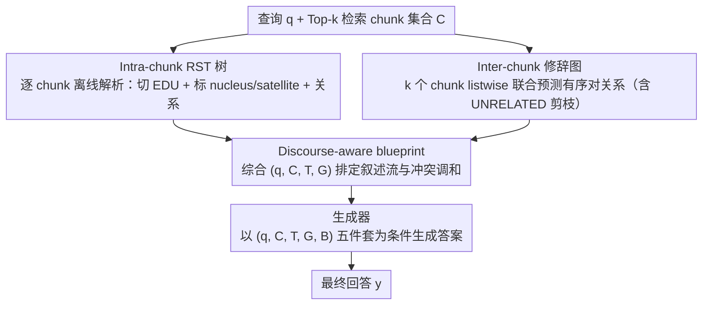

# Disco-RAG: Discourse-Aware Retrieval-Augmented Generation

**会议**: ACL 2026  
**arXiv**: [2601.04377](https://arxiv.org/abs/2601.04377)  
**代码**: https://dongqi.me/projects/Disco-RAG (有)  
**领域**: 信息检索 / RAG / 篇章结构  
**关键词**: RAG、RST、篇章结构、修辞图、长文档推理

## 一句话总结
作者提出 Disco-RAG，把修辞结构理论（RST）显式注入 RAG pipeline——对每个 chunk 解析 intra-chunk RST 树（局部层级）+ 跨 chunk 构建 inter-chunk 修辞图（全局连贯）+ 生成 discourse-aware blueprint 引导回答，在 Loong / ASQA / SciNews 三个长文档基准上 training-free 即拿下 SOTA（Loong overall +12.74 LLM Score）。

## 研究背景与动机

**领域现状**：RAG（Retrieval-Augmented Generation）是把外部知识接入 LLM 的主流方案，标准流程是把文档切 chunk → 向量化入库 → 查询时检索 Top-k chunk → 拼接进 prompt 让 LLM 生成。GraphRAG / RQ-RAG / StructRAG 等结构化变体陆续出现，通过知识图谱、子图、层级树等给检索增加结构信号。

**现有痛点**：现有 RAG（包括 GraphRAG 等结构化变体）有两个被忽略的篇章层面缺陷：(1) **intra-chunk structural blindness**——chunk 内部的修辞层级（哪句是核心、哪句是补充、哪些是因果/对比关系）未被建模；(2) **inter-chunk coherence gaps**——多个 chunk 之间的修辞连接（如 chunk A 的结论与 chunk B 的反例之间的对照关系）无法被识别。

**核心矛盾**：举一个反例——Chunk A 说「研究发现 12% 较低的发病率」，Chunk B 说「整体效应不显著」。标准 RAG 不知道 A 是 conditional finding（仅适用于冬季缺 D 成人），会粗放地总结为「维生素 D 降低流感风险」。本质问题是：**RAG 检索回的是 chunk 级证据，但生成需要 discourse 级推理**——这之间隔着「孤立证据」vs「连贯论证链」的鸿沟。

**本文目标**：在 inference-time（不微调）让 LLM 既能看到 chunk，又能看到 chunk 内/chunk 间的修辞结构，并在此基础上做出 plan，再生成。

**切入角度**：修辞结构理论（RST, Mann & Thompson 1987/1988）天然提供了 nucleus（核心）/satellite（卫星）+ Elaboration / Contrast / Cause 等关系标签，过去主要用于摘要和神经生成模型，本文首次系统迁移到 RAG。

**核心 idea**：用 LLM 同时充当 RST parser（解析 chunk 内 EDU + 关系）+ rhetorical graph constructor（预测 chunk 间关系）+ planner（生成基于结构的 blueprint）+ generator，4 个角色串成 pipeline，无需任何额外训练。

## 方法详解

### 整体框架

Disco-RAG 是一套 inference-time 策略，不动 retriever 和 generator 的参数，而是在标准 RAG 的「检索 → 生成」之间塞进「篇章建模 + 规划」两段，让 LLM 不只看到孤立 chunk，还看到 chunk 内/chunk 间的修辞结构再动笔。标准 RAG 形式化为 $y = \arg\max_{y'} P(y' \mid q, \mathcal{C})$，其中 $\mathcal{C} = \{c_1, \dots, c_k\}$ 是 Top-$k$ 检索的 chunk；Disco-RAG 在此之上依次产出每个 chunk 的 intra-chunk RST 树 $\mathcal{T}$、chunk 之间的 inter-chunk 修辞图 $\mathcal{G}$、以及一份 discourse-aware blueprint $\mathcal{B}$，最终把 $(q, \mathcal{C}, \mathcal{T}, \mathcal{G}, \mathcal{B})$ 五件套一起作为生成条件：$y = \arg\max_{y'} P(y' \mid q, \mathcal{C}, \mathcal{T}, \mathcal{G}, \mathcal{B})$。同一个基模换 prompt 轮流扮演 parser / graph constructor / planner / generator 四个角色，全程零训练。

### 关键设计

**1. Intra-chunk RST tree：把 chunk 从 bag-of-tokens 还原成有主次的修辞树**

标准 RAG 把整个 chunk 当一袋 token 抛给 generator，核心结论和旁证混为一谈，模型很容易把一句带条件的局部结论当成普遍结论。Disco-RAG 让 LLM parser $\mathcal{A}$ 对每个 chunk $c_i$ 联合做三件事——切分 EDU（Elementary Discourse Unit）、分配 nucleus/satellite 角色、标注 Elaboration/Contrast/Cause 等关系——得到一棵 RST 树 $t_i=(V_i,E_i)$。这一过程形式化为 $P(t_i \mid c_i; \theta_\mathcal{A}) = \prod_j P(e_{i_j} \mid c_i; \theta_\mathcal{A}) \cdot \prod_{(u,v)} P(r_{u,v} \mid e_{i_u}, e_{i_v}; \theta_\mathcal{A})$，前一项是 EDU 边界概率、后一项是关系概率。

有了这棵树，generator 就被明确告知「这段的核心句是哪条、哪些只是 elaboration、哪些是 condition」，从而不被 satellite 信息带偏。由于这步与查询无关，所有 intra-chunk 树都**离线**预解析，把它的推理成本摊销掉。

**2. Inter-chunk rhetorical graph：用 listwise 推理捞出 chunk 之间的论证关系**

证据散在多个 chunk 里时，真正难的是判断它们之间「A 是 B 的反例」「C 支持 A 却反驳 B」这类论证级关系，而这恰是 GraphRAG 等 entity-edge 图最缺的。Disco-RAG 把全部 $k$ 个 retrieved chunk 一次性 listwise 喂给 $\mathcal{A}$，让它联合预测每个有序对的修辞关系，构成有向图 $\mathcal{G}=(\mathcal{C},\mathcal{F})$：$P(\mathcal{G} \mid \mathcal{C}) = \prod_{i=1}^k \prod_{j \ne i} P(r_{i,j} \mid \mathcal{C})$，并允许 UNRELATED 标签让模型主动剪枝无关连接。

相比把 chunk A、chunk B 拆开单独问的 pairwise 做法，listwise 让 parser 始终握有全局上下文，更容易识别那种需要三方对照才能判定的关系——这也是后面对检索噪声极鲁棒（能自动忽略 UNRELATED 段）的来源。

**3. Discourse-aware planning blueprint：先按修辞结构排好叙述流，再落笔**

直接生成会把「选哪些证据、按什么顺序、怎么处理冲突」这些高层决策和措辞这种低层决策搅在一起。Disco-RAG 在生成前先把 $(q, \mathcal{C}, \mathcal{T}, \mathcal{G})$ 全部交给 $\mathcal{A}$ 产出一份动态 blueprint $\mathcal{B}$，列明先讲什么、再讲什么、用哪些证据支撑、冲突证据如何调和。这份 plan 既不是抽取式（不照抄 chunk）也不是 free-form（受 RST 树和修辞图约束），而是一串「discourse-aware reasoning steps」。

关键在于「discourse-aware」四个字：消融里不看结构的 generic plan 只比标准 RAG 涨 1.3–2.0 分，而利用 RST 关系决定「先讲 nucleus 还是 satellite」「contrast 怎么呈现」的 discourse-aware plan 涨 12+ 分，说明结构 prior 才是放大器、纯 plan 本身价值有限。

### 损失函数 / 训练策略

**完全 training-free**，四个 LLM 角色（parser / graph constructor / planner / generator）共享同一基模（Llama-3.1-8B、Llama-3.3-70B 或 Qwen2.5-72B）。Retriever 用 Qwen3-Embedding-8B，chunk size = 256 tokens（无 sliding window），Top-10 retrieval，beam search width = 3。各模块全部由 prompt 驱动，完整模板见论文附录。

## 实验关键数据

### 主实验：3 个长文档基准（节选）

**Loong**（4 个长度档，10K → 250K tokens；4 种任务）综合表现：

| 长度档 | 方法 | Backbone | LLM Score↑ | EM↑ |
|--------|------|----------|------------|------|
| Set 1 (10K-50K) | Standard RAG | Llama-3.3-70B | 62.78 | 0.34 |
| Set 1 | StructRAG (prev SOTA) | – | 69.43 | 0.35 |
| Set 1 | **Disco-RAG** | Llama-3.3-70B | **71.00** | **0.38** |
| Set 2 (50K-100K) | Standard RAG | Llama-3.3-70B | 53.77 | 0.18 |
| Set 2 | **Disco-RAG** | Llama-3.3-70B | **63.61** | **0.28** |
| Set 4 (200K-250K) | Standard RAG | Llama-3.3-70B | 35.61 | 0.07 |
| Set 4 | StructRAG | – | 51.42 | 0.10 |
| Set 4 | **Disco-RAG** | Llama-3.3-70B | **54.62** | **0.11** |

**ASQA**：Disco-RAG (Llama-3.3-70B) 拿到 EM=42.0 / RL=42.3 / DR=32.8，全维度超越 MAIN-RAG-Llama3-8B（39.2 / 42.0 / —）与 Tree of Clarifications（— / 39.7 / 36.6）。

**SciNews**：Disco-RAG (Llama-3.3-70B) 拿到 RL=21.11 / BERTScore=65.67 / SARI=44.37 / SummaC=69.48，多数指标超越 RSTformer（20.12 / 62.80 / 41.56 / —）和 Plan-Input（— / 65.32 / — / 72.40）。

### 消融实验（Loong benchmark, Llama-3.3-70B）

| 方法 | Overall LLM Score | Overall EM | 说明 |
|------|-------------------|------------|------|
| **Disco-RAG (full)** | **62.07** | **0.24** | 三模块齐全 |
| w/o RST tree | 56.22 | 0.20 | 去掉 intra-chunk 树 → 跌 5.85 |
| w/o rhetorical graph | 57.10 | 0.21 | 去掉 inter-chunk 图 → 跌 4.97 |
| w/o planning | 59.75 | 0.22 | 去掉 planner → 跌 2.32 |
| Standard RAG | 49.33 | 0.17 | 基线 |
| w/ retrieve-and-plan | 50.64 | 0.18 | 标准 RAG + free-form plan（无结构） |
| w/ plan-and-retrieve | 51.38 | 0.18 | 先 plan 再 retrieve（无结构） |

generic planning 只比 standard RAG 涨 1.3–2.0 分，而 discourse-aware planning 涨 12+ 分，证明结构 prior 不可替代。

### 关键发现
- **结构模块 > planner 的贡献**：RST 树和修辞图各贡献 ~5 分，planner 只贡献 ~2 分。结构是基础，plan 是放大器。
- **越长文档增益越大**：Set 1（短）Disco-RAG 比 Standard RAG 高 8.22 分，Set 4（200K+ tokens）则高 19 分。证明 discourse-aware 在长文档下尤其关键——证据分散时更需要修辞 scaffold 来串联。
- **对 retrieval 噪声极鲁棒**：替换 Top-10 中 20–40% 为无关 chunk，Standard RAG 从 49.33 跌到 45.23，Disco-RAG 仍维持 56.17，说明修辞结构能让 generator 自动识别 UNRELATED 段。
- **结构扰动实验**：随机 shuffle RST 关系标签 → 62.07 → 55.48；翻转图边方向 → 55.82；shuffle plan steps → 57.50。但都仍优于 standard RAG（49.33），证明性能来自 structural 信号本身而非「多了 token」。
- **混合模型部署**：8B parser + 70B generator 拿到 60.52，逼近全 70B 的 62.07，远超 standard RAG 的 49.33——意味着结构模块可以下放到小模型节省成本。
- **SFT 正交可叠加**：在 SciNews 上 fine-tune generator 后再加 discourse 输入，RL 从 22.8 涨到 23.3，SummaC 从 72.3 涨到 74.0，证明 discourse signal 与参数学习互补。
- **人工评估**：3 名 PhD 评分（3 分 Likert），Disco-RAG 在 Faithfulness 上 2.53 vs Standard RAG 1.67，几乎追近人写参考的 2.88。

## 亮点与洞察
- **「discourse」是 RAG 一直缺的那块拼图**：GraphRAG 等结构化变体盯着 entity-level KG，本文 zoom out 到 argument-level discourse，捕捉因果/对比/elaboration 这类「论证关系」，刚好是 LLM 在多文档合成时最容易出错的层面。这个视角转换很巧妙。
- **Listwise inter-chunk relation prediction**：相比 pairwise 询问，让 LLM 一次看完所有 chunk 再决定关系，能利用全局上下文做更精准的修辞推断。这个 listwise trick 可以迁移到任何「文档间关系建模」任务（如多文档摘要的冲突检测、新闻事件聚类）。
- **三模块解耦 + 同一基模复用**：parser / graph constructor / planner / generator 都用同一个 LLM，只换 prompt，工程上极简且部署灵活。混合模型实验进一步表明可以「8B 跑结构 + 70B 跑生成」省成本。
- **结构 ablation 仍优于无结构**：即便随机扰动后的结构信号都比 standard RAG 强，说明 discourse-aware framework 的 robustness 来自「让 generator 关注结构」这件事本身，而非依赖完美 parsing。这给实际部署降低了 parser 质量门槛。
- **修辞结构在长文档下增益翻倍**：从 Set 1 的 +8 分到 Set 4 的 +19 分，证明 RAG 系统在长文档场景下最该补的能力就是 discourse modeling。

## 局限与展望
- **额外 LLM 调用 → 高 latency / token 消耗**：作者承认 RST parsing + graph construction + planning 各需一次 LLM 调用，比 standard RAG 大约慢 3-4 倍，对延迟敏感场景需要缓存复用结构、batching 或蒸馏 lighter parser。
- **依赖 backbone 的 discourse 理解能力**：在小模型（如 Llama-3.1-8B）上 parser 质量不如 70B，全 8B 版本只到 58.94 vs 全 70B 的 62.07。对更小或非 instruction-tuned 模型可能完全失效。
- **数据集偏 narrow**：三个 benchmark 都是英文 + 学术/百科风格，对其他语言、对话/代码/数学类文档的适用性未知。
- **修辞关系标签集固定**：只用了经典 RST 的少数关系（Elaboration, Contrast, Cause 等），对法律/医学等专域可能需要扩展标签集。
- **未对比 entity-level + discourse-level 联合方法**：作者把 GraphRAG 当 baseline 但没尝试「GraphRAG 的实体图 + Disco-RAG 的修辞图」融合，这块潜力未挖。

## 相关工作与启发
- **vs GraphRAG (Edge et al. 2024) / KG-RAG**：GraphRAG 用 entity-level KG，把证据按实体共现组织；Disco-RAG 用 argument-level RST，把证据按修辞关系组织。两者粒度不同——entity 解决「我提到了什么」，discourse 解决「我在论证什么」。本文在 Loong 上比 GraphRAG 高 30+ 分，证明 discourse 是当前 RAG 更紧迫的瓶颈。
- **vs StructRAG (Li et al. 2025b)**：StructRAG 用 hybrid information structurization（动态选 table/tree/graph 等格式），是 SOTA 的训练时方法；Disco-RAG training-free 且持续小幅优于 StructRAG（71.00 vs 69.43 in Set 1, 54.62 vs 51.42 in Set 4），证明结构化信号的「类型」（修辞 vs 通用）比「形式」更重要。
- **vs RST-LoRA (Liu & Demberg 2024) / RSTformer (Liu et al. 2024)**：这两者把 RST 注入摘要模型的参数（LoRA / 编码器），Disco-RAG 把 RST 注入 prompt（inference-time），更易迁移到任意 frozen LLM。
- **vs Tree of Clarifications / RQ-RAG / MAIN-RAG**：这些方法专注 query refinement / multi-agent filtering，Disco-RAG 关注「retrieved evidence 的结构」，两类工作互补，可叠加。
- **vs FLARE (Jiang et al. 2023)**：FLARE 是 active retrieval，Disco-RAG 是 post-retrieval structural enhancement，可结合：先 FLARE 决定何时检索，再 Disco-RAG 解析结构。

## 评分
- 新颖性: ⭐⭐⭐⭐ RST 注入 RAG 这一具体组合是新的，但 RST 本身和 RAG 结构化都有 prior work
- 实验充分度: ⭐⭐⭐⭐⭐ 3 数据集 × 3 backbone × 4 长度档 + 消融 + 结构扰动 + 混合部署 + SFT 叠加 + 人工评估，极其详尽
- 写作质量: ⭐⭐⭐⭐ 公式化 pipeline 清晰，图 1 的反例说明 motivation 直观；附录 prompt 全公开
- 价值: ⭐⭐⭐⭐⭐ Training-free 即可大幅提升长文档 RAG，且模块化解耦工程友好，直接可部署

<!-- RELATED:START -->

## 相关论文

- [\[ACL 2025\] Typed-RAG: Type-Aware Decomposition of Non-Factoid Questions for Retrieval-Augmented Generation](../../ACL2025/information_retrieval/typed-rag_type-aware_decomposition_of_non-factoid_questions_for_retrieval-augmen.md)
- [\[ACL 2026\] MASS-RAG: Multi-Agent Synthesis Retrieval-Augmented Generation](mass-rag_multi-agent_synthesis_retrieval-augmented_generation.md)
- [\[ACL 2026\] Feedback Adaptation for Retrieval-Augmented Generation](feedback_adaptation_for_retrieval-augmented_generation.md)
- [\[ACL 2025\] EXIT: Context-Aware Extractive Compression for Enhancing Retrieval-Augmented Generation](../../ACL2025/information_retrieval/exit_context-aware_extractive_compression_for_enhancing_retrieval-augmented_gene.md)
- [\[ACL 2026\] VideoStir: Understanding Long Videos via Spatio-Temporally Structured and Intent-Aware RAG](videostir_understanding_long_videos_via_spatio-temporally_structured_and_intent-.md)

<!-- RELATED:END -->
