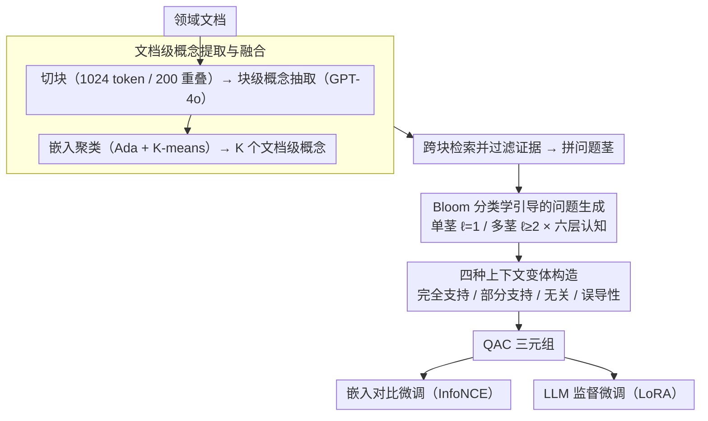

# Domain-Specific Data Generation Framework for RAG Adaptation

**会议**: ACL 2026  
**arXiv**: [2510.11217](https://arxiv.org/abs/2510.11217)  
**代码**: 无  
**领域**: 信息检索 / RAG  
**关键词**: RAG适配, 数据生成, 领域特定, 嵌入微调, Bloom分类学

## 一句话总结

本文提出 RAGen，一个可扩展的模块化数据生成框架，通过文档级概念提取、多块证据组装和 Bloom 分类学引导的问题生成，自动合成领域特定的 QAC（问题-答案-上下文）数据，支持嵌入模型对比微调和 LLM 监督微调，在三个领域数据集上显著优于 AutoRAG 和 LlamaIndex 基线。

## 研究背景与动机

**领域现状**：RAG（检索增强生成）已成为将 LLM 集成到领域特定工作流的主流方案，通过外部检索为模型提供上下文信息。但直接应用通用 RAG 管道到新领域往往性能不佳。

**现有痛点**：(1) 通用检索器和生成器未与领域特定术语和数据分布对齐；(2) RAG 适配需要高质量的领域特定训练数据，但人工标注成本高昂；(3) 现有数据生成方法（AutoRAG、LlamaIndex）基于单块问题生成范式——仅从单个文本块中生成问题，导致问题浅显、局部化、缺乏跨概念推理能力；(4) RAFT 等方法针对单一组件优化，且与特定训练范式紧密耦合。

**核心矛盾**：RAG 适配的关键瓶颈不是模型架构或训练目标，而是上游的数据供给——缺乏高质量、跨概念、多认知层次的领域特定训练数据。

**本文目标**：设计一个以数据为中心的框架，自动从原始文档中生成可用于多组件 RAG 适配（嵌入模型+LLM）的高质量 QAC 数据集。

**切入角度**：从文档级概念出发（而非单块），组装跨块证据形成"问题茎"（question stem），再用 Bloom 分类学引导生成不同认知层次的问题，最终配对精心构造的正/负/误导性上下文。

**核心 idea**：高质量 RAG 训练数据应该是跨概念、跨块、多认知层次的——而不是从单个文本块中机械生成的浅层 QA 对。

## 方法详解

### 整体框架

RAGen 把"从原始文档造出高质量 RAG 训练数据"拆成三个串联阶段：先从一批领域文档中提炼出跨块的文档级概念，再围绕每个概念跨块检索并过滤证据、拼成"问题茎"，最后用 Bloom 分类学引导在问题茎上生成多认知层次的问题，并为每个问题配上四种不同支持度的上下文。整条管道的输入是一堆领域文档，中间产物是概念与证据，输出则是可直接用于嵌入对比微调和 LLM 监督微调的 QAC（问题-答案-上下文）三元组。

### 关键设计

**1. 文档级概念提取与融合：把局部块概念聚成全局锚点**

直接从单个文本块出问题，问题就被锁死在那一小段内容里、天然浅显。RAGen 先把文档切成 1024 token、200 token 重叠的块，用 ChatGPT-4o 从每块抽出块级概念，再用 OpenAI Ada 嵌入把所有块级概念向量化后做 K-means 聚类，融合成 $K$ 个文档级概念，每个聚类取离中心最近的概念作代表。这样得到的概念不再属于某一个块，而是跨块的高层语义主题，为后续"跨块出题"提供了全局锚点。

**2. Bloom 分类学引导的问题生成：把认知层次拉高**

单块方法生成的问题绝大多数停在记忆、理解这种低阶层次，缺乏跨概念推理。RAGen 把 Bloom 修订版分类学的六个层次（记忆→理解→应用→分析→评价→创造）显式作为出题类型约束，并支持两种输入粒度：单茎（$\ell=1$）只用一个概念的证据，多茎组合（$\ell \geq 2$）把多个概念的证据联合喂入以逼出跨概念问题；当多茎组合数量爆炸时设上限截断。借助这种层次约束和多茎联合，分析、评价、创造类的深层问题比例被显著抬高。

**3. 四种上下文变体构造：把负样本做难**

只拿随机采样的块当负样本，检索器学到的判别边界太松。RAGen 为每个 QA 对配四种上下文：完全支持（能直接回答的证据）、部分支持（信息不完整、需跨证据推理）、无关（同域但内容无关）、误导性（主题相关但语义不足以支撑答案，类似阅读理解中的干扰项）。其中误导性上下文借鉴了干扰项思想，在语义层面制造"看似相关实则不够"的困难负例，训练出对语义差异更敏感、更鲁棒的检索器。

### 损失函数 / 训练策略

嵌入微调用 InfoNCE 对比损失，学习率 1e-5、3 epoch、温度 $\tau=0.02$、每对配 2 个负样本；LLM 微调用 LoRA 做监督微调（Qwen2.5-1.5B/3B），学习率 1e-5、5 epoch、留 10% 作验证集。两者均在 4×RTX 3090 上完成。

## 实验关键数据

### 主实验

**嵌入模型检索性能（BGE-large-v1.5，三个领域平均）**

| 训练数据 | R@1 | R@5 | R@10 | MRR@10 |
|---------|-----|-----|------|--------|
| Vanilla（不微调） | 0.153 | 0.411 | 0.534 | 0.263 |
| AutoRAG | 0.190 | 0.517 | 0.655 | 0.330 |
| LlamaIndex | 0.204 | 0.539 | 0.671 | 0.346 |
| **RAGen** | **0.333** | **0.716** | **0.828** | **0.497** |

### 消融实验

**LLM 微调性能（Qwen2.5-1.5B，ROUGE-L）**

| 领域 | AutoRAG | LlamaIndex | RAGen |
|------|---------|------------|-------|
| PPFS | 0.288 | 0.329 | **0.396** |
| TradePolicy | 0.278 | 0.270 | **0.391** |
| BusinessAI | 0.270 | 0.269 | **0.339** |

**认知层次分布对比**

| 方法 | 记忆+理解（低阶） | 分析+评价+创造（高阶） |
|------|-----------------|---------------------|
| LlamaIndex | ~70% | ~15% |
| AutoRAG | ~65% | ~20% |
| RAGen | ~30% | ~50% |

### 关键发现

- RAGen 在嵌入检索上大幅领先基线——R@1 比 LlamaIndex 高约 63%（0.333 vs 0.204），证明跨概念数据生成的优越性
- RAGen 的 ROUGE-L 在 LLM 微调中也一致最优（+20-40% 相对提升），说明数据质量对生成端同样关键
- RAGen 生成的问题认知层次更高——高阶问题（分析/评价/创造）占 50% vs 基线的 15-20%
- 误导性上下文的加入显著提升了检索鲁棒性——对比仅用随机负样本
- 多茎组合（$\ell \geq 2$）生成的跨概念问题要求更深层次的推理，是 RAGen 数据质量优势的核心来源

## 亮点与洞察

- 以数据为中心的 RAG 适配思路——不改模型架构，只改训练数据，却带来最大的性能提升
- Bloom 分类学引导的问题生成是一个可迁移的方法论，可应用于任何教育或评估数据生成场景
- 四种上下文变体（特别是误导性上下文）的设计借鉴了阅读理解中的干扰项思想

## 局限与展望

- 概念提取和问题生成依赖 ChatGPT-4o，成本较高且结果受模型能力限制
- 仅在三个相对小规模的领域数据集上验证，未在大规模工业场景中测试
- 未与 RAFT 等端到端 RAG 适配方法直接对比
- 跨文档推理（$\ell \geq 2$ 的不同文档概念组合）未充分探索

## 相关工作与启发

- **vs RAFT**: RAFT 专注于生成端的干扰感知微调，RAGen 提供通用的数据生成框架支持多组件适配
- **vs AutoRAG/LlamaIndex**: 这些方法基于单块生成范式，RAGen 的跨概念多茎设计是本质区别
- **vs RAGEval/RAGAS**: 这些框架用于评估 RAG 系统，RAGen 明确面向 RAG 适配的训练数据生成

## 评分

- 新颖性: ⭐⭐⭐⭐ 文档级概念+Bloom 分类学+多茎组合的数据生成范式新颖实用
- 实验充分度: ⭐⭐⭐⭐ 三个领域、三种嵌入模型、两种 LLM，消融充分但规模有限
- 写作质量: ⭐⭐⭐⭐ 方法描述清晰系统，图示直观
- 价值: ⭐⭐⭐⭐ 为 RAG 领域适配提供了实用的数据生成解决方案

<!-- RELATED:START -->

## 相关论文

- [\[ACL 2025\] On Synthetic Data Strategies for Domain-Specific Generative Retrieval](../../ACL2025/information_retrieval/on_synthetic_data_strategies_for_domain-specific_generative_retrieval.md)
- [\[ACL 2026\] More Than Efficiency: Embedding Compression Improves Domain Adaptation in Dense Retrieval](more_than_efficiency_embedding_compression_improves_domain_adaptation_in_dense_r.md)
- [\[ACL 2026\] Feedback Adaptation for Retrieval-Augmented Generation](feedback_adaptation_for_retrieval-augmented_generation.md)
- [\[ACL 2026\] UnIte: Uncertainty-based Iterative Document Sampling for Domain Adaptation in Information Retrieval](unite_uncertainty-based_iterative_document_sampling_for_domain_adaptation_in_inf.md)
- [\[ACL 2025\] RAGEval: Scenario Specific RAG Evaluation Dataset Generation Framework](../../ACL2025/information_retrieval/rageval_scenario_specific_rag_evaluation_dataset_generation_framework.md)

<!-- RELATED:END -->
