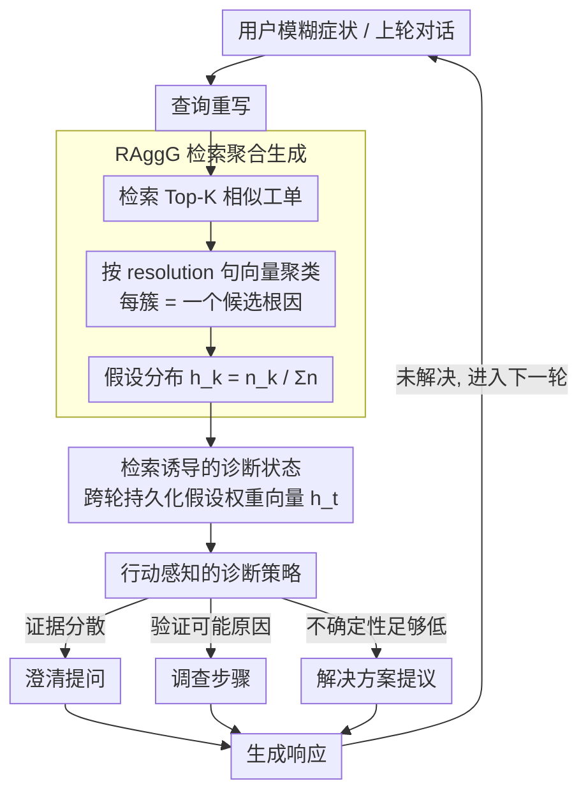

# DQA: Diagnostic Question Answering for IT Support

**会议**: ACL 2026  
**arXiv**: [2604.05350](https://arxiv.org/abs/2604.05350)  
**代码**: 无  
**领域**: 信息检索 / 对话系统  
**关键词**: 诊断式问答、IT支持、RAG、根因分析、诊断状态跟踪

## 一句话总结
本文提出DQA框架，通过维护持久化的诊断状态和在根因层面聚合检索证据（而非逐文档处理），实现企业IT支持场景下的系统化故障排查，成功率从基线41.3%提升至78.7%，平均轮次从8.4降至3.9。

## 研究背景与动机

**领域现状**：企业IT支持交互本质上是诊断性的——用户提交模糊的症状报告，支持代理需要迭代收集证据来识别根因。检索增强生成（RAG）是主流的知识接地方法，多轮RAG进一步通过对话查询重写来改善检索鲁棒性。

**现有痛点**：标准多轮RAG系统缺乏显式的诊断状态表示。检索到的文档在每一轮独立消费，难以跨轮次累积证据、调和冲突信号或维护对未解决假设的感知。大规模工单库检索还会产生大量近重复的冗余结果，浪费上下文窗口和延迟预算。

**核心矛盾**：诊断性对话需要跟踪竞争性假设、解释部分信号并决定何时提问vs.何时给出解决方案，但现有RAG系统将"对话连贯性"与"诊断进展"混为一谈，缺乏对诊断进度的显式建模。

**本文目标**：设计一个维护显式诊断状态、在根因层面聚合证据、并支持基于状态的行动选择的故障排查框架。

**切入角度**：借鉴案例推理（CBR）的思想——从相似的已解决案例中学习，但不是适配单个案例，而是聚合整个检索邻域的分布信息（如集群普遍性）来指导行动选择。

**核心 idea**：将检索到的工单按根因描述聚类，维护一个假设-权重向量作为诊断状态，随每轮新证据动态更新，指导从"广泛提问"到"精准排查"再到"提出解决方案"的策略转变。

## 方法详解

### 整体框架

DQA 把企业 IT 故障排查建模成一个带显式诊断状态的多轮循环：用户给出模糊症状后，系统每一轮都做"查询重写→检索相似工单→按根因聚合→更新诊断状态→选择行动→生成响应"，让对话从"广泛提问"逐步收敛到"精准排查"再到"给出解决方案"。其核心是把传统 RAG 的逐文档处理抬升到根因层面，并用一个跨轮持久化的假设-权重向量来承载诊断进展。下面三个设计分别负责证据怎么聚、状态怎么记、行动怎么选。

### 关键设计

**1. RAggG 检索聚合生成：把工单按根因聚成诊断信号**

大规模工单库检索回来一堆近重复结果，逐条塞进上下文既浪费窗口又淹没信号。RAggG 给定用户描述后检索 Top-K 相似工单，用句向量编码器对工单的 resolution 字段做嵌入，再用 mini-batch k-means 或层次聚类把它们归并，每个聚类代表一个候选根因，输出聚合证据 $\mathcal{E} = \{(n_j, R_j)\}_{j=1}^{J}$，其中 $n_j$ 是该根因的证据计数、$R_j$ 是代表性案例。由此得到查询条件化的假设分布 $h_k = \frac{n_k(x)}{\sum_{k'} n_{k'}(x)}$。关键在于聚合保留了"哪类根因最常见"这样的分布信息，而非简单去重，为下游选行动提供了比单篇文档强得多的信号。

**2. 检索诱导的诊断状态：让证据跨轮累积**

标准多轮 RAG 每轮独立消费文档，无法跨轮累积证据、调和冲突或记住未验证的假设。DQA 维护结构化状态 $s_t$，核心是假设权重向量 $\mathbf{h}_t \in \mathbb{R}^K$（每个分量对应一个根因聚类），并挂载相关症状、KB 文章和典型解决方案。每轮通过重新检索、重新聚合来刷新权重——检索诱导的权重始终从最新证据算起，而结构化字段则持久化跨轮保留。这种"靠重新检索来隐式更新信念"的做法，省去了手工设计概率模型的复杂性，又保持了对当前证据的即时响应。

**3. 行动感知的诊断策略：把诊断进展显式化**

不加约束的自由文本生成会把"对话连贯"和"诊断推进"混为一谈，看不出排查到了哪一步。DQA 把每轮行动约束为三类——澄清提问（收集区分性证据）、调查步骤（验证可能原因）、解决方案提议（不确定性足够低时给修复）。随着证据累积、支持集中到少数根因，策略自动从广泛提问切换到精准调查再到给方案，使整个诊断过程可追踪、可解释。

### 损失函数 / 训练策略

DQA 是系统级设计、不涉及参数训练，采用基于回放的评估协议：在 150 个匿名企业 IT 支持场景上，每个场景由一个用户模拟器与 DQA 代理做多轮交互来测量成功率与平均轮次。

## 实验关键数据

### 主实验

| 方法 | 成功率 | 平均轮次 |
|------|--------|---------|
| Multi-turn RAG基线 | 41.3% | 8.4 |
| DQA | **78.7%** | **3.9** |

### 消融实验

| 配置 | 成功率 | 说明 |
|------|--------|------|
| DQA完整 | 78.7% | 完整框架 |
| w/o 聚合 | ~55% | 去掉根因聚合后退化明显 |
| w/o 诊断状态 | ~50% | 无跨轮状态跟踪 |
| w/o 行动策略 | ~60% | 无显式行动选择 |

### 关键发现
- DQA将成功率几乎翻倍（41.3%→78.7%），同时将平均轮次减少一半以上（8.4→3.9）
- 根因层面的聚合比逐文档检索更有效，因为它压缩了冗余信息同时保留了分布信号
- 显式诊断状态使系统能在轮次间累积证据，避免重复提问
- 行动策略的转换（提问→调查→解决）与诊断信心的变化自然对应

## 亮点与洞察
- **从文档检索到根因聚合的范式转变**：传统RAG在文档级别操作，DQA提升到语义概念（根因）级别聚合，这个思路可以推广到任何需要从大量相似案例中提取结构化洞察的检索场景。
- **隐式信念更新**：通过每轮重新检索+重新聚合来更新诊断状态，避免了显式概率模型的复杂性。这是一种"检索即推理"的策略。
- **诊断行动的形式化**：将开放式对话约束为三种行动类型，使系统行为可解释、可控。

## 局限与展望
- 评估基于150个匿名场景的回放协议，规模较小，可能不能完全反映实际部署效果
- 聚类质量依赖于工单resolution字段的质量，噪声或不完整的解决描述可能影响效果
- 当前策略是手工定义的三种行动类型，未来可探索学习型策略
- 未讨论与实时系统集成的延迟和可扩展性问题

## 相关工作与启发
- **vs 标准多轮RAG**：多轮RAG改善检索鲁棒性但不表示诊断状态。DQA显式跟踪假设和证据
- **vs 案例推理（CBR）**：CBR从少数案例适配，DQA从大邻域聚合分布信息
- **vs 医疗诊断对话**：类似的不确定性缩减逻辑，但IT场景的异构性和故障模式变化更快

## 评分
- 新颖性: ⭐⭐⭐⭐ 根因聚合+诊断状态的组合在RAG系统中是新颖的设计
- 实验充分度: ⭐⭐⭐ 效果提升显著，但150个场景的评估规模偏小
- 写作质量: ⭐⭐⭐⭐ 问题定义清晰，方法设计有系统性
- 价值: ⭐⭐⭐⭐ 对企业IT支持场景有直接实用价值，聚合思路可推广

<!-- RELATED:START -->

## 相关论文

- [\[ACL 2026\] MAB-DQA: Addressing Query Aspect Importance in Document Question Answering with Multi-Armed Bandits](mab-dqa_addressing_query_aspect_importance_in_document_question_answering_with_m.md)
- [\[ACL 2026\] FinRAG-12B: A Production-Validated Recipe for Grounded Question Answering in Banking](finrag-12b_a_production-validated_recipe_for_grounded_question_answering_in_bank.md)
- [\[ACL 2026\] ChatR1: Reinforcement Learning for Conversational Reasoning and Retrieval Augmented Question Answering](chatr1_reinforcement_learning_for_conversational_reasoning_and_retrieval_augment.md)
- [\[ACL 2026\] CounterRefine: Answer-Conditioned Counterevidence Retrieval for Inference-Time Knowledge Repair in Factual Question Answering](counterrefine_answer-conditioned_counterevidence_retrieval_for_inference-time_kn.md)
- [\[ACL 2026\] Is Agentic RAG Worth It? An Experimental Comparison of RAG Approaches](is_agentic_rag_worth_it_an_experimental_comparison_of_rag_approaches.md)

<!-- RELATED:END -->
