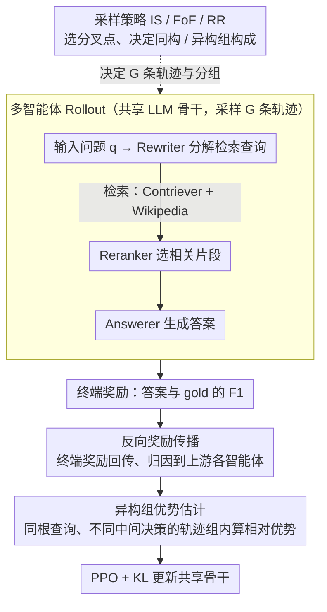

# End-to-End Optimization of LLM-Driven Multi-Agent Search Systems via Heterogeneous-Group-Based Reinforcement Learning

**会议**: ACL 2026  
**arXiv**: [2506.02718](https://arxiv.org/abs/2506.02718)  
**代码**: 无  
**领域**: 信息检索 / 多智能体 RL  
**关键词**: 多智能体搜索, MARL, 组优化, 端到端优化, RAG

## 一句话总结

本文提出 MHGPO（Multi-Agent Heterogeneous Group Policy Optimization），一种无需 critic 的多智能体 RL 方法，通过异构组相对优势估计和反向奖励传播，在三智能体搜索系统（Rewriter→Reranker→Answerer）中实现端到端优化，捕获隐式跨智能体依赖和跨轨迹关联，在 HotpotQA 等多跳 QA 基准上显著优于 MAPPO 和 GRPO 基线。

## 研究背景与动机

**领域现状**：多智能体搜索系统（MASS）通过协调多个专业化 LLM 智能体（配备搜索工具）来分解任务和检索增强推理。常见架构为 Rewriter（将问题分解为检索查询）→ Reranker（从检索结果中选择相关片段）→ Answerer（生成最终答案）。

**现有痛点**：(1) 提示工程和单智能体 SFT 的优化方式工程量大且适应性差；(2) MAPPO 需要大型 critic 网络来评估联合动作，导致不稳定和高内存开销；(3) GRPO 等组优化算法在单上下文设置中有效，但扩展到多上下文 MASS 并非直接——多智能体 rollout 跨越多个有不相交局部上下文的智能体；(4) 上游智能体的输出影响下游行为但没有直接梯度路径（间接依赖），来自同一根查询的 rollout 探索相关但不同的中间决策（隐式跨轨迹关系）。

**核心矛盾**：MASS 需要系统级优化而非单智能体优化——但现有 MARL 方法要么依赖昂贵的 critic（MAPPO），要么无法处理多上下文的跨智能体依赖（GRPO）。

**本文目标**：设计一种高效的无 critic 多智能体 RL 方法，能够捕获间接跨智能体依赖和隐式跨轨迹关联，将优化焦点从局部智能体性能转向全局系统成功。

**切入角度**：参数共享+组优化——所有智能体共享一个 LLM 骨干，通过异构组的相对优势估计来比较来自不同提示的 rollout，并用反向奖励传播将终端奖励归因到上游智能体。

**核心 idea**：异构组优势估计——通过比较来自同一根查询但不同中间决策的 rollout（形成异构组），将优化焦点从"在固定上游输出下选最优本地动作"转向"奖励导致全局成功的系统行为"。

## 方法详解

### 整体框架

MHGPO 要解决的是"如何不靠 critic、也不退化成单智能体优化，就把 Rewriter→Reranker→Answerer 这条搜索链端到端训起来"。它让三个智能体共享同一个 LLM 骨干，对每个输入问题采样 $G$ 条完整轨迹（采样策略决定在哪个智能体处分叉、由此形成同构/异构组），用 Answerer 答案与 gold 的 F1 作为终端奖励；这个奖励先沿轨迹反向传播、归因到上游每个智能体，再在异构组内做相对优势估计，最后以 PPO 目标加 KL 正则更新共享骨干。输入是原始问题，中间产物是多条带搜索动作的轨迹，输出是一个被系统级成功信号优化过的多智能体策略。

### 关键设计

**1. 反向奖励传播：把终端成功归因到上游**

Rewriter 这种上游智能体的输出会左右最终答案，但它和终端奖励之间没有直接梯度路径，这是 MASS 优化的核心难点。MHGPO 让终端奖励从 Answerer 的输出出发、沿轨迹反向传播：对智能体 $k$ 的第 $i$ 个输出，它分得的奖励是所有"消费了该输出"的直接后继智能体奖励的聚合（默认取平均），再叠加该智能体特定的格式惩罚得到最终奖励。这样即便没有直接梯度，"差的检索查询导致差的最终答案"这种间接依赖也会被反传的奖励暴露出来。

**2. 异构组优势估计：从跨轨迹关联里学全局行为**

标准 GRPO 只在同一输入的 rollout 之间算相对优势（同构组），无法处理 MASS 里"下游输入随上游 rollout 变化"的多上下文情形。MHGPO 允许一个组内混入来自不同提示的 rollout（异构组）——比如同一问题、不同 Rewriter 查询会喂给 Reranker 不同的输入，它们天然构成异构组。在异构组内做跨轨迹比较后，优势信号不再只是"在固定上游前缀下挑最优本地动作"，而是奖励那些真正导致全局成功的系统行为，把优化焦点从局部抬到全局。

**3. 三种 Rollout 采样策略：在效率和稳定性间取舍**

异构组怎么采样直接决定效率和优化质量。IS（独立采样）为每个智能体都独立铺开 rollout，是纯同构组但冗余严重，要采 $n\times G$ 次；FoF（fork-on-first）只在入口智能体分叉 $G$ 次、下游一对一往下走，很省采样但只有入口智能体有同构比较基准；RR（轮询）把分叉点随机化，让各智能体都有概率拿到同构比较机会，从而在全局协调与局部稳定之间取得平衡。三者构成从"全冗余高稳定"到"高效但下游缺基准"再到"折中"的谱系。

### 损失函数 / 训练策略

优化目标为 PPO 损失加 KL 正则；由于所有智能体参数共享，多智能体 RL 实际退化为多任务学习。训练 1 epoch、$G=4$，骨干用 Llama3.1-8B-Instruct，检索语料库为 Wikipedia dump，检索后端为 Contriever。

## 实验关键数据

### 主实验

**HotpotQA / 2WikiMultihopQA / MuSiQue 上的性能**

| 方法 | HotpotQA F1 | 2WikiMHQA F1(OOD) | MuSiQue F1(OOD) |
|------|------------|-------------------|-----------------|
| Llama3.1-8B（无 RL） | 22.78 | 20.82 | 2.81 |
| PPO | 24.52 | 9.20 | 8.02 |
| GRPO | 27.42 | 11.03 | 9.29 |
| Search-o1 | - | - | - |
| **MHGPO-FoF** | **最高** | **显著更高** | **显著更高** |
| **MHGPO-RR** | **最高级别** | **最高级别** | **最高级别** |

### 消融实验

**采样策略对比**

| 策略 | 采样效率 | 训练稳定性 | 性能 |
|------|---------|----------|------|
| IS | 低（高冗余） | 高 | 中 |
| FoF | 高 | 中 | 高 |
| FoF (os) | 中 | 中 | 高+ |
| RR | 中高 | 高 | **最高** |

### 关键发现

- MHGPO 显著优于 PPO 和 GRPO——无 critic 设计更稳定，异构组捕获了跨智能体依赖
- PPO 训练不稳定且 OOD 性能大幅下降（2WikiMHQA F1 仅 9.20），MHGPO 的 OOD 泛化更好
- RR 策略在效率和性能间取得最佳平衡——概率化的分叉点为所有智能体提供了同构比较机会
- 参数共享+无 critic 设计大幅降低了内存和计算开销

## 亮点与洞察

- 首次系统研究组优化算法在多智能体搜索系统中的应用
- 异构组优势估计是对 GRPO 的自然扩展，将优化焦点从局部转向全局
- 反向奖励传播是处理间接跨智能体依赖的简洁有效方案

## 局限与展望

- 仅在三智能体 MASS 架构上验证，更复杂拓扑的效果未知
- 参数共享可能限制智能体间的角色分化
- 训练仅 1 epoch，更多训练轮次的效果未探索

## 相关工作与启发

- **vs MAPPO**: MAPPO 需要大型 critic 网络，MHGPO 用组相对优势替代，更高效更稳定
- **vs GRPO**: GRPO 仅支持同构组和单上下文，MHGPO 扩展到异构组和多上下文
- **vs Search-o1**: Search-o1 在单模型内集成检索，MHGPO 优化模块化多智能体系统

## 评分

- 新颖性: ⭐⭐⭐⭐ 异构组优势估计和反向奖励传播是对 GRPO/MARL 的有意义扩展
- 实验充分度: ⭐⭐⭐⭐ 多个数据集含 OOD 评估，但智能体架构较简单
- 写作质量: ⭐⭐⭐⭐ 理论形式化严谨，与 GRPO 的连接分析清晰
- 价值: ⭐⭐⭐⭐⭐ 为 LLM 多智能体系统的端到端 RL 优化提供了实用高效的方案

<!-- RELATED:START -->

## 相关论文

- [\[ACL 2026\] Enhancing LLM-based Search Agents via Contribution Weighted Group Relative Policy Optimization](enhancing_llm-based_search_agents_via_contribution_weighted_group_relative_polic.md)
- [\[ICML 2026\] Graph-R1: Towards Agentic GraphRAG Framework via End-to-end Reinforcement Learning](../../ICML2026/information_retrieval/graph-r1_towards_agentic_graphrag_framework_via_end-to-end_reinforcement_learnin.md)
- [\[ACL 2025\] Gumbel Reranking: Differentiable End-to-End Reranker Optimization](../../ACL2025/information_retrieval/gumbel_reranking.md)
- [\[ACL 2026\] Agentic Conversational Search with Contextualized Reasoning via Reinforcement Learning](agentic_conversational_search_with_contextualized_reasoning_via_reinforcement_le.md)
- [\[ACL 2026\] Learning to Extract Rational Evidence via Reinforcement Learning for Retrieval-Augmented Generation](learning_to_extract_rational_evidence_via_reinforcement_learning_for_retrieval-a.md)

<!-- RELATED:END -->
