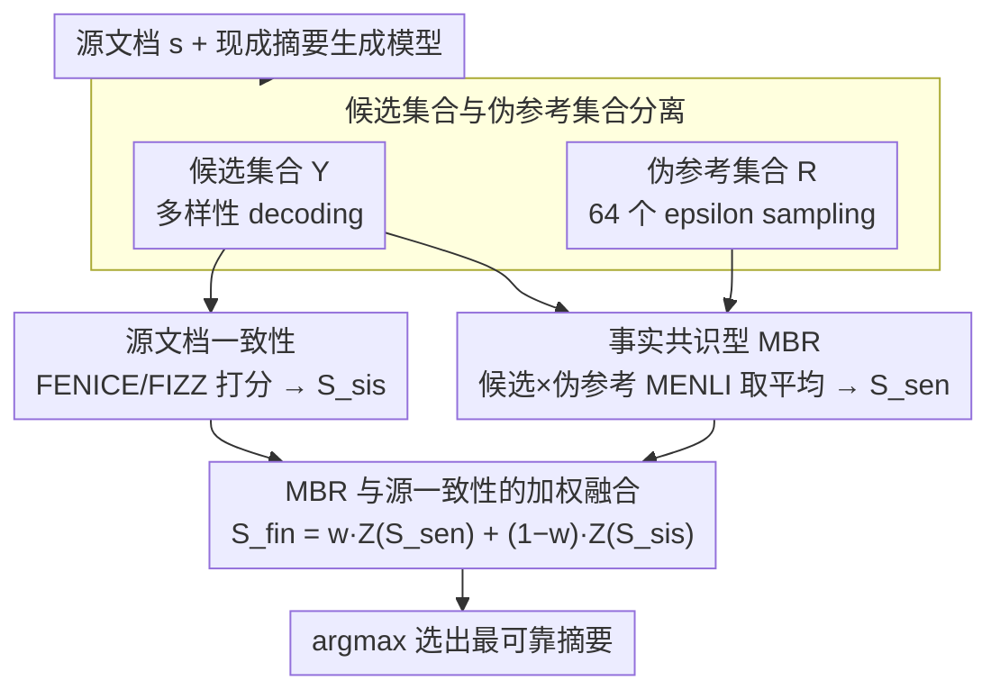

# Enhancing Factuality through Consensus and Consistency in Summarization Using Minimum Bayes Risk Decoding

**会议**: ACL2026  
**arXiv**: [2605.29336](https://arxiv.org/abs/2605.29336)  
**代码**: https://github.com/naist-nlp/ConSUM  
**领域**: 摘要生成 / 事实一致性 / 重排序  
**关键词**: 摘要事实性, MBR decoding, 伪参考摘要, reference-free metric, reranking

## 一句话总结
本文提出 ConSUM，在摘要生成候选中同时考察候选对源文档的事实一致性和候选之间的共识，用 MBR decoding 结合 FENICE/FIZZ 等事实性指标重排序，在 CNN/DailyMail、XSum 和人工评估中提升摘要事实可靠性。

## 研究背景与动机
**领域现状**：自动摘要系统通常先由生成模型产出一个或多个候选摘要，再用 ROUGE、BERTScore、事实性评估器或 reranker 选择更好的输出。由于测试时没有人工 gold summary 可用，很多 reference-free reranking 方法只能把源文档当作唯一依据，判断候选摘要是否忠实于输入。

**现有痛点**：只依赖源文档的 reference-free 指标并不稳定。一方面，源文档很长，评估器可能只粗粒度地判断候选和源文档是否相关，漏掉细小但关键的事实错误；另一方面，单一指标容易把 reranking 推向该指标自身的偏好，例如更长摘要、更容易被某个事实抽取器识别的摘要，未必是真正更好的摘要。

**核心矛盾**：摘要事实性需要同时满足两个条件：它必须和源文档一致，也应当落在生成模型自身认为可信的语义区域中。前者对应 consistency，后者对应 consensus。过去的 reranking 往往只优化其中一个信号，导致选择结果容易被 metric bias 或单个异常候选牵着走。

**本文目标**：作者希望在没有人工参考摘要的测试场景中，仍然构造一个可用的“参考信号”。具体来说，系统要从同一模型采样出的候选与伪参考中选择最终摘要，既利用 source-based factuality metric，也利用候选和伪参考之间的 NLI 式一致性。

**切入角度**：Minimum Bayes Risk decoding 在机器翻译中常用于从候选池中选择期望效用最高的输出。本文把这一思想移到摘要事实性上：如果一个候选和多个同源伪参考都保持一致，它更可能代表模型分布中的稳定事实；再加上源文档一致性检查，就能过滤掉“看起来流畅但偏离事实”的候选。

**核心 idea**：用“候选间共识”补足“源文档一致性”，通过 MBR 分数和 reference-free factuality 分数的加权组合来选择更可靠的摘要。

## 方法详解

### 整体框架
ConSUM 不重新训练摘要模型，而是在解码之后做候选选择。输入是一篇源文档 $s$ 和一个现成的摘要生成模型，输出是被判定为最可靠的那条摘要。系统先从模型采样出两组文本——候选集合 $\mathcal{Y}$ 提供可被选中的多样输出，伪参考集合 $\mathcal{R}$ 用作近似 gold reference 的内部参照；再为每个候选 $y_i$ 算两个分数：一是候选对源文档的事实一致性（consistency，用 FENICE/FIZZ 等 reference-free factuality metric），二是候选对伪参考集合的平均效用（consensus，用 MENLI 做 MBR utility）。最后两个分数各自做 z-score 标准化后加权融合 $S_{fin}=wZ(S_{sen})+(1-w)Z(S_{sis})$，选出 $\arg\max_y S_{fin}$，从而把“看起来流畅但偏离事实”的候选过滤掉。

### 关键设计

**1. 候选集合与伪参考集合分离：把“被选对象”和“评判尺子”拆开**

测试时没有人工 gold summary，于是 ConSUM 用同一模型采样的伪参考来当近似参照。但如果直接令 $\mathcal{Y}=\mathcal{R}$，MBR 共识就会被候选池自身的采样偏差污染，一条恰好被多次采到的异常候选会被当成“共识”。本文因此把两组分开：候选集合 $\mathcal{Y}$ 用强调多样性的 decoding（PLM 用 epsilon sampling / diverse beam search，LLM 用 nucleus sampling），伪参考集合 $\mathcal{R}$ 固定为 64 个 epsilon sampling 样本以覆盖模型真实分布。这样候选生成和共识估计可以各自独立调，降低把异常候选误判为共识的风险。

**2. 用 MENLI 做事实共识型 MBR：让“共识”指向事实一致而非措辞最常见**

对每个候选 $y_i$，计算它与全部伪参考 $r_j$ 的 MENLI utility 再取平均，$S_{sen}(y_i,\mathcal{R})=\frac{1}{|\mathcal{R}|}\sum_j u(y_i,r_j)$。之所以不沿用机器翻译里常见的 ROUGE / BERTScore，是因为它们偏词面或语义相似，会把“共识”引向最常见的表达方式；而摘要幻觉问题真正关心的是 factual agreement。换成 NLI-based 的 MENLI 后，一个候选只有在事实层面与多个伪参考都站得住，才能拿到高共识分，相当于用模型自采样的多数事实给候选投票。

**3. MBR 与 source consistency 的加权融合：共识信号与源文档约束互相兜底**

单看 MBR 会偏好更长、或更容易被 MENLI 认可的摘要；单看 reference-free 指标又可能漏掉细粒度事实错误。ConSUM 把 FENICE/FIZZ 给出的 $S_{sis}$ 和 MBR 给出的 $S_{sen}$ 分别标准化后按 $w$ 融合：$w=0$ 退化为只看源文档一致性，$w=1$ 退化为只看 MBR 共识。作者在 $w\in\{0,0.25,0.5,0.75,1.0\}$ 上做敏感性实验，最终取 $w=0.75$ 作统一默认值——它在 CNN/DM 上最优、在 XSum 上仍有竞争力，说明共识信号占主导但仍需源文档一致性兜底，从而压住单一指标的 reward hacking。

### 训练策略
本文不训练新生成模型也不学监督 reranker，全部增强都发生在推理期：候选与伪参考的采样策略、权重 $w$ 的选择构成了它的“配置”。统计显著性用 paired-bootstrap resampling 迭代 10,000 次并做 Bonferroni correction，以确保 reranking 收益不是采样噪声。

## 实验关键数据

### 主实验
| 数据集 / 评估 | 指标或设置 | 本文关键结果 | 对照 | 结论 |
|--------|------|------|----------|------|
| CNN/DM | FIZZ 分数，epsilon setting | FENICE-0.75 将 Fi 从 39.36 提到 52.44 | Baseline 39.36 | 事实性显著提升 |
| XSum | FIZZ 分数，epsilon setting | FENICE-0.75 将 Fi 从 16.91 提到 27.79 | Baseline 16.91 | 对高幻觉抽象摘要更有效 |
| CNN/DM | MENLI-Entailment | 从 4.46 提到 10.44 | Baseline 4.46 | 共识信号改善 entailment |
| XSum | MENLI-Entailment | 从 -31.15 提到 -20.36 | Baseline -31.15 | 负分场景下仍有明显改善 |
| Human Eval / CNN/DM | Overall | FENICE-0.75 为 4.63 | Baseline 4.56, MBR-1.0 为 4.57, Gold 为 3.92 | 人工评价最偏好 FENICE-0.75 |

### 消融实验
| 配置 | 关键指标 | 说明 |
|------|---------|------|
| FENICE, $w=0.75$ | CNN/DM 81.05, XSum 77.52 | 两个数据集都较稳，是最终默认配置的重要依据 |
| FIZZ, $w=0.75$ | CNN/DM 71.08, XSum 55.03 | 相比 $w=0$ 的 14.15 / 17.37，大幅受益于 MBR 共识 |
| SimCLS, $w=1.0$ | CNN/DM 65.35, XSum 90.91 | reference-free 部分反而伤害 SimCLS，最终系统排除 SimCLS |
| MBR-only, $w=1.0$ | FENICE: CNN/DM 68.86, XSum 39.70 | 只靠 MBR 不够稳，说明仍需要源文档一致性约束 |
| Human Eval / Factuality | FENICE-0.75 为 4.87 | 高于 MBR-1.0 的 4.74、FIZZ-0.75 的 4.77、Baseline 的 4.79 |

### 关键发现
- 最有效的设置不是只看 reference-free factuality，也不是只看 MBR，而是二者融合；$w=0.75$ 表明共识信号占主导，但仍需要源文档一致性兜底。
- XSum 的收益尤其说明问题：该数据集摘要更抽象、幻觉更频繁，ConSUM 通过伪参考共识过滤掉更明显的事实偏差。
- Oracle 分数仍远高于当前方法，作者指出许多指标上 oracle 可以超过 ConSUM 最优分数两倍以上，说明候选池中存在更好摘要，但选择器还没有充分识别它们。
- FENICE 与 FIZZ 虽然都是 atomic fact 风格指标，但粒度差异很大：FENICE 通常抽 3-6 个 ACU，FIZZ 会抽取更多事实单元，因此二者和最终事实分数的关系并不完全一致。

## 亮点与洞察
- 这篇论文最好的点是把“没有 gold reference”转化为“从模型分布里构造伪参考”。它没有假设伪参考一定正确，而是把多个伪参考的平均一致性当作抗噪信号，思路很实用。
- 候选和伪参考分离是一个细节但很关键。它提醒我们：用采样集合做自评价时，候选多样性和参考代表性是两个目标，混在一起会让评估信号变脏。
- 论文没有盲目追求单个 factuality metric 的最优，而是显式讨论 metric bias。对于任何“用评估器指导生成”的任务，这都是可迁移的经验：最好把目标指标和约束指标拆开建模。
- 人工评估中 gold reference 得分不高，是一个有趣但合理的信号。CNN/DM 的参考摘要质量本身存在争议，因此“超过 gold”不必解读为模型完全更好，而应理解为该 benchmark 的 reference 噪声确实会影响自动评价。

## 局限与展望
- MBR 的计算复杂度是 $O(n^2)$，候选数和伪参考数增加会快速放大计算成本。本文只探索了候选/伪参考数量等少量设置，utility function 和伪参考生成策略还没有系统展开。
- FENICE 和 FIZZ 在大规模处理时也有计算瓶颈，导致作者无法更充分地搜索权重、指标组合和采样策略。
- 实验只覆盖 CNN/DM 与 XSum 两个英文新闻摘要数据集。两者之间的最优权重差异已经很明显，说明方法迁移到长文档、对话摘要、医学/法律摘要或多语言摘要时可能需要重新校准。
- 未来可以考虑更高效的 MBR 近似、学习式权重选择、按源文档/候选特征动态调整 $w$，以及把伪参考共识扩展到多模型 ensemble，而不是只从同一模型采样。

## 相关工作与启发
- **vs source-only reranking**: 传统 reference-free reranking 主要比较候选和源文档，本文额外引入候选间共识，优势是可以捕捉源文档评估器漏掉的异常事实，但代价是更高采样和 pairwise scoring 成本。
- **vs MBR decoding in NMT**: 机器翻译中的 MBR 常用候选和伪参考的相似度选译文，本文把 utility 换成 MENLI，并把任务目标从语义相似改成事实一致性，更贴合摘要幻觉问题。
- **vs SimCLS / BERTScore-style consensus**: 这些方法更强调语义或质量相似度，ConSUM 的 MENLI utility 更关注 entailment 与 contradiction，因此更适合 factuality-sensitive summarization。
- **启发**：在没有人工参考答案的生成任务中，可以用“模型自采样共识 + 外部一致性约束”构造弱监督选择器。这一范式也可能用于问答、报告生成、代码解释和开放式信息抽取。

## 评分
- 新颖性: ⭐⭐⭐⭐ MBR 和 factuality metric 本身不是新概念，但把候选共识与源文档一致性系统结合到摘要事实性 reranking 上很清晰。
- 实验充分度: ⭐⭐⭐⭐ 自动指标、权重分析、人工评估和 oracle 分析比较完整，但数据域仍局限于英文新闻摘要。
- 写作质量: ⭐⭐⭐⭐ 方法动机明确，图表和附录充分；不足是主表较大，读者需要在大量 metric 中抓主线。
- 价值: ⭐⭐⭐⭐ 对事实性摘要、无参考 reranking 和采样式 decoding 都有直接参考价值，尤其适合已有生成模型的推理期增强。

<!-- RELATED:START -->

## 相关论文

- [\[ICLR 2026\] Attribution-Guided Decoding](../../ICLR2026/information_retrieval/attribution-guided_decoding.md)
- [\[NeurIPS 2025\] Retrieval is Not Enough: Enhancing RAG Reasoning through Test-Time Critique and Optimization](../../NeurIPS2025/information_retrieval/retrieval_is_not_enough_enhancing_rag_reasoning_through_test-time_critique_and_o.md)
- [\[ACL 2026\] GIFT: Guided Fine-Tuning and Transfer for Enhancing Instruction-Tuned Language Models](gift_guided_fine-tuning_and_transfer_for_enhancing_instruction-tuned_language_mo.md)
- [\[ACL 2025\] Reranking-based Generation for Unbiased Perspective Summarization](../../ACL2025/information_retrieval/reranking-based_generation_for_unbiased_perspective_summarization.md)
- [\[ICML 2026\] CARE: Class-Adaptive Expert Consensus for Reliable Learning with Long-Tailed Noisy Labels](../../ICML2026/information_retrieval/care_class-adaptive_expert_consensus_for_reliable_learning_with_long-tailed_nois.md)

<!-- RELATED:END -->
