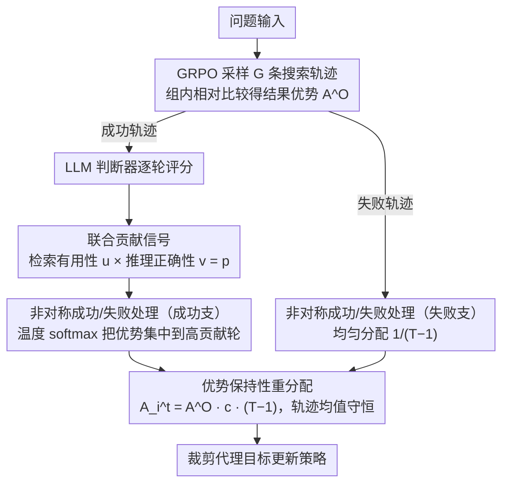

# Enhancing LLM-based Search Agents via Contribution Weighted Group Relative Policy Optimization

**会议**: ACL 2026  
**arXiv**: [2604.14267](https://arxiv.org/abs/2604.14267)  
**代码**: [GitHub](https://github.com/zsxmwjz/CW-GRPO)  
**领域**: 信息检索  
**关键词**: 搜索代理, GRPO, 贡献加权, 过程监督, 信用分配

## 一句话总结
CW-GRPO 将过程监督重新定义为"优势重分配"：用 LLM 判断器评估每轮搜索的检索有用性和推理正确性，计算贡献分数来缩放基于结果的优势，实现轮级别信用分配而不引入不稳定的价值函数，在 Qwen3-8B 上超越标准 GRPO 5.0%。

## 研究背景与动机

**领域现状**：搜索代理（如 Search-R1、R1-Searcher）通过迭代检索外部证据来增强 LLM 的事实可靠性。训练方法分为过程监督（轮级别奖励 + PPO）和结果监督（最终答案奖励 + GRPO）。

**现有痛点**：过程监督需要学习价值函数做轮级别奖励估计，但中间状态多样导致估计不稳定、训练脆弱。结果监督（GRPO）训练稳定但奖励信号稀疏——对成功轨迹的所有搜索轮给相同信用，无法区分关键搜索和冗余搜索。

**核心矛盾**：过程监督精细但不稳定，结果监督稳定但粗粒度——需要在两者之间找到平衡点。

**本文目标**：在保持 GRPO 训练稳定性的同时实现轮级别信用分配。

**切入角度**：不直接优化过程奖励，而是用过程信号来调制（rescale）结果优势——将过程监督视为优势重分配问题。

**核心 idea**：LLM 判断器评估每轮的检索有用性 $u$ 和推理正确性 $v$ → 联合贡献分数 $p = u \cdot v$ → 通过温度 softmax 将结果优势重分配到高贡献轮。

## 方法详解

### 整体框架
CW-GRPO 把过程监督重新表述为“优势重分配”，而不是另学一个价值函数。对每个问题先用 GRPO 的方式采样 $G$ 条搜索轨迹，靠组内相对比较得到一条轨迹级的结果优势 $A_i^O$；这本来会被均匀摊到该轨迹的每一轮搜索上。CW-GRPO 在这之上插入一层调制：对成功轨迹的每一轮，用 LLM 判断器评出该轮的检索有用性与推理正确性，合成一个贡献分数，再用温度 softmax 把同一条轨迹的总优势向高贡献轮倾斜；失败轨迹则保持均匀分配。最后仍用标准的裁剪代理目标优化策略，因此训练稳定性与 GRPO 基本一致，却获得了轮级别的信用分配。

### 关键设计

**1. 联合贡献信号（Conjunctive Contribution）：检索得好且用得对才算真进展**

搜索代理的每一轮其实做了两件可能脱节的事——检索和推理。CW-GRPO 让 LLM 判断器对每轮评两个正交的二元信号：检索有用性 $u_i^t$（这轮是否拿到新的、任务相关的证据）和推理正确性 $v_i^t$（推理链是否正确解读了当前上下文）。贡献分数取两者的逻辑与 $p_i^t = u_i^t \cdot v_i^t$。这个“与”而非“或”是刻意的：有用检索配错误推理是在浪费好证据，正确推理配无用检索是在空转，只有两者同时成立才是朝答案推进了一步，因此只有这种轮才该被放大信用。

**2. 非对称处理成功/失败轨迹：成功能归因，失败不硬归因**

成功轨迹用温度控制的 softmax 把优势集中到高贡献轮：$c_i^t = \exp(\alpha p_i^t) / \sum_{t'} \exp(\alpha p_i^{t'})$；失败轨迹则均匀分配 $c_i^t = 1/(T_i-1)$。背后的判断是成功与失败的可归因性并不对称——一条轨迹成功了，多半能指出是哪几轮的好检索/好推理导致的；但失败往往源于语料根本没覆盖答案这类外部因素，而非代理某一轮决策错了。在归因模糊时强行分配会引入噪声监督，所以失败轨迹退回均匀分配，既不乱罚也保住了结果监督原有的稳定性。

**3. 优势保持性重分配：只重分配信用，不改变学习信号总量**

重分配后的轮级优势写成 $A_i^t = A_i^O \cdot c_i^t \cdot (T_i-1)$，这个形式特意保证了 $\frac{1}{T_i-1}\sum_t A_i^t = A_i^O$，即一条轨迹内的优势均值始终等于原始结果优势。效果是高贡献轮的梯度信号被放大、低贡献轮被抑制，但轨迹层面的总量分文不动。这样 CW-GRPO 维持了和原始 GRPO 相同的梯度量级，避免了过程信号常带来的训练不稳定，也正是它能“在 GRPO 稳定性下做精细信用分配”的关键。

### 训练策略
策略用裁剪代理目标优化 $\mathcal{L}(\theta) = -\mathbb{E}[\min(rA, \text{clip}(r, 1-\epsilon, 1+\epsilon)A)]$，其中 $A$ 即上面重分配后的轮级优势。判断器的可靠性经过校准：在 97 个搜索轮的人工标注上，LLM 判断器与人类专家的共识率达 95%，支撑了用 LLM 替代 PRM 式人工过程标注的可行性。

## 实验关键数据

### 主实验

| 模型 | 方法 | 性能提升 | 说明 |
|------|------|---------|------|
| Qwen3-8B | CW-GRPO vs GRPO | +5.0% | 多个知识密集型基准 |
| Qwen3-1.7B | CW-GRPO vs GRPO | +6.3% | 小模型收益更大 |
| - | CW-GRPO vs 过程监督基线 | 一致优于 | 避免了价值函数不稳定 |

### 消融实验

| 配置 | 关键指标 | 说明 |
|------|---------|------|
| 仅检索有用性 | 低于联合 | 单一信号不够 |
| 仅推理正确性 | 低于联合 | 单一信号不够 |
| 失败轨迹也做贡献分配 | 不如均匀 | 验证了非对称设计的必要性 |
| 不同温度 α | 最优 α 在中等值 | 太高过度集中、太低退化为 GRPO |

### 关键发现
- 成功轨迹中贡献高度集中在少数关键轮——这是搜索代理任务的结构性特征
- 小模型（1.7B）从 CW-GRPO 的收益更大（+6.3%），可能因为小模型更需要精细的信用分配来提高搜索效率
- LLM 判断器与人工标注的 95% 共识率证明了用 LLM 做过程评估的可行性
- 失败轨迹的归因困难是一个结构性挑战——许多失败并非因为代理决策错误

## 亮点与洞察
- **将过程监督重定义为优势重分配**是一个优雅的视角转换——不训练价值函数、不直接优化过程奖励，而是用过程信号调制结果优势
- 联合贡献信号（$u \cdot v$）的设计反映了搜索任务的核心：好的检索必须伴随正确的解读，两者缺一不可
- 非对称处理的哲学很深刻——"我们知道成功是因为做对了什么，但不一定知道失败是因为做错了什么"

## 局限与展望
- LLM 判断器自身的评估可能有偏差，特别是对推理正确性的判断
- 仅在知识密集型 QA 任务上验证，对代码生成等其他代理任务的适用性待验证
- 温度 $\alpha$ 是超参数，不同任务需要调整
- 二元贡献信号（0/1）可能过于粗糙，连续值评估可能更精细

## 相关工作与启发
- **vs Search-R1**: Search-R1 用标准 GRPO 做结果监督，CW-GRPO 增加了轮级别信用分配
- **vs PPO 过程监督**: PPO 需要学习价值函数且训练不稳定，CW-GRPO 完全避免了价值函数
- **vs PRM 方法**: PRM 需要轮级别人工标注，CW-GRPO 用 LLM 判断器替代

## 评分
- 新颖性: ⭐⭐⭐⭐ 过程监督→优势重分配的视角转换新颖，联合贡献信号设计合理
- 实验充分度: ⭐⭐⭐⭐ 两个模型大小、多基准、判断器校准验证
- 写作质量: ⭐⭐⭐⭐⭐ 动机链清晰，方法推导流畅，公式设计优雅

<!-- RELATED:START -->

## 相关论文

- [\[ACL 2026\] End-to-End Optimization of LLM-Driven Multi-Agent Search Systems via Heterogeneous-Group-Based Reinforcement Learning](end-to-end_optimization_of_llm-driven_multi-agent_search_systems_via_heterogeneo.md)
- [\[ACL 2026\] Can Compact Language Models Search Like Agents? Distillation-Guided Policy Optimization for Preserving Agentic RAG Capabilities](can_compact_language_models_search_like_agents_distillation-guided_policy_optimi.md)
- [\[ACL 2026\] From Relevance to Authority: Authority-aware Generative Retrieval in Web Search Engines](from_relevance_to_authority_authority-aware_generative_retrieval_in_web_search_e.md)
- [\[ICML 2026\] ReSeek: A Self-Correcting Framework for Search Agents with Instructive Rewards](../../ICML2026/information_retrieval/reseek_a_self-correcting_framework_for_search_agents_with_instructive_rewards.md)
- [\[ACL 2026\] Rerank Before You Reason: Analyzing Reranking Tradeoffs through Effective Token Cost in Deep Search Agents](rerank_before_you_reason_analyzing_reranking_tradeoffs_through_effective_token_c.md)

<!-- RELATED:END -->
