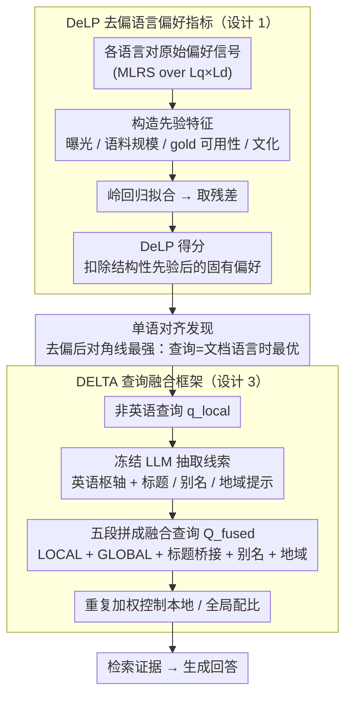

# Enhancing Multilingual RAG Systems with Debiased Language Preference-Guided Query Fusion

**会议**: ACL 2026 Findings  
**arXiv**: [2601.02956](https://arxiv.org/abs/2601.02956)  
**代码**: [GitHub](https://github.com/jeonghyunpark2002/DELTA)  
**领域**: 信息检索 / 多语言RAG  
**关键词**: 多语言RAG, 英语中心偏差, 语言偏好, 查询融合, 去偏校准

## 一句话总结

本文发现多语言 RAG 系统中"英语偏好"主要是评估基准中结构性先验（gold 证据集中于英语、文化先验）的伪影而非模型固有偏差，提出去偏语言偏好指标 DeLP 揭示检索器实际偏好单语对齐，并基于此设计 DELTA 查询增强框架，在多语言 RAG 上一致超越英语枢轴策略。

## 研究背景与动机

**领域现状**：多语言 RAG（mRAG）通过从多语言知识源检索证据来增强 LLM 的跨语言回答能力。英语枢轴（将非英语查询翻译为英语后再检索）被广泛认为是一种有效的启发式策略。

**现有痛点**：(1) 学界普遍将英语枢轴的有效性归因于 LLM 的"英语中心"能力——更强的英语推理和更少的翻译噪声；(2) 但本文发现这种"英语偏好"主要是由评估基准中的结构性偏差驱动的——MKQA 等基准中 73.3% 的 gold 证据存在于英语 Wikipedia 中，其他语言仅 0.5-1.4%；(3) 现有度量方法（如 MLRS）无法区分模型的真实偏好和数据分布强加的外部必要性。

**核心矛盾**：英语枢轴看起来有效不是因为模型偏好英语，而是因为正确答案几乎只存在于英语资源中——这是数据不平衡而非模型偏差。去除这些结构性混淆因素后，模型的真实偏好是什么？

**本文目标**：(1) 揭示 mRAG 中"英语偏好"的真实来源；(2) 设计去偏指标 DeLP 测量模型的固有语言偏好；(3) 基于去偏后的洞察设计更好的 mRAG 策略。

**切入角度**：识别三类结构性先验——曝光先验（高资源语料库主导检索结果）、gold 可用性先验（正确证据集中于英语）、文化先验（地域性主题与特定语言绑定），然后通过岭回归从原始偏好信号中回归掉这些先验。

**核心 idea**：去偏后发现检索器的真实偏好是单语对齐（查询和文档语言匹配时检索效果最好），而非英语偏好——因此应该将查询增强为多语言锚点以利用单语对齐，而非盲目翻译为英语。

## 方法详解

### 整体框架
本文分两步：先用 DeLP 指标诊断多语言检索器“真正偏好哪种语言”，再用 DELTA 框架据此改写查询。DeLP 这一侧的输入是检索器在各种查询语言 $L_q$ 与文档语言 $L_d$ 组合下的原始偏好信号，它构造一组先验特征（曝光、语料库规模、gold 可用性、文化），用岭回归把能被这些结构性先验解释的部分拟合掉，剩下的残差就是去偏后的固有偏好。把去偏偏好画成矩阵后浮现一个反直觉的结论：最强信号落在对角线上——检索器真正偏好的是“查询与文档同语言”的单语对齐，而非英语。DELTA 这一侧据此改写查询：对一个非英语查询，它保留原始本地查询以吃下单语对齐，同时用一个冻结 LLM 补上英语枢轴和跨语言实体锚点（规范标题、别名、地域提示），把这些线索拼成一条融合查询送进检索器；本地信号与全局英语信号之间的配比，由 DeLP 揭示的去偏偏好通过“重复加权”来控制，最后由生成器产出回答。

### 关键设计

**1. DeLP 去偏语言偏好指标：把数据分布效应从模型偏好里减出去**

现有度量（如 MLRS）把“模型偏好英语”和“答案碰巧只在英语资源里”混为一谈——MKQA 中 73.3% 的 gold 证据落在英语 Wikipedia，其他语言只有 0.5–1.4%，这种极端不平衡会被误读成模型偏好。DeLP 的做法是把原始偏好显式拆成先验解释部分与残差：用岭回归 $s_e(L_q, L_d) \approx w^\top \phi(L_q, L_d) + \epsilon$ 拟合曝光先验、gold 可用性先验、文化先验等结构性因素，回归后的残差 $\epsilon$ 才被定义为 DeLP 得分，即扣除环境必要性之后模型真正表现出的语言倾向。

**2. 单语对齐发现：去偏后浮现的真实偏好**

把 DeLP 应用到检索器上会得到一个反直觉的结论：表面上压倒性的英语偏好在去偏后大幅缩水、降到中等水平，与此同时“单语对齐”信号增强——当查询语言与文档语言匹配（如日语查询去检索日语 Wikipedia）时检索效果最好。这个发现直接改写了对英语枢轴的解释：英语枢轴之所以看着有效，只是间接蹭了英语资源的丰富性，而非命中了模型的最优偏好；既然模型真正想要的是同语言匹配，盲目翻成英语反而离最优更远。

**3. DELTA 查询融合框架：把单语对齐落成一条融合查询**

DELTA 把上面的洞察落成一个只在查询层操作的轻量增强：对一个本地查询 $q_{local}$，它先用冻结 LLM 构造英语枢轴 $q_{glob}$、并抽取一组跨语言实体线索（配对的规范标题、别名、地域提示），再把它们和原始查询拼成一条融合查询 $Q_{fused}$，由五个片段组成——[LOCAL]（原始查询，吃单语对齐的红利）、[GLOBAL]（英语枢轴，借英语 gold 资源的覆盖度）、[TITLE_BRIDGE]（双语标题桥接）、[ALIASES]（别名）和地域提示。保留原始脚本是关键：标题、别名、原文字形这些“原生表层锚点”对实体精确匹配至关重要，恰恰是英语枢轴翻译时最容易丢掉的信息。本地信号与全局信号之间的配比不另设权重，而是用一种“重复加权”策略——按 DeLP 给出的去偏偏好和文化线索置信度，对相应片段重复出现来加权（命中文化线索且置信度够高时，额外重复本地侧的标题/别名锚点）。整个过程无需改检索器、生成器或语料库，因此既轻量又能按查询动态适配，而不是对所有非英语查询套同一条英语枢轴。

### 训练策略
本文不涉及任何模型训练，所有结论都在现成组件上得到：检索器用 BGE-m3，生成器用 Qwen3-235B、DeepSeek-v3.1、Gemini-2.5-Flash。DeLP 的岭回归只是分析工具，DELTA 也只是推理期的查询改写策略。

## 实验关键数据

### 主实验

**多语言 RAG 端到端准确率（部分语言）**

| 方法 | ko | zh | ja | ar | 平均 |
|------|-----|-----|-----|-----|------|
| 基础（原始语言查询） | 低 | 低 | 低 | 低 | 低 |
| 英语枢轴 | 中 | 中 | 中 | 中 | 中 |
| **DELTA** | **高** | **高** | **高** | **高** | **最高** |

### 消融实验

**结构性先验对偏好度量的影响**

| 指标 | 英语偏好 | 单语对齐信号 |
|------|---------|-----------|
| MLRS（原始） | 强 | 弱 |
| **DeLP（去偏后）** | **弱** | **强** |

### 关键发现

- 英语 Wikipedia 覆盖 73.3% 的 gold 证据，其他语言仅 0.5-1.4%——英语枢轴的"有效性"主要来自这种极端不平衡
- 去偏后英语偏好大幅缩减，单语对齐成为主导偏好——检索器在查询和文档语言匹配时表现最佳
- DELTA 一致超越英语枢轴——证明利用模型真实偏好比遵循有偏的环境信号更有效
- 文化先验也是一个重要混淆因素——地域性问题的正确答案更可能存在于对应语言的 Wikipedia 中

## 亮点与洞察

- 对"英语偏好神话"的系统性解构是本文的核心贡献——揭示了评估方法论中的重大盲点
- DeLP 指标的设计思路（回归掉已知先验看残差）可迁移到任何涉及混淆因素的评估场景
- DELTA 极其轻量——仅在查询层面操作，无需修改模型、检索器或语料库

## 局限与展望

- DeLP 的去偏效果依赖于先验因素的完整性——如果有未识别的混淆因素仍会影响结论
- 仅在 MKQA 基准上验证，其他多语言 QA 基准的结论可能不同
- DELTA 的翻译步骤引入额外延迟
- 未探索检索器本身的训练偏差对语言偏好的影响

## 相关工作与启发

- **vs 英语枢轴策略**: 本文证明英语枢轴的有效性来自数据不平衡而非模型偏好
- **vs MLRS**: MLRS 混淆了结构性先验和模型偏好，DeLP 通过去偏揭示真实信号
- **vs CoPriva**: CoPriva 研究文本隐私保护，本文聚焦语言偏好的去偏

## 评分

- 新颖性: ⭐⭐⭐⭐⭐ 对"英语偏好神话"的解构和去偏语言偏好指标是重要贡献
- 实验充分度: ⭐⭐⭐⭐ 三个强 LLM 验证，但仅在 MKQA 一个基准上
- 写作质量: ⭐⭐⭐⭐⭐ 分析逻辑严密，结构性偏差的识别和论证令人信服
- 价值: ⭐⭐⭐⭐ 改变了对多语言 RAG 的理解，DeLP 和 DELTA 都有直接实用价值

<!-- RELATED:START -->

## 相关论文

- [\[ACL 2025\] Investigating Language Preference of Multilingual RAG Systems](../../ACL2025/information_retrieval/investigating_language_preference_of_multilingual_rag_systems.md)
- [\[ACL 2026\] Language-Coupled Reinforcement Learning for Multilingual Retrieval-Augmented Generation](language-coupled_reinforcement_learning_for_multilingual_retrieval-augmented_gen.md)
- [\[ACL 2026\] All Languages Matter: Understanding and Mitigating Language Bias in Multilingual RAG](all_languages_matter_understanding_and_mitigating_language_bias_in_multilingual_.md)
- [\[ACL 2026\] Multi-Faceted Self-Consistent Preference Alignment for Query Rewriting in Conversational Search](multi-faceted_self-consistent_preference_alignment_for_query_rewriting_in_conver.md)
- [\[ACL 2026\] GIFT: Guided Fine-Tuning and Transfer for Enhancing Instruction-Tuned Language Models](gift_guided_fine-tuning_and_transfer_for_enhancing_instruction-tuned_language_mo.md)

<!-- RELATED:END -->
