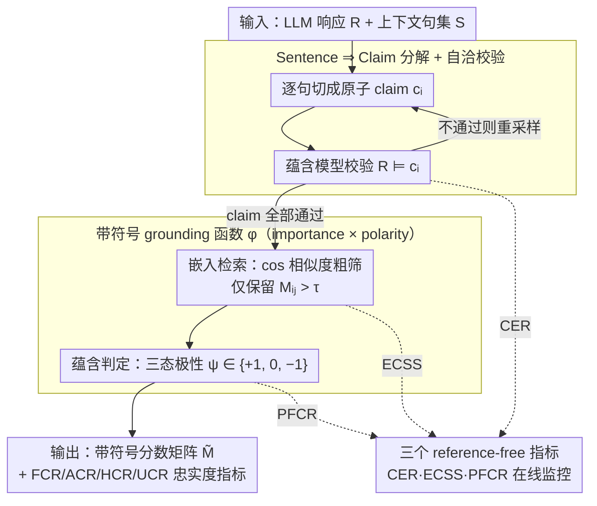

<!-- 由 src/gen_stubs.py 自动生成 -->
# eTracer: Towards Traceable Text Generation via Claim-Level Grounding

**会议**: ACL 2026  
**arXiv**: [2601.03669](https://arxiv.org/abs/2601.03669)  
**代码**: https://github.com/chubohao/eTracer  
**领域**: 文本生成 / 可溯源 / 生物医学 RAG  
**关键词**: claim-level grounding, RAG 可验证性, 幻觉检测, 生物医学 QA, 引用粒度

## 一句话总结
eTracer 把 RAG 响应拆成原子 claim 再去上下文里搜支持/反驳的句级证据，用三步流水线（分解 → 嵌入检索 → 蕴含判定）输出带符号分数矩阵，从而在生物医学场景下既能精确反查每条事实的出处、又能定量评估响应的忠实度。

## 研究背景与动机

**领域现状**：当前主流 RAG 与商用搜索引擎（Perplexity、Bing Chat）虽然给出响应+引用，但引用粒度仍是「整段网页 / 整段 passage ⇒ 整句响应」，用户为了核对一条事实往往得通读整篇上下文。学界后续提出 inline citation、attribute-then-generate、TRUE/NLI 评估等方法，但都建立在「句级 ⇒ 句级」的对齐假设上。

**现有痛点**：作者在前置的用户实验（附录 A）中实测发现，passages ⇒ response、passages ⇒ sentence、甚至 token ⇒ token 三类主流方案的人工验证平均耗时分别是 446 s / 212 s / 312 s，且验证准确率仅 91%–96%。换言之，「更细就一定更好」并不成立：粗粒度让人读太多，token 级又噪声过大；中间档的句⇒句对齐恰恰错配了「一个响应句往往携带多条独立事实」这一事实。

**核心矛盾**：响应句是信息密集的复合体（subject-predicate-object 经常多个），而上下文证据是单一论断的句子；强行把它们做句对句的蕴含，必然只命中部分子事实，导致 recall/precision 双低。同时，生物医学领域允许「同时存在支持与反驳证据」，传统二分类（蕴含 / 非蕴含）的设定根本表达不了这种「歧义」状态。

**本文目标**：(1) 重新定义 grounding 的语义单元——从「句」下放到「claim」（原子、独立、可独立判真的事实）；(2) 设计带符号 grounding 函数，同时刻画证据的重要度与极性；(3) 给出无需 ground truth 也能评估的 reference-free 指标，让方法可在真实场景里 self-monitor。

**切入角度**：作者三个关键先验观察（附录 B 实证验证）：① 抽出来的 claim 应被原响应蕴含（CER ≥ 97%）；② claim 与其证据应有高语义相似度（cos≈0.75）；③ 对 claim 取语义否定后，原支持/反驳证据的角色应翻转（PFCR≈90%）。这三条同时也是反过来评估 grounding 方法好坏的天然指标。

**核心 idea**：用「sentence ⇒ claim」grounding 取代「sentence ⇒ sentence」grounding，再用「分解 + 嵌入检索 + NLI 判极性」的轻量 pipeline 给每个 (claim, 上下文句) 对赋一个 $\in\{-1, 0, +1\}\times \text{cos sim}$ 的带符号分数。

## 方法详解

### 整体框架

eTracer 是挂在 RAG 之后的即插即用后处理器，输入是「LLM 响应 $\mathcal{R}$ + 它依赖的上下文句集 $S=\{s_i\}_{i=1}^m$」，输出是「响应每句对应的带符号分数矩阵 $\tilde{M}\in\mathbb{R}^{p\times m}$」。整条流水线分三阶段流动：先把响应逐句切成原子 claim 并自校验，再把 claim 与上下文句各自用 Qwen3-Embedding-8B 嵌入后做余弦相似度粗筛，最后让蕴含模型对候选 (claim, 证据) 对判极性、与相似度相乘得到既含强度又含方向的分数，由此既能反查每条事实的出处、又能算出 FCR/ACR/HCR/UCR 四类忠实度指标。三个 reference-free 指标则旁挂在这三阶段上做在线监控。

### 关键设计

**1. Sentence ⇒ Claim 分解 + 自洽校验：把响应句拆成原子事实，并强制每条 claim 都被原句蕴含**

痛点在于分解模型只要 hallucinate 一条 claim，下游 grounding 就被永久污染——错的 claim 永远找不到支持证据，会被误判成幻觉。eTracer 用 GPT-5.1 在 182 个手标 sentence-claim 组上生成蒸馏数据 $\mathcal{D}_{dec}$，把分解能力蒸馏进 Qwen3-14B（LoRA、4-bit、10 epoch、lr $2\times 10^{-4}$），训练目标是标准条件 NLL $\max_{\mathcal{M}_{dec}}\mathbb{E}_{(r,\{c_i\})}\log p_{\mathcal{M}_{dec}}(\{c_i\}\mid r)$。它把「分解阶段的幻觉」当成必须修复的失败模式：推理时每切完一句就用蕴含模型 $\mathcal{M}_{ent}$ 验证 $\mathcal{R}\models c_i$，不通过就重新采样直到全部通过或触达上限，从源头堵住污染。

**2. 带符号 grounding 函数 $\phi$（importance × polarity）：一个标量同时编码证据强度与支持/反驳方向**

传统二元 NLI 把「中立」和「反驳」混成「不是支持」，丢掉了医学场景里关键的「这条证据其实反对该主张」信号。eTracer 把判定拆成两路：强度路用余弦相似度 $M_{ij}=\mathbf{e}_{c_i}\cdot \mathbf{e}_{s_j}$ 做检索粗筛，极性路用蕴含模型给出三态符号 $\psi(s, c)\in\{+1, -1, 0\}$；最终分数 $\tilde{M}_{ij}=M_{ij}\cdot \psi(s_j, c_i)$ 仅在 $M_{ij}>\tau$（默认 $\tau=0.5$，在 cos-sim 分布上选）时保留、否则置 0。把「哪些句值得看」（检索）和「看完之后怎么算」（判定）解耦，既能调速度，又能单独 ablate 出 FCR / ACR / HCR / UCR。

**3. 三个 reference-free 评估指标（CER / ECSS / PFCR）：无 ground truth 也能在线监控 grounding 质量**

真实部署里拿不到引用黄金集，无法持续打分，于是 eTracer 把三条在标注数据上验证为真的先验性质反过来当 proxy。CER $=\frac{1}{p}\sum \mathbb{I}[\mathcal{R}\models c_i]$ 衡量分解忠实度，越接近 1 越说明没乱编 claim（GT 上达 97%）；ECSS $=\frac{1}{k}\sum \mathrm{Sim}(c, s_i)$ 衡量 claim 与挑出证据的「检索-语义」一致性（GT 上 cos≈0.75）；PFCR $=\frac{1}{k}\sum \mathbb{I}[\phi(s_i, c)\approx -\phi(s_i, \neg c)]$ 衡量对 claim 取否定后符号能否翻转，即极性判别的稳健性（GT 上 90%）。三者恰好对应分解、检索、判极性三个阶段，让工业部署免去逐条人工标注也能算出方法分数。

### 一个完整示例

以响应句「Drug X lowers blood pressure but raises liver enzymes」为例：分解模型先把它切成 $c_1$=「Drug X lowers blood pressure」、$c_2$=「Drug X raises liver enzymes」，并各自通过 $\mathcal{R}\models c_i$ 校验；嵌入后与上下文逐句算 cos，$c_1$ 命中一句 cos 0.82 的证据、$\mathcal{M}_{ent}$ 判 Entailment，得 $\tilde{M}=+0.82$；$c_2$ 命中一句 cos 0.6 的证据但被判 Contradiction，得 $\tilde{M}=-0.6$。最终矩阵告诉用户：前半句有强支持证据、后半句反而被上下文反驳，需要 flag。

### 损失函数 / 训练策略

只有两个被微调的小模型：

- **分解模型** $\mathcal{M}_{dec}$：base = Qwen3-14B，LoRA + 4-bit，182 条样本，effective batch 256，10 epoch，单 A6000 GPU 约 38 min，目标 $\max\log p(\{c_i\}\mid r)$ 且只对响应 token 计算 loss。
- **蕴含模型** $\mathcal{M}_{ent}$：base = Qwen3-4B-Instruct-2507，LoRA + 4-bit，4 267 条 (claim, evidence, label) 三类样本，effective batch 512，5 epoch，单 A6000 GPU 约 45 min，目标 $\max\log p(y\mid (c, s))$。
- 推理：禁采样（temperature=0, top-k=1），用 Qwen3-Embedding-8B 作通用嵌入器；$\tau=0.5$ 是默认设定。

## 实验关键数据

数据集：作者人标了一份生物医学 grounding ground truth $\mathcal{D}_g$（PubMedQA + BioASQ-QA + TracSum 各 100 实例），含 578 响应句、1 564 claim、4 579 (claim, evidence) 对；同时为每个 claim 用 Qwen3-14B 反向生成 1 564 条反驳上下文做负样本平衡（98% 验证为真矛盾，剩余 2% 人工改写）。 split 30/70 训练 / 评估。

### 主实验

baselines 覆盖三档：句级 NLI（DeBERTa）、句级 instruct-following（Qwen3 / Ministral / Llama）、claim 级同款 baselines、以及 end-to-end claim grounding。所有 baseline 都跑两遍（带 / 不带分解）。

| 方法 | 粒度 | $\mathrm{F1}_e$（支持） | $\mathrm{F1}_c$（反驳） | Time (s) |
|------|------|------|------|------|
| Qwen3-4B-Instruct | 句级 | 0.557 | 0.815 | 4.71 |
| Qwen3-14B | 句级 | 0.592 | 0.811 | 8.70 |
| Qwen3-4B-Instruct + decomp | claim 级 | 0.639 ↑.082 | 0.817 ↑.002 | 14.18 |
| Qwen3-14B + decomp | claim 级 | 0.660 ↑.068 | 0.860 ↑.049 | 26.02 |
| **eTracer** ($\tau=0$) | claim 级 | **0.709** | **0.946** | 22.19 |
| **eTracer** ($\tau=0.5$) | claim 级 | 0.705 | 0.939 | **14.35** |

eTracer 相对同 base 模型 Qwen3-4B-Instruct（句级）在 $\mathrm{F1}_e$ 上 +0.152（+27%），$\mathrm{F1}_c$ 上 +0.131（+16%）；对反驳证据的提升尤为显著（baseline 普遍 < 0.83，eTracer ≥ 0.94）。

end-to-end baseline（直接让 LLM 一步出 claim+引用）在 CER 上崩盘——Qwen3-14B 只有 0.309，因为它倾向于直接复制上下文当 claim；eTracer pipeline CER = 0.930，证明流水线分解必要。

### 消融实验

| 配置 | $\mathrm{F1}_e$ | $\mathrm{F1}_c$ | 说明 |
|------|------|------|------|
| w/o $\mathcal{M}_{dec}$（直接句级 grounding） | 0.607 | 0.485 | 去掉分解模块 |
| w/ $\mathcal{M}_{dec}$（完整 eTracer） | 0.705 | 0.939 | 完整方法 |
| Δ | ↑.098 (+16%) | ↑.454 (+94%) | 反驳证据几乎翻倍 |

阈值 $\tau$ 扫描：$\tau\in\{0, 0.25, 0.5, 0.75, 1\}$，所有指标在 $\tau=0.25$ 达峰，$\tau=0.5$ 仅边际下降但推理时间减少 7.84 s（-35%）。

用户实验（附录 A，4 人 ×12 任务）：S⇒C（本文）平均验证 116 s / 准确率 100%；P⇒R 446 s / 91%；P⇒S 212 s / 96%；T⇒T 312 s / 93%。S⇒C 比最强 baseline 还快 1.83 倍。

### 关键发现

- 去掉分解模块对**反驳证据**的影响 ($\mathrm{F1}_c$ -0.454, -94%) 远大于对支持证据 ($\mathrm{F1}_e$ -0.098, -16%)；说明 claim 粒度对挖出「反对意见」是必要的，因为反驳往往只与原句中的某一条子论断对立。
- 反向蒸馏「失败的 claim 再分解」机制让 eTracer pipeline CER 比 end-to-end Qwen3-14B 高出 +0.621（0.930 vs 0.309），印证「显式分解 + 校验」远胜「让大模型一次干完」。
- $\tau$ 在 0.25 达峰非常符合 §B.2 中观察到的 claim-evidence 平均 cos≈0.75 的语义先验，等于把先验直接写进了流水线。

## 亮点与洞察

- **「fine-grained ≠ better」是反直觉但关键的洞察**：作者用真人实验证明 token-level grounding 反而比句级慢（312 s vs 212 s），说明粒度选择应匹配「人验证时的语义单元」，而非一味更细。这一观点对所有 explainability/attribution 类工作都有迁移价值。
- **三个 reference-free 指标的可解释性**：CER 捕获「假 claim 率」、ECSS 捕获「检索准不准」、PFCR 捕获「极性稳不稳」，三者天然对应 pipeline 的三阶段，把白盒诊断写进了评估体系——其他可解释 RAG 系统完全可以照搬。
- **「分解 + 自校验循环」是把幻觉问题前移**：与其在最终响应处 detect 幻觉，不如在分解时就拦截，能极大降低下游链路被错误 claim 污染的概率，可复用到任何 multi-step pipeline。
- **带符号 grounding 把「支持 / 反驳 / 中立」一次刻画**：FCR / ACR / HCR / UCR 四指标的拆分对临床循证医学非常有用——「ambiguous」（同时存在矛盾证据）正是医生需要 flag 的内容，传统二分类完全表达不了。

## 局限与展望

- **推理代价仍偏高**：claim 级 grounding 比句级慢 1.7–22 倍。$\tau=0.5$ 能缓解 35%，但实时场景仍需进一步加速（如 batch 化 NLI、用更小蕴含模型）。
- **只在生物医学**评估：作者承认未在通用领域验证；但 pipeline 中的分解 / 嵌入 / NLI 都是通用组件，迁移风险主要在 prompt 与 fine-tune 数据规模，不在架构。
- **抽取式生成不适配**：当响应几乎照抄上下文时（如抽取式摘要），强行分解反而引入噪声，作者建议在抽取场景退化为句级 grounding。
- **依赖人标黄金集 (300 实例, ~5k claim)**：规模偏小，统计显著性受限；后续应扩展到 10k+ 级别并跨多个领域。
- **嵌入器与 NLI 模型耦合**：若换 base 模型（如 Qwen3 之外），$\tau$ 阈值与训练超参都得重选。
- **未与最近的 attribute-then-generate**（Slobodkin 2024、Chu 2025）做端到端对比，留下方法论上的小空白。

## 相关工作与启发

- **vs LongCite (Zhang et al. 2025)**：LongCite 让 LLM 在生成阶段就输出细粒度引用，依赖指令跟随能力，引用可能不准；eTracer 是 post-hoc 框架，对生成模型零侵入，且引用是「证据搜索 + 蕴含校验」两步独立判断，可解释性更强。
- **vs TRUE / NLI 评估 (Honovich et al. 2022)**：TRUE 在句级做 NLI 评 factuality，没解决「一句话多事实」问题；eTracer 用 claim 分解把 NLI 用在更合适的粒度上，并加上语义相似度做证据候选筛选。
- **vs LOO attribution (Qi et al. 2024)**：LOO 在 token 级算影响力，给出最细粒度证据但噪声大、用户难解读；eTracer 提供「句⇒claim」中间档，用户实验验证它在时间与准确率上均优于 LOO 风格的 T⇒T。
- **vs FActScore (Min et al. 2023)**：FActScore 也用 atomic facts 评 factuality，但只算 precision、不区分支持/反驳/中立；eTracer 引入符号化 grounding 后能同时算 FCR/ACR/HCR/UCR，更适合医学等高风险场景。
- **可迁移启发**：把 「三个 reference-free 指标对应 pipeline 三阶段」 当作通用 RAG 监控模板；把「分解 + 蕴含自校验循环」用到 chain-of-thought 推理链可以拦截中间步骤幻觉。

## 评分
- 新颖性: ⭐⭐⭐⭐ 「sentence ⇒ claim」与带符号 grounding 是清晰的概念升级，三个 reference-free 指标的提出尤其新颖；但 claim 分解 + NLI 的 pipeline 思路在 FActScore / DocLens 已有原型。
- 实验充分度: ⭐⭐⭐⭐ 三个 corpora、8 个 baselines、两种粒度对比 + 用户实验 + 阈值扫描 + 自校验消融，覆盖度优秀；缺点是只评医学域、ground truth 仅 300 实例。
- 写作质量: ⭐⭐⭐⭐⭐ 定义 / 算法 / 假设验证 / 用户实验 / 主实验 / 消融自洽闭环，符号统一、Figure 与 Table 解释到位，可读性极高。
- 价值: ⭐⭐⭐⭐ 框架 plug-and-play、代码 + 数据开源、用户验证速度提升 2.6×，对生物医学 RAG 与高风险问答场景有直接落地价值。

<!-- RELATED:START -->

## 相关论文

- [\[ACL 2025\] Investigating the Robustness of Retrieval-Augmented Generation at the Query Level](../../ACL2025/information_retrieval/investigating_the_robustness_of_retrieval-augmented_generation_at_the_query_leve.md)
- [\[ACL 2026\] Quantifying and Improving the Robustness of Retrieval-Augmented Language Models Against Spurious Features in Grounding Data](quantifying_and_improving_the_robustness_of_retrieval-augmented_language_models_.md)
- [\[ICLR 2026\] Query-Level Uncertainty in Large Language Models](../../ICLR2026/information_retrieval/query-level_uncertainty_in_large_language_models.md)
- [\[ACL 2026\] VisRet: Visualization Improves Knowledge-Intensive Text-to-Image Retrieval](visret_visualization_improves_knowledge-intensive_text-to-image_retrieval.md)
- [\[ACL 2026\] ReasonEmbed: Enhanced Text Embeddings for Reasoning-Intensive Document Retrieval](reasonembed_enhanced_text_embeddings_for_reasoning-intensive_document_retrieval.md)

<!-- RELATED:END -->
