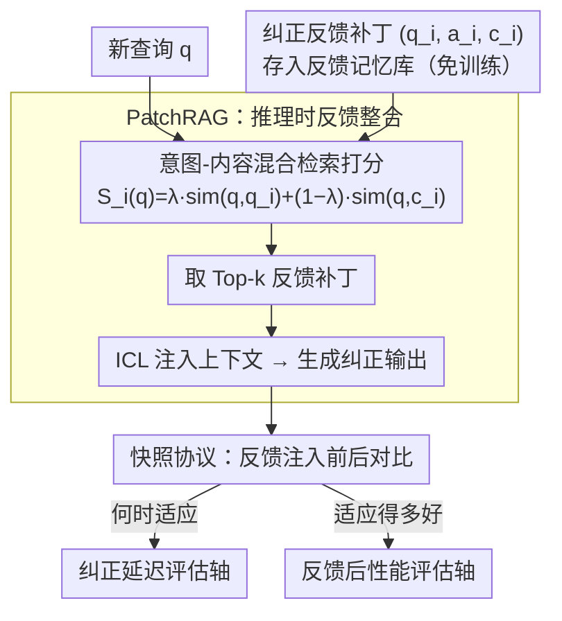

# Feedback Adaptation for Retrieval-Augmented Generation

**会议**: ACL 2026 Findings  
**arXiv**: [2604.06647](https://arxiv.org/abs/2604.06647)  
**代码**: 无  
**领域**: 信息检索 / RAG  
**关键词**: RAG、反馈适应、纠正延迟、PatchRAG、在线学习

## 一句话总结
本文提出"反馈适应"作为RAG系统的新问题设定——研究纠正性反馈多快、多有效地传播到未来查询，定义了纠正延迟和反馈后性能两个评估轴，并提出PatchRAG作为免训练的推理时反馈整合方案，实现即时纠正和强泛化。

## 研究背景与动机

**领域现状**：RAG已成为接地LLM到外部知识的主导范式。然而，现有研究假设部署后知识和系统行为保持静态。实际部署中，RAG系统经常被用户或专家纠正——当输出过时、错误或不理想时提供反馈。

**现有痛点**：(1) 现有方法通过重新训练或微调来处理反馈，引入从反馈提供到行为改变之间的固有延迟；(2) 现有评估协议仅关注整体准确率，无法捕捉系统在反馈后的适应速度和质量；(3) 当前基准将正确性与适应性混为一谈，掩盖了交互式场景中系统行为的关键维度。

**核心矛盾**：训练型方法可以实现强性能但有延迟（纠正延迟高），推理时方法可以即时反应但可能泛化不够（反馈后性能低）。这个trade-off在现有评估框架下完全不可见。

**本文目标**：(1) 形式化反馈适应问题；(2) 定义能捕捉适应动态的评估指标；(3) 提供一个概念验证实例。

**切入角度**：将"适应反馈"从训练/维护关注提升为一等公民的研究问题。反馈适应不是关于提高平均准确率，而是关于表征交互条件下知识更新的动态。

**核心 idea**：定义两个正交评估轴——纠正延迟（反馈多快生效）和反馈后性能（对语义相关查询的泛化），并用PatchRAG展示即时适应是可能的。

## 方法详解

### 整体框架
本文把"反馈适应"立成 RAG 的一类新问题：系统部署后会被用户或专家纠正，关键是这些纠正多快、多有效地传播到未来的查询。整套工作由三层拼成——先形式化问题并给出两个正交的评估轴，再用免训练的 PatchRAG 在推理时即时整合反馈，最后用快照协议在反馈注入前后做对比、隔离出反馈的边际效果。

### 关键设计

**1. 纠正延迟评估轴：量化反馈从给出到系统行为持续改变之间的时间差**

两个系统可能有相同的最终准确率，却在"反馈后还继续错多久"上天差地别，而这一维在标准评估里完全不可见。给定 $t$ 时刻的反馈 $f_t$，纠正延迟被定义为系统开始对语义一致的查询持续产生纠正输出之前的经过时间；任何依赖重训练的方法都天然带有显著延迟，无论它最终准确率多高，这正是纠正延迟想暴露出来的代价。

**2. 反馈后性能评估轴：测系统对与反馈语义一致、但表述不同查询的泛化质量**

只会死记反馈实例、不会泛化到相关查询的系统会在这一轴上现形。它与标准测试准确率的区别在于显式以反馈的存在为条件，聚焦"意图一致但措辞不同"的查询；和纠正延迟互补——一个回答"何时适应"，一个回答"适应得多好"，两者合起来才能照出标准准确率看不到的行为维度。

**3. PatchRAG：推理时反馈整合的免训练实例**

PatchRAG 有意做到最小——不改架构、不训参数，只做存储与检索，目的是证明即时适应可行而非给出终极方案。每条反馈被存成元组 $f_i = (q_i, a_i, c_i)$（原始查询、纠正答案、支持证据）；对新查询 $q$ 用意图-内容混合检索打分 $S_i(q) = \lambda \cdot \text{sim}(q, q_i) + (1-\lambda) \cdot \text{sim}(q, c_i)$，兼顾意图匹配与内容接地，再把 Top-k 反馈项作为上下文经 ICL 注入生成。混合检索正是为解决"表面措辞不同、意图一致"的泛化需求而设计。

### 损失函数 / 训练策略
PatchRAG不涉及训练。评估使用NQ、TriviaQA、HotpotQA三个数据集，与Standard RAG、Self-RAG、Auto-RAG、ChatQA-1.5等基线对比。

## 实验关键数据

### 主实验

| 方法 | NQ | TriviaQA | HotpotQA | 纠正延迟 |
|------|-----|---------|---------|---------|
| Standard RAG | 28.7 | 67.1 | 28.5 | 高（需重训练） |
| Auto-RAG | 37.9 | 60.9 | 44.9 | 高 |
| PatchRAG | **竞争力** | **竞争力** | **竞争力** | **即时（零延迟）** |

### 消融实验

| 评估轴 | 训练型方法 | PatchRAG | 说明 |
|--------|-----------|---------|------|
| 纠正延迟 | 高（需重训练时间） | **零** | 即时反映反馈 |
| 反馈后性能 | 高（但延迟后） | **高** | 意图感知检索支持泛化 |
| 整体准确率 | 高 | 竞争力 | 标准评估无法区分 |

### 关键发现
- 训练型方法存在结构性的延迟-性能trade-off——这在标准准确率评估中完全不可见
- PatchRAG以零纠正延迟实现强反馈后性能，证明即时适应是可行的
- 意图-上下文混合检索比纯意图或纯内容检索更有效，因为它同时处理了表面形式变化和内容相关性
- 不完美反馈条件下的压力测试显示PatchRAG具有合理的鲁棒性

## 亮点与洞察
- **反馈适应作为一等公民**：将"部署后如何响应纠正"从运维问题提升为核心研究问题，定义了清晰的评估框架。这对所有交互式AI系统都有广泛启发。
- **纠正延迟的概念**：类似于软件工程中的"修复时间"，纠正延迟量化了用户纠正到系统改变之间的真实差距。这个指标可以推广到任何需要快速适应的系统评估。
- **最小化设计的力量**：PatchRAG通过极简设计证明了概念，展示了"存储+检索+ICL"即可实现即时适应，为后续更复杂的方案提供了基准。

## 局限与展望
- PatchRAG是概念验证而非最终方案，大规模反馈积累后的检索效率和冲突管理未探讨
- 仅评估了事实性纠正，未涉及偏好或风格层面的反馈
- 评估基于快照协议而非真正的在线流式评估
- 反馈质量假设为完美或近似完美，实际部署中反馈可能嘈杂或矛盾

## 相关工作与启发
- **vs 持续学习**：持续学习关注不忘记旧知识，反馈适应关注快速整合新纠正
- **vs 模型编辑**：模型编辑通过参数修改实现更新，PatchRAG不修改参数
- **vs 在线学习**：在线学习优化聚合性能，反馈适应关注纠正后的时间动态

## 评分
- 新颖性: ⭐⭐⭐⭐⭐ 反馈适应作为独立研究问题的提出和形式化是重要贡献
- 实验充分度: ⭐⭐⭐ 三个数据集，但评估协议较新颖需要更广泛验证
- 写作质量: ⭐⭐⭐⭐⭐ 问题定义极其清晰，评估框架设计优雅
- 价值: ⭐⭐⭐⭐⭐ 开辟了RAG评估的新维度，对部署实践有直接指导

<!-- RELATED:START -->

## 相关论文

- [\[ACL 2026\] Domain-Specific Data Generation Framework for RAG Adaptation](domain-specific_data_generation_framework_for_rag_adaptation.md)
- [\[AAAI 2026\] ReFeed: Retrieval Feedback-Guided Dataset Construction for Style-Aware Query Rewriting](../../AAAI2026/information_retrieval/refeed_retrieval_feedback-guided_dataset_construction_for_style-aware_query_rewr.md)
- [\[ACL 2026\] CodePromptZip: Code-specific Prompt Compression for Retrieval-Augmented Generation in Coding Tasks with LMs](codepromptzip_code-specific_prompt_compression_for_retrieval-augmented_generatio.md)
- [\[ACL 2026\] Disco-RAG: Discourse-Aware Retrieval-Augmented Generation](disco-rag_discourse-aware_retrieval-augmented_generation.md)
- [\[ACL 2026\] Language-Coupled Reinforcement Learning for Multilingual Retrieval-Augmented Generation](language-coupled_reinforcement_learning_for_multilingual_retrieval-augmented_gen.md)

<!-- RELATED:END -->
