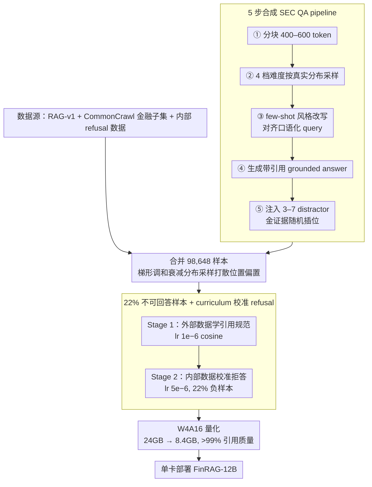

# FinRAG-12B: A Production-Validated Recipe for Grounded Question Answering in Banking

**会议**: ACL 2026  
**arXiv**: [2605.05482](https://arxiv.org/abs/2605.05482)  
**代码**: 未开源 (Stage 1 可基于 RAG-v1 复现)  
**领域**: RAG / 金融 / 模型压缩  
**关键词**: 金融问答, 引用 grounding, calibrated refusal, curriculum learning, W4A16 量化

## 一句话总结
Kasisto 团队基于 Gemma 3 12B-IT，用 143M token 的数据高效配方 (LLM-as-Judge 过滤 + 引用标注 + 22% 不可回答样本 + 两阶段 curriculum) 训出 FinRAG-12B，并通过 W4A16 量化压到 8.4 GB 单卡部署——答案质量 (JudgeLM 6.21) 和引用质量 (73.1) 都超过 GPT-4.1，refusal 比例 12% 介于 base 的不安全 4.3% 和 GPT-4.1 的过度拒绝 20.2% 之间，在 40+ 家金融机构上线后查询解决率显著提升 +7.1pp ($p<0.001$)，延迟和成本相比 GPT-4.1 分别便宜 3–5× 和 20–50×。

## 研究背景与动机

**领域现状**：银行业要上 LLM 的核心阻力是合规——回答必须可验证、可溯源、不能编造，且面对每天变化的利率、账户余额、政策需要 RAG。BloombergGPT (50B/346B tokens) 路线证明大力出奇迹可行但闭源且不报延迟成本；FinGPT 用 LoRA 但只做分类不做生成 RAG。

**现有痛点**：(a) 通用指令调优 LLM 普遍 sycophantic——即使检索上下文不足也会硬答 (Sharma 2024)，base Gemma 3 12B 只在 4.3% 的查询上说 IDK，几乎全在编；(b) GPT-4.1 反向极端——20.2% 过度拒绝，把答得了的查询也拒了；(c) RAG 模型有"lost in the middle"位置偏置 (Liu 2024)；(d) 混训所有数据 → 灾难性表现 (JudgeLM 3.28，IDK 飙到 46.5%)，但单训外部或单训内部数据各有缺陷；(e) 部署成本——GPT-4.1 每 query $0.02–0.05，40 家机构日 10K 查询打不起。

**核心矛盾**：grounded answer quality、refusal calibration、citation quality、latency、cost 这五个维度互相冲突——直接 SFT 容易过拟合到某一维而牺牲其他，而银行场景必须五个全要。同时合规限制下大量真实用户数据 (含 PII) 不能直接训。

**本文目标**：(i) 一个 data-efficient (≤200M token) 的训练 recipe，同时优化答案质量+引用+calibrated refusal；(ii) 一个可在单卡部署、成本 ≤$0.005/query 的服务方案；(iii) 一套从数据策展到量化服务的端到端 production 方法学；(iv) 在真生产环境 (40+ 家机构) 上验证。

**切入角度**：作者发现"数据质量 > 数据规模" (Phi-3、LIMA 已证明) + "curriculum learning 解决多目标冲突" + "controlled 负样本比例校准 refusal"——把这三件事拼成一个 recipe。

**核心 idea**：用 LLM-as-Judge 过滤 + 多阶段合成 + curriculum learning 在 143M tokens 上同时优化答案/引用/拒答；refusal 通过 22% 不可回答样本 sweep 出最优负例比例；最后 W4A16 量化保留 >99% citation 质量。

## 方法详解

### 整体框架
FinRAG-12B 是一套把 Gemma 3 12B-IT 训成「可溯源、会拒答、能单卡部署」金融 QA 模型的端到端配方，全程只用 143M token。数据侧先合并开源 RAG-v1（43,581 样本，JudgeLM 过滤 <5 分）、5 步合成的 SEC QA（16,773 样本）、CommonCrawl 金融子集（20,499 样本）与内部 refusal calibration 数据（17,795 样本）共 98,648 样本，并让金证据在 distractor 中按右梯形调和衰减分布 $P(X=x)=\frac{1}{N-K_{\min}+1}\sum_{K=\max(x,K_{\min})}^{N}\frac{1}{K}$ 采样以打散位置偏置；训练侧走两阶段 curriculum（Stage 1 lr $1\times10^{-6}$ cosine 学引用规范、Stage 2 lr $5\times10^{-6}$ linear 校准拒答与真实风格），最后用 SmoothQuant W4A16 把 24GB 压到 8.4GB 上线，使答案质量、引用、拒答、延迟、成本这五个互相冲突的维度同时达标。

### 关键设计

**1. 5 步合成 SEC QA pipeline（而非单 shot 生成）：让合成数据既 grounded 又贴近真实 query 分布**

单 shot LLM 生成出来的 QA 又长又啰嗦，和真实用户「碎片化、口语化」的查询差距巨大，直接训会过拟合到合成分布，因此 FinRAG 把「分布对齐」当成合成数据的核心目标而非单纯堆量。具体走五步：分块（400–600 token）→ 按真实分布给 easy/medium 高采样权重的 4 档难度生成 → few-shot 风格改写（控制 query style fragment / how-do-I / what-is、长度服从 log-normal、正式度可调，例如把「What is the minimum credit score required for mortgage approval?」压成「min credit score for mortgage」）→ 产出带引用的 grounded answer → 注入 3–7 个 topically-similar distractor 并随机插入金证据位置。对齐效果很直接：question-type 的 JS divergence 从 0.434 降到 0.041（10× 改进）、平均长度从 19.55 词降到 8.85 词（真实值 9.91）。

**2. 22% 不可回答样本 + curriculum 校准 refusal：让模型证据不足时主动说 IDK 又不过度拒绝**

refusal calibration 是单一目标 SFT 解决不了的——它和「答案质量」天然冲突，敢答更可能答对但也更可能编。作者在 10%–30% 区间以 2pp 步长 sweep 负样本比例，找到 22% 这个 Pareto 甜蜜点：超过 26% 时 recall 急剧下降（过度拒绝），低于此则 sycophancy 主导（false positive 高）。但负例比例对了还不够——把所有数据混训会让 IDK 飙到 46.5% 且只有 39% 是真负例，于是用两阶段 curriculum 把冲突任务隔离：外部数据先教 citation、内部数据再校准拒答，最终 IDK 调到 13.2%、TN 准确率 56%。

**3. W4A16 量化保留 >99% citation 质量：把 24GB 压到 8.4GB 实现单卡实时部署**

金融 RAG 必须秒级响应，且 40+ 家机构部署要求硬件成本可控，这两条把量化逼成刚需。FinRAG 用 SmoothQuant W4A16（4-bit 权重 + 16-bit 激活）把模型压到 8.4GB（2.86×），单 GPU（RTX 6000 Ada）即可部署、per-query 成本 ~\$0.001，TTFT 0.14s / TTC 0.57s，比上一代 Mistral-7B-Instruct 基础的 FinRAG-v3 的 TTC 快 3.2×。关键发现是引用质量在低位量化下几乎不掉（>99% 保留）——grounded generation 对激进量化的鲁棒性，本身就是一个值得传播的结论。

### 损失函数 / 训练策略
LoRA ($r=64, \alpha=256$, dropout 0.05) 应用到所有 attention+MLP，8-bit AdamW lr $2\times10^{-5}$，per-device batch 4 + grad accum 4 (有效 16)，max seq 16,384，patience 5 早停。总训练 1,400 步 / ~360 GPU-hours / 8× RTX A6000 / 成本约 $1,800。

## 实验关键数据

### 主实验：258 条银行 QA 测试集 (3 家金融机构)

| 模型 | JudgeLM (1–10) | Citation Q (0–100) | QA F1 | IDK% |
|------|---------------|--------------------|-------|------|
| Gemma 3 12B (base) | 5.70 | 80.2 | 0.964 | 4.3 (under-refuse) |
| GPT-4.1 (API) | 5.72 | 70.8 | 0.900 | 20.2 (over-refuse) |
| **FinRAG-12B** | **6.21** | **73.1** | 0.936 | **12.0 (calibrated)** |

公共基准 FinanceBench (150 条 SEC 问题)：

| 模型 | FinanceBench F1 |
|------|-----------------|
| Gemma 3 12B (base) | 0.249 |
| GPT-4.1 | 0.238 |
| **FinRAG-12B** | **0.284** (引用率 97.3%) |

### Curriculum / 数据策略消融 (258 条银行 QA)

| 策略 | JudgeLM | QA F1 | Cit. Q | IDK% | TN% (refusal 正确率) |
|------|---------|-------|--------|------|---------------------|
| External only (RAG-v1+SEC 合成) | 5.72 | 0.972 | 76.1 | 0.4 | 0 (灾难性低) |
| Internal only (CC+内部) | 5.62 | 0.913 | 69.2 | 17.4 | 53 |
| Combined (全混训) | 3.28 | 0.706 | 51.2 | 46.5 | 39 (彻底崩) |
| **Curriculum (staged)** | **5.91** | 0.938 | **74.7** | 13.2 | **56** |

### 关键发现
- **混训 ≠ 多数据更好**：把所有数据揉成一锅训反而让 JudgeLM 从 5.91 跌到 3.28、IDK 飙到 46.5%——多目标冲突必须用 curriculum 隔离。
- **base model 的 4.3% IDK 是危险的**：Gemma 3 base 拒答率虚低，意味着 95.7% 不可回答查询它都在硬答，监管语境下不可接受。
- **GPT-4.1 的 20.2% IDK 是浪费**：超过 20% 查询被拒，用户体验和商业价值都受损。FinRAG-12B 的 12% 是 calibrated sweet spot。
- **生产指标 +7.1pp 解决率**：3,297 条 7 个月真实查询，从 77.4% 提到 84.5% ($\chi^2=24.4, p<0.001$)；用户满意度 +3.4pp 但不显著 ($p=0.26$)，归因分解显示满意度提升来自"更多查询被解决" (分布漂移) 而非"每条回答更好"——揭示了 production RAG 真实价值驱动机制。
- **W4A16 不掉点**：4-bit 量化保留 >99% citation 质量，证明 grounded generation 对低位量化鲁棒。
- **5 步合成 vs 单 shot**：question-type JS divergence 改善 10×、长度从 19.55 → 8.85 词逼近真实 9.91 词——分布对齐比生成质量更关键。

## 亮点与洞察
- **"data-efficient + curriculum" 组合拳很实用**：143M token 训出击败 GPT-4.1 的 grounded QA 模型，证明在垂直域里"配方 > 规模"。Stage 1 用开源数据 / Stage 2 用私有数据的设计同时解决"复现性"和"私有数据保护"两个工业痛点。
- **负样本比例 sweep 找 sweet spot 是可迁移技巧**：refusal calibration 本质是个 Pareto 优化问题，作者用最简单的 grid search (10%–30% 步长 2pp) 找出 22%——这种"理论简单但落地有效"的方法值得任何 SFT pipeline 借鉴。
- **梯形调和衰减分布缓解 lost-in-the-middle**：用一个混合分布让金证据随机出现在各位置，强迫模型不依赖位置启发式——比标准 shuffle 更可控。
- **满意度归因分析**：作者没满足于"FinRAG 更好"，而是分解出"满意度提升来自分布漂移而非单回答质量"——这种诚实的因果归因在 industry paper 里少见，且暗示 production RAG 的下一步优化重点应该是"提高 coverage" 而非"再榨答案质量"。
- **W4A16 + LoRA + Gemma 3 这套技术组合是 2025 年金融 LLM 部署的合理配方**：可以直接套用到其他垂直领域 (法律、医疗、客服)。

## 局限与展望
- 评测集偏小：258 条银行 QA 仅来自 3 家机构，且偏向零售银行常见查询；商业/投行/保险/交易未覆盖。
- 内部数据 (Stage 2) 因合规不能开源，只有 Stage 1 完全可复现——一定程度上限制了学术后续工作。
- Refusal 评测只识别显式 "I don't know" 及近义变体，对 hedged / 部分不确定的表达 (如"可能是..."、"具体请咨询...") 没建模，可能低估真实 abstention 行为。
- 满意度 +3.4pp 不显著 ($p=0.26$)——可能需要更长观察期或更大样本才能确认。
- 数据合成依赖 GPT 类教师模型——长期看会有"模型崩塌"风险 (合成数据训出来的模型再去合成)。
- 47 家机构虽多，但都在美国零售银行域，跨监管体系 (欧盟、亚太) 未验证。

## 相关工作与启发
- **vs BloombergGPT (Wu 2023)**: 50B / 346B token / 闭源 / 不报延迟成本；FinRAG-12B 12B / 143M token / 部分开源 / 给出完整 production 指标——证明"data quality 路线"比"暴力 scaling"在垂直域更合理。
- **vs FinGPT (Yang 2023)**: 都用 LoRA 但 FinGPT 只做分类；FinRAG-12B 做生成 RAG with citation——任务更难。
- **vs Phi-3 (Abdin 2024) / LIMA (Zhou 2023)**: 借鉴了"小而精数据"哲学，但 FinRAG-12B 把它落到 grounded RAG + refusal 的多目标场景。
- **vs RARR (Gao 2023) / Self-RAG (Asai 2024)**: 这些方法 inference-time 优化 grounding；FinRAG-12B training-time 让模型本身就 grounded，部署时不需要额外推理开销。和 FinGround 的关系：FinGround 是验证层 (可作用于任何 generator)，FinRAG-12B 是生成器；二者可叠加。
- **vs CRAG / Adaptive-RAG**: 都改进检索路由，FinRAG-12B 接受外部检索结果不做 routing 但通过训练让生成对噪声检索更鲁棒。
- **启发**：(a) 任何垂直域 LLM 上线都应做"负样本比例 sweep" 校准拒答；(b) 多目标冲突时优先考虑 curriculum 而非全混训；(c) 生产模型应该报"解决率"等业务指标而非只报基准 F1，并做归因分解；(d) W4A16 量化是 12B 级模型单卡部署的标配。

## 评分
- 新颖性: ⭐⭐⭐ 单一技术 (curriculum, LoRA, refusal calibration) 都不新；但"数据 pipeline + curriculum + 22% 负样本 + W4A16 + 生产验证"作为完整 recipe 在金融 RAG 域是首次系统落地。
- 实验充分度: ⭐⭐⭐⭐ 自建 + 公开两套基准、详尽 ablation、3,297 条 7 个月生产数据、满意度归因分析；但银行 QA 测试集 258 条偏小。
- 写作质量: ⭐⭐⭐⭐ Industry paper 写得罕见清晰，配方步骤可复现，limitations 诚实，归因分析有深度。
- 价值: ⭐⭐⭐⭐⭐ 直接 production-validated (40+ 家机构上线)，给出从数据到量化的端到端 recipe，对任何想做垂直域 grounded LLM 的团队都有直接参考价值。

<!-- RELATED:START -->

## 相关论文

- [\[ACL 2026\] DQA: Diagnostic Question Answering for IT Support](dqa_diagnostic_question_answering_for_it_support.md)
- [\[ACL 2026\] ChatR1: Reinforcement Learning for Conversational Reasoning and Retrieval Augmented Question Answering](chatr1_reinforcement_learning_for_conversational_reasoning_and_retrieval_augment.md)
- [\[ACL 2026\] MAB-DQA: Addressing Query Aspect Importance in Document Question Answering with Multi-Armed Bandits](mab-dqa_addressing_query_aspect_importance_in_document_question_answering_with_m.md)
- [\[ACL 2026\] CounterRefine: Answer-Conditioned Counterevidence Retrieval for Inference-Time Knowledge Repair in Factual Question Answering](counterrefine_answer-conditioned_counterevidence_retrieval_for_inference-time_kn.md)
- [\[AAAI 2026\] N2N-GQA: Noise-to-Narrative for Graph-Based Table-Text Question Answering Using LLMs](../../AAAI2026/information_retrieval/n2n-gqa_noise-to-narrative_for_graph-based_table-text_question_answering_using_l.md)

<!-- RELATED:END -->
