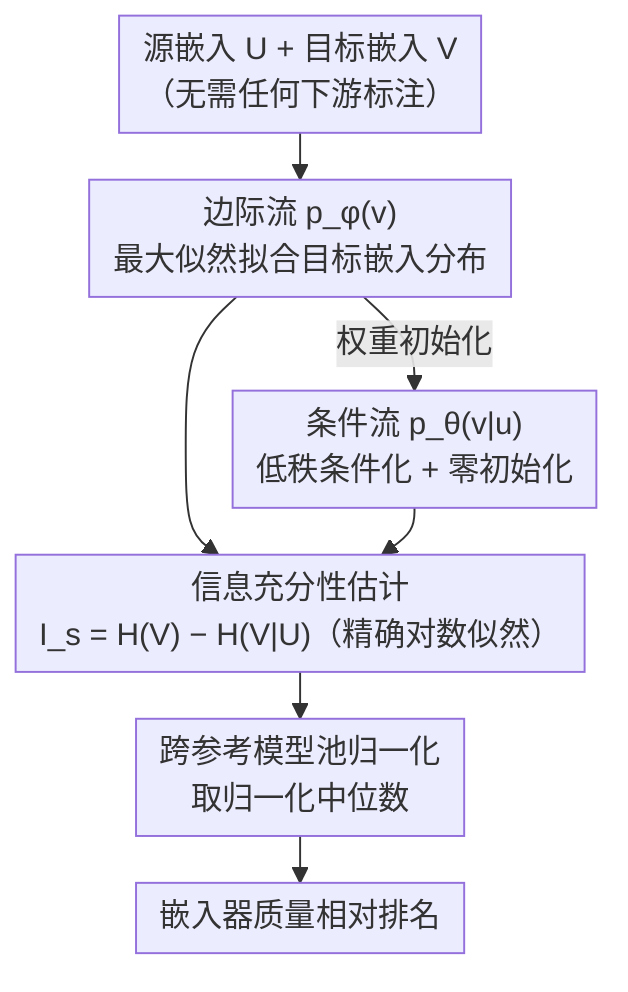

# FLARE: Task-Agnostic Embedding Model Evaluation via Normalizing Flows

**会议**: ACL 2026 Findings  
**arXiv**: [2604.17344](https://arxiv.org/abs/2604.17344)  
**代码**: 无  
**领域**: 信息检索  
**关键词**: 嵌入模型评估, 无标签评估, 正则化流, 信息充分性, 高维密度估计

## 一句话总结

提出FLARE框架，利用正则化流（Normalizing Flows）进行无标签的文本嵌入模型评估，通过直接从对数似然估计信息充分性来避免基于距离的密度估计在高维空间中的崩溃，在11个数据集上与有监督基准的Spearman $\rho$ 达0.90。

## 研究背景与动机

**领域现状**：文本嵌入模型（如Qwen3 Embedding、Gemini Embedding）数量快速增长，选择最适合特定语料的模型变得越来越困难。标准方法依赖MTEB等有标注基准，但这需要标注数据且可能存在基准污染。

**现有痛点**：（1）有标注基准对专有领域不可用，且基准泄露导致分数虚高；（2）无标签方法如均匀性、IsoScore等关注几何性质而非语义内容；（3）EMIR方法使用KDE或GMM估计密度，在高维空间因维度灾难而不稳定。

**核心矛盾**：需要无标签评估嵌入质量，但现有密度估计方法在高维空间中统计不可靠。

**本文目标**：设计一个在高维嵌入上仍然稳定可靠的无标签嵌入评估框架。

**切入角度**：利用正则化流的精确对数似然估计能力，避免基于距离的密度估计。

**核心 idea**：用正则化流替代KDE/GMM来估计信息充分性，将评估误差从依赖原始维度转为依赖数据流形的内在维度。

## 方法详解

### 整体框架

FLARE 把"嵌入模型好不好"重新表述成一个无标签的密度估计问题：给定源嵌入 $U$ 和目标嵌入 $V$，衡量前者对后者保留了多少信息。它先训练一个边际流 $p_\phi(v)$ 拟合目标嵌入的分布，再在此基础上初始化并训练一个条件流 $p_\theta(v|u)$ 捕获源-目标依赖；信息充分性分数取边际熵减条件熵，最后跨参考模型池归一化输出排名。整条流程不需要任何下游标注，输出即是对嵌入器质量的相对排序。

### 关键设计

**1. 基于正则化流的信息充分性估计：用精确似然替代崩溃的核密度**

现有无标签方法 EMIR 用 KDE 或 GMM 估计高维密度，维度一上去就因维度灾难而统计失效。FLARE 改用正则化流，把嵌入质量定义成源对目标的不确定性减少量 $I_s(U \to V) = H(V) - H(V|U)$，其中两个熵都由流模型的精确对数似然算出，而非变分下界。这样估计的可靠性不再依赖样本在原始维度上的密度，最终得分取跨参考模型池的归一化中位数，使不同嵌入器之间可比。

**2. 低秩条件化与零初始化：让条件流在高维下仍可训练且稳定起步**

标准条件流要为每个维度建模交叉依赖，复杂度 $O(d^2)$ 在 $d\ge 3584$ 的嵌入上不可行。FLARE 让条件流复用边际流权重，只通过一个低秩残差分支注入源信息：$\mathbf{h}_{cond} = \mathbf{h}_{base} + B(A(u))$，其中 $A$ 把源嵌入压到 $r=64$ 的瓶颈、$B$ 升回原维度，参数量从 $O(d^2)$ 降到 $O(dr)$。$B$ 零初始化使条件流起点恰好等于已训好的边际流，避免冷启动时的梯度震荡，保证两阶段渐进训练平滑收敛。

**3. 有限样本泛化界：把可靠性从原始维度解绑到内在维度**

为了说明中等样本量就够用，FLARE 证明了估计误差的上界主要由数据流形的内在维度 $d_{eff}$ 决定，而非嵌入的原始维度 $d$。由于真实嵌入往往集中在低维流形上、$d_{eff} \ll d$，这条界保证了把 FLARE 部署到新的未标注语料时，即便维度很高也能用有限样本得到可靠排名——这正是它在高维下不崩溃的理论根因。

### 损失函数 / 训练策略

两阶段均为正则化流的标准最大似然训练：先训边际流 $p_\phi(v)$，再以其权重初始化条件流 $p_\theta(v|u)$ 并配合零初始化的低秩分支接续训练，确保渐进收敛稳定。

## 实验关键数据

### 主实验

与有监督排名的Spearman $\rho$ 对比：

| 方法 | 高维嵌入(d≥3584) | 说明 |
|------|------------------|------|
| Silhouette Score | 不稳定 | 几何指标 |
| EMIR (GMM) | 崩溃 | 维度灾难 |
| **FLARE** | **ρ高达0.90** | 正则化流 |

### 消融实验

| 配置 | 效果 | 说明 |
|------|------|------|
| FLARE完整 | 最优 | 正则化流+低秩+零初始化 |
| 替换为KDE | 高维崩溃 | 维度灾难 |
| 无零初始化 | 收敛慢 | 梯度不稳定 |

### 关键发现

- FLARE在高维嵌入上保持稳定，而现有方法全部崩溃——关键差异化优势
- 排名预测与有监督基准高度一致（$\rho$=0.90）
- 理论界与实验一致：误差依赖内在维度而非原始维度

## 亮点与洞察

- 将嵌入评估转化为密度估计问题是深刻洞察：嵌入质量等价于"保留了多少原始信息"。
- 低秩条件化+零初始化的工程设计精巧，可复用于其他高维条件密度估计场景。
- 有限样本泛化界将实践经验上升为理论保证。

## 局限与展望

- 正则化流训练成本高于简单几何指标
- 依赖模型池中的参考嵌入模型，池的组成可能影响结果
- 仅在文本嵌入上验证，多模态嵌入待探索

## 相关工作与启发

- **vs EMIR**: 共享信息充分性框架但GMM在高维崩溃；FLARE用正则化流解决
- **vs MTEB**: 需标注数据且受基准污染；FLARE适用于任意未标注语料
- **vs Uniformity/IsoScore**: 衡量几何而非语义；FLARE基于信息论

## 评分
- 新颖性: ⭐⭐⭐⭐⭐ 正则化流+信息充分性的新颖组合
- 实验充分度: ⭐⭐⭐⭐ 11数据集×8嵌入器，理论+实验双验证
- 写作质量: ⭐⭐⭐⭐⭐ 理论推导严谨
- 价值: ⭐⭐⭐⭐⭐ 解决高维嵌入无标签评估的关键痛点

<!-- RELATED:START -->

## 相关论文

- [\[NeurIPS 2025\] Learning Task-Agnostic Representations through Multi-Teacher Distillation](../../NeurIPS2025/information_retrieval/learning_task-agnostic_representations_through_multi-teacher_distillation.md)
- [\[CVPR 2026\] ProM3E: Probabilistic Masked MultiModal Embedding Model for Ecology](../../CVPR2026/information_retrieval/prom3e_probabilistic_masked_multimodal_embedding_model_for_ecology.md)
- [\[CVPR 2026\] MuCo: Multi-turn Contrastive Learning for Multimodal Embedding Model](../../CVPR2026/information_retrieval/muco_multi-turn_contrastive_learning_for_multimodal_embedding_model.md)
- [\[ICLR 2026\] HUME: Measuring the Human-Model Performance Gap in Text Embedding Tasks](../../ICLR2026/information_retrieval/hume_measuring_the_human-model_performance_gap_in_text_embedding_tasks.md)
- [\[ACL 2026\] Reliable Evaluation Protocol for Low-Precision Retrieval](reliable_evaluation_protocol_for_low-precision_retrieval.md)

<!-- RELATED:END -->
