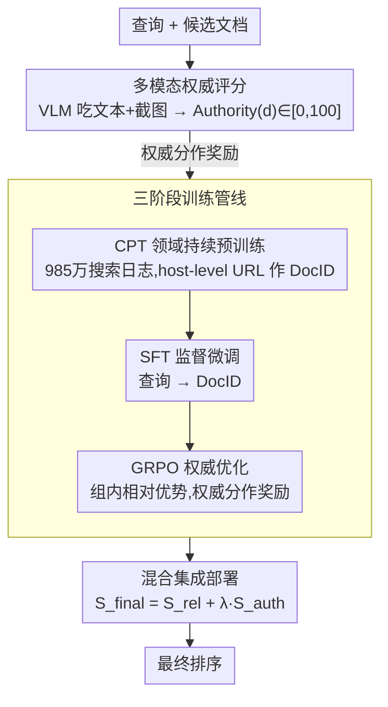

# From Relevance to Authority: Authority-aware Generative Retrieval in Web Search Engines

**会议**: ACL 2026  
**arXiv**: [2604.13468](https://arxiv.org/abs/2604.13468)  
**代码**: 无  
**领域**: 信息检索 / 搜索引擎  
**关键词**: 生成式检索、权威性、GRPO、多模态评分、网络搜索

## 一句话总结
本文提出AuthGR，首个将文档权威性系统性整合到生成式检索中的框架，通过VLM多模态权威评分、三阶段渐进式训练（CPT→SFT→GRPO）和混合集成部署管线，在Naver商业搜索引擎的大规模A/B测试中验证了显著的用户参与度提升。

## 研究背景与动机

**领域现状**：生成式信息检索（GenIR）将检索重新表述为文本生成任务，直接生成文档标识符（DocID）。近期在电商搜索、外卖和金融服务等工业场景中得到了广泛应用。然而，现有方法主要优化语义相关性。

**现有痛点**：在健康、金融等高风险领域，仅依赖语义相关性可能将未经验证的个人博客（如健康博主）排在与官方医学协会同等的位置。但将权威性整合到GenIR面临三个挑战：(1) 定义权威性——仅靠文本线索无法区分可信来源和精心伪装的推广网站；(2) 学习权威性——在不损害语义相关性的前提下注入权威概念非同小可；(3) 部署——直接替换现有排序器不切实际。

**核心矛盾**：相关性高的文档不等于可信的文档。在高风险领域，向用户推荐不可靠信息可能造成严重后果。但现有GenIR系统没有任何机制来区分权威源和非权威源。

**本文目标**：设计首个权威性感知的GenIR框架，在保持相关性的同时优先展示可信文档。

**切入角度**：(1) 用VLM模拟人类对网页权威性的多模态判断（文本内容+视觉设计+广告分布）；(2) 用GRPO偏好优化让模型学会在候选文档中优先选择高权威文档；(3) 通过混合集成管线与现有排序器协同部署。

**核心 idea**：权威评分作为GRPO的奖励信号，让生成式检索模型在保持语义相关的同时学会偏好权威来源。

## 方法详解

### 整体框架

AuthGR 要解决的是"相关 ≠ 可信"：生成式检索给定查询直接生成文档标识符（DocID），但只优化语义相关性会把伪装的推广网页排到官方权威源同一档。它的做法是先用 VLM 给每个候选文档打出一个多模态权威分，再把这个分数当作奖励，沿"领域持续预训练 → 监督微调 → GRPO 权威优化"三阶段把权威偏好注入一个生成式检索模型，最后在线上通过混合集成与现有排序器协同——查询进来，AuthGR 产出一批权威 DocID，与原排序器的相关性分加权融合后给出最终排序。

### 关键设计

**1. 多模态权威评分：用 VLM 把"可信度"变成可大规模计算的奖励信号**

推广性内容最擅长在文字上模仿权威语言，仅靠文本很难识破，而广告密度、页面布局质量这类视觉线索才是区分真权威与精装伪装的关键。AuthGR 让 VLM 同时吃文本信号（标题、正文、URL 元数据）和视觉信号（页面截图），按统一评分标准在专业性、官方性、公共利益三个维度打分，并附带检查商业意图与有害性，输出 $\text{Authority}(d) = f_{\text{VLM}}(T(d), V(d)) \in [0,100]$ 及自然语言理由。这相当于把人类评估者的判断变成一个可扩展的自动代理，为后续训练提供稠密的权威奖励。

**2. 三阶段训练管线：把权威意识从"知识"逐步升级为"偏好"**

直接 SFT 会平等对待所有有效文档，学不到权威性的相对差异；加权交叉熵又是逐点的、缺乏探索。AuthGR 用渐进式三阶段：先在 985 万搜索日志上做领域持续预训练（CPT），让模型掌握查询-URL-标题-正文的关联，并刻意采用 host-level URL（如 `plus.gov.kr`）作为 DocID 以暴露来源身份；再在 395 万高质量查询-文档对上做监督微调（SFT），学会从查询生成 DocID；最后用 GRPO 做权威优化——对每个查询采样 $G$ 个候选 DocID，以权威分数为奖励，按组相对优势 $A_i = \frac{r_i - \text{mean}(\mathbf{r})}{\text{std}(\mathbf{r})}$ 更新策略。组内对比正是让模型在多个候选中学会"优先挑权威源"的机制。

**3. 混合集成部署管线：用加权融合替代高风险的整体替换**

在商业搜索引擎里直接换掉现有排序器风险过大，会动摇已经调优的召回率。AuthGR 改为旁路集成：现有检索器照常给出相关性分数 $S_{\text{rel}}(d|q)$，AuthGR 则生成一组权威 DocID 集合 $\mathcal{D}_{\text{auth}}(q)$，并按排名线性衰减得到权威分 $S_{\text{auth}} = \frac{N - \text{rank}(d) + 1}{N}$。两者通过 $S_{\text{final}} = S_{\text{rel}} + \lambda \cdot S_{\text{auth}} \cdot \mathbb{I}[d \in \mathcal{D}_{\text{auth}}]$ 融合，既保住原系统召回，又把可信文档的排名顶上来，且只对落在权威集合内的文档加分。

### 损失函数 / 训练策略

三阶段各用对应目标：CPT 用标准语言建模损失，SFT 用负对数似然，GRPO 用以权威分数为奖励的 PPO 式裁剪目标。全部基于 Naver 商业搜索引擎的韩语数据训练。

## 实验关键数据

### 主实验

| 模型 | 规模 | P@3 | R@5 | R@10 |
|------|------|------|------|------|
| Qwen3 (ICL) | 32B | 0.0821 | 0.1176 | 0.1570 |
| K-EXAONE (ICL) | 236B | 0.1366 | 0.1918 | 0.2656 |
| AuthGR | **3B** | 匹配14B基线 | — | — |

### 消融实验

| 配置 | 效果 | 说明 |
|------|------|------|
| Full AuthGR (CPT+SFT+GRPO) | 最优 | 三阶段完整 |
| w/o CPT | 下降 | 缺少领域知识先验 |
| w/o GRPO (仅CPT+SFT) | 权威性低 | 无法区分权威级别 |
| 在线A/B测试 | 用户参与度↑ | 大规模商业验证 |
| 人工评估 | 质量评分↑ | 专家验证 |

### 关键发现
- AuthGR的3B模型在离线评估中匹配14B基线（4.7×参数效率提升）
- 大规模在线A/B测试确认了真实用户参与度的显著提升
- 人工评估验证了权威分数与人类判断的高度一致性
- GRPO阶段是注入权威意识的关键——仅SFT无法学习权威的相对性
- 多模态（文本+视觉）评分比纯文本评分更准确，因为推广内容善于模仿权威文本

## 亮点与洞察
- **从相关性到权威性的范式扩展**：首次在GenIR中系统性地引入权威信号，从"找到相关的"扩展到"找到可信的"。在信息过载和虚假信息泛滥的时代，这个方向至关重要。
- **VLM作为权威评估的可扩展代理**：利用VLM的多模态理解能力自动化网页权威评估，是传统PageRank思路的现代升级。
- **工业级验证**：在Naver商业搜索引擎上的大规模A/B测试和人工评估提供了极强的实践验证，不同于多数学术工作仅有离线实验。

## 局限与展望
- 仅在韩语网络搜索上验证，跨语言和跨文化的权威性标准可能不同
- VLM评分的计算成本较高，大规模实时评分可能面临效率挑战
- 权威性评估可能存在偏见——某些正当但小众的信息源可能被低估
- host-level的DocID粒度可能错误地将同一域名下的不同质量内容等同处理

## 相关工作与启发
- **vs PageRank/TrustRank**：传统方法依赖链接结构，AuthGR直接从内容和视觉评估权威性
- **vs 标准GenIR**：标准GenIR只优化相关性，AuthGR增加权威维度
- **vs TREC Health Misinformation Track**：聚焦健康领域的可信度，AuthGR提供了通用的框架

## 评分
- 新颖性: ⭐⭐⭐⭐⭐ 首个将权威性系统整合到GenIR的工作，工业意义重大
- 实验充分度: ⭐⭐⭐⭐⭐ 离线+在线A/B+人工评估的完整验证体系
- 写作质量: ⭐⭐⭐⭐ 动机清晰，方法系统化，但部分技术细节偏简
- 价值: ⭐⭐⭐⭐⭐ 直接影响商业搜索引擎的可信度，社会意义重大

<!-- RELATED:START -->

## 相关论文

- [\[ACL 2026\] AuthorityBench: Benchmarking LLM Authority Perception for Reliable Retrieval-Augmented Generation](authoritybench_benchmarking_llm_authority_perception_for_reliable_retrieval-augm.md)
- [\[ACL 2026\] Why These Documents? Explainable Generative Retrieval with Hierarchical Category Paths](why_these_documents_explainable_generative_retrieval_with_hierarchical_category_.md)
- [\[ACL 2026\] IF-GEO: Conflict-Aware Instruction Fusion for Multi-Query Generative Engine Optimization](if-geo_conflict-aware_instruction_fusion_for_multi-query_generative_engine_optim.md)
- [\[CVPR 2025\] GENIUS: A Generative Framework for Universal Multimodal Search](../../CVPR2025/information_retrieval/genius_a_generative_framework_for_universal_multimodal_search.md)
- [\[ACL 2026\] Enhancing LLM-based Search Agents via Contribution Weighted Group Relative Policy Optimization](enhancing_llm-based_search_agents_via_contribution_weighted_group_relative_polic.md)

<!-- RELATED:END -->
