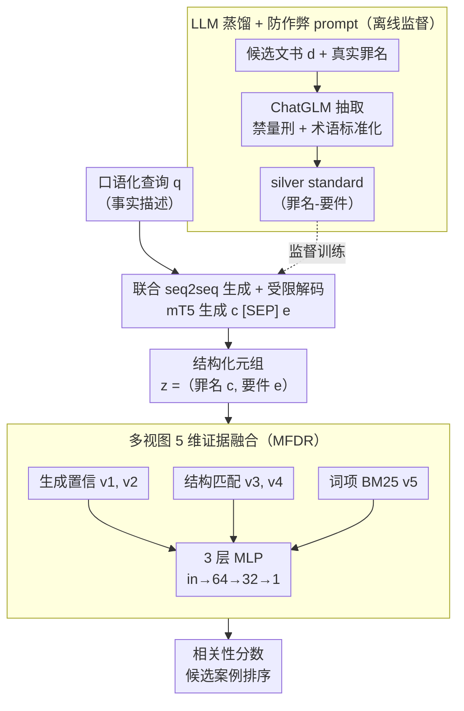

# GLIER: Generative Legal Inference and Evidence Ranking for Legal Case Retrieval

**会议**: ACL 2026  
**arXiv**: [2604.23779](https://arxiv.org/abs/2604.23779)  
**代码**: 待确认  
**领域**: 信息检索 / 法律 NLP  
**关键词**: 法律案例检索, 生成式推理, 罪名-要件, 多视图证据融合, 知识蒸馏

## 一句话总结
本文提出 **GLIER**：把法律案例检索（LCR）从"直接文本相似度匹配"重写为"先用 seq2seq 联合生成 *罪名 + 构成要件* 这一隐变量、再用多视图（生成置信 + 结构匹配 + 词项 BM25）MLP 融合"的两阶段框架，在 LeCaRD/LeCaRDv2 上超越 SAILER、KELLER，且只用 10% 数据训练就能击败强基线的全量结果。

## 研究背景与动机

**领域现状**：法律案例检索（LCR）目前主流三种范式：(i) BM25 等词项匹配，关键词强但无法建模法理逻辑；(ii) BERT/Lawformer/SAILER 等 dense retrieval，靠预训练长文本编码，但仍是黑盒相似度；(iii) DSI/LegalSearchLM 等生成式检索，直接生成 DocID，幻觉风险高、缺乏证据对齐。

**现有痛点**：法律相关性不是"字面相似"而是"法理一致"——本质是判定 *Charge*（罪名）与 *Constitutive Elements*（构成要件）的对齐。查询通常是口语化事实描述，候选文档是正式法律语言，两者存在严重 *语义鸿沟*。SAILER/KELLER 这类方法即便引入结构化预训练或 LLM 改写，仍属"Retrieve-then-Rank"判别范式，没有显式建模"从 query 推罪名再推要件"的法律推理链。

**核心矛盾**：检索任务被建模成 query→doc 的直接映射，但法律相关性其实是 query→（罪名, 要件）→doc 的链式条件依赖；既要 *可解释* 又要 *鲁棒可控*。

**本文目标**：(1) 把 LCR 形式化成"隐变量 $z=(c,e)$"上的推断问题；(2) 用联合 seq2seq 生成强制罪名→要件的法理顺序依赖；(3) 把生成置信度与结构/词项信号融合做精排，避免纯生成的幻觉。

**切入角度**：模仿法律专家思维——先从案情推罪名与要件，再去案例库找符合该法理画像的先例；同时利用 LLM 离线蒸馏 silver standard，避开昂贵人工标注。

**核心 idea**：用 seq2seq 一次性生成 `c [SEP] e`，靠 autoregressive 解码自然实现 $P(e|q,c)$ 的链式约束，再用 5 维特征 MLP 把"latent confidence + 显式结构 + 词项匹配"融合排序。

## 方法详解

### 整体框架

GLIER 把法律案例检索从"query→doc 的直接相似度匹配"改写成"query→（罪名, 要件）→doc 的链式推断"，让检索沿着法律专家的思路走：先从案情推出隐变量 $z=(c,e)$，再据此找符合该法理画像的先例。它由两个串联模块组成：生成器 GLIE（mT5-base 学生模型）把口语化的 query $q$ 生成结构化元组 $K_q=(c_q,e_q)$，其监督信号来自 ChatGLM 教师离线蒸馏出的"罪名-要件"silver standard $\mathcal{D}_{struct}$；精排器 MFDR 则把生成置信、结构匹配、词项匹配拼成 5 维特征 $\mathbf{v}_{q,d}\in\mathbb{R}^5$，经 3 层 MLP（in→64→32→1）输出相关性分数。整体可形式化为 $\hat z = \arg\max_z P_\theta(z|q)$、$S(q,d)=f_\psi(q,d,\hat z)$，其中 $P_\theta(z|q)=P_\theta(c|q)P_\theta(e|q,c)$ 显式编码了"罪名先于要件"的条件依赖。

### 关键设计

**1. 联合 seq2seq 生成 + 受限解码：让 autoregressive 解码天然承载罪名→要件的法理顺序**

如果用两个独立分类器分别预测罪名和要件，就会出现"暴力性"要件挂在"财产犯罪"罪名下这种逻辑冲突。GLIER 改成一次性生成目标序列 $Y=c_q\oplus\text{[SEP]}\oplus e_q$，最小化 $\mathcal{L}_{\text{gen}}=-\sum_{t=1}^{|Y|}\log P(y_t|y_{<t},X;\theta)$，这样 element 是在 charge 已生成的 prefix 条件下采样的，逻辑冲突被自然过滤掉。推理时用 beam width=3，并加 validity filter $\hat c_q=\{t\in\hat c_{raw}\mid t\in\mathcal{K}_{charge}\}$、$\hat e_q=\{t\in\hat e_{raw}\mid t\in\mathcal{K}_{element}\}$ 把输出强制约束在合法分类法 $\mathcal{K}$ 内，抑制生成模型常见的同义词幻觉。消融证实这种联合策略比独立生成 MAP +1.87%、Hits@5 +1.89%。

**2. LLM 蒸馏 + 防作弊 prompt：把噪声长文书提炼成可检索的结构化监督**

人工标注"罪名-要件"成本极高，GLIER 用 ChatGLM 离线蒸馏 silver standard：对每条文档 $d$ 给定真实罪名 $c_{gt}$，调用 $K_d=\text{LLM}(d,c_{gt},\mathcal{P})=(c_d,e_d)$。关键在 prompt 设计强制两点——一是用专业法律术语而非口语描述，二是**严格禁止抽取量刑结果**（"有期徒刑/赔偿"等）。后者至关重要：法律文书充斥量刑、程序细节，若不剥离，silver label 会泄露目标信号让学生模型学到"匹配量刑模板"的捷径；而术语标准化则保证抽出的要件与法律分类法一致、能被 validity filter 接住。失败样本用 deepseek-R1 作 fallback 重抽，再经清洗管线删去约 2.7% 错误实例。人工 100 例评估显示罪名准确 97.0%、要件精度 82.0%、Cohen's $\kappa$=0.71。

**3. 多视图 5 维证据融合（MFDR）：用 MLP 学出门控与调音信号的非线性互补**

生成置信、结构命中、词项 BM25 是三类异质信号，简单规则相加会丢掉它们之间的非线性关系（消融里 w/o MLP 用规则求和 MAP 暴跌 15.2%）。MFDR 把它们组织成 5 维特征：*Latent Confidence* $v_1,v_2$ 是罪名/要件序列的长度归一化生成概率 $v_1=\exp(\tfrac{1}{|\hat c_q|}\sum_t\log P(t|\hat c_{<t},q))$、$v_2$ 同理；*Explicit Structural* $v_3=\mathbb{I}(\hat c_q\cap c_d\neq\varnothing)$、$v_4=\tfrac{|\hat e_q\cap e_d|}{|\hat e_q|+\epsilon}$；*Lexical* $v_5=\tfrac{\text{BM25}(q,d)}{\max_{d'\in\mathcal{C}_q}\text{BM25}(q,d')}$（每查询最大归一化）。MLP 用 BCE 配 BM25 hard negative（正负比 1:3）训练 $\mathcal{L}_{\text{score}}=-[\log S(q,d^+)+\sum_{d^-}\log(1-S(q,d^-))]$。SHAP 分析揭示其工作根因：Hit_Charge 是决定性的"门控"特征（罪名不对直接 0 分），Norm_BM25 是细粒度的"调音"特征，二者粒度互补才让融合超线性提升。

### 损失函数 / 训练策略

两个模块独立训练。生成器：mT5-base 在 silver standard 上做 NLL，max source/target = 512/128，beam=3。评分器：3 层 MLP（dropout 0.1），AdamW，lr 1e-4，batch 64；hard negative 取 BM25 top-K 的非相关文档（与 query 词项高度重叠但法理不同），强制 MLP 不能只依赖 $v_5$。

## 实验关键数据

### 主实验

| 模型 | 数据集 | MAP | Hits@3 | Hits@5 | MRR@5 |
|------|--------|-----|--------|--------|-------|
| BM25 | LeCaRD | 49.13 | 72.72 | 81.13 | 62.42 |
| SAILER | LeCaRD | 58.28 | 71.96 | 80.37 | 67.90 |
| KELLER | LeCaRD | **61.81** | 83.81 | 88.57 | 68.20 |
| **GLIER (ours)** | LeCaRD | 58.61 | **95.45†** | **95.45†** | **71.97** |
| KELLER | LeCaRDv2 | 76.22 | 95.94 | 98.71 | 93.02 |
| **GLIER (ours)** | LeCaRDv2 | **76.58** | **97.48** | **99.37** | **93.52** |

LeCaRDv2 上 GLIER 7 项指标全部 SOTA；LeCaRD 上 Hits@3 比 KELLER 高 11.64 个百分点（95.45% vs 83.81%），Recall@3 26.13% vs 19.01%，证明 GLIER 显著降低"零召回"风险（虽然 MAP 略低，但找得到的能力远强）。

### 消融实验

| 设置 | MAP | MRR@5 | NDCG@5 | 说明 |
|------|-----|-------|--------|------|
| Full Model (5 特征) | 76.58 | 93.52 | 84.64 | 完整 |
| w/o Lexical (BM25) | 50.23 | 66.03 | 51.69 | 去 BM25，掉 26.35 |
| w/o Charge 特征 | 60.19 | 84.62 | 72.22 | 去罪名结构信号，掉 16.39 |
| w/o Element 特征 | 73.60 | 91.53 | 84.12 | 去要件特征，掉 2.98 |
| Only Lexical | 58.43 | 79.42 | 65.13 | 仅 BM25 |
| Only Charge | 48.26 | 66.55 | 49.30 | 仅罪名 |
| Only Elements | 40.88 | 63.97 | 47.31 | 仅要件 |
| w/o GenIR（teacher LLM+prompt 直推） | 74.78 | 91.14 | — | 缺学生模型 −1.80 |
| w/o MLP（规则求和） | 61.38 | 84.22 | — | 缺融合器 −15.20 |
| Independent Generation | 74.71 | 92.53 | — | 罪名/要件分开生成 −1.87 |

### 关键发现
- **Charge 是"门控"，BM25 是"调音"**：SHAP 显示罪名命中是决定性 binary filter，BM25 是细粒度连续调整；单独看 BM25 比单独看法律特征还强（58.43 vs 50.23），但二者结合超线性提升到 76.58，验证 "lexical 提供 ranking 分辨率、generative 提供 semantic gatekeeper" 的互补假说。
- **罪名 > 要件**：去 charge 比去 element 掉 16.39 vs 2.98，验证罪名是粗粒度主过滤、要件是细粒度二级校验的法律层级结构。
- **罕见的数据效率**：仅用 10% 训练数据 GLIER 即 MAP 74.58，已超过 SAILER 全量 73.60、Lawformer 全量 70.44；30% 数据基本饱和（75.68）。原因有二：(1) LeCaRDv2 绝对体量已大；(2) 法律文本同类高度同质，少量样本即足以学到"事实→罪名"映射。
- **Backbone 不是关键**：把 mT5-base 换成 Qwen2.5-7B-Instruct + 1024 ctx，MAP 仅微涨 +0.0020，说明性能主要来自结构化推断范式，而非模型规模或长度。
- **联合 > 独立**：联合生成比独立两步多 +1.87 MAP，证明 chain-of-logic（charge 作为 semantic anchor 约束 element 生成）正向收益大于潜在的错误传播风险。

## 亮点与洞察
- **范式 reframing**：把 LCR 从"text similarity"升级到"latent juridical structure inference"，是法律 IR 少见的"显式建模推理链"工作；这种思路可直接迁移到医学（症状→诊断→治疗）、合规（合同条款→风险类别→案例）等其他垂直检索场景。
- **silver standard 的防作弊 prompt**：禁止包含量刑细节是一个非常细致但关键的小技巧，避免学生模型走捷径——这给"用 LLM 蒸馏专业领域监督数据"提供了一个值得学习的模板。
- **MLP 多视图融合**：5 维向量极简但 SHAP 解释力强，门控+调音的角色分离揭示了"信号粒度的差异"决定融合非线性形态的本质，这种 SHAP-guided 设计可推广到任何混合信号 ranking 任务。
- **数据效率**：10% 数据击败全量 baselines 的现象，本质是任务的结构化先验把搜索空间大幅压缩，提示在 *领域知识极强* 的任务中应优先建模 latent 结构而不是堆数据。

## 局限与展望
- **mT5-base 512 token 限制**：超长 query 仍会被截断，可能造成要件抽取不全；附录 F 已部分用 Qwen2.5-7B+1024 缓解，但收益微弱说明 backbone 不是真正瓶颈。
- **teacher 偏置传播**：silver standard 完全依赖 ChatGLM，教师的幻觉/偏见会下沉到 student；deepseek-R1 fallback + 2.7% 清洗只能缓解。
- **司法体系局限**：实验只在中国大陆刑事案件上做；普通法系（依赖判例推理）的 charge→elements 树状结构未必适用。
- **可解释性以"罪名命中"为主**：要件粒度的可解释还较弱，未给出"哪条要件最关键"的细粒度归因。
- **未与 LegalSearchLM 等纯生成式检索直接对比**：参考较少，对比基准还可以加强。

## 相关工作与启发
- **vs SAILER**：SAILER 用 reasoning/decision section 做结构感知预训练，但仍是 dual encoder 判别范式；GLIER 显式生成法理变量，提供更强可解释性与少样本鲁棒性。
- **vs KELLER**：KELLER 用 LLM 把 case 改写为 crime-subfact 对，做多粒度对比；GLIER 不局限于改写，而是把"罪名→要件"作为联合生成 + 显式 hit 特征，能给 ranking 提供门控信号（KELLER 仍是相似度）。
- **vs PromptCase**：PromptCase 用 LLM 抽 legal facts/issues 替换全文，但没有联合建模链式依赖；GLIER 把 chain-of-logic 嵌入 seq2seq autoregression，更严格。
- **vs LegalSearchLM / DSI**：纯生成式检索直接生成 DocID，幻觉风险高、缺乏证据对齐；GLIER 把生成只用作"语义桥"，最终 ranking 仍是判别式融合，幻觉风险更低。

## 评分
- 新颖性: ⭐⭐⭐⭐ 把 LCR 重写成"隐法律变量推断"是清晰的范式贡献；联合生成 + 多视图融合的具体形式较新颖。
- 实验充分度: ⭐⭐⭐⭐ 两个数据集、3 组基线、SHAP 可解释、10–100% 数据效率、backbone 替换、联合 vs 独立、特征 ablation 全；缺少与 LegalSearchLM 等生成式检索的直接对比。
- 写作质量: ⭐⭐⭐⭐ 公式与表格清晰，SHAP 与门控-调音解释很形象。
- 价值: ⭐⭐⭐⭐ 对法律 IR 社区是清晰可用的强基线，并为"专业垂直检索引入推理链"提供可复用蓝图。

<!-- RELATED:START -->

## 相关论文

- [\[ACL 2025\] GRAF: Graph Retrieval Augmented by Facts for Romanian Legal Multi-Choice Question Answering](../../ACL2025/information_retrieval/graf_graph_retrieval_augmented_by_facts_for_romanian_legal_multi-choice_question.md)
- [\[ACL 2026\] Learning to Extract Rational Evidence via Reinforcement Learning for Retrieval-Augmented Generation](learning_to_extract_rational_evidence_via_reinforcement_learning_for_retrieval-a.md)
- [\[ACL 2026\] From Relevance to Authority: Authority-aware Generative Retrieval in Web Search Engines](from_relevance_to_authority_authority-aware_generative_retrieval_in_web_search_e.md)
- [\[ACL 2026\] Why These Documents? Explainable Generative Retrieval with Hierarchical Category Paths](why_these_documents_explainable_generative_retrieval_with_hierarchical_category_.md)
- [\[ACL 2026\] CounterRefine: Answer-Conditioned Counterevidence Retrieval for Inference-Time Knowledge Repair in Factual Question Answering](counterrefine_answer-conditioned_counterevidence_retrieval_for_inference-time_kn.md)

<!-- RELATED:END -->
