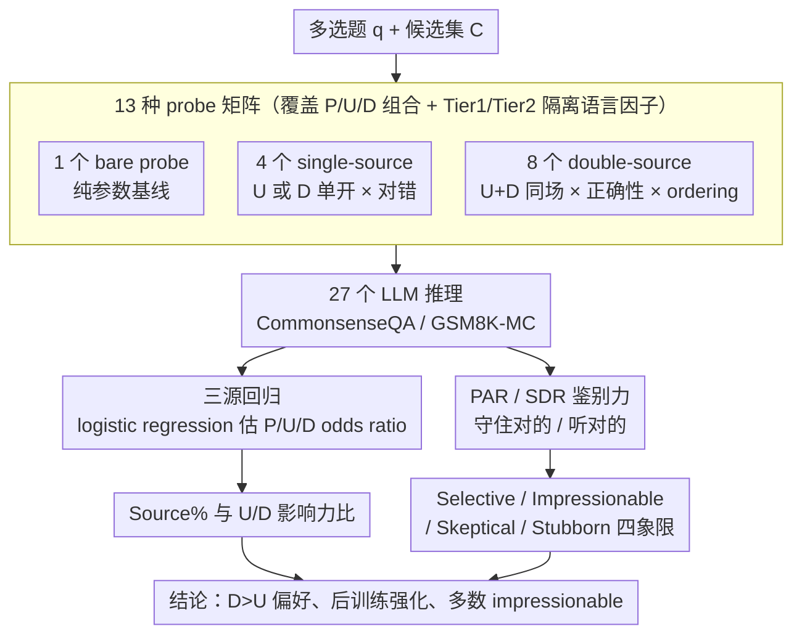

# How Large Language Models Balance Internal Knowledge with User and Document Assertions

**会议**: ACL 2026  
**arXiv**: [2604.22193](https://arxiv.org/abs/2604.22193)  
**代码**: https://github.com/shuowl/llm-source-balancing (有)  
**领域**: RAG / 知识冲突 / 阿谀  
**关键词**: 三源交互, 文档偏好, 阿谀, 鉴别力, 后训练影响

## 一句话总结
本文跳出"参数知识 vs 单一外部源"的二元冲突范式，提出"参数 / 用户主张 / 文档主张"三源交互评测框架，在 27 个 LLM × 2 数据集上发现：大多数模型对文档比对用户更轻信，后训练进一步强化这一偏好，且大部分模型属于"impressionable"——分不清外部信息是帮还是害。

## 研究背景与动机

**领域现状**：RAG 与 chat-based 系统让 LLM 必须同时与三类信息源交互 —— 自己参数里的知识 (P)、检索回来的文档 (D)、用户发来的主张 (U)。但已有研究只研究二元组合：P vs D（knowledge conflict）或 P vs U（sycophancy），从未把三者放在同一个统一框架下比较。

**现有痛点**：二元设置无法回答现实系统中最常见的问题 —— 当文档说一个答案、用户说另一个答案、模型自己又有第三个答案时，谁会赢？现有 sycophancy 与 knowledge conflict 文献各说各话，无法直接对比 U 与 D 的相对影响力。

**核心矛盾**：模型能力的"安全性"取决于它能否区分"helpful external info"和"harmful external info"，而不是单纯顺从或拒绝 —— 但绝大多数评测只测前者，把"易受影响"等同于"对齐良好"。

**本文目标**：(RQ1) 量化 P / U / D 三源的相对影响；(RQ2) 模型能否区分有益与有害的外部信息；(RQ3) 后训练 (SFT / RLHF) 如何改变三源偏好。

**切入角度**：把每道题构造为 13 种 probe variant（裸题 / 单源 4 种 / 双源 8 种），用 logistic regression 同时估计三个源的 odds ratio，再把它们归一化为"reliance ratio"，从而把 U 与 D 的影响力放到同一尺度比较。

**核心 idea**：用"控制 probe 设计 + 统计建模 + 选择行为分类"三层评测，把"模型对外部源的依赖"分解成"reliance"（在场就影响）与"discrimination"（区分有益有害）两个独立维度。

## 方法详解

### 整体框架

本文不训练新模型，而是搭一套评测流水线，把"一道多选题"放大成一组受控探针，量出参数知识 (P) / 用户主张 (U) / 文档主张 (D) 三股力量的拉扯。给定多选题 $q$ 与候选集 $\mathcal{C}$，先把 P / U / D 各自的"是否在场"和"说得对不对"排列组合成 13 个 probe variant，并用 Tier 1（统一模板）/ Tier 2（上下文相关）两套 assertion 控制语言复杂度这一干扰因子；再把这批探针喂给 27 个 LLM（GPT-4o、LLaMA3 系、Qwen3 系）在 CommonsenseQA 与 GSM8K-multiple-choice 上跑出答案。最后做三层递进分析——用 logistic regression 把宏观依赖比例拆出来，按选择行为给模型分类，再看外部信息如何漂移答案的概率分布。

### 关键设计

**1. 13 种 probe 矩阵：用最小代价覆盖所有源组合并隔离语言因子**

要把三股力量拆干净，第一步得系统覆盖每种源组合、又不引入额外噪声，这是整条流水线的输入。矩阵由三层构成：1 个 bare probe（无外部源）给出纯参数基线；4 个 single-source probe $v_{u^+}, v_{u^-}, v_{d^+}, v_{d^-}$ 单独打开用户主张 (U) 或文档主张 (D) 且分对错，用来干净测出模型只面对一个源时的反应、并喂给后面的鉴别力指标；8 个 double-source probe 把 U 与 D 同时摆上桌，覆盖两种正确性组合 × 两种先后 ordering，既造冲突场景又能测 positional bias。语言复杂度则用 Tier 1 / Tier 2 拆开——Tier 1 用统一模板硬套答案文本，Tier 2 由 GPT-4o 生成与题目上下文贴合的自然主张，从而把"措辞像不像真话"和"源本身的属性"两类干扰因子分离开。

**2. 三源回归：把三股影响力放到同一把尺子上**

探针跑完得到的是一堆答案对错，直接对比准确率只能告诉你"加了外部信息变好还是变坏"，却分不清这份影响来自"源在场"还是"源说对"。本文改用一个 logistic regression 同时估计三个源的边际效应：$\log \frac{p}{1-p} = \beta_0 + \beta_P P_i + \delta_U U_{pres} + \beta_U (U_{pres} \times U_{corr}) + \delta_D D_{pres} + \beta_D (D_{pres} \times D_{corr})$，其中 $\delta$ 项捕捉"在场"的影响、交互项捕捉"正确性"的影响。把系数指数化得到 odds ratio——Parametric OR $= e^{\beta_P}$、User OR $= e^{\delta_U + \beta_U}$、Doc OR $= e^{\delta_D + \beta_D}$，再归一化为 Source% $= \text{Source OR} / (P+U+D)$ 便于横向比较。最关键的是 U/D 影响力之比 $e^{(\delta_U + \beta_U) - (\delta_D + \beta_D)}$：这个比值 $<1$ 就意味着模型对文档比对用户更轻信，第一次让阿谀（信用户）和知识冲突（信文档）两条研究线落到同一坐标系里。

**3. PAR / SDR：把"对齐质量"细化成可测的鉴别力**

回归只回答了"模型在场时听不听"，但模型对外部信息言听计从并不等于对齐良好——真正的安全是"该听时听、该顶时顶"。本文在 single-source 探针上用两个条件概率刻画这种鉴别力：当源说错时模型能否守住正确的参数答案，$\text{PAR}^+_s = P(\hat{y}_{v_{s^-}, q} = \hat{y}_{v_{bare}, q} \mid \hat{y}_{v_{bare}, q} = y_q^*, y^{assert}_{v_{s^-}, q} \neq y_q^*)$；当参数错了而源说对时模型能否听话改正，$\text{SDR}^+_s = P(\hat{y}_{v_{s^+}, q} = y^{assert}_{v_{s^+}, q} \mid \hat{y}_{v_{bare}, q} \neq y_q^*, y^{assert}_{v_{s^+}, q} = y_q^*)$。以 $0.5$ 为阈值把模型钉进 Selective / Impressionable / Skeptical / Stubborn 四象限：只有 PAR 与 SDR 双高的 Selective 才真正可用，其余三类各有偏科——这正是 RAG 里"检索回一篇错文档就被带跑"的 impressionable 失败模式所在。

### 损失函数 / 训练策略

评测本身无训练损失。缓解实验里，作者用 SFT 在覆盖 U+D+ / U+D- / U-D+ / U-D- 四种源交互模式的数据上微调，让模型 PAR 与 SDR 同步上升——说明"在源冲突下该信谁"是可学习的，鉴别力不靠模型规模天生。

## 实验关键数据

### 主实验

| 发现 | 数据要点 | 说明 |
|---|---|---|
| 文档 > 用户偏好 | 大多数模型 U%/D% < 1 | 文档 OR 更高，模型更愿意听检索结果而不是用户 |
| 后训练强化偏好 | base / SFT / instruct 三阶段 U%/D% 持续下降 | post-training 让模型越来越"信文档" |
| 多数模型 impressionable | PAR$^+$ < 0.5 且 SDR$^+ \geq 0.5$ 占主流 | 听话但不会判断，外部错的也照搬 |
| SFT 可救 | 在多样化源交互数据上 SFT 后 PAR / SDR 同步上升 | 说明鉴别力是可学习的，不是模型规模天生 |

### 消融实验

| 配置 | 关键观察 | 说明 |
|---|---|---|
| Tier 1 vs Tier 2 assertion | 趋势一致，但 Tier 2 影响更大 | 语言复杂度本身也是依赖来源 |
| User-first vs Doc-first ordering | 趋势保持，量级小幅变化 | positional bias 真实存在但不改变 U<D 的总体方向 |
| GPT-4o / LLaMA3 / Qwen3 三族 | 文档偏好跨架构一致 | 不是某家训练数据的偶然产物，是训练范式的系统性结果 |
| Base → SFT → Instruct | U%/D% 一路下降 | 把后训练效应分解到阶段，定位偏好被哪个阶段放大 |

### 关键发现
- **"文档更可信"似乎来自训练偏置**：base 模型 U/D 接近平衡，instruct 模型严重偏向 D —— 暗示 SFT/RLHF 中"有引文/有证据"的样本可能教会了模型把文档源等同于权威。
- **大多数模型 impressionable**：它们既愿意采纳正确外部信息（高 SDR），也愿意采纳错误外部信息（低 PAR）—— 这正是 RAG 系统中"幻觉因为检索回来一篇错文档"的根因。
- **SFT 能同时提 PAR 和 SDR**：在涵盖 4 种源交互模式（U+D+ / U+D- / U-D+ / U-D-）的数据上微调，使模型学会"看源的对错而不是看源的身份"。
- **概率分布漂移分析**：KL 散度显示，外部信息会让正确答案的置信度被"挤走"——即便最终预测没变，模型对正确答案的内在 confidence 已经被外部主张稀释。

## 亮点与洞察
- **把 sycophancy 与 knowledge conflict 统一在一个框架**：之前两条研究线各说各话，本文用 logistic regression + odds ratio 把 U 与 D 放到同一尺度比较，是评测方法学上的清晰贡献。
- **U%/D% 这个简单比值非常实用**：可以直接作为 RAG / chat 系统上线前的"信任校准"指标，比单看准确率信息量大得多。
- **"impressionable" 概念可迁移**：四象限分类法可以套到任意"模型 vs 外部输入"的场景，比如 tool use、code review、医学问答等。

## 局限与展望
- **只测多选题**：开放生成中信息整合远更复杂，三源框架是否还成立未知。
- **U 和 D 都是单条 assertion**：现实 RAG 一次检索多篇文档、用户也有多轮对话，源内部的冲突未被建模。
- **没区分 "可信文档" 与 "不可信文档"**：所有文档主张都被等同对待，无法回答"模型对带 metadata 的文档源是否更愿意听"。
- **缓解方案只验证了 SFT**：DPO / RLHF / Constitutional AI 等更主流方案没对比，工业可复现路径需要补全。

## 相关工作与启发
- **vs Wu et al. 2024 (Context Dependence)**：他们只看 P vs context，本文把 context 拆成 U 和 D 两个独立带 attribution 的源，是真正的扩展。
- **vs Sharma et al. 2024 (Sycophancy)**：本文与 sycophancy 文献的 odds ratio 思路一致但用法不同 —— 本文同时估三个源、不是单独估 U。
- **vs Mallen et al. 2023 (Selective Trust)**：他们提议模型自己决定信参数还是信外部，本文把"信哪边"细化为可测量、可微调的 PAR/SDR。

## 评分
- 新颖性: ⭐⭐⭐⭐ 三源统一框架与 PAR/SDR 分类法在评测方法学上有清晰增量
- 实验充分度: ⭐⭐⭐⭐ 27 模型 × 2 数据集 × 13 probe × 双 Tier × 双 ordering，矩阵覆盖很完整
- 写作质量: ⭐⭐⭐⭐ 从宏观 OR 到中观选择行为再到微观概率分布，三层结构清晰
- 价值: ⭐⭐⭐⭐ U%/D% 与 PAR/SDR 可直接作为 RAG / chat 系统上线前的鉴别力 audit 指标

<!-- RELATED:START -->

## 相关论文

- [\[ACL 2026\] How Retrieved Context Shapes Internal Representations in RAG](how_retrieved_context_shapes_internal_representations_in_rag.md)
- [\[ACL 2026\] RiTeK: A Dataset for Large Language Models Complex Reasoning over Textual Knowledge Graphs in Medicine](ritek_a_dataset_for_large_language_models_complex_reasoning_over_textual_knowled.md)
- [\[ACL 2026\] Navigating Large-Scale Document Collections: MuDABench for Multi-Document Analytical QA](navigating_large-scale_document_collections_mudabench_for_multi-document_analyti.md)
- [\[ICLR 2026\] Query-Level Uncertainty in Large Language Models](../../ICLR2026/information_retrieval/query-level_uncertainty_in_large_language_models.md)
- [\[ICLR 2026\] TokMem: One-Token Procedural Memory for Large Language Models](../../ICLR2026/information_retrieval/tokmem_one-token_procedural_memory_for_large_language_models.md)

<!-- RELATED:END -->
