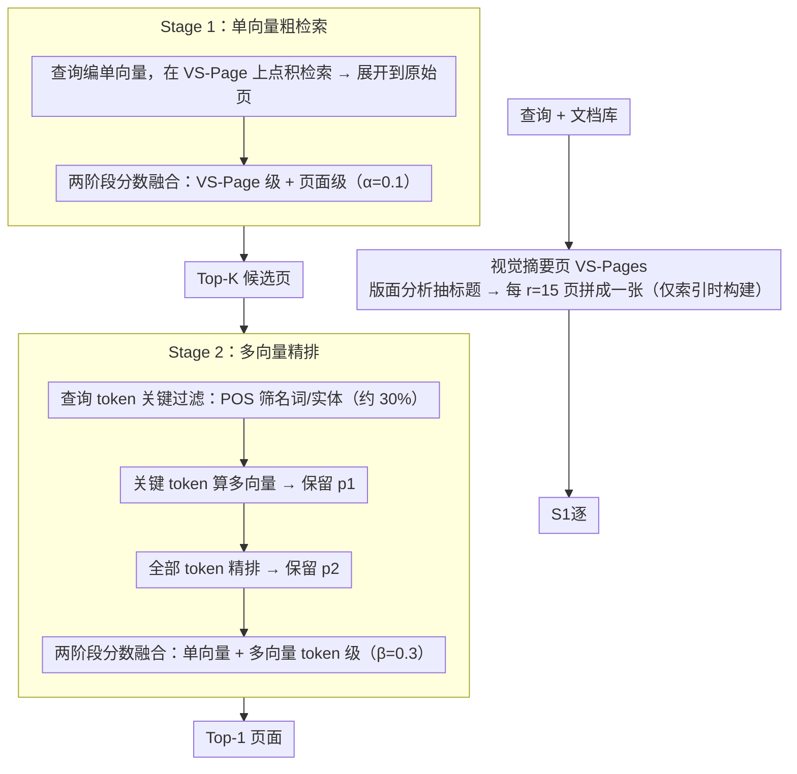

# Hybrid-Vector Retrieval for Visually Rich Documents: Combining Single-Vector Efficiency and Multi-Vector Accuracy

**会议**: ACL 2026 Findings  
**arXiv**: [2510.22215](https://arxiv.org/abs/2510.22215)  
**代码**: [https://github.com/juyeonnn/HEAVEN](https://github.com/juyeonnn/HEAVEN)  
**领域**: 信息检索  
**关键词**: 视觉文档检索, 混合向量检索, 效率-精度权衡, 视觉摘要页, 查询token过滤

## 一句话总结

HEAVEN 提出了一种即插即用的两阶段混合向量框架，通过视觉摘要页（VS-Pages）加速单向量粗检索 + 基于词性的查询 token 过滤减少多向量重排序计算，在四个基准上保持 99.87% 的多向量 Recall@1 同时减少 99.82% 的每查询 FLOPs。

## 研究背景与动机

**领域现状**：视觉文档检索（VDR）是 RAG 的核心组件，当前方法分为两大范式——单向量检索（高效但粗糙）和多向量检索（准确但计算昂贵），二者存在显著的效率-精度权衡。

**现有痛点**：
- 单向量方法（如 DSE）每查询仅需一次点积但丢失细粒度信息，Recall@1 差距大（如 ViMDoc 上比多向量低 22.5%）
- 多向量方法（如 ColQwen2.5）需计算所有 query token 与所有 page patch 的交互，FLOPs 高出数百倍
- 现有效率优化（patch pooling/pruning）在压缩比增大时性能急剧下降

**核心矛盾**：单向量方法在粗粒度检索（大 K）时已足够好（Recall@200 只差 0.63%），但精细检索时不够；多向量方法精度高但计算开销不可接受。

**本文目标**：设计一个框架，在几乎不损失多向量检索精度的前提下，将每查询计算量降低数个数量级。

**切入角度**：利用两个经验观察——(1) 单向量检索在大候选集时可接受；(2) 查询中约 70% 的 token 是停用词等冗余信息——设计两阶段级联过滤。

**核心 idea**：先用单向量 + 视觉摘要页快速缩小候选范围，再用多向量 + 查询关键 token 精细重排序，实现即插即用的混合检索。

## 方法详解

### 整体框架

HEAVEN 要解决的是视觉文档检索里“单向量快但粗、多向量准但贵”的效率-精度牵扯，思路是把两者串成一条从粗到细的级联流水线。输入查询后，Stage 1 用单向量模型（如 DSE）在压缩过的视觉摘要页（VS-Pages）上高效粗检索、快速缩小到一个小候选页面集；Stage 2 再用多向量模型（如 ColQwen2.5）只拿查询中的关键 token 对这个小候选集做精细重排。两个阶段的编码器即插即用、可独立替换，无需额外训练，最终在几乎不损多向量精度的前提下把每查询计算量压下几个数量级。

### 关键设计

**1. 视觉摘要页（VS-Pages）：把多页压成一页再检索**

文档里大量页面是 logo、页眉等重复 / 无信息内容，真正对检索有用的只是标题等关键布局，逍页跑单向量是浪费。HEAVEN 用版面分析（DocLayout-YOLO）从每页抽出标题布局，把多页（默认 $r=15$ 页）的标题布局裁剪拼合成一张摘要页，先在 VS-Page 级别检索再展开到原始页面，使单向量阶段的比较次数降为原来的 $1/r$ 量级。关键是 VS-Pages 仅在索引时构建一次，不增加任何查询时开销。

**2. 查询 token 关键过滤：只拿名词去算多向量**

多向量重排的贵在于要算所有 query token 与所有 page patch 的交互，但查询里约 70% 的 token 是停用词等冗余信息、几乎不贡献检索信号。HEAVEN 用词性标注（POS tagging）筛出查询中的关键 token（名词、命名实体等，约占 30%），先仅用这批关键 token 计算多向量相似度做初步重排（保留 $p_1$），再用全部 token 对精筛后的小候选集（保留 $p_2$）做最终排序。实验证明仅用关键 token 的效果与用全部 token 相当，且明显优于随机选同等数量的 token。

**3. 两阶段分数融合：不同粒度的信号互补**

文档级、页面级、token 级的检索信号各有侧重，只用一种会丢信息。HEAVEN 在 Stage 1 里融合 VS-Page 级别（提供文档级信息）与页面级别（提供精细定位）的单向量分数，权重 $\alpha=0.1$；在 Stage 2 最终排序里融合单向量分数与多向量 token 级匹配分数，权重 $\beta=0.3$。消融显示去掉任一级融合都会明显掉精度，说明三种粒度确实互补。

### 一个完整示例

以一次查询 “What was the revenue growth in Q3?” 为例：索引阶段已把要检索的文档按每 15 页拼成若干张 VS-Page；Stage 1 把查询编成单向量，先在 VS-Page 上点积粗检索、再展开到原始页面并以 $\alpha=0.1$ 融合两级分数，留下 Top-$K$ 候选页。进到 Stage 2，POS 标注从查询里筛出关键 token“revenue / growth / Q3”，先用它们算多向量相似度把 $K$ 个候选压到 $p_1$，再用全部 query token 对这批做精排并以 $\beta=0.3$ 融入单向量分数，输出最终的 Top-1 页面。整个过程中昂贵的多向量交互只作用在 $K$ 个候选页 × 30% 的 token 上，这是 FLOPs 降两个数量级的来源。

### 损失函数 / 训练策略

HEAVEN 是无训练的即插即用框架，不需要额外训练。两个阶段的编码器使用现成预训练模型（Stage 1 用 DSE，Stage 2 用 ColQwen2.5），可直接替换为更强的模型。

## 实验关键数据

### 主实验

| 数据集 | 指标 | HEAVEN | ColQwen2.5 (多向量SOTA) | 性能保持 / FLOPs 降低 |
|--------|------|--------|----------|------|
| ViMDoc | R@1 | 71.05% | 71.13% | 99.88% / -99.88% |
| OpenDocVQA | R@1 | 71.56% | 72.63% | 98.52% / -99.89% |
| ViDoSeek | R@1 | 75.04% | 75.57% | 99.30% / -98.50% |
| M3DocVQA | R@1 | 59.31% | 57.99% | **102.27%** / -99.81% |
| **平均** | R@1 | 69.24% | 69.33% | **99.87% / -99.82%** |

### 消融实验

| 配置 | 关键影响 | 说明 |
|------|---------|------|
| w/o VS-Pages | FLOPs 显著增加 | 需比较所有原始页面 |
| w/o 候选精修 | 性能严重下降 | VS-Page→页面的分数融合很关键 |
| w/o 查询token过滤 | FLOPs 增加 | 冗余查询token带来不必要计算 |
| w/o 重排序精修 | 性能显著下降 | 单/多向量分数融合互补 |

### 关键发现
- 在 M3DocVQA 上 HEAVEN 甚至超越了完整的 ColQwen2.5（+2.27% R@1），因为 VS-Page 的文档级信号有帮助
- Stage 1 单独已超越 DSE（+1.74% 平均 R@1，-49.31% FLOPs），VS-Pages 压缩有效
- 仅用 ~30% 的关键查询 token 即可匹配全 token 多向量性能，且优于随机选同量 token
- 与 patch pooling/pruning 等效率优化对比，HEAVEN 在相同 FLOPs 下精度显著更高

## 亮点与洞察
- 即插即用设计非常实用：无需额外训练，两阶段编码器可独立替换升级
- VS-Pages 的思路巧妙：通过版面分析提取关键布局 → 拼成摘要页 → 减少检索对象数量，仅索引时一次性构建
- 从查询侧过滤 token（而非文档侧压缩 patch）是一个相对被忽视但有效的优化方向
- 附带提出了 ViMDoc 基准，填补了多文档 + 长文档视觉检索评测的空白

## 局限与展望
- VS-Pages 依赖版面分析工具（DocLayout-YOLO）的质量，对非标准版面文档可能效果受限
- 查询 token 过滤基于词性标注，对非英语语言的效果需验证
- 目前默认超参数针对英文文档调优，跨语言/跨领域的泛化性有待考察
- 两阶段级联设计引入了系统复杂度和多个超参数（α, β, p1, p2, K, r）

## 相关工作与启发
- **vs ColQwen2.5（纯多向量）**: HEAVEN 保持 99.87% 的 R@1 同时减少 99.82% FLOPs
- **vs DSE（纯单向量）**: HEAVEN 在 Stage 1 即超越 DSE，VS-Pages 有效压缩搜索空间
- **vs Patch Pooling/Pruning**: 从文档侧压缩 vs 从查询侧过滤，HEAVEN 效率-精度权衡更优

## 评分
- 新颖性: ⭐⭐⭐⭐ 两阶段混合 + VS-Pages + 查询侧过滤的组合设计独到
- 实验充分度: ⭐⭐⭐⭐⭐ 四个基准、多组对比、消融、效率分析、超参分析、即插即用验证均完备
- 写作质量: ⭐⭐⭐⭐ 结构清晰，观察→方法→验证的逻辑链完整

<!-- RELATED:START -->

## 相关论文

- [\[ACL 2026\] Prune-then-Merge: Towards Efficient Multi-Vector Visual Document Retrieval](sculpting_the_vector_space_towards_efficient_multi-vector_visual_document_retrie.md)
- [\[ICML 2026\] LEMUR: Learned Multi-Vector Retrieval](../../ICML2026/information_retrieval/lemur_learned_multi-vector_retrieval.md)
- [\[ICML 2025\] POQD: Performance-Oriented Query Decomposer for Multi-Vector Retrieval](../../ICML2025/information_retrieval/poqd_performance-oriented_query_decomposer_for_multi-vector_retrieval.md)
- [\[CVPR 2025\] VDocRAG: Retrieval-Augmented Generation over Visually-Rich Documents](../../CVPR2025/information_retrieval/vdocrag_retrieval-augmented_generation_over_visually-rich_documents.md)
- [\[ACL 2026\] Why These Documents? Explainable Generative Retrieval with Hierarchical Category Paths](why_these_documents_explainable_generative_retrieval_with_hierarchical_category_.md)

<!-- RELATED:END -->
