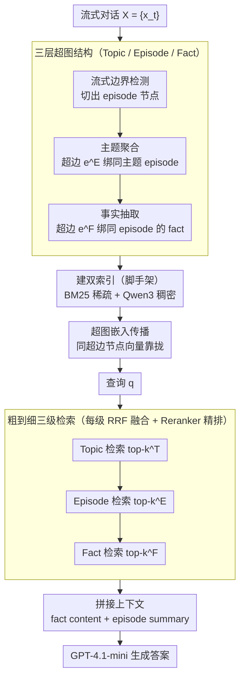

<!-- 由 src/gen_stubs.py 自动生成 -->
# HyperMem: Hypergraph Memory for Long-Term Conversations

**会议**: ACL 2026  
**arXiv**: [2604.08256](https://arxiv.org/abs/2604.08256)  
**代码**: 将开源（论文脚注声明 "source code is about to be released"）  
**领域**: 长期对话记忆 / Agentic Memory / 检索增强生成（RAG）  
**关键词**: 超图记忆, 三层架构, 高阶关联, 粗到细检索, LoCoMo

## 一句话总结
HyperMem 用"超图（hyperedge 连接 ≥3 个节点）"代替传统 RAG 的 pairwise 边，把长期对话记忆组织成"主题 → 情节 → 事实"三层结构，通过粗到细检索 + 超图嵌入传播解决多 episode 跨时间相关性的检索碎片化问题，在 LoCoMo benchmark 上 LLM-as-judge 准确率打到 92.73%（前 SOTA 86.49%）。

## 研究背景与动机

**领域现状**：对话 agent 的固定 context window 容纳不下数月的对话历史，需要长期记忆模块。当前主流方案分两类：(1) RAG 类（GraphRAG / LightRAG / HippoRAG2 / HyperGraphRAG）用 chunk 或图结构存外部知识；(2) Memory system 类（MemoryBank / A-Mem / Mem0 / Zep / MIRIX / MemOS）专门给对话场景做层级化记忆。

**现有痛点**：两类方法都**只用 pairwise（两两）关系**——chunk RAG 是 chunk-chunk 检索，graph RAG 是 entity-entity 边。但对话中真正重要的关联往往是**高阶（high-order）的**——比如一个用户的"运动"主题可能涉及 7 次不同时间的对话片段（episode 1, 3, 4, ...），每个 episode 里又散落多个事实（什么运动、和谁、什么时间、成绩）。pairwise 边无法显式表达"这一组 episode 共同属于一个主题"，导致检索碎片化，多跳推理掉点严重。

**核心矛盾**：对话记忆的**联合依赖（joint dependency）本质是高阶**，但现有数据结构（图 / 树）只支持二元关系。即使是 RAPTOR / SiReRAG / HiRAG 这种树形索引，节点之间仍然是层级边（父子两两关系），不能显式 group。

**本文目标**：(1) 找一个能表达 ≥3 个节点联合关联的结构；(2) 用这个结构组织出 topic / episode / fact 三层语义粒度；(3) 设计粗到细检索策略，先定位 topic 再展开到 fact。

**切入角度**：超图（hypergraph）的 hyperedge 可以连接任意数量的节点，天然适合"把同主题的多个 episode 绑成一个组"。这与人类记忆的联想性质（associative memory，Anderson & Bower）吻合。

**核心 idea**：用 hyperedge 显式 group 同主题 episode + 同 episode 的 fact，把碎片化对话内容统一为 coherent unit；再加超图嵌入传播让同 hyperedge 内节点共享语义；最后用 topic→episode→fact 的粗到细检索 + RRF 融合 + reranker 出最终上下文。

## 方法详解

### 整体框架

HyperMem 把流式对话 $X = \{x_t\}_{t=1}^T$ 离线组织成一张"主题—情节—事实"三层超图，在线再用粗到细检索为查询 $q$ 拼出上下文交给 LLM 作答。离线构建分三步走：先让 LLM 做流式边界检测，把对话切成语义完整的 episode 节点 $v^E = (v^E_{\text{dialogue}}, v^E_{\text{title}}, v^E_{\text{episode}})$；再让每个新 episode 检索历史相似 episode，按「初始化 / 新建 / 更新主题」三种 case 聚成 topic 并用超边 $e^E_t \in \mathcal{E}^E$ 把同主题的所有 episode 绑成一组；最后从每个 episode 抽出原子 fact $v^F = (v^F_{\text{content}}, v^F_{\text{potential}}, v^F_{\text{keywords}})$（`potential` 预判这条 fact 能回答哪类 query，`keywords` 供 BM25 召回），用超边 $e^F$ 把同 episode 的 fact 绑成一组。构建完每个节点同时建 BM25 sparse + Qwen3-Embedding-4B dense 双索引，并做一次超图嵌入传播让远距离的同主题 episode 在向量空间靠拢。在线检索沿 Topic→Episode→Fact 逐级展开，每级先 RRF 融合 sparse/dense 排名再过 Qwen3-Reranker-4B 精排，依次取 top-$k^T{=}10$、$k^E{=}10$、$k^F{=}30$，最终把 fact 的 content 与 episode 的 summary 拼成 context 喂给 GPT-4.1-mini 生成答案。

### 关键设计

**1. 三层超图结构（Topic / Episode / Fact）：把两两关系升级成多对多的联合关联**

传统 GraphRAG 在 Multi-hop 上掉点，根子在于"两个事实同属一个事件"这种高阶关系无法编码——只能让它们各自指向同一个 entity 间接搭线，而 entity 一旦不在查询里这条线就断了。HyperMem 把记忆形式化为 $\mathcal{H} = (\mathcal{V}^T \cup \mathcal{V}^E \cup \mathcal{V}^F, \mathcal{E}^E \cup \mathcal{E}^F)$：超边 $\mathcal{E}^E$ 直接把同主题的所有 episode 圈进一组、$\mathcal{E}^F$ 把同 episode 的所有 fact 圈进一组，每条超边上还挂着 LLM 给的重要性权重 $w_{e,v} \in [0,1]$。三层各司其职——Topic 是可跨周跨月的语义锚点，Episode 是时间连续的事件段，Fact 是原子可检索单元——于是一个 topic 超边就能一次性拉出某个用户在 10 个月里 7 次比赛的全部提及，而不必依赖某个恰好出现在查询中的实体。

**2. 超图嵌入传播（Hypergraph Embedding Propagation）：让同超边节点在向量空间互相靠拢**

单凭 BM25 + 原始 dense 看不到 topic 级的 grouping，语义相关但时间相隔很远的 episode 在向量空间往往各自为政。HyperMem 借鉴 HGNN（Feng et al., 2019）但做成极简的一步前向：先按权重 softmax 聚合出超边嵌入 $\bm{h}_e = \sum_v \alpha_{e,v} \bm{h}_v$（其中 $\alpha_{e,v} = \exp(w_{e,v}) / \sum_u \exp(w_{e,u})$），再回写到节点 $\bm{h}'_v = \bm{h}_v + \lambda \cdot \text{Agg}_{e \in \mathcal{N}(v)}(\bm{h}_e)$，默认 $\lambda = 0.5$。这等于给"同超边语义共享"加了一条软约束，查询命中一个 episode 后能顺势把同主题的其他 episode 也拉近一步，而整个过程无需任何训练参数。

**3. 粗到细三级检索 + RRF 融合 + Reranker 精排：层层剪枝，既缩搜索空间又保住主题 coherence**

直接在上万条 fact 里排序会噪声爆炸、丢失主题连贯性，单层 chunk RAG 又信息密度太低。HyperMem 把检索拆成 Topic→Episode→Fact 三级，每级都走"BM25 + dense → RRF 融合 → reranker"同一条流水线：RRF 用 $\text{RRF}(d) = \sum_{m=1}^M 1/(k + \text{rank}_m(d))$ 把两个 ranker 的 rank 倒数相加，绕开原始分数尺度不一致的问题。先排出 top-$k^T$ 个 topic，顺着它们的超边展开 episode 候选排出 top-$k^E$，再顺着 episode 的超边展开 fact 排出 top-$k^F$，最终 context 由 top facts 的 `content` 与 top episodes 的 `summary` 拼成。这套"先定位话题再找证据"的顺序贴合人类回忆方式，也是 token 效率的关键——HyperMem 仅用 7.5× tokens 就拿到 92.73%，而 GraphRAG 烧到 35.3× tokens 也只有 67.6%。

### 损失函数 / 训练策略
本方法**无监督训练**——所有节点构建、hyperedge 权重、boundary 检测均由 LLM zero-shot 完成（GPT-4.1-mini 生成 answer，Qwen3 系列负责 embedding/rerank）。超图嵌入传播是闭式一步前向，无需训练参数。3 次独立运行取平均，超参 $\lambda = 0.5$, $k^T = k^E = 10$, $k^F = 30$。

## 实验关键数据

### 主实验（LoCoMo benchmark，LLM-as-judge accuracy %，judge = GPT-4o-mini）

| 方法 | Single-hop | Multi-hop | Temporal | Open Domain | Overall |
|------|-----------|-----------|----------|-------------|---------|
| GraphRAG | 79.55 | 54.96 | 50.16 | 58.33 | 67.60 |
| LightRAG | 86.68 | 84.04 | 60.75 | 71.88 | 79.87 |
| HippoRAG 2 | 86.44 | 75.89 | 78.50 | 66.67 | 81.62 |
| HyperGraphRAG | 90.61 | 80.85 | 85.36 | 70.83 | 86.49 |
| Mem0 / Mem0g | 67.13 / 65.71 | 51.15 / 47.19 | 55.51 / 58.13 | 72.93 / 75.71 | 66.88 / 68.44 |
| MIRIX (GPT-4.1-mini) | 85.11 | 83.70 | 88.39 | 65.62 | 85.38 |
| MemOS | 81.09 | 67.49 | 75.18 | 55.90 | 75.80 |
| **HyperMem (Ours)** | **96.08** | **93.62** | **89.72** | 70.83 | **92.73** |

整体 SOTA，Single-hop +5.5、Multi-hop +9.6、Temporal +1.3、Overall +6.2（vs. HyperGraphRAG）。Open Domain 仍受限于"对话外部知识"问题。

### 消融实验

| 配置 | Overall | $\Delta$ |
|------|---------|----------|
| HyperMem (Full) | **92.66** | – |
| w/o FC（Fact Context） | 91.75 | −0.91 |
| w/o EC（Episode Context） | 88.90 | **−3.76** |
| w/o TR（Topic Retrieval，从 Episode 开始） | 91.94 | −0.72 |
| w/o TR & FC | 91.75 | −0.91 |
| w/o TR & EC | 88.83 | −3.83 |
| w/o TR & ER（只用 Fact 检索，拍平层级） | 90.19 | −2.47 |

### 关键发现
- **Episode context 最关键**：去掉 EC 掉 3.76%，对 Temporal 类问题掉 5.61%——episode 的时间连续性是跨 session reasoning 的支柱，单纯 fact 没有时间锚。
- **完全拍平层级到 Fact-only 在 Multi-hop 上掉 5.68%**，证明粗到细检索确实在做有效的"早期剪枝 + coherence 保留"，而非只是层级噱头。
- **Topic top-k 最敏感**：$k=1$ 时只 76.88%，$k=10$ 时 92.66%（+15.78%），说明 topic 召回的覆盖度是性能瓶颈；episode top-k 反而几乎不敏感（k=10 vs k=20 只差 0.26%），fact top-k 在 30 之后开始引入噪声。
- **Token 效率**：HyperMem 在 7.5× tokens（以 Mem0 为 1×）拿 92.73%，"Fact Only" 配置在 2.5× tokens 已经 89.48%，对比 HyperGraphRAG 26.3× tokens 才 86.49%——超图组织带来的 token 效率优势是数量级的。
- **Case study**：在 "Nate 赢了几场比赛" 这种 Multi-hop（10 个月 7 个 session）问题上，GraphRAG 因 pairwise 边碎片化只能答 "at least two"，HyperMem 通过 topic hyperedge 一次把 7 个 episode 拉出来精确回答 "seven tournaments"。

## 亮点与洞察
- **"hyperedge 显式 group"是对 RAG 范式的范式级改进**：之前所有 GraphRAG 改进都在"加更精细的 entity / relation / path"，本质还是 pairwise；HyperMem 直接换数据结构，让"高阶联合依赖"成为一等公民，这是 RAG 第一性原理上的提升。Multi-hop +9.6 的提升是最直接的证据。
- **三层粒度（Topic / Episode / Fact）+ 时间 / 主题双锚**正好对应人类对话记忆的认知层级——主题是长期语义、episode 是事件单元、fact 是细节，这种切法在 cognitive science 上有理论支撑（Anderson & Bower），也解释了为什么 Temporal 问题能 89.72%。
- **`potential` 字段（fact 节点预测自己能回答的 query 类型）**是个很实用的 trick：把 reverse query alignment 在索引阶段做掉，相当于给 fact 加上 query-side 的语义索引，提升查询命中率。这个思路可以反过来用在搜索引擎的 document expansion。
- **粗到细 + RRF + Reranker 三连**是一个很可复用的检索 pipeline 模板——RRF 解决 sparse/dense 分数尺度问题，reranker 解决 RRF 召回不够精的问题，分层解决候选爆炸问题，每一步都有明确职责。
- **超图嵌入传播无需训练**就能拿性能，证明"结构上的拓扑信息"本身就是强信号，不一定要 HGNN 那种复杂的 message passing。

## 局限与展望
- 作者承认：**单用户假设**，多用户/多 agent 场景下需要访问控制、记忆隔离机制；Open Domain 问题仍弱（70.83%），需要接外部知识库。
- 自己看到的：**完全依赖 LLM 做 boundary detection、topic aggregation、fact extraction**——构建一个用户的记忆需要大量 LLM 调用，成本和延迟在大规模部署下都是问题，论文也没给完整的离线构建时间。
- **超图传播只做一次**（$\lambda = 0.5$, 一步），相比 HGNN 多层传播是简化版，可能没充分利用 hyperedge 的高阶结构；但作者把"简单"当卖点，没有 ablate 多层传播。
- **依赖 GPT-4.1-mini 生成 + GPT-4o-mini 评判**，存在评判模型偏差风险；MIRIX 也用 GPT-4.1-mini 做对比相对公平，但其他 baseline 用 GPT-4o-mini judge 可能有评判偏好。
- **没有展示在线增量更新的开销**——三个 Algorithm 看起来都是 batch 离线构建，但实际对话是流式的，每来一个 episode 是否要重建 topic / 重传播 embedding？

## 相关工作与启发
- **vs HyperGraphRAG (Luo et al., 2025)**：HyperGraphRAG 也用超图，但用于静态 KB 上的多实体关系；HyperMem 把它搬到**动态演化的对话记忆**场景，加上 topic/episode/fact 三层 + 粗到细检索，是适配 agent memory 的版本。
- **vs RAPTOR / SiReRAG / HiRAG**：这些是 tree-structured 多粒度索引，节点之间仍是父子（pairwise）边；HyperMem 用 hyperedge 替代树边，允许一个 fact 属于多个主题（多 hyperedge 重叠），更灵活。
- **vs Mem0 / A-Mem / Zep**：这些 memory system 主要做 graph-based 持久化和事实演化追踪，pairwise 关系；HyperMem 在结构上更进一步，并且在 LoCoMo 上把 Mem0g 的 68.44% 拉到 92.73%，提升幅度巨大。
- **vs MIRIX**：MIRIX 是 multi-agent 共享 memory，HyperMem 是单 agent 高阶记忆；二者其实正交，未来可以结合（每个 agent 内部用 HyperMem，跨 agent 用 MIRIX 共享）。
- **启发**：超图思路完全可以迁移到代码库索引（一个 commit 涉及多文件 = hyperedge）、推荐系统（一次购物清单涉及多 item = hyperedge）、医学知识图（一个症状涉及多疾病多检查 = hyperedge）。

## 评分
- 新颖性: ⭐⭐⭐⭐ 把超图首次系统性引入对话 memory 系统，三层架构 + 粗到细检索的组合是新颖的范式级改进。
- 实验充分度: ⭐⭐⭐⭐⭐ 与 14 个 baseline 在 4 类问题上对比，详细消融 + 超参敏感性 + 效率分析 + 4 类 case study，覆盖度极高。
- 写作质量: ⭐⭐⭐⭐⭐ 结构非常清晰，Figure 1 一张图就把贡献点说清楚，方法 / 实验 / 算法伪代码完整，易于复现。
- 价值: ⭐⭐⭐⭐⭐ 92.73% 在 LoCoMo 上是大幅 SOTA，且 token 效率好（7.5× vs HyperGraphRAG 26.3×），对话 agent 产品可直接落地。

<!-- RELATED:START -->

## 相关论文

- [\[ICLR 2026\] AMemGym: Interactive Memory Benchmarking for Assistants in Long-Horizon Conversations](../../ICLR2026/information_retrieval/amemgym_interactive_memory_benchmarking_for_assistants_in_long-horizon_conversat.md)
- [\[ICML 2026\] HGMem: Hypergraph-based Working Memory to Improve Multi-step RAG for Long-Context Complex Relational Modeling](../../ICML2026/information_retrieval/hgmem_hypergraph-based_working_memory_to_improve_multi-step_rag_for_long-context.md)
- [\[AAAI 2026\] Mem-PAL: Towards Memory-based Personalized Dialogue Assistants for Long-term User-Agent Interaction](../../AAAI2026/information_retrieval/mem-pal_towards_memory-based_personalized_dialogue_assistants_for_long-term_user.md)
- [\[ACL 2026\] VideoStir: Understanding Long Videos via Spatio-Temporally Structured and Intent-Aware RAG](videostir_understanding_long_videos_via_spatio-temporally_structured_and_intent-.md)
- [\[AAAI 2026\] ComoRAG: A Cognitive-Inspired Memory-Organized RAG for Stateful Long Narrative Reasoning](../../AAAI2026/information_retrieval/comorag_a_cognitive-inspired_memory-organized_rag_for_stateful_long_narrative_re.md)

<!-- RELATED:END -->
