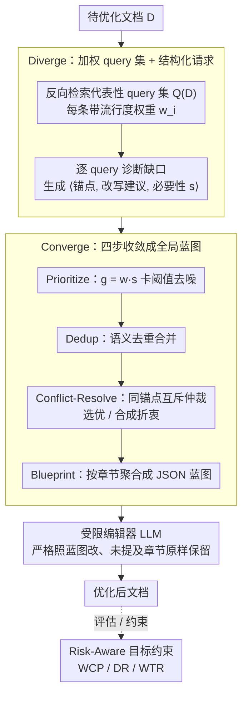

# IF-GEO: Conflict-Aware Instruction Fusion for Multi-Query Generative Engine Optimization

**会议**: ACL 2026  
**arXiv**: [2601.13938](https://arxiv.org/abs/2601.13938)  
**代码**: 论文未声明（截至接收）  
**领域**: 信息检索 / 生成式搜索引擎优化 (GEO) / RAG  
**关键词**: GEO、生成式搜索、多查询优化、冲突感知指令融合、风险感知稳定性

## 一句话总结
本文把"为多条潜在查询同时优化一篇文档"视为受限多目标优化问题，提出 IF-GEO："先发散后收敛"——先用 LLM 反向挖掘代表性 query 并生成结构化编辑请求，再通过 **优先级×必要性打分 + 去重 + 冲突解决 + Global Revision Blueprint** 把多个互相打架的编辑指令融合成一份可执行的修改蓝图，并配套引入 WCP/DR/WTR 三项 risk-aware 稳定性指标；在 GEO-Bench 上把 objective overall 从 Auto-GEO 的 7.59 推到 11.03，同时把最坏单查询跌幅从 -0.0511 降至 -0.0090。

## 研究背景与动机

**领域现状**：生成式搜索引擎（GSE，如 ChatGPT Search、Perplexity）正在取代传统排序型搜索引擎，能见度（visibility）不再取决于排名，而取决于"是否被 LLM 选中并引用进答案"。"Generative Engine Optimization (GEO)" 由 KDD'24 提出，专门通过改写文档内容来提升其在生成回答中的曝光。

**现有痛点**：现有方法（GEO 的 9 条启发式规则、Auto-GEO 偏好规则、RAID 单一意图轨迹）都把多查询能见度问题当成**一维**优化——只奔一个目标改文档；但现实中同一篇文档要同时满足 3-5 条异质 query（如"什么是 X" / "X 的优缺点" / "X 的用法"），它们在有限的内容预算下经常**互相冲突**：往 A 里塞例子可能挤掉 B 想要的统计数据。

**核心矛盾**：以"均值"或"单一聚合意图"做优化目标，会把真正的失败模式——少数 query 大幅退化——掩盖在均值变好的表象下；而启发式方法（如"加引用"）虽然均值正向，却无法处理 query-level 的 trade-off。

**本文目标**：(a) 提出一个能"先生成发散指令再收敛融合"的框架；(b) 建立显式的 risk-aware 评估协议（WCP/DR/WTR）把"尾部退化"度量出来。

**切入角度**：把每条候选 query 都视为一个独立的"利益相关方"，让 LLM 先各自提编辑请求（带必要性打分），再由一个"协调器"对全局打分排序、去重、冲突仲裁；最终输出按文档章节聚合的 JSON 蓝图，作为后续改写的强约束契约。

**核心 idea**：用"diverge-then-converge + conflict-aware instruction fusion"代替"一个 query 一次改写"——把多目标优化的协调器搬到 LLM 编辑环节里。

## 方法详解

### 整体框架

IF-GEO 是一条纯 LLM-API 流水线（同款 GPT-4o-mini 跑所有调用），输入一篇待优化文档 $D$、输出一份按蓝图改好的文档，核心是"先发散后收敛"两个 Phase。Phase I（Diverge）先让 LLM 当"搜索分析师"对 $D$ 反向检索出加权代表性 query 集合 $Q(D) = \{(q_i, w_i)\}_{i=1}^m$（$w_i \in [0,100]$ 为流行度打分、禁止 paraphrase），再对每个 $q_i$ 独立诊断"文档缺什么"，生成结构化请求 $r_{i,j} = \langle e_{i,j}, u_{i,j}, s_{i,j} \rangle$（锚点片段 $e_{i,j}$、改写建议 $u_{i,j}$、G-EVAL 风格的必要性打分 $s_{i,j} \in [0,100]$）。Phase II（Converge）把这堆互相打架的请求收敛成一份蓝图：按全局优先度 $g_{i,j} = w_i \cdot s_{i,j}$ 卡阈值去噪、语义去重，再对同锚点互斥请求做冲突仲裁，把保留指令按文档**章节**聚合成有序 JSON 蓝图，最后交给一个"受限编辑器"LLM 严格照蓝图改、未提及章节原样保留。整套优化在最大化期望能见度 $\mathbb{E}[\Delta v]$ 之外，还把 WCP / DR / WTR 三项稳定性指标作为同等重要的约束写进目标函数。

### 关键设计

**1. Diverge——加权代表性 query 集合 + 必要性打分的结构化请求：把"为不同 query 服务"的需求显式化、可比较化**

传统 GEO 一上来就把多个 query 的需求糊成一个"engine preference"去优化，query 之间的差异被抹平，后续也就无从"看见冲突"。IF-GEO 反过来用反向检索（而非 paraphrase）逼近真实潜在用户分布得到 $Q(D)$，并让 LLM 打两套相互独立的分数：$w_i$ 衡量某条 query 在整体用户中的重要性，$s_{i,j}$ 衡量某条编辑对该 query 的关键程度。二者乘积 $g_{i,j} = w_i \cdot s_{i,j}$ 把"模糊的优化意图"翻译成一个可排序、可比较的全局优先度，直接驱动后面的融合与仲裁，让每条 query 都成为一个能各自提请求的"利益相关方"。

**2. Converge——Prioritize → Dedup → Conflict-Resolve → Blueprint 四步收敛：把发散的 request pool 拧成一份可执行的全局修改蓝图**

发散阶段产出的请求往往噪声多、意图重叠、还在同一段落上彼此互斥，直接逐条 patch 会出现"同一段被改了又改最终覆盖掉"的灾难。收敛阶段先用 $g_{i,j}$ 卡阈值剔掉低价值请求，再语义去重把意图相近的合并为沿用最高分的 meta-request；对仍然互斥的请求不走硬阈值，而是交给 LLM 做"semantic 仲裁"——$g$ 值差距大就 Selection 选优、相近就 Synthesis 合成折衷指令；最后**按章节而非按 query** 把指令重排成 JSON 蓝图，把"如何改一篇文档"从串行打补丁变成按 section 一次性改完。消融印证了这一步的分量：去掉冲突解决后 Mean 从 9.24 直接跌到 6.14，是所有消融里跌幅最大的。

**3. Risk-Aware Stability Objective（WCP / DR / WTR）：把"对每条 query 都稳"写进目标函数，不让均值掩盖尾部退化**

GEO 真正的失败模式是"均值变好，但少数 query 大幅退化"，而传统方差 VAR 把正负波动一并计入，会错误地把"能见度上行"也当成风险。为此 IF-GEO 引入三项指标精准捕捉尾部：Worst-Case Performance $\text{WCP} = \min_{i=1}^m \Delta v_i$ 给出安全下限；Downside Risk $\text{DR} = \frac{1}{m}\sum_{i=1}^m (\min(0, \Delta v_i))^2$ 只对负 gain 的平方计罚，把良性波动与有害波动区分开；Win-Tie Rate $\text{WTR} = \frac{1}{m}\sum_{i=1}^m \mathbb{I}(\Delta v_i \ge 0)$ 量化"无回退覆盖比例"，作为 Pareto 安全度的代理。三者既是评测语言，也是同等重要的优化约束，从而把"不退化"从口号落成可度量的目标。

### 损失函数 / 训练策略
**没有模型训练**——IF-GEO 完全是推理时框架，所有步骤都是带固定 schema 的 prompt 调用。默认超参：query 展开 $N_q = 5$、每 query 建议数 $N_s = 5$、internal temperature = 0.2、$\tau = 0.7$；改写阶段也由同一 LLM 完成，使用 GEO-Bench 同款 GPT-4o-mini 仿真引擎评估。

## 实验关键数据

### 主实验

GEO-Bench / RAID 多查询基准（1k queries，每个文档 5 个相关 query），各方法的能见度改进（数值越大越好）：

| 方法 | Objective Overall | Objective Word | Objective Position | Subjective Average |
|------|--------------------|----------------|--------------------|---------------------|
| Trans. SEO（传统 SEO） | 1.84 | 1.83 | 1.77 | 1.51 |
| Cite Sources（最强启发式之一） | 4.71 | 4.47 | 4.59 | 3.31 |
| Quotation Addition | 4.23 | 4.29 | 4.19 | 2.71 |
| Statistics Addition | 3.49 | 3.28 | 3.39 | 2.31 |
| RAID（单一意图） | 0.88 | 1.06 | 0.78 | 1.36 |
| Auto-GEO（偏好驱动 SOTA） | 7.59 | 7.80 | 7.64 | 5.30 |
| **IF-GEO（本文）** | **11.03** | **11.07** | **11.15** | **5.87** |

跨查询稳定性指标（Objective Overall 维度）：

| 方法 | VAR ↓ | WCP ↑ | WTR ↑ | DR ↓ |
|------|--------|--------|--------|-------|
| Cite Sources | 0.0165 | -0.0785 | 72.06% | 0.0044 |
| Auto-GEO | 0.0159 | -0.0511 | 73.56% | 0.0043 |
| **IF-GEO** | 0.0189 | **-0.0090** | **80.50%** | **0.0023** |

IF-GEO 把"最坏单 query 跌幅"从 Auto-GEO 的 -0.0511 砍到 -0.0090（≈ -82%），DR 减半，WTR 从 73.56% 升到 80.50%。

### 消融实验

250 query 子集（数值较主实验略低，因样本量更小）：

| 变体 | Mean ↑ | VAR ↓ | WCP ↑ | WTR ↑ | DR ↓ |
|------|---------|--------|--------|--------|-------|
| IF-GEO (Full) | **9.24** | 0.0156 | **-0.0328** | **80.80%** | **0.0021** |
| w/o Blueprint Construction | 8.18 | 0.0167 | -0.0517 | 81.20% | 0.0021 |
| w/o Instruction Fusion | 7.07 | 0.0156 | -0.0569 | 74.80% | 0.0043 |
| w/o Conflict Resolution | 6.14 | 0.0174 | -0.0713 | 77.20% | 0.0032 |

### 关键发现
- **Conflict Resolution 是最关键的安全护栏**：去掉它 Mean 跌 3.1pt（最大），WCP 也跌得最深，说明 LLM 主导的"动态冲突仲裁"才是"为什么 IF-GEO 不退化"的核心；与之相比 Blueprint Construction 主要影响"执行效率"而非"稳定性"。
- **Instruction Fusion 主治尾部**：去掉它 WTR 从 80.8% 跌到 74.8%、DR 翻倍到 0.0043，证明 fusion 不是为了"多加几条规则"而是为了"减少互相打架的规则"，价值体现在尾部稳定性而非均值。
- **N=5 是 sweet spot**：扩展 query 数从 1 到 9，Mean 从 8.06 单调上升到 10.02，但 WTR/DR/WCP 在 $N=5$ 之后几乎不动；因为成本随 $N$ 线性增加，$N=5$ 被选作"近最优-低延迟"默认值。
- **跨引擎泛化**：把目标 GE 换成 Gemini-2.0-Flash（无任何方法调优），IF-GEO 仍在 WCP/WTR 上领先 Auto-GEO，说明"显式跨查询协调"比"engine-specific 偏好规则"更通用。
- **初始排名鲁棒性**：按文档初始 rank 分桶分析，IF-GEO 在低排名桶上也保持稳定增益，说明它真的在提升"内容鲁棒性"而不是吃 positional bias 红利。

## 亮点与洞察
- **把多目标优化的"协调机制"直接搬到 LLM 编辑里**是本文最大的概念创新——GEO 不再是 prompt 工程或启发式规则的堆叠，而是一个有形式化目标函数（带 WCP/DR 约束）的优化问题，让后续工作可以拿这套语言继续推进。
- **WCP/DR/WTR 三件套是非常值得复用的评测语言**：现在大量 LLM 应用都面临"平均好但少数 case 大跌"的问题（推荐、个性化、对齐），把 G-EVAL 风格的"均值视角"升级为 risk-aware 视角，应该会成为行业标配。
- **"反向检索 query + 必要性打分"的结构化请求**很优雅——它把"模糊的优化意图"翻译成可比较、可仲裁的结构化对象，使 LLM 之间能进行"semantic 谈判"。这条思路可迁移到 prompt rewriting、PR review、文档协同编辑等场景。
- **冲突仲裁交给 LLM 自己判断"分差大不大"**而非用硬阈值，是一个低成本、高灵活的设计——在没有大量人工 label 的情况下避免了 trade-off 超参整定的痛苦。

## 局限与展望
- **推理成本**：完整流水线需要 $N_q$ 次 query 挖掘 + $N_q \times N_s$ 次请求生成 + 多步融合 + 一次重写，token 消耗远高于单 pass baseline；论文未给出精确 token/秒费用对比，对实际部署是真实门槛。
- **仿真 gap**：评测全在 GPT-4o-mini 仿真 GE 上，未在 Perplexity / Bing AI 等商业 GSE 实测，能见度迁移性存疑。
- **Query Discovery 单点依赖**：整套蓝图质量都依赖第一步挖出的代表性 query 集合，若 query 分布偏移（如冷门长尾领域），后面所有融合都会失准；缺少"挖错了能不能被后段补救"的鲁棒性研究。
- 个人观察：(a) $g_{i,j} = w_i \cdot s_{i,j}$ 乘法形式相对粗糙，未来可引入 LP/softmax 归一以保证可解释；(b) 未对"对抗性 GEO"——即多个发布商同时 IF-GEO 时的均衡是否仍然稳定——做博弈论分析；(c) WCP/DR/WTR 之间显然存在 Pareto 折衷，但论文并未给出 Pareto front。

## 相关工作与启发
- **vs GEO (KDD'24)**：GEO 是 9 条手工启发式（加引用、加统计、加权威等），query-agnostic；IF-GEO 是 query-aware 的协调框架，把启发式时代的 GEO 升级成"优化算法"。
- **vs Auto-GEO (Wu et al., 2025)**：Auto-GEO 从大规模 ranking 数据中学引擎偏好规则，仍是单聚合目标；IF-GEO 不学规则，而是每个文档都重新"诊断 → 编辑"，并显式优化 risk-aware 目标。
- **vs RAID (Chen et al., 2025b)**：RAID 用 4W multi-role reflection 推断单一意图轨迹；IF-GEO 保留多意图并显式仲裁冲突——结果显示 RAID 在 multi-query 场景下 Mean 仅 0.88，远落后于 IF-GEO 的 11.03。
- **vs 通用多目标优化（Pareto / ε-constraint）**：IF-GEO 没用经典优化理论，而是把"协调器"实现为 LLM prompt；这是 LLM-as-decision-maker 范式的一个具体成功案例，可启发"用 LLM 替代复杂求解器"的更多场景。

## 评分
- 新颖性: ⭐⭐⭐⭐ "diverge-then-converge + LLM 冲突仲裁 + risk-aware metric"组合在 GEO 领域是新的，但底层范式与 multi-agent debate / G-EVAL 一脉相承。
- 实验充分度: ⭐⭐⭐⭐ 主表 11 baseline 全面对比 + 4 项稳定性指标 + 完整消融 + 查询扩展 sweep + 跨模型 + 跨排名鲁棒性，缺一个真实商业 GSE 实测。
- 写作质量: ⭐⭐⭐⭐ 问题动机讲得很清楚（图 1 直接画出冲突），公式与定义规范；多个指标的物理意义解释到位。
- 价值: ⭐⭐⭐⭐ GEO 是新兴方向，本文同时贡献了方法与评测协议（WCP/DR/WTR），对后续工作影响面较大。

<!-- RELATED:START -->

## 相关论文

- [\[ACL 2026\] From Relevance to Authority: Authority-aware Generative Retrieval in Web Search Engines](from_relevance_to_authority_authority-aware_generative_retrieval_in_web_search_e.md)
- [\[ACL 2026\] Enhancing Multilingual RAG Systems with Debiased Language Preference-Guided Query Fusion](enhancing_multilingual_rag_systems_with_debiased_language_preference-guided_quer.md)
- [\[ACL 2026\] Context Attribution with Multi-Armed Bandit Optimization](context_attribution_with_multi-armed_bandit_optimization.md)
- [\[CVPR 2026\] CC-VQA: Conflict- and Correlation-Aware Method for Mitigating Knowledge Conflict in Knowledge-Based Visual Question Answering](../../CVPR2026/information_retrieval/cc-vqa_conflict-_and_correlation-aware_method_for_mitigating_knowledge_conflict_.md)
- [\[ACL 2026\] MAB-DQA: Addressing Query Aspect Importance in Document Question Answering with Multi-Armed Bandits](mab-dqa_addressing_query_aspect_importance_in_document_question_answering_with_m.md)

<!-- RELATED:END -->
