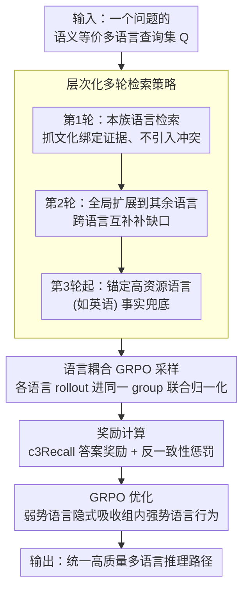

# Language-Coupled Reinforcement Learning for Multilingual Retrieval-Augmented Generation

**会议**: ACL 2026 Findings  
**arXiv**: [2601.14896](https://arxiv.org/abs/2601.14896)  
**代码**: [GitHub](https://github.com/Cherry-qwq/LcRL-Open)  
**领域**: 强化学习  
**关键词**: 多语言RAG, 强化学习, GRPO, 知识偏差, 知识冲突

## 一句话总结

本文提出 LcRL 框架，通过语言耦合的 GRPO 策略优化和反一致性惩罚奖励，解决多语言 RAG 中的知识偏差和知识冲突问题，在多语言问答任务上取得显著提升。

## 研究背景与动机

**领域现状**：检索增强生成（RAG）已成为缓解 LLM 幻觉和知识不足的有效范式。在多语言场景中，由于训练数据分布极度不均衡，不同语言间的知识差异显著，多语言 RAG（MRAG）需要模型从多语言集合中有效获取和整合外部知识。

**现有痛点**：现有 MRAG 方法主要采用"一刀切"策略——将不同语言的等价查询通过单轮检索和统一优化处理。这带来两个核心问题：（1）**知识偏差**——LLM 对语义等价的不同语言查询产生截然不同的回答，因为各语言知识储备不一；（2）**知识冲突**——当检索集合包含多种语言时，语言表达差异导致检索文档语义相关但事实不一致，干扰 LLM 生成正确答案。

**核心矛盾**：现有 RL-based RAG 方法（如 Search-R1）的策略在单语言内独立优化，无法调和跨语言间的矛盾事实，也无法利用语言间的互补效应。

**本文目标**：设计一个语言耦合的强化学习框架，让 LLM 自适应地决定是否检索、检索哪种语言的资源，并有效调和多语言间的冲突知识。**切入角度**：将多语言决策和经验奖励耦合到 GRPO 框架中。**核心 idea**：让语义等价的多语言查询在同一 group 内采样和评估，促进跨语言知识迁移。

## 方法详解

### 整体框架

LcRL 把多语言决策直接焊进 GRPO 的训练回路：对一个问题的多种语义等价查询，让 LLM 与搜索引擎以 `<search>`/`<answer>` 标签交错的方式多轮交互，每轮按层次化策略选择该检索哪种语言的资源。所有语言版本的 rollout 被放进同一个 group 联合打分，再用一个把字符召回率和反一致性惩罚揉在一起的奖励驱动优化。这样从"等价查询集"输入到"统一高质量推理路径"输出，弱势语言能在组内向强势语言对齐，而冲突的错误答案会被主动拆散。

### 关键设计

**1. 层次化多轮检索策略：先本族、再全球、最后锚高资源**

朴素的"一刀切"检索会让多种语言的文档同时涌入，语义相关却事实打架。LcRL 改成按轮次分阶段铺开：第 1 轮只检索查询原生语言 $\mathcal{R}_L(q)$，优先抓住与文化绑定的证据并避免一上来就引入冲突；第 2 轮全局扩展到其余所有语言 $\bigcup_{l \in \mathcal{L} \setminus \{L\}} \mathcal{R}_l(q)$，用跨语言互补性填补本族语言的知识缺口；第 3 轮及之后锚定高资源语言（如英语）$\mathcal{R}_{en}(q)$ 作为事实兜底。这种"原生→全局→高资源"的递进，让模型在调和冲突和补全知识之间有了明确的优先级。

**2. 语言耦合 GRPO：让等价查询共享同一条基线**

知识偏差的根源是各语言被独立优化，弱势语言学不到强势语言的行为。LcRL 把语义等价查询集 $\mathcal{Q} = \{q_1, q_2, \dots, q_n\}$ 的采样 $o_i \sim \pi_\theta(\cdot \mid q_i; \mathcal{R})$ 放进同一个 group，优势 $\hat{A}_{i,t}^{\text{coupled}}$ 在整个多语言组上统一归一化，而不是各语言各算各的。如此一来不同语言的嵌入被绑定到同一条高质量推理路径上，弱势语言能从组内强势语言的高奖励样本里隐式吸收行为模式，跨语言知识迁移自然发生。

**3. 反一致性惩罚奖励：拆散扎堆的错误答案**

工具集成 RL 中 GRPO 常因 Lazy Likelihood Displacement 而坍塌——一群相似的错误答案互相强化形成正反馈。LcRL 先圈出"坏样本"集合 $B_q = \{i \in G_q \mid r_{\text{ans}}(i) < \tau_{\text{bad}}\}$，对每个坏样本算它与其他坏样本的最大相似度 $m_i$，相似度越高说明错误越扎堆，就按 $r_{\text{anti\_align}}(i) = -p_i \cdot w_q$ 施加惩罚。这相当于专门盯着"集体犯同一个错"的模式打压，打破错误的正反馈循环、稳住训练。

### 损失函数 / 训练策略

奖励信号上，答案项用字符 3-gram 召回 $r_{\text{ans}}(i) = \text{c3Recall}(\hat{a}_i, a_{\text{gold}})$ 替代二值精确匹配，给出稠密反馈；最终奖励 $r_{\text{total}}(i) = \max(0, r_{\text{ans}}(i) + \lambda \cdot \tilde{r}_{\text{anti\_align}}(i))$，其中反一致性惩罚被裁剪到 $[-0.5, 0]$。目标函数为标准 PPO-clip 形式加 KL 正则化。

## 实验关键数据

### 主实验

| 数据集 | 指标 | LcRL (Qwen2.5-3B) | mSearch-R1 | Search-R1 | D-RAG |
|--------|------|------|----------|------|------|
| MKQA | fEM | **41.2** | 37.9 | 22.6 | 37.4 |
| MKQA | c3Recall | **57.0** | 53.2 | 34.8 | 43.3 |
| MKQA | CLR | **99.1** | 95.6 | 83.6 | 90.2 |
| XOR-TyDi | fEM | **31.7** | 21.2 | 18.4 | 31.5 |
| XOR-TyDi | c3Recall | **43.9** | 35.8 | 32.0 | 38.9 |

### 消融实验

| 配置 | fEM | c3Recall | 说明 |
|------|-----|---------|------|
| Full LcRL | 41.2 | 57.0 | 完整模型 |
| w/o Lc Reward | 30.8 | 42.2 | 去掉语言耦合奖励 |
| w/o c3Recall Reward | 18.0 | 20.2 | 用精确匹配替代 |
| w/o Lc Rollout | 30.4 | 45.7 | 去掉语言耦合采样 |
| w/o multi-language Rollout | 27.9 | 38.5 | 去掉多语言检索 |
| Replace by PPO | 15.5 | 21.7 | 用 PPO 替代 GRPO |

### 关键发现
- LcRL 在所有基线上取得显著提升（t-test p < 0.01），且在 Qwen3-8B 上 fEM 达 47.6
- 随着检索集合语言数量增加，只有 LcRL 性能持续提升，其他方法在超过 2 种语言后急剧下降
- LcRL 在有限训练数据条件下表现强健，且能成功迁移至训练中未见的语言
- GRPO 大幅优于 PPO，得益于组内学习机制促进跨语言泛化

## 亮点与洞察
- 语言耦合 GRPO 的设计巧妙利用了多语言等价查询的互补性，是对标准 GRPO 的有意义扩展
- 反一致性惩罚有效解决了 RL 训练中的 reward collapse 问题，可迁移到其他工具集成 RL 场景
- 层次化检索策略（原生→全局→高资源）在简洁性和有效性间取得良好平衡

## 局限与展望
- 仅在三个 LLM 上评估，未覆盖更多开源多语言模型
- 检索器固定为 multilingual-e5-base，未探索联合优化检索器的可能
- 缺乏针对多语言 RAG 的专用检索相关性标注数据集
- 未来可探索更多语言覆盖和更大规模模型的效果

## 相关工作与启发
- **vs Search-R1**: Search-R1 为单语言 RL-RAG，LcRL 通过语言耦合机制解决了其在多语言设置中的优化不稳定性
- **vs D-RAG**: D-RAG 通过辩证推理缓解冲突但在固定 pipeline 内，LcRL 端到端联合优化检索和生成
- **vs SFT 方法**: RL 方法在低资源条件下即可取得竞争力，SFT 依赖大量数据

## 评分
- 新颖性: ⭐⭐⭐⭐ 语言耦合 GRPO 和反一致性惩罚是对多语言 RL-RAG 的重要创新
- 实验充分度: ⭐⭐⭐⭐⭐ 多模型 × 两数据集 × 详尽消融 × 数据规模/语言覆盖分析
- 写作质量: ⭐⭐⭐⭐ 问题定义清晰，方法展开有条理，可视化丰富
- 价值: ⭐⭐⭐⭐ 为多语言 RAG 的后训练优化开辟新路线，反一致性惩罚思想可广泛复用

<!-- RELATED:START -->

## 相关论文

- [\[ACL 2026\] Learning to Extract Rational Evidence via Reinforcement Learning for Retrieval-Augmented Generation](learning_to_extract_rational_evidence_via_reinforcement_learning_for_retrieval-a.md)
- [\[ACL 2026\] Agentic Conversational Search with Contextualized Reasoning via Reinforcement Learning](agentic_conversational_search_with_contextualized_reasoning_via_reinforcement_le.md)
- [\[ACL 2026\] Enhancing Multilingual RAG Systems with Debiased Language Preference-Guided Query Fusion](enhancing_multilingual_rag_systems_with_debiased_language_preference-guided_quer.md)
- [\[ACL 2026\] ChatR1: Reinforcement Learning for Conversational Reasoning and Retrieval Augmented Question Answering](chatr1_reinforcement_learning_for_conversational_reasoning_and_retrieval_augment.md)
- [\[ACL 2026\] Beyond Black-Box Interventions: Latent Probing for Faithful Retrieval-Augmented Generation](beyond_black-box_interventions_latent_probing_for_faithful_retrieval-augmented_g.md)

<!-- RELATED:END -->
