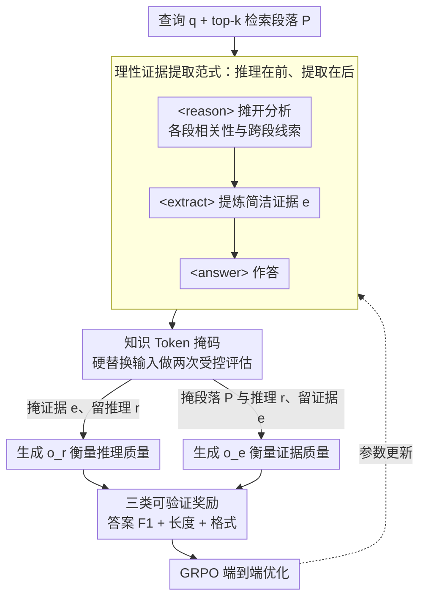

<!-- 由 src/gen_stubs.py 自动生成 -->
# Learning to Extract Rational Evidence via Reinforcement Learning for Retrieval-Augmented Generation

**会议**: ACL 2026 Findings  
**arXiv**: [2507.15586](https://arxiv.org/abs/2507.15586)  
**代码**: [GitHub](https://github.com/HITsz-TMG/EviOmni)  
**领域**: 图像复原  
**关键词**: 检索增强生成, 证据提取, 强化学习, 推理引导提取, GRPO

## 一句话总结

提出 EviOmni，通过"先推理再提取"的范式学习从检索文档中提取理性证据：将证据推理和证据提取整合为统一轨迹，用知识 token 掩码避免信息泄露，通过 GRPO 以可验证奖励优化，在 5 个基准上以极高压缩比（~38x）取得优于全文检索的准确率。

## 研究背景与动机

**领域现状**：RAG 通过检索外部段落增强 LLM 的准确性。然而检索到的段落常含大量噪声和无关内容，需要证据提取/降噪。现有方法包括重排序（将相关段落置顶）和摘要/提取（用 SFT 训练过滤模型）。

**现有痛点**：现有方法直接提取证据而不进行深度思考，可能遗漏关键线索。例如，直接提取可能因上下文理解不足而丢掉分散在多个段落中的关键信息。训练数据通常通过启发式构建（如字符串包含、词汇重叠），不直接对齐 RAG 的最终目标。

**核心矛盾**：普通证据提取是"看到什么提什么"，缺乏对检索内容的深度推理——当关键线索需要跨段落推理才能识别时，直接提取容易遗漏。

**本文目标**：让证据提取器先推理（识别检索内容中的线索及其相关性），再基于推理结果提取，并通过 RL 优化使提取结果直接对齐下游任务准确率。

**切入角度**：实证研究发现，在 SFT 数据中加入推理步骤（reason→extract）后，证据的答案召回率从 70.8% 提升至 75.2%（NQ 数据集），证明推理引导的价值。

**核心 idea**：将证据推理 <reason> 和证据提取 <extract> 统一到一个生成轨迹中，用知识 token 掩码分离评估，用 GRPO + 三类可验证奖励（答案、长度、格式）端到端优化。

## 方法详解

### 整体框架

EviOmni 把"证据降噪"从"看到什么提什么"改成"先想清楚再提"。给定查询 $q$ 和 top-k 检索段落 $P$，同一个模型既当提取器又当生成器，吐出一条统一轨迹 `<reason>推理</reason><extract>证据</extract><answer>答案</answer>`：先在推理段分析各段落的相关性与线索，再据此提炼简洁证据，最后作答。训练时的关键难点是怎么分别衡量"推理"和"证据"各自的好坏，本文用知识 token 掩码把两者隔离评估，并用三类可验证奖励通过 GRPO 端到端优化，使提取结果直接对齐下游答案准确率。

### 关键设计

**1. 理性证据提取范式：推理在前、提取在后**

直接提取的毛病在于关键线索常分散在多个段落、需要跨段推理才能识别，"看到什么提什么"容易漏。EviOmni 让模型先生成 `<reason>` 段把每个段落的相关性和包含线索摊开分析，再基于这份推理生成 `<extract>` 证据，形式化为 $e \sim \mathcal{M}_\mathcal{E}(\cdot \mid q,P,r) \cdot \mathcal{M}_\mathcal{E}(r \mid q,P)$。推理这一步既能串起跨段落的分散线索，又能主动排掉误导信息，比无脑提取更稳——实证里加入推理后证据的答案召回率从 70.8% 升到 75.2%。

**2. 知识 Token 掩码：把推理和证据的功劳拆开算**

如果不做隔离，证据生成后答案仍能从完整上下文（包括原始段落）里偷信息，奖励就反映不出证据本身的质量。EviOmni 用硬掩码（直接替换输入 token）做两次受控评估：掩掉证据 $e$、只留推理 $r$ 生成答案 $o_r$ 来衡量推理质量；掩掉段落 $P$ 和推理 $r$、只留证据 $e$ 生成答案 $o_e$ 来衡量证据质量。之所以用硬掩码而非软掩码（调注意力），是因为 causal attention 早已把信息聚合进后续 token，调权重堵不住泄露，只有替换输入才能彻底切断。

**3. 三类可验证奖励：直接对齐下游目标**

启发式构造的训练数据（字符串包含、词汇重叠）跟 RAG 最终目标是错位的，所以本文把奖励直接挂到下游表现上。答案奖励 $R^{ans}$ 用 unigram F1 统一跨任务评估；长度奖励 $R^{len}$ 鼓励推理写得全面（长于证据）而证据写得精炼（远短于段落）；格式奖励 $R^{fmt}$ 保证标签结构合法。三者加权为 $R^{final} = \lambda_1 R^{ans} + \lambda_2 R^{len} + \lambda_3 R^{fmt}$，用可验证信号取代启发式指标。

### 损失函数 / 训练策略

采用 GRPO 在线策略优化，基础模型为 Qwen2.5-1.5B/7B-Instruct，同一模型同时充当证据提取器和答案生成器。

## 实验关键数据

### 主实验

1.5B 模型在 NQ/TQA/HotpotQA 上（EM/F1/压缩比）：

| 方法 | NQ EM | NQ CR | TQA EM | HotpotQA EM |
|------|-------|-------|--------|-------------|
| Full（无压缩） | 41.97 | 1.0x | 57.02 | 19.20 |
| FilCo | 36.62 | 16.3x | 54.06 | 18.18 |
| SEER | 36.93 | 13.2x | 54.57 | 18.60 |
| **EviOmni** | **41.14** | **38.1x** | **56.84** | **20.46** |

EviOmni 在 ~38x 压缩下接近甚至超过全文性能。

### 消融实验

| 配置 | NQ AR | HotpotQA AR |
|------|-------|------------|
| Vanilla Evidence (无推理) | 70.79% | 60.55% |
| Rational Evidence (有推理) | **75.24%** | **67.74%** |
| Rationale 本身 | 77.30% | 71.48% |

### 关键发现

- 理性证据的答案召回率比普通证据高 4-7 个百分点，证实推理引导的价值
- 在 38x 压缩比下性能接近全文输入，说明提取的证据高度精炼
- 在 OOD 数据集（HotpotQA）上也有提升，表明泛化性好
- 同时支持传统 RAG 和 Agentic RAG（提前终止、噪声鲁棒等特性）

## 亮点与洞察

- **"先推理再提取"的范式转换**具有广泛意义——不仅适用于 RAG，任何需要从噪声信息中提取关键内容的任务都可以借鉴
- **知识 Token 掩码**解决了训练中信息泄露的技术难题，设计精巧
- **38x 压缩比下性能不降**的结果令人印象深刻，对推理效率有重大实践意义

## 局限与展望

- 推理过程增加了生成长度，虽然证据更短但总输出更长
- 仅在 QA 任务上训练和评估，对话/摘要等任务的适用性需验证
- 推理质量受基础模型能力限制，1.5B 模型的推理深度有限

## 相关工作与启发

- **vs Recomp/FilCo/SEER**: 这些方法直接提取/摘要，无推理引导，压缩比和准确率均不如 EviOmni
- **vs SFT 方法（Wang et al., 2023）**: SFT 依赖启发式构建训练数据，RL 直接对齐下游任务目标

## 评分

- 新颖性: ⭐⭐⭐⭐⭐ "推理→提取"范式 + 知识掩码 + RL优化的组合非常新颖
- 实验充分度: ⭐⭐⭐⭐⭐ 5 个基准、两种模型规模、传统+Agentic RAG 均验证
- 写作质量: ⭐⭐⭐⭐ 框架图清晰，实证研究有说服力
- 价值: ⭐⭐⭐⭐⭐ 对 RAG 管线效率和质量有直接实践意义

<!-- RELATED:START -->

## 相关论文

- [\[ACL 2026\] Language-Coupled Reinforcement Learning for Multilingual Retrieval-Augmented Generation](language-coupled_reinforcement_learning_for_multilingual_retrieval-augmented_gen.md)
- [\[ACL 2026\] Agentic Conversational Search with Contextualized Reasoning via Reinforcement Learning](agentic_conversational_search_with_contextualized_reasoning_via_reinforcement_le.md)
- [\[ACL 2026\] ChatR1: Reinforcement Learning for Conversational Reasoning and Retrieval Augmented Question Answering](chatr1_reinforcement_learning_for_conversational_reasoning_and_retrieval_augment.md)
- [\[ICML 2026\] Graph-R1: Towards Agentic GraphRAG Framework via End-to-end Reinforcement Learning](../../ICML2026/information_retrieval/graph-r1_towards_agentic_graphrag_framework_via_end-to-end_reinforcement_learnin.md)
- [\[AAAI 2026\] OPERA: A Reinforcement Learning--Enhanced Orchestrated Planner-Executor Architecture for Reasoning-Oriented Multi-Hop Retrieval](../../AAAI2026/information_retrieval/opera_a_reinforcement_learning--enhanced_orchestrated_planner-executor_architect.md)

<!-- RELATED:END -->
