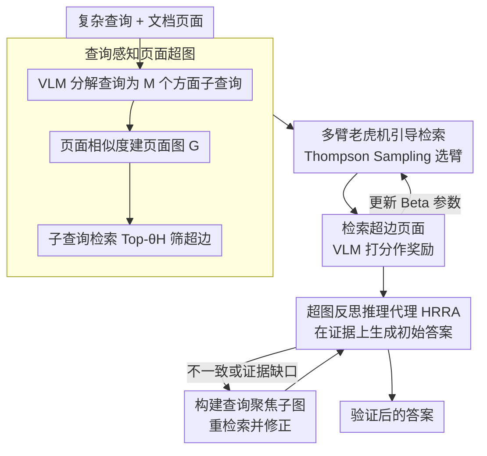

# MAB-DQA: Addressing Query Aspect Importance in Document Question Answering with Multi-Armed Bandits

**会议**: ACL 2026  
**arXiv**: [2604.08952](https://arxiv.org/abs/2604.08952)  
**代码**: [GitHub](https://github.com/ElephantOH/MAB-DQA)  
**领域**: 文档问答与信息检索  
**关键词**: 文档问答、多臂老虎机、查询分解、多模态RAG、超图推理

## 一句话总结

提出 MAB-DQA 框架，将复杂查询分解为多个方面子查询，用多臂老虎机机制（Thompson Sampling）动态评估各方面的重要性并重新分配检索预算，显著提升多模态文档问答的检索精度和回答准确率。

## 研究背景与动机

- **领域现状**：文档问答（DQA）要求 AI 根据用户查询从文档中生成答案，是文档理解的核心任务。当前先进方法（如 ColPali、MoloRAG）采用视觉-查询延迟交互（Late Interaction）范式，计算查询 token 与文档图像 patch 的最大点积再求和作为相似度分数。
- **现有痛点**：Late Interaction 的"max-pooling + summation"操作对所有查询 token 赋予等权，无法像人类一样区分查询中不同方面的重要性。这导致低重要性但高频的关键词（如公司名"Best Buy"）会在无关页面上产生高虚假相似度，而真正包含关键证据的页面反而被排在后面。
- **核心矛盾**：多模态 RAG 通常只保留少数候选页面（如 Top-4），信息含量高但视觉显著性低的内容容易被忽略。作者统计发现 MMLongBench 中 19.8%、LongDocURL 中 27.8% 的样本存在因忽略关键查询条件导致的检索错误。
- **本文目标**：显式建模查询中多个隐式方面的不同重要性，动态分配检索注意力，优先检索包含关键信息的证据页面。
- **切入角度**：将每个子查询视为多臂老虎机的一个"臂"，利用 VLM 初步推理反馈作为奖励信号，通过探索-利用策略自适应地将检索预算分配给高价值方面。
- **核心 idea**：查询分解 + Thompson Sampling 驱动的动态检索预算分配 + 超图反思推理，三阶段递进式文档问答。

## 方法详解

### 整体框架

MAB-DQA 是一条推理时的三阶段流水线，核心是把"哪个查询方面更重要"这件事交给多臂老虎机在线学。给定查询和文档页面，它先把原始查询拆成多个方面子查询并和页面一起组织成超图；再以 Thompson Sampling 在各方面（臂）之间动态分配检索预算，优先把算力投到信息价值高的方面上、捞出关键证据页；最后由一个带反思的推理代理在证据上生成并自我验证答案。从"复杂查询+整篇文档"输入到"经过验证的答案"输出，整条链路始终围绕"按方面重要性重新分配检索注意力"展开。

### 关键设计

**1. 查询感知页面超图：用超边表达"一个方面关联一组页面"**

普通图只能连页面对页面，表达不了"某个查询方面同时牵涉一簇页面"的群组关系。MAB-DQA 先基于页面间相似度建查询无关的页面图 $G$，再用 VLM 把原始查询 $q$ 分解为 $M$ 个方面子查询 $\{q_1,\dots,q_M\}$；对每个子查询检索 Top-$\theta_H$ 页面得候选集 $C_j$，并从中筛出"在该子查询下排名比全局查询更靠前"的页面构成超边 $\hat{E}_j$。最终超图 $H = (V_G, \{\hat{E}_j\} \cup E_G)$ 同时承载页面间边和方面超边，让后续检索能以"方面"为单位调度页面群组。

**2. 多臂老虎机引导检索：把检索预算押给高价值方面**

不同查询方面的信息价值差异很大，Late Interaction 那种对所有 token 等权的"max-pooling+求和"会让高频低价值的关键词在无关页上刷出虚假高分。MAB-DQA 把每个子查询 $Q_j$ 当一个臂，维护 Beta$(\alpha_j, \beta_j)$ 分布，每轮用 Thompson Sampling 采样选臂、检索对应超边页面，再让 VLM 打相关性分 $s_{\text{vlm}}\in[0,1]$ 作为奖励回写 Beta 参数。页面综合评分为 $\text{score}(p_i) = (1-\alpha)\cdot \max\text{LI} + \alpha\cdot s_{\text{vlm}} + \beta[(1-\lambda)\cdot h_i + \lambda\cdot \bar{s}_{\text{cb}}]$，其中 $\bar{s}_{\text{cb}}$ 是关联子查询的 Thompson Sampling 置信度均值。探索-利用的天然平衡让预算自适应地流向真正重要的方面。

**3. 超图反思推理代理（HRRA）：多阶段验证兜住幻觉**

单次生成容易漏信息或编答案，所以末端接一个"初始回答—验证—优化"的反思循环：先用检索到的证据页生成初始答案，一旦检测到内部不一致或证据缺口，就回头在超图上构建查询聚焦子图、重新检索并修正。多阶段验证给最终答案加了一道保险，把检索阶段的收益真正落到回答准确率上。

### 损失函数 / 训练策略

整个框架是推理时方法，不涉及模型训练。臂的 Beta 分布在线更新为 $(\alpha_j, \beta_j) \leftarrow (\alpha_j + s_{\text{vlm}}, \beta_j + 1 - s_{\text{vlm}})$。关键超参数：$\alpha=0.8$（VLM 评估权重）、$\beta=0.1$（超图项比例调节）、$\lambda=0.75$（页面度数 vs 臂置信度平衡）、$\theta_G=0.8$（页面图边阈值）、$\theta_H=10$（超边容量）、$m=20$（检索迭代数）。

## 实验关键数据

### 主实验

| 方法 | MMLongBench | LongDocURL | FetaTab | PaperTab | 平均 |
|---|---|---|---|---|---|
| Qwen-2.5-VL-7B (Direct) | 0.204 | 0.398 | 0.350 | 0.112 | 0.266 |
| MDocAgent | 0.315 | 0.527 | 0.598 | 0.227 | 0.417 |
| MoloRAG+ | 0.372 | 0.528 | 0.600 | 0.195 | 0.424 |
| **MAB-DQA** | **0.399** | **0.564** | **0.638** | **0.269** | **0.468** |
| 提升 | +7.25% | +5.22% | +6.33% | +18.50% | +10.38% |

检索性能（Top-3，MMLongBench）：MAB-DQA 在 Recall (69.53)、Precision (34.32)、NDCG (41.05)、MRR (72.94) 上全面超越 MoloRAG 和 MoloRAG+。

### 消融实验

| 变体 | MMLongBench | LongDocURL | FetaTab | PaperTab | 平均提升 |
|---|---|---|---|---|---|
| Colpali (Baseline) | 0.296 | 0.554 | 0.537 | 0.152 | 0.0% |
| + MABR | 0.388 | 0.543 | 0.609 | 0.226 | +22.8% |
| + HRRA | 0.395 | 0.561 | 0.624 | 0.236 | +26.5% |
| MAB-DQA (Full) | 0.399 | 0.564 | 0.638 | 0.269 | +33.1% |

### 关键发现

- **查询方面重要性差异显著**：约 20-28% 的样本存在因忽略关键条件导致的检索错误，证明均匀加权的 Late Interaction 存在系统性缺陷
- **PaperTab 提升最大（+18.5%）**：涉及文档结构和表格理解的任务最受益于方面感知检索
- **MABR 和 HRRA 互补递进**：MABR 提供自适应检索聚焦关键方面 (+22.8%)，HRRA 进一步通过反思验证纠错 (+26.5%)，联合使用达到 +33.1%
- **跨 VLM 骨干通用**：在 Qwen2.5-VL-7B、LLaVa-13B、Qwen3-30B、Qwen3-32B 上均有一致提升

## 亮点与洞察

- **问题定义精准**：清晰地刻画了 Late Interaction 中"查询方面权重均匀"这一被忽视的问题，并用可视化热力图和统计数据 (Issue 列) 充分论证
- **MAB 建模巧妙**：将查询方面重要性估计转化为多臂老虎机问题，Thompson Sampling 的探索-利用平衡与检索场景天然契合
- **推理时方法，无需训练**：整个框架在推理时运行，不需要额外训练数据或微调，即插即用
- **超图建模页面-方面关系**：比普通图更能表达"一个方面关联一组页面"的群组结构

## 局限与展望

- 强依赖底层 VLM 的能力——若 VLM 在特定领域（法律、医学等）表现差，整体性能会受限
- 超参数较多（α, β, λ, θ_G, θ_H, m），目前通过网格搜索选择，作者计划未来引入贝叶斯优化自动调参
- 仅使用 Thompson Sampling，未对比 UCB、ε-Greedy 等其他 bandit 策略
- 检索时间复杂度 O(m·T_VLM)，VLM 调用次数随迭代轮数线性增长，大规模文档下效率可能成为瓶颈

## 相关工作与启发

- **ColPali (Faysse et al., 2024)**：视觉-语言嵌入模型，本文的检索骨干
- **MoloRAG (Wu et al., 2025)**：也使用图结构和 VLM 评估进行多模态 DQA，是最强基线但固定检索预算且不区分方面重要性
- **MBA-RAG (Tang et al., 2025)**：也用 MAB 但面向单模态，用 MAB 选择检索策略而非查询方面
- **GraphRAG (Edge et al., 2025)**：图增强 RAG 的代表性工作，MAB-DQA 进一步引入超图和动态预算分配
- 本文的方面感知检索思路可推广到通用多模态 RAG 场景

## 评分

- 新颖性: ⭐⭐⭐⭐ 将 MAB 引入查询方面重要性建模是新颖的视角，超图构建也有独到之处
- 实验充分度: ⭐⭐⭐⭐ 4 个基准、多种基线对比、消融、敏感性分析、跨 VLM 验证，较为全面
- 写作质量: ⭐⭐⭐⭐ 图示清晰，问题动机论证充分，可视化案例分析有说服力
- 价值: ⭐⭐⭐⭐ 推理时方法、无需训练、即插即用，实用性强

<!-- RELATED:START -->

## 相关论文

- [\[ACL 2026\] DQA: Diagnostic Question Answering for IT Support](dqa_diagnostic_question_answering_for_it_support.md)
- [\[ACL 2026\] Context Attribution with Multi-Armed Bandit Optimization](context_attribution_with_multi-armed_bandit_optimization.md)
- [\[ACL 2026\] FinRAG-12B: A Production-Validated Recipe for Grounded Question Answering in Banking](finrag-12b_a_production-validated_recipe_for_grounded_question_answering_in_bank.md)
- [\[ACL 2026\] ChatR1: Reinforcement Learning for Conversational Reasoning and Retrieval Augmented Question Answering](chatr1_reinforcement_learning_for_conversational_reasoning_and_retrieval_augment.md)
- [\[ACL 2026\] Prune-then-Merge: Towards Efficient Multi-Vector Visual Document Retrieval](sculpting_the_vector_space_towards_efficient_multi-vector_visual_document_retrie.md)

<!-- RELATED:END -->
