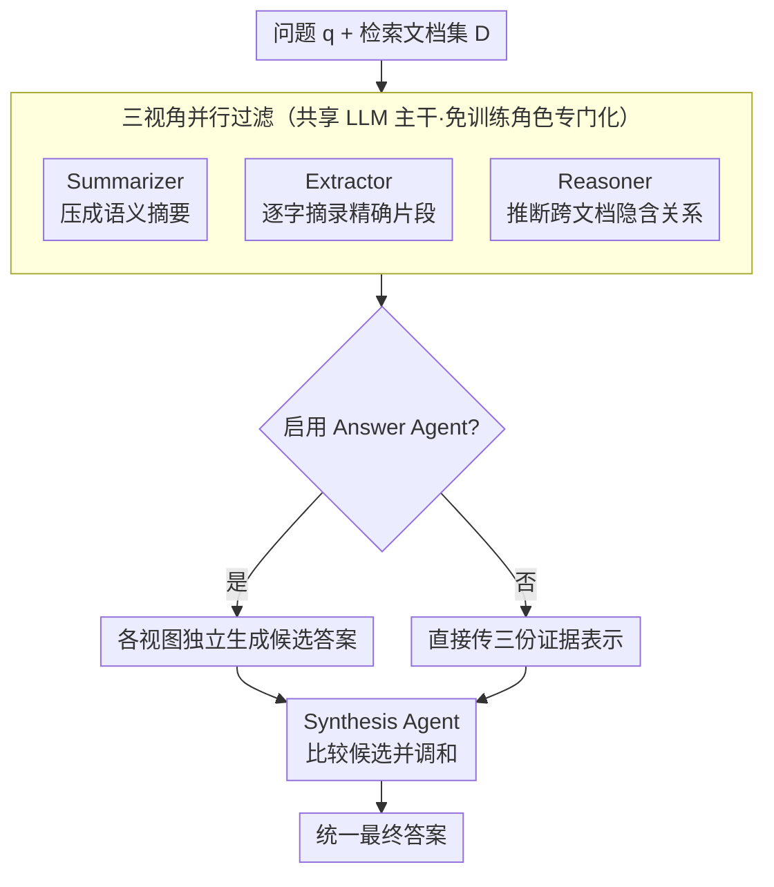

# MASS-RAG: Multi-Agent Synthesis Retrieval-Augmented Generation

**会议**: ACL 2026 Findings  
**arXiv**: [2604.18509](https://arxiv.org/abs/2604.18509)  
**代码**: 无  
**领域**: 信息检索 / RAG  
**关键词**: 多Agent RAG, 证据综合, 免训练, 多视角过滤, 异构证据融合

## 一句话总结

本文提出 MASS-RAG，一个免训练的多 Agent 综合 RAG 框架，通过 Summarizer/Extractor/Reasoner 三个专门化过滤 Agent 从互补视角处理检索文档，再通过 Synthesis Agent 整合多视角证据或候选答案，在四个基准上持续超越强基线。

## 研究背景与动机

**领域现状**：RAG 通过在推理时引入外部知识增强 LLM 的事实性。然而，当检索到的上下文有噪声、不完整或异构时，单一生成过程难以有效协调证据。

**现有痛点**：(1) 现有多 Agent RAG（如 Chang et al. 2024）仅使用单一裁判 Agent 从单一视角过滤上下文，无法捕捉互补或异构的事实证据；(2) 不相关或冗余的检索信息会降低生成质量；(3) 对于需要跨文档聚合互补证据的问题，单一视角特别不足。

**核心矛盾**：检索到的文档可能以不同形式包含相关证据——有的需要总结，有的需要精确提取，有的需要推理连接——单一过滤策略无法兼顾。

**本文目标**：设计多视角证据过滤和综合机制，使 RAG 系统能从互补角度处理和整合检索到的文档。

**切入角度**：将证据处理分为三种互补视角——摘要（压缩保留语义）、抽取（逐字提取精确证据）、推理（推断隐含关系），通过多 Agent 分工实现。

**核心 idea**：不同类型的问题需要不同类型的证据处理——MASS-RAG 通过多 Agent 并行产生多个证据视图，然后通过显式比较和整合来产生更鲁棒的最终答案。

## 方法详解

### 整体框架

MASS-RAG 想解决的核心问题是：检索回来的文档往往以不同形式藏着相关证据，有的要压缩、有的要逐字摘录、有的要跨文档推断，单一过滤策略只会丢掉某一类证据。它的做法是把"过滤"这一步拆给三个视角不同的 Agent 并行处理，再交给一个综合 Agent 整合。给定问题 $q_i$ 和检索文档集合 $D$，框架先让 Summarizer、Extractor、Reasoner 各自产出一份去噪后的证据视图，可选地让 Answer Agent 基于每份视图生成候选答案，最后由 Synthesis Agent 把三路证据（或三个候选答案）比较、调和成统一预测。整个流程免训练，三个 Agent 共享同一 LLM 主干，仅靠角色提示分化。

### 关键设计

**1. 三视角并行过滤：用互补角度兜住不同类型的证据**

不同问题类型对证据的需求天差地别——事实型问题要的是精确片段，综合型问题要的是跨文档推断，信息型问题要的是语义压缩，单一裁判 Agent 只能覆盖其中一种，盲点很大。MASS-RAG 因此让三个角色各管一摊：Summarizer 把检索文档压成语义一致的简洁摘要 $R_i^{(s)} = \mathcal{A}_{\text{sum}}(q_i, D)$，Extractor 逐字摘录精确事实片段 $R_i^{(e)} = \mathcal{A}_{\text{ext}}(q_i, D)$，Reasoner 推断跨文档的隐含关系 $R_i^{(r)} = \mathcal{A}_{\text{rea}}(q_i, D)$。三路并行意味着只要有一种处理方式能命中正确证据，整体就不会因为过滤策略选错而漏掉关键信息。

**2. 可选 Answer Agent 与综合调和：让竞争假设在比较中收敛**

三路证据之间可能互补，也可能给出相互冲突的答案，直接拼接容易引入噪声。MASS-RAG 在综合前留了一个可开关的中间环节：启用 Answer Agent 时，每份过滤结果先独立生成候选答案 $A_i^{(j)} = \mathcal{A}_{\text{ans}}(q_i, R_i^{(j)})$，再由 Synthesis Agent 显式比较三个候选并调和；禁用时则直接整合三份证据表示。是否启用按任务而定——事实型 QA 的候选答案承载丰富语义信号，不同视角的竞争假设值得显式对比；多选题的中间候选信号有限，跳过更省成本。这种自适应让同一框架在不同任务上都能保持稳健。

**3. 免训练的角色专门化：靠提示约束而非微调实现分工**

要让三个 Agent 真正分化，最直接的办法是分别微调，但那会牺牲即插即用性。MASS-RAG 完全靠角色提示和输出约束来塑造专门化：Summarizer 被约束只能压缩，Extractor 被约束只能逐字提取，Reasoner 被约束只能输出中间推理表示。这样所有 Agent 可以共享同一个 LLM 主干，无需任何额外训练就能挂到现成模型上，部署门槛极低，代价是角色分化的强度受限于提示工程的上限。

### 一个完整示例

以一个需要跨文档聚合的事实型问题为例：检索器召回三篇文档 $D$，其中一篇用长段落描述背景、一篇在表格里给出精确数字、一篇隐含了两个实体的关系。Summarizer 把背景段落压成一句摘要，Extractor 从表格里逐字摘出数字片段，Reasoner 推断出连接两个实体的隐含链条。Answer Agent 基于三份视图分别给出候选答案——可能两路一致、一路偏离。Synthesis Agent 比较三者，发现摘要与推理路径相互印证，据此采纳与表格数字一致的答案作为最终输出，从而避免了单视角过滤时因漏读表格或忽略隐含关系而出错。

### 损失函数 / 训练策略

免训练框架，所有 Agent 共享同一 LLM 主干（实验中使用 Llama-3-8B 和 Llama-2-7B/13B），仅通过角色提示分化，不涉及任何参数更新。

## 实验关键数据

### 主实验

**四个基准的准确率（Llama-3-8B + 检索）**

| 基准 | Vanilla RAG | Chang et al. (单Agent过滤) | MASS-RAG |
|------|-----------|------------------------|---------|
| TriviaQA | ~70 | ~72 | ~74 |
| PopQA | ~48 | ~52 | ~55 |
| ARC-C | ~60 | ~63 | ~66 |

### 关键发现

- MASS-RAG 在需要跨文档聚合互补证据的场景下优势最大
- Answer Agent 对事实型 QA（TriviaQA/PopQA）有显著帮助，对多选题（ARC-C）帮助较小
- 三个过滤 Agent 中，Reasoner 的单独贡献最大，说明跨文档推理是最大的瓶颈

## 亮点与洞察

- 多视角过滤的思路直觉上就很有道理——不同问题确实需要不同的证据处理方式，一刀切的过滤策略会丢失特定类型的证据
- 免训练设计使得框架即插即用，可以直接应用到任何 LLM 上
- 可选 Answer Agent 的设计提供了任务自适应的灵活性

## 局限与展望

- 多 Agent 设计增加了推理成本（3x 过滤 + 综合）
- 所有 Agent 共享同一 LLM，角色分化仅通过提示实现——专门化程度受限
- 未与基于训练的 RAG 方法（如 Self-RAG）在同等条件下公平对比
- 长文本 QA 场景未充分验证

## 相关工作与启发

- **vs Self-RAG**: 基于训练的方法，MASS-RAG 免训练但增加推理开销
- **vs Chang et al.**: 单Agent过滤，MASS-RAG 用多视角弥补单一视角的盲点
- **vs REPLUG/Self-RAG**: 关注检索策略优化，MASS-RAG 关注检索后的证据处理优化

## 评分

- 新颖性: ⭐⭐⭐ 多Agent过滤的思路有价值但不算突破性
- 实验充分度: ⭐⭐⭐⭐ 4基准+消融+多模型，但缺少与训练型方法的同等对比
- 写作质量: ⭐⭐⭐⭐ 框架清晰，动机明确
- 价值: ⭐⭐⭐⭐ 对RAG系统的证据处理提供了实用的改进思路

<!-- RELATED:START -->

## 相关论文

- [\[ACL 2025\] MAIN-RAG: Multi-Agent Filtering Retrieval-Augmented Generation](../../ACL2025/information_retrieval/main-rag_multi-agent_filtering_retrieval-augmented_generation.md)
- [\[ACL 2026\] BRIEF-Pro: Universal Context Compression with Short-to-Long Synthesis for Fast and Accurate Multi-Hop Reasoning](brief-pro_universal_context_compression_with_short-to-long_synthesis_for_fast_an.md)
- [\[ACL 2026\] Feedback Adaptation for Retrieval-Augmented Generation](feedback_adaptation_for_retrieval-augmented_generation.md)
- [\[ACL 2026\] Disco-RAG: Discourse-Aware Retrieval-Augmented Generation](disco-rag_discourse-aware_retrieval-augmented_generation.md)
- [\[ACL 2026\] Language-Coupled Reinforcement Learning for Multilingual Retrieval-Augmented Generation](language-coupled_reinforcement_learning_for_multilingual_retrieval-augmented_gen.md)

<!-- RELATED:END -->
