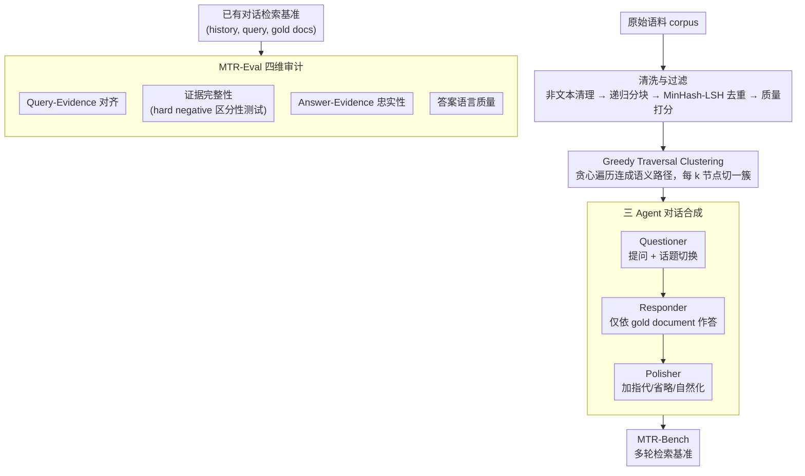

# MTR-Suite: A Framework for Evaluating and Synthesizing Conversational Retrieval Benchmarks

**会议**: ACL 2026  
**arXiv**: [2605.20729](https://arxiv.org/abs/2605.20729)  
**代码**: https://github.com/rangehow/mtr-suite  
**领域**: 信息检索 / Conversational Retrieval  
**关键词**: 对话检索, RAG评测, 合成基准, LLM-as-a-Judge, Greedy Traversal Clustering  

## 一句话总结
MTR-Suite 提出一套从 benchmark 审计、对话数据合成到检索评测的完整框架，用 MTR-Eval 诊断标注质量，用 MTR-Pipeline 以约 1/400 人工成本生成高难度多轮检索基准 MTR-Bench。

## 研究背景与动机
**领域现状**：RAG 的事实性上限很大程度由 retrieval module 决定。如果检索器找不到正确证据，后面的 generator 再强也无法可靠回答。随着生产系统进入多轮对话场景，conversational retrieval benchmark 变得越来越关键。

**现有痛点**：人工标注基准有认知边界。标注者通常只看到局部文档，很难知道语料中是否还有其他文档也能回答当前 query，因此容易产生 annotation sparsity 和 false negatives。自动合成方法虽然便宜，但很多依赖静态启发式，例如把 Wikipedia section header 直接改写成问题，导致对话不自然、query 与 gold document 对齐不稳。

**核心矛盾**：高质量 conversational retrieval benchmark 需要全局视野、自然语言对话、多轮上下文干扰和低成本规模化；人工标注质量高但贵且局部，规则自动化便宜但僵硬且可能继承局部视野问题。

**本文目标**：构建一个统一框架，既能审计已有 benchmark 的 query-evidence / answer-evidence 质量，又能自动合成更贴近生产 RAG 的多轮检索数据，并用该数据评估现代 retriever 的真实短板。

**切入角度**：论文把系统拆成三块：MTR-Eval 负责评价 benchmark 质量；MTR-Pipeline 负责自动合成；MTR-Bench 是用该 pipeline 生成的 general-domain benchmark。核心方法包括 LLM ensemble 审计、知识库清洗、greedy traversal clustering 和三 agent 对话生成。

**核心 idea**：从 local heuristic 转向 global-aware automated annotation，让合成 query 不只看单个文档，还要通过全局候选和 hard negatives 检查证据是否唯一、完整、可信。

## 方法详解
MTR-Suite 的方法可以理解为“先审计什么是好 benchmark，再按这个标准合成 benchmark”。MTR-Eval 通过 LLM-as-a-Judge 评估已有数据中的四类质量问题；MTR-Pipeline 则用高质量文档片段、语义路径聚类和多 agent 生成自然多轮对话；最终 MTR-Bench 用更复杂的 topic switching、verbose answer 和新近知识库来 stress-test retrievers。

### 整体框架
MTR-Eval 输入一个 conversational retrieval benchmark，其中每个 turn 是 conversation history $H_i$、当前 query $q_i$ 和 gold document set $G_i$。系统评估 gold 是否真的支持 query、是否遗漏了更合适的 evidence、answer 是否忠实于 evidence，以及 answer 本身语言质量。

MTR-Pipeline 从原始 corpus 开始，先做非文本清理、recursive chunking、MinHash-LSH 去重，再用 NVIDIA quality classifier 和 FineWeb-EDU scorer 过滤高信息密度片段。随后，greedy traversal clustering 在 embedding space 中构造连续语义路径，并按固定 cluster size 切段。最后三 agent 生成对话：Questioner 模拟用户提问和 topic switch，Responder 生成严格 grounded answer，Polisher 增加指代、省略和自然表达。

### 关键设计

**1. MTR-Eval 四维审计：先量化 benchmark 标注质量，再谈模型分数**

在标注稀疏、噪声大的 benchmark 上拿到高 recall 没有意义——可能是数据太简单或 gold 标注本身有漏。MTR-Eval 因此用 LLM-as-a-Judge 从四个维度审计已有数据：Query-Evidence Alignment 检查 gold document 到底回不回答 query；Evidence Completeness 通过 hard negative pool 做 discriminability testing，看是否漏掉了更合适的证据；Answer-Evidence Faithfulness 检查答案是否真被证据支撑；Answer Quality 单独评语言质量。先把 benchmark 本身审一遍，模型分数才解释得清。

**2. Greedy Traversal Clustering：为多轮对话铺一条语义连续但不重复的文档路径**

要让合成对话像真实用户那样沿主题渐进浏览，就得先组织出一串语义相关、彼此不重复的文档。K-means / DBSCAN 的 cluster size 不可控，阈值邻居法又容易让不同 cluster 互相重叠。论文用贪心遍历：从随机起点出发，每步选最近的未访问邻居，连成一条 semantic path，再每 $k$ 个节点切成一个 cluster。每个 document 只访问一次，cluster size 完全可控，正好模拟用户顺着链接或主题一步步走下去的浏览轨迹。

**3. 三 Agent 对话合成：让合成数据既守 gold grounding 又像真人交互**

单 agent 一把生成对话，要么僵硬要么守不住 grounding。MTR-Pipeline 把任务拆给三个分工的 agent：Questioner 根据文档 cluster 和历史生成 query 并模拟 topic switch，Responder 只基于指定的 gold document 作答（保证严格 grounding），Polisher 再重写整段对话、加入指代、省略、自然的话题切换和生产式冗长回答。三者各管一头，自然性、证据对齐和可控性才能同时兼顾。Polisher 的作用尤其实在：去掉它之后，人类识别「这是机器生成问题」的准确率从 62% 升到 79%。

### 一个完整示例：一条对话怎么被合成出来
设 corpus 已经过非文本清理、recursive chunking、MinHash-LSH 去重，再用 NVIDIA quality classifier 和 FineWeb-EDU scorer 滤出高信息密度片段。Greedy Traversal Clustering 从某个起点出发，连出一条经过 8 个语义相邻文档的路径，按 cluster size 切成几段。轮到生成时，Questioner 盯着当前 cluster 抛出第一个问题、几轮后切到相邻话题（一段对话平均 8 轮、跨约 5.6 个 topic）；Responder 严格只用被指定的 gold document 回答，保证每个 turn 的答案都有据可查；最后 Polisher 把这串问答重写得有指代和省略、读起来像真人，并把答案拉成生产式长度。整段对话连同每个 turn 的 gold document set 一并落盘——单条 dialogue 成本约 \$0.005，相比 Doc2Dial 等众包基准的 \$1.50–\$2.00，约为 1/400。

### 损失函数 / 训练策略
本文主要做 benchmark synthesis 和 evaluation，不训练检索模型。MTR-Eval 用多 LLM ensemble 加 pointwise scoring 压低 self-preference bias 与 position bias，Discriminability Testing 里还会随机打乱文档顺序以防位置作弊。MTR-Pipeline 的生成成本估计约每条 dialogue \$0.005，相比 Doc2Dial 等众包 benchmark 的 \$1.50–\$2.00，约为 1/400。

## 实验关键数据

### 主实验
MTR-Bench 基于 Wikipedia 2025-01 dump 构建，旨在避免模型直接依赖旧知识记忆。下表展示数据规模。

| Split | # Turns | # Conversations | Tokens / Question | Tokens / Answer | Turns / Conversation | Topics / Conversation |
|-------|---------|-----------------|-------------------|-----------------|----------------------|----------------------|
| Dev | 31,896 | 3,987 | 15.32 | 87.67 | 8 | 5.59 |
| Test / MTR-Bench | 8,000 | 1,000 | 15.35 | 86.90 | 8 | 5.70 |
| Overall | 39,896 | 4,987 | 15.33 | 87.52 | 8 | 5.61 |

### 消融实验
| 设置 | Comp. | Q-E | A-E | Qual. | BGE R@5 | BGE R@20 |
|------|-------|-----|-----|-------|---------|----------|
| MTR-FINANCE | 4.50 | 4.54 | 4.70 | 4.91 | 0.37 | 0.50 |
| w/o Filter | 4.67 | 4.72 | 4.82 | 4.90 | 0.45 | 0.56 |

### 关键发现
- 主检索实验中，现有 retriever 在旧 benchmark 上常有 90+ Recall@20，但在 MTR-Bench 上明显下降；论文报告 prior benchmarks 的平均 Recall@20 比 MTR-Bench 高 43.54 points。
- 在 MTR-Bench 上扩大检索窗口收益有限：旧 benchmark 从 R@5 到 R@20 平均提升 15.06 points，而 MTR-Bench 只提升 8.68 points，说明 gold evidence 更难进入候选。
- 代表性结果中，gte-modernbert-base 在 MTR-Bench 上 R@5 / R@20 为 50.29 / 59.31，gte-Qwen2-7B 为 39.75 / 53.23，Dragon-ChatQA 为 43.84 / 50.96。
- extended Recall@k 显示即使 $k=1000$ 也没有满召回：bge-large-en-v1.5 为 47.0，ChatQA-Context 为 67.4，gte-Qwen2-7B-instruct 为 82.2。
- Oracle query rewriting 能带来 20%-40% R@5 improvement，说明难点主要来自对话语言复杂性、指代、省略、topic switching 和 verbose history，而不是 2025 知识库完全不可检索。

## 亮点与洞察
- MTR-Suite 的核心贡献不只是“又做了一个 benchmark”，而是把 benchmark 质量审计也系统化了。这样可以解释为什么某些数据集 recall 高：可能是模型强，也可能是数据太简单或标注有噪声。
- Greedy Traversal Clustering 是一个很工程化但有效的设计，它同时解决 cluster size、重复采样和自然 topic flow 三个问题。
- Polisher 的消融很有说服力：去掉后，人类识别机器生成问题的准确率从 62% 升到 79%，说明自然化重写确实降低了合成痕迹。
- w/o Filter 的 recall 更高但 benchmark 更容易，提示评测集不是越容易被检索越好；高质量 benchmark 应该同时有可靠标注和足够区分度。

## 局限与展望
- MTR-Bench 明确聚焦 retrieval component，而不是端到端生成；这能保持诊断清晰，但不能直接衡量最终回答质量。
- E2E 指标如 EM、BLEU 与真实 RAG 的长答案风格冲突，因此论文选择避开，但未来仍需要能处理长答案、证据链和事实性的端到端评测。
- Wikipedia 作为主语料相对干净，虽然论文做了金融内部语料验证，但专有领域、低资源语言和噪声知识库仍需更多公开实验。
- 合成数据依赖 LLM 安全对齐和 prompt 约束，长期仍需要持续审计生成偏差、幻觉和潜在敏感内容。

## 相关工作与启发
- **vs QuAC / CoQA / Doc2Dial**: 这些人工或半人工数据集奠定了多轮问答基础，但存在人工局部视野和成本问题；MTR-Suite 用全局审计和自动生成扩展规模。
- **vs CORAL**: CORAL 依赖 Wikipedia 结构化启发式合成，容易产生僵硬对话；MTR-Pipeline 用多 agent 和 semantic trajectory 生成更自然的 query flow。
- **vs TREC CAsT / QReCC**: 这些数据集强调 conversational retrieval，但标注稀疏和历史形式未必匹配生产 RAG；MTR-Bench 显式加入 verbose answer 和 hard topic switch。
- **启发**: 企业 RAG 系统可以把 MTR-Pipeline 当成持续回归测试工具，每次知识库更新后自动生成新 benchmark，检测 retriever 是否跟上数据演化。

## 评分
- 新颖性: ⭐⭐⭐⭐☆ MTR-Eval + MTR-Pipeline + MTR-Bench 的组合完整，尤其 benchmark 审计视角有价值。
- 实验充分度: ⭐⭐⭐⭐☆ 有主评测、工业金融域验证、过滤和 Polisher 消融、extended recall 分析。
- 写作质量: ⭐⭐⭐⭐☆ 系统结构清晰，数据设计和实验结论对应紧密。
- 价值: ⭐⭐⭐⭐⭐ 对 RAG retriever 评测、自动 benchmark 合成和企业检索系统回归测试都很实用。

<!-- RELATED:START -->

## 相关论文

- [\[ACL 2026\] Code-Switching Information Retrieval: Benchmarks, Analysis, and the Limits of Current Retrievers](code-switching_information_retrieval_benchmarks_analysis_and_the_limits_of_curre.md)
- [\[AAAI 2026\] ConvMix: A Mixed-Criteria Data Augmentation Framework for Conversational Dense Retrieval](../../AAAI2026/information_retrieval/convmix_a_mixed-criteria_data_augmentation_framework_for_conversational_dense_re.md)
- [\[ACL 2026\] ChatR1: Reinforcement Learning for Conversational Reasoning and Retrieval Augmented Question Answering](chatr1_reinforcement_learning_for_conversational_reasoning_and_retrieval_augment.md)
- [\[ACL 2026\] Agentic Conversational Search with Contextualized Reasoning via Reinforcement Learning](agentic_conversational_search_with_contextualized_reasoning_via_reinforcement_le.md)
- [\[ACL 2026\] RARE: Redundancy-Aware Retrieval Evaluation Framework for High-Similarity Corpora](rare_redundancy-aware_retrieval_evaluation_framework_for_high-similarity_corpora.md)

<!-- RELATED:END -->
