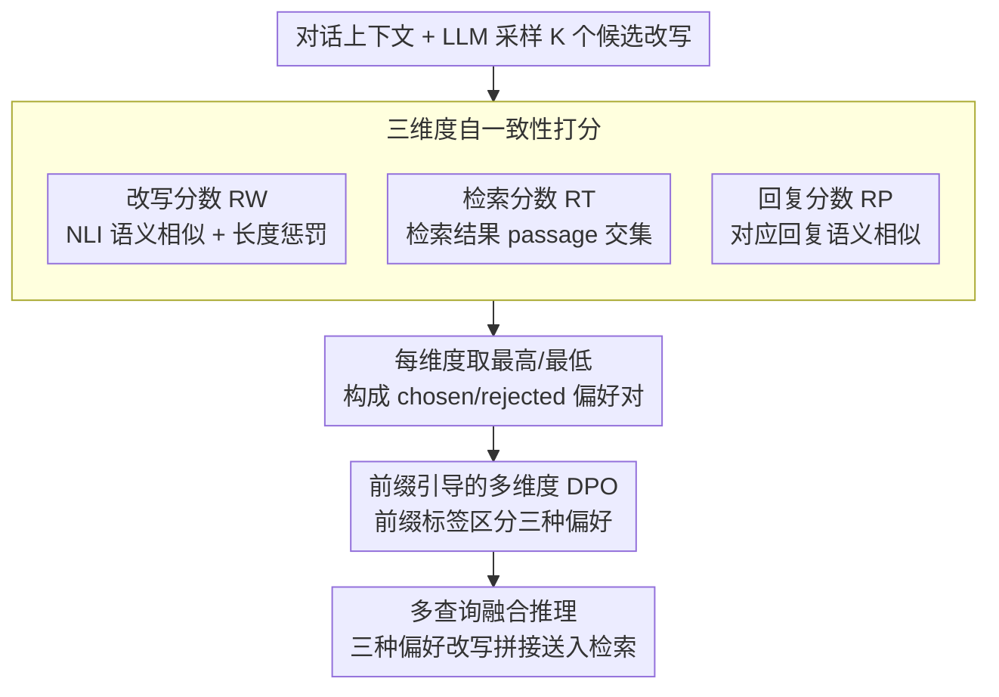

# Multi-Faceted Self-Consistent Preference Alignment for Query Rewriting in Conversational Search

**会议**: ACL 2026 Findings  
**arXiv**: [2604.06771](https://arxiv.org/abs/2604.06771)  
**代码**: 无  
**领域**: 信息检索  
**关键词**: 对话式查询改写, 偏好对齐, 自一致性打分, 多维度DPO, 对话式搜索

## 一句话总结

本文提出 MSPA-CQR，通过从改写、检索、回复三个维度构建自一致性偏好数据，并使用前缀引导的多维度 DPO 优化来训练查询改写模型，在分布内外场景均显著超越现有方法。

## 研究背景与动机

**领域现状**：对话式问答（CQA）中，用户查询往往存在歧义（如指代不清、省略关键词），需要对话式查询改写（CQR）将模糊查询转为完整、自包含的查询，以辅助下游检索。早期方法依赖人工标注的改写作为训练目标，但人工标注成本高昂且往往只优化可读性，并不直接有助于检索。

**现有痛点**：近期研究开始引入检索信号作为反馈，但仍存在两个问题：(1) 只考虑了检索维度的偏好，忽略了改写质量和回复质量的反馈；(2) 偏好数据的构建依赖人工标注的 gold passages，无法推广到无标注数据。

**核心矛盾**：一个好的改写查询应当同时满足三方面需求——改写本身要自包含完整、检索时要包含关键信息避免冗余、对应回复要合理准确。这三个维度的偏好存在差异（Kendall-Tau 相关性仅 0.36-0.58），单一维度的对齐无法兼顾。

**本文目标**：(1) 构建不依赖人工标注的多维度偏好数据；(2) 设计能同时从改写、检索、回复三个维度学习偏好的优化方法。

**切入角度**：受自一致性（Self-Consistency）策略启发，如果多个改写结果在语义上高度一致，说明这些改写更可靠。作者据此设计了三种不同的自一致性打分方法来衡量改写质量。

**核心 idea**：用 LLM 采样多个候选改写，分别从改写语义一致性、检索结果交集、回复语义一致性三个角度打分排序，构建多维度偏好对，再通过前缀引导的 MDPO 让模型学会在不同偏好下生成最优改写。

## 方法详解

### 整体框架

MSPA-CQR 要解决的是：好的对话式改写应当同时满足自包含、检索友好、回复导向三方面需求，但这三个维度的偏好排序差异很大（Kendall-Tau 仅 0.36-0.58），单一维度对齐无法兼顾；而以往引入检索信号的方法又依赖人工标注的 gold passages，难以推广。它的整体流程分两阶段：先用 LLM 对每个对话采样 $K$ 个候选改写，分别从改写、检索、回复三个维度做自一致性打分，挑出 chosen/rejected 偏好对；再用前缀引导的多维度 DPO 训练改写模型，让它在不同偏好标签下都能生成对应的最优改写。推理时为同一对话生成三种偏好导向的改写并拼接，一起送入检索系统。

### 关键设计

**1. 三维度自一致性打分：用采样一致性替代人工标注**

要构建偏好数据却又不依赖 gold passages，作者借自一致性思想——多个改写若高度一致，说明它们更可靠。对 $K$ 个候选改写 $\{rq_i\}$，改写分数 $RW_i$ 用 NLI 模型算它与其余改写的语义相似度均值并加上长度惩罚，衡量自包含性；检索分数 $RT_i$ 计算各改写检索结果之间 passage 交集大小的均值，衡量是否抓住关键信息；回复分数 $RP_i$ 用 NLI 算对应回复之间的语义相似度均值，衡量答案导向性。每个维度取分数最高与最低的改写分别作为 chosen 和 rejected。三种打分各自从不同角度刻画质量，且全程无需任何人工标注，因此能套用到任意无标注对话数据上。

**2. 前缀引导的多维度 DPO：让一个模型区分三种偏好**

三个维度的排序差异显著（最低 Kendall-Tau 仅 0.36），把它们混在一起训练只会互相干扰，但分别训三个模型又太重。MSPA-CQR 的折中是定义前缀标签集 $V = \{[\text{REWRITE}], [\text{RETRIEVAL}], [\text{RESPONSE}]\}$，在每条偏好数据输入前拼上对应标签，训练目标沿用标准 DPO 形式 $\mathcal{L}_{MDPO} = -\mathbb{E}[\log \sigma(\hat{r}_\theta(pr,x,rq^+) - \hat{r}_\theta(pr,x,rq^-))]$，只是靠前缀 $pr$ 让模型把不同维度的偏好区分开。这样单个模型就能同时适应三种偏好，前缀控制轻量却足以避免维度间的冲突。

**3. 多查询融合推理：拼接三种偏好改写覆盖更全的检索需求**

不同偏好的改写各有侧重——自包含偏好补全指代、检索偏好凸显关键词、回复偏好贴近答案，单用一种都会漏掉部分线索。推理时 MSPA-CQR 分别用三个偏好前缀生成三个改写查询，再拼接成一个长查询送进检索系统，效果类似查询扩展，简洁地把三方面需求一次性覆盖。

## 实验关键数据

### 主实验

| 数据集 | 检索器 | 指标 | MSPA-CQR | RETPO (之前SOTA) | 提升 |
|--------|--------|------|----------|------------------|------|
| TopiOCQA | BM25 | MRR | 30.6 | 28.3 | +2.3 |
| TopiOCQA | BM25 | R@100 | 75.2 | 73.1 | +2.1 |
| QReCC | BM25 | MRR | 57.4 | 50.0 | +7.4 |
| QReCC | BM25 | R@100 | 95.2 | 89.5 | +5.7 |
| TopiOCQA | ANCE | MRR | 41.4 | 30.0 | +11.4 |
| QReCC | ANCE | R@10 | 72.3 | 66.7 | +5.6 |

### 消融实验

| 配置 | TopiOCQA MRR | QReCC MRR | 说明 |
|------|-------------|-----------|------|
| Full MSPA-CQR | 30.6 | 57.4 | 完整模型 |
| w/o Retrieval Pref | 下降 | 下降 | 去掉检索偏好后下降 |
| w/o Response Pref | 下降 | 下降 | 去掉回复偏好后下降 |
| w/o Rewrite Pref | 下降 | 下降 | 去掉改写偏好后下降 |
| Single Pref (仅检索) | ~28.3 | ~50.0 | 退化为类 RETPO |

### 关键发现

- 三个偏好维度之间差异显著：TopiOCQA 上改写与检索的 Kendall-Tau 仅 0.36，说明单一偏好无法代替多维度对齐
- 在 OOD 场景下（跨数据集迁移），MSPA-CQR 同样表现稳健，证明多维度对齐提升了泛化能力
- 密集检索（ANCE）场景下提升更为显著（MRR 提升 11.4），表明多维度改写对语义匹配的帮助更大

## 亮点与洞察

- **自一致性打分替代人工标注**：巧妙利用多次采样的一致性来衡量改写质量，完全避免了对 gold passages 的依赖，使方法可以应用于任何无标注对话数据
- **前缀控制多偏好学习**：用简单的前缀标签让单一模型学会区分三种偏好，这比训练三个独立模型高效得多，且推理时可灵活组合
- **三查询融合检索**：推理时生成三个偏好导向的改写并拼接，类似查询扩展的效果，简洁有效

## 局限与展望

- 推理时需要生成三个改写查询并拼接，增加了查询长度和检索延迟
- 仅在英文数据集（TopiOCQA、QReCC）上验证，多语言场景未探索
- LLM 采样多个候选改写的成本较高，偏好数据构建阶段的计算开销不可忽略
- 可探索三个偏好维度的动态加权而非简单拼接

## 相关工作与启发

- **vs RETPO**: RETPO 仅使用检索偏好做 DPO 对齐，且依赖人工标注 gold passages。MSPA-CQR 扩展到三个维度，且用自一致性替代人工标注
- **vs IterCQR**: IterCQR 用检索信号做强化学习，但信号单一。MSPA-CQR 的多维度信号提供更丰富的训练信号
- **vs AdaCQR**: AdaCQR 基于 T5 做适应性改写，MSPA-CQR 用 LLaMA-2-7B 且通过偏好对齐获得更强的泛化能力

## 评分

- 新颖性: ⭐⭐⭐⭐ 三维度自一致性偏好对齐的思路新颖，但核心技术（DPO+前缀控制）相对成熟
- 实验充分度: ⭐⭐⭐⭐ 两个主流数据集、稀疏/密集检索、OOD 评估均覆盖，但消融实验细节可以更完整
- 写作质量: ⭐⭐⭐⭐ 动机推导清晰，方法描述完整
- 价值: ⭐⭐⭐⭐ 对 CQR 领域有实际推进，自一致性打分的思路可迁移到其他偏好对齐场景

<!-- RELATED:START -->

## 相关论文

- [\[ACL 2026\] Agentic Conversational Search with Contextualized Reasoning via Reinforcement Learning](agentic_conversational_search_with_contextualized_reasoning_via_reinforcement_le.md)
- [\[ACL 2026\] Enhancing Multilingual RAG Systems with Debiased Language Preference-Guided Query Fusion](enhancing_multilingual_rag_systems_with_debiased_language_preference-guided_quer.md)
- [\[AAAI 2026\] ReFeed: Retrieval Feedback-Guided Dataset Construction for Style-Aware Query Rewriting](../../AAAI2026/information_retrieval/refeed_retrieval_feedback-guided_dataset_construction_for_style-aware_query_rewr.md)
- [\[ICML 2026\] ReSeek: A Self-Correcting Framework for Search Agents with Instructive Rewards](../../ICML2026/information_retrieval/reseek_a_self-correcting_framework_for_search_agents_with_instructive_rewards.md)
- [\[ACL 2025\] GainRAG: Preference Alignment in Retrieval-Augmented Generation through Gain Signal Synthesis](../../ACL2025/information_retrieval/gainrag_preference_alignment.md)

<!-- RELATED:END -->
