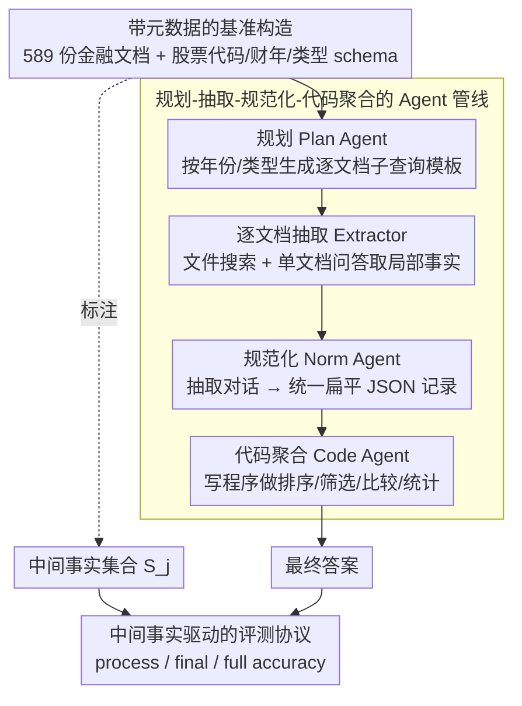

# Navigating Large-Scale Document Collections: MuDABench for Multi-Document Analytical QA

**会议**: ACL2026  
**arXiv**: [2604.22239](https://arxiv.org/abs/2604.22239)  
**代码**: https://github.com/Zhanli-Li/MuDABench  
**领域**: 信息检索 / 多文档问答 / 文档智能  
**关键词**: 多文档分析问答, RAG评测, 金融文档, 元数据规划, Agent工作流

## 一句话总结
这篇论文提出 MuDABench，把多文档问答从“找几个相关片段回答问题”推进到“在大规模半结构化文档集合上做抽取、聚合和定量分析”，并证明普通 RAG 即使扩大召回也很难完成这类任务，而元数据感知的多 Agent 工作流能显著提高结果但仍远落后于人类专家。

## 研究背景与动机
**领域现状**：当前企业知识库、网页问答和文档问答系统里，主流范式通常是 RAG：先把文档切成片段，再从一个近似扁平的语料池里召回少量相关 chunk，最后让 LLM 在一个上下文窗口内生成答案。HotpotQA、2WikiMultiHopQA、MuSiQue、FanOutQA 等多跳问答数据集延续了这种设定，长上下文基准也更多是在考察模型能不能把更长输入装进窗口里。

**现有痛点**：真实的多文档分析任务常常不是“找证据句”，而是“把文档集合当成一个半结构化数据库来做分析”。例如监管机构想知道哪些公司在 2024 年更换了会计师事务所，就需要按公司和年份筛选报告、逐篇抽取会计师事务所字段、对齐 2023 与 2024 的记录，再聚合出发生变更的公司列表。少召回一份报告、错读一个表格或把年份搞混，都会导致最终结论错误。

**核心矛盾**：已有多文档 QA 基准大多只有几个网页或短文档，主要考察跨实体多跳推理；金融文档基准如 FinanceBench 更偏单文档问答，FinAgentBench 更偏检索定位；Aryn、DocETL 等系统工作讨论多步流程，但缺少公开的大规模标准基准。也就是说，现有评测没有把“大量文档 + 显式元数据 + 单文档抽取 + 跨文档聚合 + 数值分析”这一完整链条压到模型系统上。

**本文目标**：作者希望定义一个更贴近真实机构文档分析的任务：给定一个带元数据的金融文档集合和自然语言分析问题，系统需要找出哪些文档相关，从每份文档里抽取必要事实，把事实结构化，再执行排序、比较、方差、增长率等聚合计算，最终给出答案。

**切入角度**：MuDABench 的切入点是利用公开金融披露文档和权威金融数据库之间的对应关系做 distant supervision。结构化数据库提供可核验的指标值，PDF 披露文档提供真实噪声、长文档、表格和跨年份上下文，专家再把结构化指标转写为自然语言中间事实和问题模板。

**核心 idea**：用“金融文档集合 + 元数据 + 中间事实标注”构造多文档分析问答基准，并用“先规划、逐文档抽取、JSON 规范化、代码聚合”的 Agent 工作流来替代扁平 RAG。

## 方法详解
MuDABench 本身既是一个基准，也包含一套面向该基准的参考解法。数据集部分强调如何把真实金融披露材料组织成可评测的多文档分析任务；方法部分则展示为什么普通 RAG 不够，以及一个更结构化的多 Agent 管线应该怎样工作。

### 整体框架

MuDABench 想刻画的是一类被现有基准忽略的任务：把大量带元数据的金融文档当成半结构化数据库来分析，系统要先按公司、年份、文档类型缩小范围，再逐篇抽取事实、结构化对齐、执行排序比较方差增长率等聚合计算，最终给出答案。它的评测输入是问题 $Q_j$、文档集合 $D_j$、元数据集合 $M_j$，并额外标注回答所需的中间事实集合 $S_j$，整个数据集形式化为 $X = \{(Q_j, D_j, M_j, S_j)\}$，从而既检查最终答案，又能定位抽取链条在哪一步断掉。配套的参考系统是一条 metadata-aware 多 Agent 管线，把复杂分析拆成规划→逐文档抽取→JSON 规范化→代码聚合四段，用模块化流程替代一次性的扁平 RAG 查询。

### 关键设计

**1. 带元数据的基准构造：把文档集合当半结构化数据库而非文本块**

真实文档库天然带元数据，忽略这层结构会让 RAG 在巨大语料池里盲目召回。MuDABench 从 cninfo、SEC 等来源收集中国 A 股和美国上市公司的年报、ESG 报告、公告等共 589 份文档、超过 80,000 页，每份文档绑定股票代码、财政年度、文档类型三类元数据，每个问题平均关联 14.8 份 PDF、149.7 页，文档集合由 5 到 38 份 PDF 组成。问题既有单年度统计，也有需要跨年份、条件筛选和计算的复杂查询，如"2022–2023 年收入增长率最高的三家公司"必须先按年份和公司定位文档才谈得上抽数计算。把"文档属于哪个实体、哪个年份、哪种披露类型"显式放进评测环境后，系统就被迫先用 schema 缩小分析空间，再做文档内抽取和跨文档聚合。

**2. 中间事实驱动的评测协议：不只看最终答案，更看抽取链条是否可靠**

多文档分析里，最终答案可能因为偶然数值或宽松 judge 而看似正确，但抽取其实早就错了。MuDABench 用 distant supervision 把权威金融数据库的结构化指标转写成自然语言中间事实集合 $S_j$，并设计两套评测：对标准 RAG，用 LLM-as-judge 判断输出或召回覆盖了多少 gold supporting facts，再用 double-check judge 估计错误遗漏比例得到更保守的覆盖分；对文档对齐的工作流，则把来源表的 metric cell 作为评测单元，算正确抽取 cell 的比例。最终同时报告 process accuracy、final-answer accuracy 和要求过程与答案都对的 full accuracy，使研究者能区分"检索没找到""抽取错了""聚合算错了"等不同失败原因。

**3. 规划-抽取-规范化-代码聚合的 Agent 管线：用结构化流程处理超窗口文档集**

复杂问题常要对几十甚至上千份文档做同类抽取再聚合，让 LLM 一次读完既不现实也容易混淆实体和年份。参考工作流因此把任务拆成四个模块：Plan Agent 读问题和 metadata schema 生成带年份、文档类型限制的逐文档子查询模板；Document-Level Extractor 把模板实例化到具体文档，用文件搜索和单文档问答抽取局部事实；Norm Agent 先从少量样例定义扁平 JSON schema，再批量把抽取对话转成统一记录；Code Agent 只看到 schema、样例和 JSON 路径，写可执行程序在完整结构化数据上完成排序、过滤、比较或统计。把"抽取"和"计算"分开后，数值分析变得可控、可扩展，也避免了一次性长上下文推理的混淆。

### 损失函数 / 训练策略
本文不是提出一个需要训练的新模型，而是提出基准、评测协议和推理工作流。实验中的 RAG 基线使用 OpenAI File Search 与 GPT-4o；Agent 工作流里，规划和代码生成使用 DeepSeek-R1-0528，规范化使用 DeepSeek-Chat-V3-0324，单文档问答仍依赖 OpenAI File Search。所有 LLM 调用 temperature 设为 0，以减少评测随机性。

## 实验关键数据

### 主实验
表 1 汇总了 MuDABench 的主要结果。每组数值依次为 Simple 和 Complex 两类问题上的 process / final / full accuracy。可以看到，普通 RAG 即使把召回 chunk 增加到 $2.5|D|$，最终答案准确率仍很低；工作流的过程覆盖显著更高，但复杂问题的最终答案仍与人类有很大差距。

| 系统配置 | Simple 过程 | Simple 最终 | Simple 严格 | Complex 过程 | Complex 最终 | Complex 严格 |
|----------|-------------|-------------|-------------|--------------|--------------|--------------|
| GPT-4o RAG, chunk = $1|D|$ | 0.1572 | 0.0663 | 0.0241 | 0.1459 | 0.0482 | 0.0181 |
| GPT-4o RAG, chunk = $2|D|$ | 0.1793 | 0.1265 | 0.0422 | 0.2212 | 0.0361 | 0.0181 |
| GPT-4o RAG + metadata, chunk = $2.5|D|$ | 0.2514 | 0.1325 | 0.0542 | 0.2522 | 0.0422 | 0.0120 |
| WF + GPT-4o, chunk = 1 | 0.4179 | 0.0667 | 0.0000 | 0.4021 | 0.0667 | 0.0095 |
| WF + GPT-4.1 mini, chunk = 3 | 0.5803 | 0.2430 | 0.0654 | 0.5338 | 0.0865 | 0.0673 |
| WF + GPT-4.1 mini, chunk = 5 | 0.5888 | 0.2243 | 0.0748 | 0.5749 | 0.1619 | 0.1143 |
| Noise WF + GPT-4.1 mini, chunk = 5 | 0.5961 | 0.1636 | 0.0727 | 0.5680 | 0.1238 | 0.0762 |
| Human Performance | 0.8940 | 0.8334 | 0.7334 | 0.8120 | 0.7334 | 0.6667 |

从这张表能读出两个关键结论。第一，扩大召回更多是在提高 process accuracy，而不是稳定提高最终答案；例如 GPT-4o RAG 从 $1|D|$ 到 $2.5|D|$，Complex process 从 0.1459 到 0.2623，但 final accuracy 仍只有 0.0482。第二，工作流确实更适合这类任务，WF + GPT-4.1 mini chunk = 5 在 Complex final 上达到 0.1619，约为普通 RAG 的 3 倍以上，但与人类的 0.7334 仍不是一个量级。

### 消融实验
论文没有做传统的“去掉模块 A/B”的模型消融，而是用 chunk budget、metadata、噪声文档和步骤级诊断来分析瓶颈。表 2 展示了文档类别与 chunk 数对过程准确率的影响，说明长文档、扫描公告、中文/英文类别都会改变单文档抽取难度。

| 文档类别 | 平均长度 | Chunk=1 Simple | Chunk=1 Complex | Chunk=3 Simple | Chunk=3 Complex | Chunk=5 Simple | Chunk=5 Complex |
|----------|----------|----------------|-----------------|----------------|-----------------|----------------|-----------------|
| A 股年报（中文） | 499k tokens | 0.4696 | 0.4555 | 0.6537 | 0.6674 | 0.6447 | 0.6570 |
| A 股 ESG 报告（中文） | 72k tokens | 0.3998 | 0.3898 | 0.6067 | 0.4813 | 0.5865 | 0.4992 |
| A 股公告（中文） | 144k tokens | 0.3903 | 0.3786 | 0.5222 | 0.4976 | 0.5542 | 0.5575 |
| 美股年报（英文） | 120k tokens | 0.4472 | 0.3955 | 0.3167 | 0.5374 | 0.4643 | 0.7375 |

表 3 是 30 个随机样例上的步骤级错误分析，直接揭示了为什么 end-to-end accuracy 上不去。规划和代码阶段看起来相对可控，规范化在抽样中是满分，但抽取阶段非常脆弱，尤其是复杂问题。

| 步骤 | Simple 独立正确率 | Complex 独立正确率 | 平均 | 在前序正确条件下的平均正确率 | 说明 |
|------|-------------------|--------------------|------|------------------------------|------|
| Planning | 86.7% | 93.3% | 90.0% | 90.0% | 大多数问题能被拆成合理子查询，但金融常识不足会造成方向性错误 |
| Extraction | 40.0% | 20.0% | 30.0% | 25.9% | 主要瓶颈，复杂题在前序正确时仍只有 14.3% |
| Normalization | 100.0% | 100.0% | 100.0% | 100.0% | 抽取结果若正确，扁平 JSON 对齐相对容易 |
| Code | 93.3% | 93.3% | 93.3% | 85.7% | 仍有编码、JSON 路径读取等工程错误 |

### 关键发现
- 普通 RAG 的核心问题不是“召回不够多”这么简单。召回 chunk 数增加后，过程覆盖有所提升，但最终答案经常不升反降，说明 LLM 很难把碎片证据稳定转换成跨文档统计结论。
- metadata 有帮助但不够。把所有元数据放进 prompt 可以给模型粗粒度结构，但如果没有显式规划和逐文档执行，模型仍然会把不同公司、年份和文档类型混在一起。
- Agent 工作流的最大收益来自把任务改写成“表格构建 + 程序分析”。这让复杂分析不再依赖一次性长上下文推理，而是把每份文档的局部事实转成统一 JSON，再用代码完成聚合。
- 主要瓶颈是单文档信息抽取，而不是最后的计算。错误分析显示抽取独立正确率平均只有 30.0%，复杂问题只有 20.0%；一旦某些关键单元格抽错，后面的 JSON 和代码再规范也救不回来。
- 噪声文档会明显拖累最终答案。Noise WF 在 process accuracy 上并不总是更差，但 Simple final 从 0.2243 降到 0.1636，Complex final 从 0.1619 降到 0.1238，说明无关文档会干扰下游聚合与判断。

## 亮点与洞察
- MuDABench 最重要的贡献是把多文档 QA 的难度从“多跳推理”换成“集合分析”。这比传统多跳 QA 更接近真实知识工作：先收集很多局部事实，再做过滤、排序、比较和统计。
- 中间事实标注很有价值。很多文档 QA 数据集只给最终答案，导致系统错误不可诊断；本文把必要事实集合暴露出来，让研究者能看到到底是检索、抽取、规范化还是计算出了问题。
- 元数据不是简单 prompt 装饰，而是任务规划的结构入口。文档集合有股票代码、年份、类型这样的天然 schema，好的系统应该先利用 schema 生成查询计划，而不是把元数据当作附加文本喂给 LLM。
- 用代码做最终聚合是一个可迁移思路。对于科研论文表格抽取、法律案例统计、政策报告审计等任务，也可以先把文档级证据整理成扁平记录，再让程序完成可验证的聚合计算。
- 论文也提醒我们：长上下文并不等于大规模文档分析能力。即使上下文窗口变长，系统仍要解决实体对齐、年份对齐、字段粒度、表格解析、跨文档一致性和计算可执行性。

## 局限与展望
- 领域局限明显。MuDABench 目前集中在金融文档，因为金融数据库有密集、可对齐的结构化事实；其他领域如法律、医学、科研文献是否能用同样方式构造高质量中间事实，还需要进一步验证。
- 数据规模受到成本约束。作者承认 distant supervision 可以继续扩展样本数，但评测代价很高，并且新增样本未必带来新的错误模式。因此 332 个问题更像高难诊断集，而不是海量训练集。
- LLM-as-judge 仍有不确定性。论文用 double-check 和人工抽查提高可靠性，但金融原子事实存在粒度、等价表达和数值容差问题，process accuracy 不能被当成绝对真值。
- 参考工作流依赖闭源或商业服务。实验使用 OpenAI File Search、GPT-4o、GPT-4.1 mini、DeepSeek 系列和商业 PDF parser，这使复现成本与系统可控性仍有门槛。
- 单文档抽取仍是硬问题。长 PDF、扫描公告、复杂表格、当前/上一财政年度同时出现等现象会让模型抽错年份或字段，未来可能需要更强的文档结构解析、表格 grounding 和领域校验机制。
- 代码 Agent 的工程健壮性还需增强。附录案例显示，字段名不一致、缺失 key、JSON 路径读取等小错误会直接导致分析程序失败，后续可以引入 schema validator、类型检查和单元测试式执行反馈。

## 相关工作与启发
- **vs HotpotQA / 2WikiMultiHopQA / MuSiQue / FanOutQA**: 这些数据集强调少量网页之间的多跳组合推理，文档数量少、结构相对简单；MuDABench 强调几十份长 PDF 的集合分析，更接近企业或监管场景。
- **vs LongBench / RULER / LongDocURL / Loong**: 长上下文基准关注模型能否处理更长输入或更多文档，但通常仍假设相关内容能被拼成一个上下文；MuDABench 则要求系统在超过上下文窗口的集合上反复抽取和聚合。
- **vs FinanceBench**: FinanceBench 是金融问答的重要基准，但主要面向单文档 QA；MuDABench 把金融场景扩展到多公司、多年份、多文档类型的分析任务。
- **vs FinAgentBench**: FinAgentBench 更关注 agentic retrieval 能否定位正确文档类型和片段；MuDABench 进一步要求定位之后完成批量抽取、结构化和定量分析。
- **vs DocETL / Aryn**: 这些系统工作提出了多步文档处理流程，但缺少大规模公开评测；MuDABench 提供了可公开比较的任务、数据和中间过程评测信号。
- **对未来系统的启发**: 一个实用的文档分析系统应该像数据库查询执行器，而不仅是聊天式 RAG。它需要 schema-aware planning、document-grounded extraction、严格结构化输出、可执行分析代码和过程级验证共同工作。

## 评分
- 新颖性: ⭐⭐⭐⭐☆ 首次系统化定义大规模半结构化文档集合上的分析型 QA，基准视角很清晰，但参考工作流本身更多是合理组合已有 Agent/RAG 模块。
- 实验充分度: ⭐⭐⭐⭐☆ 主实验、chunk budget、metadata、噪声和步骤级错误分析都覆盖到了，表格信息有诊断价值；不足是样本规模与闭源服务依赖限制了更广泛复现。
- 写作质量: ⭐⭐⭐⭐☆ 任务动机和错误分析写得直接，读者容易理解普通 RAG 为什么失败；部分表格在 HTML/PDF 转换中标签不够友好，方法与实验表位置也略显混乱。
- 价值: ⭐⭐⭐⭐⭐ 这个基准对文档智能、企业知识库、金融监管分析和 Agentic RAG 都很有参考意义，尤其提醒研究者评测端到端答案之外还要看中间事实质量。

<!-- RELATED:START -->

## 相关论文

- [\[ACL 2026\] How Large Language Models Balance Internal Knowledge with User and Document Assertions](how_large_language_models_balance_internal_knowledge_with_user_and_document_asse.md)
- [\[ACL 2026\] Prune-then-Merge: Towards Efficient Multi-Vector Visual Document Retrieval](sculpting_the_vector_space_towards_efficient_multi-vector_visual_document_retrie.md)
- [\[ACL 2026\] UnIte: Uncertainty-based Iterative Document Sampling for Domain Adaptation in Information Retrieval](unite_uncertainty-based_iterative_document_sampling_for_domain_adaptation_in_inf.md)
- [\[ACL 2026\] MAB-DQA: Addressing Query Aspect Importance in Document Question Answering with Multi-Armed Bandits](mab-dqa_addressing_query_aspect_importance_in_document_question_answering_with_m.md)
- [\[ACL 2026\] A Picture is Worth a Thousand Words? An Empirical Study of Aggregation Strategies for Visual Financial Document Retrieval](a_picture_is_worth_a_thousand_words_an_empirical_study_of_aggregation_strategies.md)

<!-- RELATED:END -->
