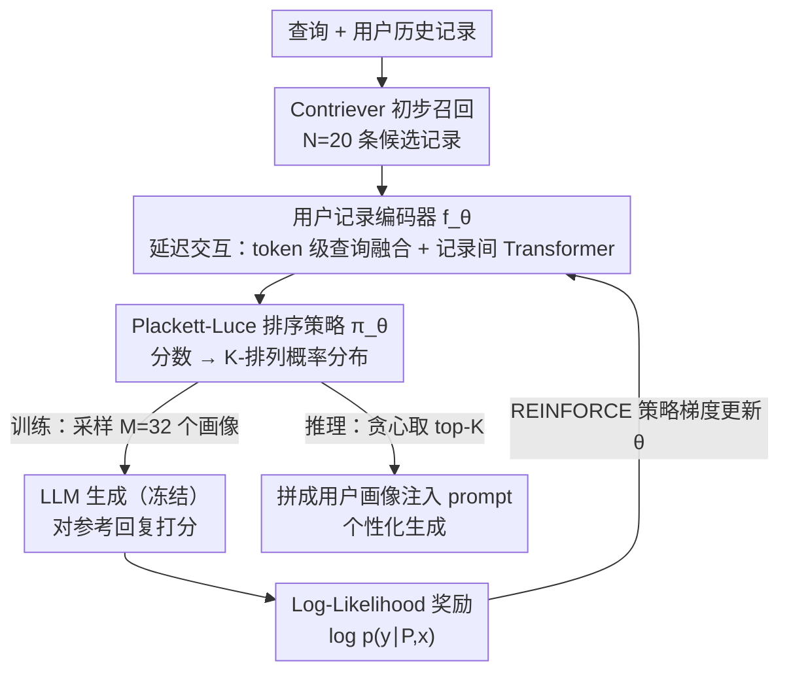

# Optimizing User Profiles via Contextual Bandits for Retrieval-Augmented LLM Personalization

**会议**: ACL 2026  
**arXiv**: [2601.12078](https://arxiv.org/abs/2601.12078)  
**代码**: [GitHub](https://github.com/LinfengDu/PURPLE)  
**领域**: 强化学习  
**关键词**: 用户画像优化、上下文老虎机、RAG个性化、Plackett-Luce排序、策略梯度

## 一句话总结

提出 PURPLE 框架，将检索增强 LLM 个性化中的用户画像构建问题建模为上下文老虎机问题，通过 Plackett-Luce 排序模型捕捉记录间依赖关系，以 LLM 对参考回复的 log-likelihood 作为奖励信号，直接优化检索以匹配生成质量。

## 研究背景与动机

- **领域现状**：LLM 个性化是当前的热门研究方向。基于 RLHF 的参数微调方法计算成本高、不适合大规模实时个性化。检索增强个性化通过将用户历史记录注入 prompt 来引导 LLM 生成个性化回复，轻量、透明、可部署。
- **现有痛点**：现有方法基于语义相关性（relevance）选择历史记录构建用户画像，但相关性并非效用（utility）的可靠代理。一条记录可能与查询语义相似，但因冗余或信息冲突反而损害生成质量。例如用户搜索"轻松的周五夜电影"，基于关键词匹配会优先选含"Friday night"的悬疑片记录，而非真正反映"放松"意图的喜剧片记录。
- **核心矛盾**：(1) 个体记录的效用取决于其他记录的上下文——组合效用非加性，贪心 top-k 选择是次优的；(2) 现有列表式重排器虽能建模依赖关系，但仍受限于相关性导向的监督信号。
- **本文目标**：设计一个直接优化下游生成质量、且对记录间交互敏感的重排机制。
- **切入角度**：将用户画像构建视为顺序敏感的组合选择问题，用上下文老虎机框架通过策略梯度直接优化。
- **核心 idea**：relevance ≠ utility；用 LLM 对参考回复的 log-likelihood 作为语义丰富的奖励信号，训练一个考虑记录间依赖的策略网络。

## 方法详解

### 整体框架

PURPLE 是一个叠在初步检索之上的重排模块：先由 Contriever 为查询召回 $N=20$ 条候选历史记录，再交给一个用户记录编码器为每条记录打一个倾向性分数。和贪心 top-k 不同，它不把记录当作彼此独立的个体，而是把"选哪 $K$ 条、按什么顺序放进画像"建模成一个组合选择问题——训练时用 Plackett-Luce 模型把分数变成有序画像的概率分布，采样若干画像、以 LLM 生成质量为奖励做策略梯度更新；推理时则直接取分数最高的 $K$ 条记录拼成画像注入 prompt。整条链路的输入是查询与候选记录、中间是顺序敏感的画像采样、输出是优化后的个性化生成上下文。

### 关键设计

**1. 用户记录编码器 $f_\theta$：延迟交互建模记录间依赖**

如果把所有候选记录在 token 级一股脑塞进一个编码器联合处理，序列长度会轻易超出上下文窗口。PURPLE 改用延迟交互：先用预训练 Contriever 拿到每条记录的 token 嵌入，让每条记录在 token 级与查询做交叉注意力得到"查询融合"表示，再池化成固定大小的记录嵌入，最后过一层无位置编码的 Transformer 编码器在记录之间互相看一眼。这样既保留了 token 级的细粒度查询-记录交互，又把记录-记录的依赖建模压在可控的计算量内——消融里去掉这层 Transformer 带来的掉点最严重，说明画像级整体建模正是收益来源。

**2. Plackett-Luce 排序策略 $\pi_\theta$：把打分变成顺序敏感的画像采样**

个体记录的效用依赖于和它同时出现的其他记录，所以"选一个集合"还不够，得显式建模"按什么顺序选"。编码器给出的倾向性分数 $f_\theta(h_i; C)\in[0,1]$ 被 PL 模型展开成一个 $K$-排列的概率 $\pi_\theta(P|C) = \prod_{k=1}^{K} f_\theta(p_k)/[S - \sum_{j<k} f_\theta(p_j)]$，即每一步从剩余记录里按归一化分数无放回地抽一条。不同排列对应不同概率，这让策略天然区分先后；训练时按此分布采样、推理时退化为贪心取 top-$K$，采样既高效又可微，正好喂给策略梯度。

**3. Log-Likelihood 奖励：用生成似然替代相关性当训练信号**

相关性不是效用的可靠代理，所以奖励直接对准下游生成质量：$R(\text{LLM}(P\Vert x), y) = \log p_\phi(y|P,x) = \sum_j \log p_\phi(y_j|P,x,y_{<j})$，即冻结的 LLM 对参考回复的 token 级对数似然。比起 Accuracy/ROUGE 这类粗粒度离散指标，连续的 log-likelihood 能进一步区分"勉强可行"和"最优"的画像，给排序提供更细的梯度。作者还证明用它做奖励等价于最大化 RAG 边际化公式的 ELBO，让这个看似启发式的选择有了理论落点。

### 损失函数 / 训练策略

训练用 REINFORCE 策略梯度 $\nabla_\theta J(\theta) = \mathbb{E}[\nabla_\theta \log \pi_\theta(P|C) \cdot R(\text{LLM}(P\Vert x), y)]$：每个样本从 PL 分布采样 $M=32$ 个画像，对奖励做 z-score 归一化以降方差、稳训练。LLM 全程冻结，只更新记录编码器参数 $\theta$；候选池固定 $N=20$、画像大小 $K=5$。

## 实验关键数据

### 主实验（LaMP 基准，6 个任务）

| 方法 | Citation Acc/F1 | Movie Acc/F1 | Rating MAE/RMSE | News RG1/RGL/MT | Scholar RG1 | Tweet RG1 |
|---|---|---|---|---|---|---|
| **Phi-4-Mini (3.84B)** |
| Contriever | 64.6/64.5 | 36.0/31.1 | 0.424/0.830 | 14.6/13.1/12.2 | 39.7 | 38.6 |
| ICR (Llama-3-8B) | 65.2/65.0 | 34.1/29.8 | 0.424/0.830 | 15.0/13.4/12.5 | 39.5 | 38.6 |
| **PURPLE** | **66.0/65.6** | **38.6/34.2** | **0.419/0.808** | **15.1/13.5/12.6** | **40.0** | 39.0 |
| **Llama-3-8B (8.03B)** |
| Contriever | 58.5/58.1 | 47.2/39.1 | 0.314/0.631 | 17.2/15.6/15.1 | 41.1 | 32.1 |
| ICR (Llama-3-8B) | 58.4/57.3 | 48.0/39.3 | 0.312/0.631 | 17.1/15.4/14.9 | 41.3 | 31.8 |
| **PURPLE** | 59.2/**58.8** | **49.6/41.6** | **0.307/0.624** | **17.6/15.9/15.3** | 41.4 | **32.5** |

PURPLE 在 3 种 LLM 规模（3.84B/8B/70B）、9 个任务上一致超越所有基线。

### 消融实验（Phi-4-Mini）

| 变体 | Citation Acc | Movie Acc | Rating MAE | News RG1 |
|---|---|---|---|---|
| PURPLE (Full) | 66.2 | 38.2 | 0.405 | 15.2 |
| w/o Cross-Attention | 64.8 | 35.1 | 0.440 | 14.8 |
| w/o 记录间依赖建模 | 61.3 | 35.0 | 0.449 | 14.5 |
| w/ 指标奖励替代 | 64.8 | 38.0 | 0.433 | 15.0 |

去除记录间依赖建模（Transformer 编码器）导致最大性能下降，验证了画像级整体优化的必要性。

### 关键发现

- **相关性 ≠ 效用**：PURPLE 的倾向性分数提供比原始相关性更有效的排序信号，即使使用比 RankGPT 小得多的模型
- **顺序敏感性有意义**：PURPLE 选出的记录顺序在 120 种排列中最频繁被排为最优，说明其分数确实捕捉了记录间的相对依赖
- **Log-likelihood 奖励跨任务通用**：即使在回归任务（Rating）上，log-likelihood 奖励也优于任务特定指标奖励
- **人工评估领先 14.4%**：在 Tweet 任务的盲测中，评估者以 57.2% vs 42.8% 偏好 PURPLE 生成的结果
- **画像大小 K=5 最优**：增大到 10 或 15 反而略降，验证了效用非单调性假设

## 亮点与洞察

- **问题建模优雅**：将用户画像构建转化为上下文老虎机的组合选择问题，Plackett-Luce 模型天然处理顺序敏感性和组合依赖
- **理论连接深刻**：证明 log-likelihood 奖励对应最大化 RAG 边际化公式的 ELBO，不仅是实验有效的启发式，还有理论支撑
- **实用价值高**：无需微调 LLM，编码器轻量，推理时仅需一次前向传播取 top-K，兼顾效果和效率
- **relevance vs utility 的核心洞察**：这一区分不仅适用于个性化，对所有 RAG 场景都有启发意义

## 局限与展望

- 依赖高质量参考回复计算 log-likelihood 奖励；实际部署中显式监督可能稀疏或不可用（如仅有隐式反馈）
- 当前每个任务独立训练策略，未验证跨任务/跨领域泛化能力
- 候选池大小固定为 20，更大候选池下的效果和效率待验证
- 未来可探索：弱监督/隐式反馈下的训练、多任务统一策略、与 RAG 流水线的更深度集成

## 相关工作与启发

- **REPLUG (Shi et al., 2024)**：通过边际化组合多条检索记录，但独立处理每条记录，无法建模记录间依赖
- **IC-RALM (Ram et al., 2023)**：解码时周期性触发检索并替换上下文，也是逐条独立处理
- **RankGPT (Sun et al., 2023)**：零样本 LLM 重排器，推理成本高且优化目标是相关性而非效用
- **ICR (Chen et al., 2025)**：利用注意力机制的零样本重排，效率较高但仍面向相关性
- **LaMP / LongLaMP (Salemi et al., 2024; Kumar et al., 2024)**：个性化基准，涵盖分类/回归/生成任务
- 启发：将 RAG 的检索优化从相关性导向转向效用导向是一个值得更广泛探索的方向

## 评分

- 新颖性: ⭐⭐⭐⭐⭐ 上下文老虎机 + Plackett-Luce + log-likelihood 奖励的组合非常优雅，relevance vs utility 的洞察深刻
- 实验充分度: ⭐⭐⭐⭐⭐ 9 个任务、3 种 LLM 规模、多种基线、消融、人工评估、敏感性分析
- 写作质量: ⭐⭐⭐⭐⭐ 问题动机的电影推荐例子生动直观，方法推导清晰，理论联系扎实
- 价值: ⭐⭐⭐⭐⭐ 提出了检索增强个性化的新范式，对 RAG 社区有广泛影响力

<!-- RELATED:START -->

## 相关论文

- [\[ACL 2026\] AuthorityBench: Benchmarking LLM Authority Perception for Reliable Retrieval-Augmented Generation](authoritybench_benchmarking_llm_authority_perception_for_reliable_retrieval-augm.md)
- [\[ACL 2026\] MAB-DQA: Addressing Query Aspect Importance in Document Question Answering with Multi-Armed Bandits](mab-dqa_addressing_query_aspect_importance_in_document_question_answering_with_m.md)
- [\[AAAI 2026\] Exposing the Cracks: Vulnerabilities of Retrieval-Augmented LLM-Based Machine Translation](../../AAAI2026/information_retrieval/exposing_the_cracks_vulnerabilities_of_retrieval-augmented_llm-based_machine_tra.md)
- [\[ACL 2025\] Parenting: Optimizing Knowledge Selection of Retrieval-Augmented Language Models with Parameter Decoupling and Tailored Tuning](../../ACL2025/information_retrieval/parenting_optimizing_knowledge_selection_of_retrievalaugmented.md)
- [\[ACL 2026\] How Large Language Models Balance Internal Knowledge with User and Document Assertions](how_large_language_models_balance_internal_knowledge_with_user_and_document_asse.md)

<!-- RELATED:END -->
