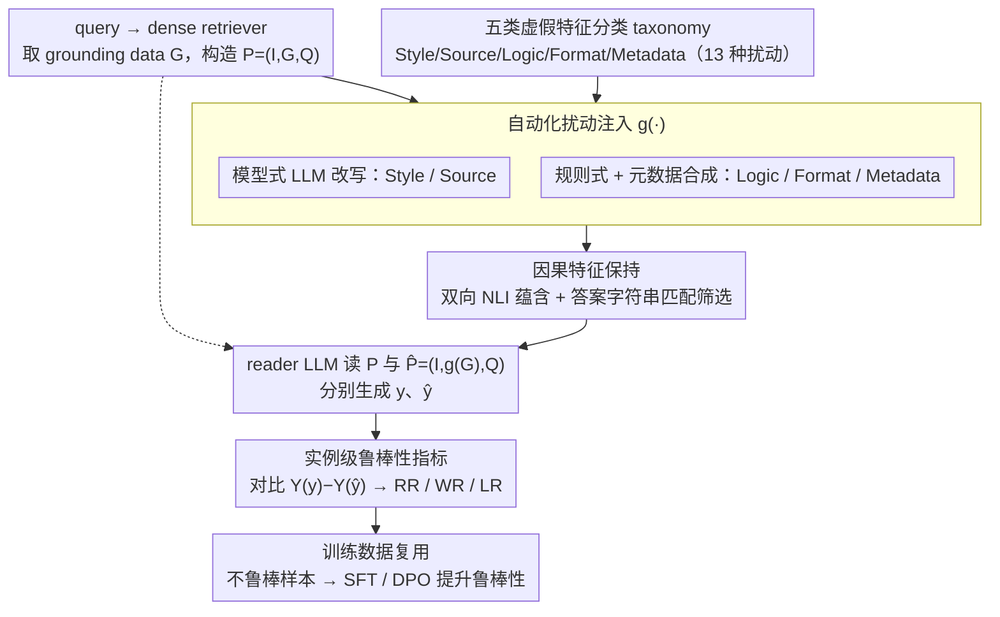

# Quantifying and Improving the Robustness of Retrieval-Augmented Language Models Against Spurious Features in Grounding Data

**会议**: ACL2026  
**arXiv**: [2503.05587](https://arxiv.org/abs/2503.05587)  
**代码**: https://github.com/maybenotime/RAG-SpuriousFeatures  
**领域**: 信息检索 / RAG鲁棒性  
**关键词**: RAG, 虚假特征, 鲁棒性评估, 扰动基准, SFT与DPO

## 一句话总结
本文提出 SURE 框架，系统评估 RAG 生成端对检索文档中风格、来源、逻辑、格式、元数据等语义无关虚假特征的敏感性，并用 SURE 生成的合成数据通过 SFT/DPO 显著提升 RALM 鲁棒性。

## 研究背景与动机
**领域现状**：RAG 通过检索外部文档缓解 LLM 幻觉，已经成为事实问答和知识密集型应用的常见范式。现有鲁棒性研究多关注显式噪声，例如检索到语义错误、无关、矛盾或位置不佳的文档。

**现有痛点**：真实互联网检索结果不仅包含语义噪声，还包含大量语义无关但会影响模型行为的特征：HTML/Markdown/YAML/JSON 格式、句子顺序、来源域名、时间戳、文风复杂度、LLM 改写痕迹等。已有 benchmark 很少系统度量这些“虚假特征”在 RAG 场景下的影响。

**核心矛盾**：同一条 golden document 只要换一种格式或元数据，正确答案并没有变，但 RAG reader 的输出可能从正确变错误。传统 dataset-level accuracy 往往只看总体变化，无法捕捉单个实例在扰动前后的翻转。

**本文目标**：建立一个自动化框架，能在保持文档因果语义不变的前提下批量注入虚假特征，给出实例级鲁棒性指标，并进一步生成可用于训练的鲁棒性数据。

**切入角度**：作者把 RAG 输入拆成 instruction、grounding data 和 query，只改变 grounding data 中与答案语义无关的表面属性，再对比原始与扰动输入下的模型输出。

**核心 idea**：用“扰动-保持-评估”的可控实验框架把虚假特征从 RAG 中显式分离出来，既量化模型敏感性，也把不鲁棒样本转化为训练信号。

## 方法详解
SURE 的完整流程包括四个部分：虚假特征分类体系、扰动注入、因果特征保持、鲁棒性评估。随后作者基于该流程构造 SURE_Wiki 与 SIG_Wiki/SIG_Trivial，并探索 scaling、Chain-of-Note、reasoning model、SFT、DPO 等缓解方式。

### 整体框架
给定 query，retriever 返回若干文档，reader LLM 接收 prompt $P=(I,G,Q)$ 并生成答案。SURE 定义扰动函数 $g(.)$，把 grounding data $G$ 改成 $g(G)$，构造反事实输入 $\hat{P}=(I,g(G),Q)$。如果 $G$ 与 $g(G)$ 的答案语义一致，而模型输出正确性发生变化，就说明 RALM 对该虚假特征不鲁棒。整条流水线自上而下是：分类体系定义要注入哪些虚假特征 → 自动化扰动注入造出反事实文档 → 因果特征保持把"答案变了"的脏样本筛掉 → reader 在原始/扰动两路上分别作答 → 实例级指标量化鲁棒性，并把不鲁棒样本回收去做训练缓解。

### 关键设计

**1. 五类虚假特征 taxonomy：把"互联网文档会怎么变样、但不该改答案"系统编目**

真实检索结果天然异质——同一条 golden document 可能以 HTML、被改写成另一种文风、或带着不同来源域名和时间戳出现，部署时根本无法保证格式、来源、写法统一。作者把这些"表面会变、语义不变"的属性归成五大类共 13 种扰动：Style（simple/complex 两种复杂度）、Source（LLM-generated/self-generated）、Logic（reverse/random/LLM-reranked 句序）、Format（JSON/HTML/YAML/Markdown）、Metadata（timestamp 的 pre/post、datasource 的 wiki/twitter）。把这些特征显式列成一张表，等于先承认它们是真实部署里的风险面，而不是凭空造的玩具扰动，后续的敏感性度量才有落点。

**2. 自动化扰动注入：模型式 + 规则式两条腿，把"造扰动"做成可规模化的流水线**

要在上万条文档上系统注入这 13 种扰动，靠人工改写完全不现实，所以扰动函数 $g(\cdot)$ 必须能自动跑。SURE 按特征类型分两路实现：Style、Source 这类要改文风、改来源、需要语义级改写的扰动，用 LLM（Llama-3.1-70B-Instruct）按精心设计的指令生成；Logic（句序重排）、Format（JSON/HTML/YAML/Markdown）这类有确定规则的扰动，用启发式规则程序生成；Metadata 则先合成时间戳和来源域名再注入文档。模型式负责"语义级改写"、规则式负责"结构级变换"，两路拼起来既覆盖了 taxonomy 的全部五类，又让整个 perturb-then-evaluate 流程不依赖人工、能批量产出反事实样本——这是后面能造出 SURE_Wiki/SIG 等数据集、以及把弱点回收成训练数据的前提。

**3. 因果特征保持机制：扰动只动表面，绝不动答案所依赖的事实**

如果一次扰动顺手改了答案事实，那模型出错到底是被虚假特征带偏、还是因为因果内容变了，就无从分辨。SURE 因此给扰动函数 $g(\cdot)$ 套上双重保险：对模型生成式扰动直接要求语义等价，再用双向 entailment（双向 NLI 蕴含）验证 $G$ 蕴含 $g(G)$ 且 $g(G)$ 蕴含 $G$、二者皆判 entailment 才保留；同时用字符串匹配确认 golden document 里的 ground truth 在扰动后仍然在场，noise document 也不会意外地"长出"正确答案。这两道关把扰动前后约束成一组只差表面属性的反事实对照，让评估尽量接近受控实验，也正好挡住了第 2 步自动注入时难免引入的语义漂移。

**4. 实例级鲁棒性指标与训练数据复用：既量化单题翻转，又把不鲁棒样本回收成训练信号**

dataset-level accuracy 只看总体涨跌，会把"同一道题在扰动前后从对变错"这种不稳定性平均掉。SURE 改成实例级配对：对原始输出 $y$ 和扰动输出 $\hat{y}$ 各判一次正确性，统计 Win Rate、Lose Rate 和 Robustness Rate，于是能区分某个虚假特征是把答案改坏了还是偶然改好了。更巧的是这套配对天然适合做训练数据——对每个不鲁棒实例，SURE 顺手记下 query、正确答案、错误答案、原始 golden passage 和扰动 golden passage，正好凑成 SFT 的稳定监督或 DPO 的偏好对，让"评估发现的弱点"直接闭环回"训练修复弱点"。

### 损失函数 / 训练策略
SURE 的评估阶段不训练模型，主要通过 perturb-then-evaluate 得到 RR/WR/LR。缓解阶段作者使用两种训练策略：SFT 把原始和扰动 golden passage 都配上正确答案，训练模型稳定输出正确答案；DPO 把正确答案作为 preferred、错误答案作为 rejected，分别结合原始和扰动 passage 构造偏好样本。实验以 Llama-3.1-8B-Instruct 为 backbone，在超过 30k 样本上训练 2 个 epoch，并在 SIG_Wiki 和跨域 SIG_Trivial 上评估。

## 实验关键数据

### 主实验

| 数据 / 模型 | Style RR | Source RR | Logic RR | Format RR | Meta RR | 说明 |
|-------------|----------|-----------|----------|-----------|---------|------|
| SIG_Trivial Mistral-7B | 88.0 | 94.0 | 94.5 | 94.0 | 99.0 | Bing + TrivialQA，字符串评估 |
| SIG_Trivial Mistral-7B Judge | 90.5 | 91.5 | 92.0 | 93.8 | 96.0 | LLM-as-Judge 结果接近 |
| SIG_Trivial Llama-3.1-8B | 87.5 | 93.5 | 93.0 | 90.8 | 97.0 | 开源 reader |
| SIG_Trivial Llama-3.1-8B Judge | 85.0 | 92.0 | 91.0 | 90.8 | 93.3 | 验证字符串指标可靠性 |

### 消融实验

| 方法 | Style | Source | Logic | Format | Meta | 数据集 |
|------|-------|--------|-------|--------|------|--------|
| Llama3.1-8B | 10.0 | 15.5 | 20.0 | 24.0 | 94.0 | SIG_Wiki |
| + SFT | 96.5 | 94.5 | 99.0 | 99.5 | 99.7 | SIG_Wiki |
| + DPO | 96.5 | 96.0 | 96.0 | 98.0 | 98.0 | SIG_Wiki |
| Llama3.1-8B | 87.5 | 93.5 | 93.0 | 90.8 | 97.0 | SIG_Trivial |
| + SFT | 88.5 | 91.5 | 95.0 | 96.3 | 99.0 | SIG_Trivial |
| + DPO | 94.5 | 94.5 | 97.3 | 95.8 | 98.0 | SIG_Trivial |

### 关键发现
- 在 SURE_Wiki 上，不同扰动类别的影响差异明显；同一类别内部的 RR 较接近，但 WR/LR 可显著不同，说明某些虚假特征有时反而会纠正模型。
- 对 Mistral-7B-Instruct，格式扰动中的 HTML 对 Known-Golden 的 Lose Rate 达到 9.30，高于 JSON/YAML/Markdown，说明结构格式会显著影响 reader。
- 六个 SOTA 模型在 SIG_Wiki 上都存在特定敏感点，即使 GPT-4o 在 datasource(twitter) 上也只有约 89% RR。
- Chain-of-Note 和 DeepSeek-R1 并不能可靠解决问题：DeepSeek-V3 的 Style RR 为 96.5，而 DeepSeek-R1 降到 84.5，说明更强推理不等价于对虚假特征更稳。
- 注意力分析显示，输出改变的 Win/Lose 样本比 Robust 样本有更大的答案 span 注意力变化；Robust 的 $\Delta A$ 为 6.52e-5，Lose 为 1.15e-4，Welch t-test 得到 p=0.046。

## 亮点与洞察
- 论文把“语义不变但表面变化”系统引入 RAG 评估，这比单纯添加无关文档更贴近真实搜索环境。
- RR/WR/LR 的实例级配对指标很实用：它不只告诉模型准确率变了多少，还能区分扰动让答案变好还是变坏。
- 训练数据复用设计很自然。SURE 不是只做 benchmark，而是把评估中发现的不鲁棒样本转成 SFT/DPO 数据，形成闭环。
- 结果提醒我们：RAG pipeline 中的文档清洗、格式保留和元数据处理不是中性预处理，它们可能直接改变模型输出。

## 局限与展望
- 作者承认 taxonomy 无法穷尽所有虚假特征，真实网页还可能包含广告、模板、导航栏、表格布局、脚注等更复杂因素。
- 当前评估主要聚焦 QA 任务和英文 Wikipedia / open web，长文档、多跳推理、跨语言 RAG 和企业私有文档仍需验证。
- 字符串匹配虽然高效，但对别名、释义式回答和数值格式可能不够灵活；LLM-as-Judge 只做了补充验证。
- SFT 在 in-domain SIG_Wiki 上极强，但在 SIG_Trivial 上部分指标不如 DPO，说明训练式缓解仍有域泛化问题。
- 训练缓解需要全参数微调和 A100 级资源，轻量 adapter 或推理时标准化策略值得继续研究。

## 相关工作与启发
- **vs 显式噪声 RAG benchmark**: 过去常研究无关文档、矛盾文档和文档位置，本文关注的是不改变语义的 spurious feature，更像对 prompt sensitivity 的 RAG 化扩展。
- **vs prompt format sensitivity**: Sclar、He 等工作证明 LLM 对 prompt 格式敏感；本文把这种敏感性移动到 grounding data 层面，发现检索文档的格式同样关键。
- **vs Chain-of-Note**: CoN 针对显式噪声设计，要求模型先写 rationale；本文实验显示 COT-style 方法对虚假特征不一定有效。
- **vs DPO/SFT 鲁棒训练**: 本文不是泛泛地做偏好优化，而是用成对原始/扰动 passage 构造数据，目标更明确地对齐“同一事实不同表面”的一致性。

## 评分
- 新颖性: ⭐⭐⭐⭐ 将 spurious feature 系统化到 RAG grounding data 中，很有问题定义价值。
- 实验充分度: ⭐⭐⭐⭐⭐ taxonomy、两套 benchmark、多模型、prompting、scaling、训练缓解和注意力分析都很完整。
- 写作质量: ⭐⭐⭐⭐ 框架清晰，表格密集但信息充分。
- 价值: ⭐⭐⭐⭐⭐ 对真实 RAG 部署、文档预处理和鲁棒训练都有直接参考意义。

<!-- RELATED:START -->

## 相关论文

- [\[ECCV 2024\] Grounding Language Models for Visual Entity Recognition](../../ECCV2024/information_retrieval/grounding_language_models_for_visual_entity_recognition.md)
- [\[ACL 2025\] When Claims Evolve: Evaluating and Enhancing the Robustness of Embedding Models Against Misinformation Edits](../../ACL2025/information_retrieval/when_claims_evolve_evaluating_and_enhancing_the_robustness_of_embedding_models_a.md)
- [\[ACL 2026\] Conjecture and Inquiry: Quantifying Software Performance Requirements via Interactive Retrieval-Augmented Preference Elicitation](conjecture_and_inquiry_quantifying_software_performance_requirements_via_interac.md)
- [\[AAAI 2026\] Do Retrieval Augmented Language Models Know When They Don't Know?](../../AAAI2026/information_retrieval/do_retrieval_augmented_language_models_know_when_they_dont_know.md)
- [\[ACL 2025\] Investigating the Robustness of Retrieval-Augmented Generation at the Query Level](../../ACL2025/information_retrieval/investigating_the_robustness_of_retrieval-augmented_generation_at_the_query_leve.md)

<!-- RELATED:END -->
