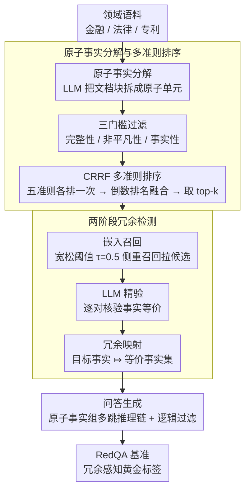

# RARE: Redundancy-Aware Retrieval Evaluation Framework for High-Similarity Corpora

**会议**: ACL 2026  
**arXiv**: [2604.19047](https://arxiv.org/abs/2604.19047)  
**代码**: 无  
**领域**: 信息检索/RAG  
**关键词**: 冗余感知检索, 高相似语料库, 多跳检索评估, 企业级RAG, 原子事实分解

## 一句话总结

本文提出 RARE 框架，通过将文档分解为原子事实来追踪跨文档冗余，并设计 CRRF（基于独立准则排序的倒数排名融合）稳定 LLM 多准则判断，在金融/法律/专利等高冗余企业语料上构建了 RedQA 基准，揭示主流检索器在 4-hop 高重叠设置下 PerfRecall@10 从 66.4% 暴跌至 5.0-27.9%。

## 研究背景与动机

**领域现状**：现有 QA 基准（如 HotpotQA、NQ、MS MARCO）假设文档间信息重叠极低，每个答案对应唯一的黄金段落。主流检索评估方案在这些"低重叠"语料上运行良好，推动了稠密检索技术的快速发展。

**现有痛点**：(1) 企业级 RAG 系统实际运行在金融年报、法律条文、专利文件等语料上，这些语料天然具有高冗余和高相似性——同一事实在多个段落中以略有不同的形式反复出现；(2) 在高冗余场景下，检索器返回了包含正确答案信息的"非源段落"时会被不公正地惩罚；(3) 现有基准上的优异表现会高估模型在企业部署中的真实鲁棒性。

**核心矛盾**：现有检索评估的核心假设——每个答案有唯一黄金段落——在企业语料中根本不成立。需要一种能够系统性追踪跨文档信息冗余、并将冗余纳入评估标签的框架。

**本文目标**：(1) 构建一个通用框架让实践者能在自己的领域语料上构建真实反映部署条件的 RAG 评估基准；(2) 量化现有基准与企业语料之间的差距。

**切入角度**：将文档分解为最小不可分割的"原子事实"单元，在原子粒度上进行冗余追踪——原子事实比段落级表示在嵌入空间中噪声更低，使得语义相似性与事实等价性之间的差距更小，LLM 等价判断更可靠。

**核心 idea**：通过原子事实分解 + 两阶段冗余检测（嵌入检索 + LLM 验证）构建冗余感知的黄金标签集，同时用 CRRF（准则分离 + 倒数排名融合）稳定 LLM 的多准则判断，解决数据生成中的质量控制问题。

## 方法详解

### 整体框架

RARE 是一条把领域文档语料变成冗余感知多跳 QA 基准的数据构建流水线，核心是先把粒度从"段落"降到"原子事实"，再在这个细粒度上追踪跨文档的冗余。它分三步走：先做有效信息选择，把文档块拆成原子事实、过滤掉无效单元并按质量排序；再做系统性冗余追踪，在原子粒度上找出散落于不同段落却语义等价的事实；最后做问答生成，把原子事实组合成多跳推理链、经逻辑过滤后产出题目。输入是金融/法律/专利等领域语料，输出是带冗余黄金标签的基准 RedQA——检索器即使命中"非源段落"，只要它承载等价事实也能被公正判对。

### 关键设计

**1. 原子事实分解与多准则排序：把段落拆成可追踪、可组合的最小单元**

段落里多个事实交织在一起，既不利于精确追踪冗余，也难当多跳问题的搭积木。RARE 先用 LLM 把每个文档块 $C$ 分解成原子信息单元 $\mathcal{A} = f_{\text{LLM}}(C)$，过三条最低门槛（完整性、非平凡性、事实性）剔除碎片，再让剩余单元按五个质量维度（有效性、完整性、具体性、清晰性、可问性）经 CRRF 排序、取 top-$k$ 进入后续流程。原子粒度隔离了单一声明，使语义相似度与事实等价度之间的鸿沟更小——既支撑下一步精确的冗余判断，又提供灵活的多跳组合模块。

**2. 两阶段冗余检测：嵌入召回 + LLM 精验构建黄金证据集**

纯靠嵌入相似度会把"像但不等价"的事实误判为冗余，纯靠 LLM 逐对验证又太贵，所以 RARE 把召回和精确拆成两段。第一阶段用嵌入相似度以宽松阈值 $\tau=0.5$（侧重召回）拉出候选冗余集 $\mathcal{C}_\tau(a_t)$，确保不漏掉等价事实；第二阶段对候选用 LLM 判断 $\phi(a_t, a_j)$ 逐对核验事实等价性，最终给每个目标原子事实 $a_t$ 记下一张冗余映射 $a_t \mapsto \mathcal{R}(a_t)$。这张映射就是冗余感知评估的依据：答案信息出现在映射里的任一段落，都算检索命中。

**3. CRRF：准则分离的倒数排名融合，稳住 LLM 的多准则判断**

让 LLM 一次性平衡五个竞争准则做联合排序时输出很不稳定，而且它跨准则的置信度分数本就校准很差。CRRF 反其道而行：对每个准则单独发起一次 LLM 调用拿到 per-criterion 排名 $\text{rank}_i(x)$，再用倒数排名融合算综合分 $s(x) = \sum_{i=1}^{N} \frac{1}{\text{rank}_i(x)}$，整个过程完全丢弃 LLM 的置信度数值、只信序数偏好。准则分离减少了相互干扰，序数融合又比校准概率可靠——消融显示分离比联合提升 11%、RRF 聚合比分数聚合再提升 18%。

### 损失函数 / 训练策略

RARE 是数据构建框架，不涉及端到端训练。流程中 LLM 全程以推理模式使用（GPT-5 Nano 做判断、GPT-5 做问题生成），text-embedding-3-large 负责相似度计算。

## 实验关键数据

### 主实验

**跨领域检索性能（Qwen3-8B）**

| 领域 | Coverage@10 | PerfRecall@10 | 冗余率(%) | 相似度(%) |
|------|------------|---------------|----------|----------|
| General-Wiki | 93.58 | 88.66 | 1.4 | 8.8 |
| Patent | 84.05 | 63.12 | 49.7 | 29.0 |
| Finance | 72.92 | 47.44 | 63.2 | 35.1 |
| Legal | 67.16 | 41.49 | 25.1 | 40.7 |

### 消融实验

**CRRF 策略消融（NDCG@3）**

| 提示策略 | 聚合方式 | GPT-5 Nano | GPT-5 |
|---------|---------|-----------|-------|
| Vanilla | Base | 0.352 | 0.341 |
| Combined | RRF | 0.419 | 0.410 |
| Separate | Base | 0.391 | 0.387 |
| **Separate (CRRF)** | **RRF** | **0.463** | **0.467** |

### 关键发现

- 检索性能下降主要由文档相似度驱动而非冗余度——Legal 相似度最高（40.7%）但冗余度最低（25.1%），PerfRecall@10 却最差（41.49%），说明近似文档的"混淆效应"比冗余的"备选路径效应"更强
- 随 hop 深度增加，性能急剧退化：Finance 从 1-hop 的 90.1% 暴跌至 4-hop 的 8.5%，而 General-Wiki 在 4-hop 仍保持 66.4%
- CRRF 中准则分离比联合提示提升 11%（0.419→0.463），RRF 聚合比分数聚合在分离提示下提升 18%（0.391→0.463）
- 端到端 RAG 实验表明检索质量是主导杠杆——命中单元的准确率远高于未命中单元

## 亮点与洞察

- 原子事实分解的思路非常巧妙——不仅解决了冗余追踪的粒度问题，还天然提供了多跳问题的组合模块。这种"先拆后组"的思路可迁移到任何需要精确内容追踪的场景
- CRRF 是一个简单但有效的 LLM 判断稳定化配方——准则分离 + 排名融合的思路可以直接应用于任何需要 LLM 做多准则评估的任务（如论文审稿、数据质量评估）
- 文档相似度比冗余度更能预测检索退化这一发现对 RAG 系统设计有重要启示——部署前应优先评估语料的文档间相似度而非冗余度

## 局限与展望

- 依赖 LLM 判断（GPT-5/GPT-5 Nano）进行生成和验证，继承了模型特定的偏差
- 嵌入相似度阈值 $\tau=0.5$ 固定，最优设置可能因领域而异
- 随 hop 深度增加，部分生成的问题变得列表化——虽然逻辑有效但不够自然
- 未来可扩展到非英文语料、更多企业领域

## 相关工作与启发

- **vs HotpotQA/NQ**: 假设文档间低重叠，不适合企业级 RAG 评估。RARE 显式建模高重叠场景
- **vs BEIR/MTEB**: 提供标准化检索评估但依赖静态标注，无法反映部署时的冗余动态
- **vs PoisonedRAG**: 关注检索投毒攻击，RARE 关注评估公平性——冗余不是威胁而是应被正确标注的特性

## 评分

- 新颖性: ⭐⭐⭐⭐ 原子事实冗余追踪+CRRF是新颖的组合，但各组件有先例
- 实验充分度: ⭐⭐⭐⭐⭐ 4领域9检索器+CRRF消融+人工评估+端到端RAG分析
- 写作质量: ⭐⭐⭐⭐⭐ 问题动机清晰，框架模块化，实验设计严谨
- 价值: ⭐⭐⭐⭐⭐ 填补了企业级RAG评估的关键空白，CRRF可广泛复用

<!-- RELATED:START -->

## 相关论文

- [\[ACL 2026\] Reliable Evaluation Protocol for Low-Precision Retrieval](reliable_evaluation_protocol_for_low-precision_retrieval.md)
- [\[ACL 2026\] Disco-RAG: Discourse-Aware Retrieval-Augmented Generation](disco-rag_discourse-aware_retrieval-augmented_generation.md)
- [\[ACL 2025\] Evaluation of Attribution Bias in Generator-Aware Retrieval-Augmented Large Language Models](../../ACL2025/information_retrieval/evaluation_of_attribution_bias_in_generator-aware_retrieval-augmented_large_lang.md)
- [\[ACL 2025\] When Should Dense Retrievers Be Updated in Evolving Corpora? Detecting Out-of-Distribution Corpora Using GradNormIR](../../ACL2025/information_retrieval/when_should_dense_retrievers_be_updated_in_evolving_corpora_detecting_out-of-dis.md)
- [\[ACL 2026\] MTR-Suite: A Framework for Evaluating and Synthesizing Conversational Retrieval Benchmarks](mtr-suite_a_framework_for_evaluating_and_synthesizing_conversational_retrieval_b.md)

<!-- RELATED:END -->
