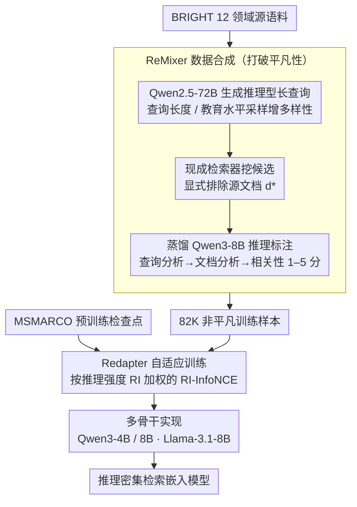

# ReasonEmbed: Enhanced Text Embeddings for Reasoning-Intensive Document Retrieval

**会议**: ACL 2026  
**arXiv**: [2510.08252](https://arxiv.org/abs/2510.08252)  
**代码**: [https://github.com/VectorSpaceLab/agentic-search/tree/main/ReasonEmbed](https://github.com/VectorSpaceLab/agentic-search/tree/main/ReasonEmbed)  
**领域**: 信息检索 / 推理密集检索  
**关键词**: 文本嵌入, 推理密集检索, 合成数据, 自适应训练, BRIGHT基准

## 一句话总结

ReasonEmbed 提出三项技术创新——ReMixer 非平凡合成数据方法（82K 高质量样本）、Redapter 自适应推理强度加权训练和多骨干实现——在 BRIGHT 基准上以 38.1 的 nDCG@10 显著超越所有现有文本嵌入模型约 10 个点。

## 研究背景与动机

**领域现状**：随着 LLM 驱动的 AI agent 兴起，许多场景需要从外部文档中检索信息。传统检索（BM25、通用嵌入模型）依赖关键词匹配或浅层语义匹配，在 BRIGHT 等推理密集检索基准上表现不佳。

**现有痛点**：(1) 训练数据匮乏——现有检索数据集来自传统搜索场景，与推理密集检索在查询形式和领域知识上差异巨大；(2) 合成数据存在平凡性问题——已有合成方法生成的查询与文档间存在过于直接的关系（相似词、关键词重叠），模型通过表面匹配即可获得高分；(3) 现有方法收效甚微——ReasonIR 等先驱工作仅带来边际提升。

**核心矛盾**：推理密集检索需要模型理解查询与文档之间的深层语义关系（需多步推理才能判断相关性），但现有合成数据的平凡性让模型走了捷径——学到的是表面模式而非推理能力。

**本文目标**：解决合成数据平凡性问题，设计推理强度感知的训练策略，构建高效的推理密集检索嵌入模型。

**切入角度**：作者发现"平凡性"是核心瓶颈——如果正样本就是生成查询所用的源文档，两者共享大量表面线索。通过排除源文档、从独立检索中挖掘候选、再用推理增强标注筛选正样本，可以构建真正需要推理才能判别的训练数据。

**核心 idea**：用"源文档排除+候选挖掘+推理标注"三阶段流程消除平凡性，再用推理强度（reasoning intensity）自适应调整样本权重，让模型重点学习需要深度推理的困难样本。

## 方法详解

### 整体框架

ReasonEmbed 的目标是训出能做推理密集检索的文本嵌入，难点在于现有合成数据"太平凡"——正样本往往就是生成查询所用的源文档，两者共享大量表面线索，模型靠词面匹配就能拿高分、根本学不到推理。它围绕一条数据驱动的链路解决这件事：先用 ReMixer 三阶段流程从 BRIGHT 的 12 个领域语料合成 82K 条非平凡样本（Qwen2.5-72B 生成条件化查询、现成检索器挖候选、蒸馏的 Qwen3-8B 推理标注器打标签），再用 Redapter 按样本的推理强度自适应加权、在 MSMARCO 预训练检查点上以 RI-InfoNCE 损失继续训练，最后在多个 LLM 骨干上复现以验证普适性。输入是领域语料、产物是一个把"需要推理才判得出相关"的能力学进参数里的嵌入模型。

### 关键设计

**1. ReMixer 数据合成：用源文档排除打破"平凡性"**

合成数据的根本病在于查询和它的源文档之间存在过直接的连接，模型走表面匹配的捷径就能命中。ReMixer 分三阶段拆掉这条捷径：先用 Qwen2.5-72B 从源文档生成需要推理的长查询，并通过查询长度采样、用户教育水平采样增加多样性；关键一步是候选挖掘时显式排除源文档 $d_q^*$，改用现成检索器从其余语料里捞候选 $\mathcal{C}_q \leftarrow \text{Top-k}\{\phi(q,d) \mid D/d_q^*\}$；最后用蒸馏的推理 LLM 做三阶段标注（查询分析→文档分析→相关性判断，1–5 分制）筛出正样本。排除源文档后，正样本变成"形式不同但本质相关"的文档，模型只有真正推理才能发现这层关系——消融里这正是 +18.4 点的主来源。

**2. Redapter 自适应训练：按推理强度把算力倾斜给困难样本**

简单样本很快饱和，继续在它们身上训练是浪费，真正值得多看几眼的是那些需要深度推理的样本。Redapter 给每个样本量化一个推理强度 $\text{RI}_\theta(s) = \min(\mathcal{L}_{q,D} / \mathcal{L}_{q',D}, \kappa)$，其中 $q'$ 是推理增强后的查询——这个比值越大，说明把查询改写得更"会推理"对检索的帮助越大，即原样本越依赖推理才能正确检索。训练时把推理强度归一化后当作 InfoNCE 损失的样本权重，让梯度向高推理强度的困难样本倾斜。这个量无需额外标注、可在训练中动态算出。

**3. 多骨干实现：验证收益来自数据与训练而非某个模型**

为排除"提升是特定骨干带来的"这种解释，ReasonEmbed 在 Qwen3-4B、Qwen3-8B、Llama-3.1-8B 三个骨干上分别实现，且都从同一个 MSMARCO 预训练检查点初始化。三者一致大幅领先（Llama-3.1-8B 也到 36.2），说明真正起作用的是去平凡化的数据和推理强度加权的训练策略。

### 损失函数 / 训练策略

训练用 RI-InfoNCE 损失 $\mathcal{L}_{RI} = \sum_{s \in B} f(\text{RI}_\theta(s), B) \cdot \mathcal{L}_{q,D}$，其中 $f$ 是批次内推理强度归一化函数、$\mathcal{L}_{q,D}$ 是标准 InfoNCE（含 1 个正样本与批次内负样本 + 硬负样本）。标注器是把 Qwen3-235B 的推理轨迹蒸馏到 Qwen3-8B 得到的轻量模型，兼顾标注质量与成本。

## 实验关键数据

### 主实验（BRIGHT nDCG@10）

| 模型 | 规模 | 平均 nDCG@10 |
|------|------|-------------|
| BM25 | - | 14.5 |
| OpenAI-3-Large | - | 17.9 |
| gte-Qwen2-7B | 7B | 23.5 |
| ReasonIR-8B | 8B | 24.4 |
| DIVER-Retriever | 4B | 28.9 |
| **ReasonEmbed-Qwen3-4B** | 4B | **37.1** |
| **ReasonEmbed-Qwen3-8B** | 8B | **38.1** |

### 消融实验

| 配置 | 平均 nDCG@10 | 说明 |
|------|-------------|------|
| Qwen3-8B 基础 InfoNCE | 37.1 | 仅用 ReMixer 数据 |
| Qwen3-8B + Redapter | **38.1** | +1.0 来自自适应权重 |
| Qwen3-8B-ms (MSMARCO only) | 18.7 | 无合成数据 |

### 关键发现

- ReasonEmbed-Qwen3-4B (37.1) 已超越所有现有模型，比最强基线 DIVER (28.9) 高 8.2 个点
- ReMixer 数据是主要贡献源——从 18.7 提升到 37.1 (+18.4)，Redapter 额外贡献 +1.0
- 在所有 12 个子任务中一致大幅领先，尤其在 StackExchange 类（需要领域推理）和 Coding 类（需要代码推理）上提升最大
- Llama-3.1-8B 骨干同样有效 (36.2)，证明方法不依赖特定模型
- 去平凡化是核心——直接用源文档作正样本训练的模型性能远低于 ReMixer

## 亮点与洞察

- "平凡性"概念的提出和验证非常有价值——揭示了现有合成数据方法的根本缺陷。"排除源文档、独立挖掘候选"这个简单操作带来了巨大提升，说明数据质量比数量重要得多
- 推理强度定义巧妙——用推理改写查询后 loss 的变化比例来量化"推理对检索的帮助程度"，无需额外标注，可在训练中动态计算
- 将推理 LLM 蒸馏为轻量标注器的做法平衡了标注质量和成本

## 局限与展望

- 评估主要在 BRIGHT 基准上，可能存在对该基准特征的过拟合
- 合成数据来自 BRIGHT 的 12 个源语料，领域覆盖有限
- Redapter 的贡献 (+1.0) 相对 ReMixer (+18.4) 较小，自适应策略的价值需要更多验证
- 推理强度阈值 $\kappa$ 的选择依赖经验

## 相关工作与启发

- **vs ReasonIR**: ReasonIR 用科学语料合成长查询和硬负样本但未解决平凡性问题（24.4）。ReasonEmbed 通过源文档排除彻底解决平凡性（38.1），提升 13.7 个点
- **vs DIVER**: DIVER 使用更复杂的检索增强生成（28.9），但仍受平凡性困扰。ReasonEmbed 证明数据质量的根本改善比方法复杂度更有效

## 评分

- 新颖性: ⭐⭐⭐⭐ 平凡性问题的识别和解决思路新颖，推理强度自适应训练有价值
- 实验充分度: ⭐⭐⭐⭐⭐ 12 个子任务、多骨干、消融完整，提升幅度巨大
- 写作质量: ⭐⭐⭐⭐ 结构清晰，问题定义精确
- 价值: ⭐⭐⭐⭐⭐ 在 BRIGHT 上创历史新高（+10 点），对推理密集检索领域有重大推动

<!-- RELATED:START -->

## 相关论文

- [\[ACL 2026\] A Survey of Reasoning-Intensive Retrieval: Progress and Challenges](a_survey_of_reasoning-intensive_retrieval_progress_and_challenges.md)
- [\[ACL 2026\] VisRet: Visualization Improves Knowledge-Intensive Text-to-Image Retrieval](visret_visualization_improves_knowledge-intensive_text-to-image_retrieval.md)
- [\[AAAI 2026\] PRIME: Planning and Retrieval-Integrated Memory for Enhanced Reasoning](../../AAAI2026/information_retrieval/prime_planning_and_retrieval-integrated_memory_for_enhanced_reasoning.md)
- [\[ACL 2026\] Why Mean Pooling Works: Quantifying Second-Order Collapse in Text Embeddings](why_mean_pooling_works_quantifying_second-order_collapse_in_text_embeddings.md)
- [\[ICLR 2026\] RefTool: Reference-Guided Tool Creation for Knowledge-Intensive Reasoning](../../ICLR2026/information_retrieval/reftool_reference-guided_tool_creation_for_knowledge-intensive_reasoning.md)

<!-- RELATED:END -->
