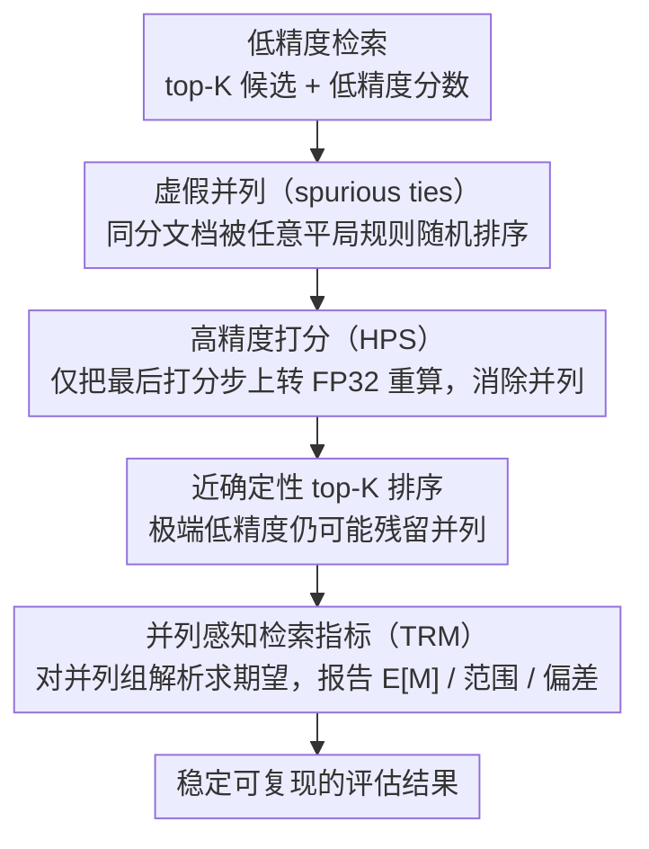

# Reliable Evaluation Protocol for Low-Precision Retrieval

**会议**: ACL 2026  
**arXiv**: [2508.03306](https://arxiv.org/abs/2508.03306)  
**代码**: 无  
**领域**: 其他  
**关键词**: 低精度检索, 虚假并列, 评估协议, 高精度打分, 并列感知指标

## 一句话总结

揭示低精度（如二值化/量化嵌入）检索系统在评估时因分数粒度降低产生大量虚假并列（spurious ties），导致评估结果高度不稳定，提出 HPS（高精度打分）和 TRM（并列感知指标）两种互补策略，使低精度检索的评估更可靠一致。

## 研究背景与动机

**领域现状**：降低模型参数和计算的数值精度（如 FP16、INT8、二值化）是提升检索系统效率的主流方法。低精度表示可以大幅减少存储和加速相似度计算，在大规模检索场景中至关重要。

**现有痛点**：当用低精度数值计算查询与文档的相关性分数时，由于数值粒度变粗，大量原本不同的文档会得到完全相同的分数，产生"虚假并列"（spurious ties）。例如，在二值化嵌入中，汉明距离只有有限的离散取值，很多文档的距离完全相同。这些并列文档的排序依赖于任意的打破平局规则（如文档ID顺序），导致评估指标（如 nDCG、MRR）出现高度随机波动。

**核心矛盾**：低精度检索在效率上的优势是真实的，但我们无法可靠地评估它的检索质量——同一个模型在不同的并列打破策略下，评估分数可以有很大差异。这使得模型比较和改进方向的判断都不可靠。

**本文目标**：设计一套评估协议，在低精度检索的约束下得到稳定、可复现、有意义的评估结果。

**切入角度**：问题的根源是"打分精度低导致并列"，解决思路自然是两条路：（1）在打分环节提升精度消除并列；（2）在指标计算环节感知并列、报告不确定性。

**核心 idea**：将最终打分步骤上升到高精度（HPS）以低计算成本消除并列，同时设计并列感知的检索指标（TRM）报告期望值和不确定性范围。

## 方法详解

### 整体框架

该评估协议针对的是"低精度打分产生大量虚假并列、导致排序随机抖动"这个根因，从打分和指标两个环节同时下手。输入是低精度检索系统返回的 top-K 候选及其分数，输出是稳定可复现的评估结果。协议的两个组件相互独立又互补：HPS（高精度打分）在打分环节用极小代价把并列消除掉，让排序变确定；TRM（并列感知检索指标）在指标环节直面残余并列，把"如果还有并列、指标会落在什么范围"明确报告出来，而不是假装并列不存在。论文针对交叉编码器的 softmax / sigmoid 打分和双编码器的内积打分（pairwise product）这三种主流打分函数分别分析了并列的成因，并验证 HPS 与 TRM 在每种打分函数下都成立，因此协议不绑定具体模型。

### 关键设计

**1. 高精度打分（HPS）：只在最后一步加精度，把虚假并列从根上抹掉**

虚假并列的本质是数值粒度太粗——softmax / sigmoid / 内积（pairwise product）这类打分函数本就把 logits 压进很窄的区间，再用低精度浮点（如 BF16、FP16）表示时可表示的数值更少、分桶更粗，于是很多本不相同的文档被映射到完全一样的分数，排序被任意的平局打破规则（如文档 ID 顺序）支配。HPS 的做法是让检索全程仍用低精度完成以保住效率，只把最后一步打分（Equation 1 中的 $\phi$）上转到高精度（FP32）重算，前向传播一律不动。由于评估指标对靠前位置最敏感，而 top-K 文档数量有限，这一步只带来 <1% 的额外计算，却能几乎完全消除 top-K 内的并列——是一种投入极小、收益极大的最小化干预。

**2. 并列感知检索指标（TRM）：不消除并列，而是诚实量化它带来的不确定性**

即便用了 HPS，极端低精度场景仍可能残留并列，此时再用单一确定值报告指标就是自欺欺人。TRM 对每个并列文档组考虑其所有可能排序排列，报告期望值 $E[M]$、最优值 $M_{max}$、最差值 $M_{min}$，以及相对默认排序的偏差 $M_{bias} = E[M] - M_{default}$。实现上沿用 McSherry & Najork 的闭式公式以线性时间求解，无需真正枚举所有排列。这套指标把评估从"一个可能带系统性偏差的点估计"变成"一段诚实的区间估计"：偏差为正说明默认平局策略系统性高估了真实分数，范围则量化了结论对并列打破策略到底有多敏感。

## 实验关键数据

### 主实验

| 打分函数 | 精度 | 并列率（无HPS） | 并列率（有HPS） | nDCG@10 变异系数 |
|---------|------|---------------|---------------|----------------|
| 内积 | INT8 | 中等 | ~0% | 大幅降低 |
| 余弦相似度 | BF16 | 低 | ~0% | 降至可忽略 |
| 汉明距离 | 1-bit | 极高（>50%） | 显著降低 | 大幅降低 |
| 内积 | 4-bit | 高 | ~0% | 消除波动 |

### 消融实验

| 配置 | 指标稳定性 | 说明 |
|------|----------|------|
| 原始低精度评估 | 高变异 | 不同随机种子下指标差异大 |
| 仅 HPS | 高稳定 | 消除并列后指标确定性排序 |
| 仅 TRM | 中等 | 报告范围但不消除根因 |
| HPS + TRM | 最优 | 消除大部分并列 + 诚实报告残余不确定性 |

### 关键发现

- 汉明距离（1-bit 嵌入）的并列问题最严重——top-100 候选中超过 50% 可能与其他候选并列，导致 nDCG@10 的变动可达 15%+
- HPS 的计算开销极小但效果显著：仅对 top-1000 候选重新打分就能消除几乎所有并列
- TRM 揭示了一个重要发现：默认的并列打破策略（按文档ID排序）通常带有系统性偏差，导致报告的指标偏高或偏低
- 两个检索数据集（MS MARCO、BEIR）上的多个模型一致验证了上述结论

## 亮点与洞察

- **问题简单但此前被广泛忽视**：低精度检索的论文通常不讨论并列对评估的影响，但这个问题实际上可以让实验结论完全不可靠。本文的核心贡献是让社区意识到这个问题
- **HPS 的成本效益比极高**：几乎零成本的改动就能解决一个严重问题，这种"最小化干预"的设计思路值得学习
- **TRM 的"诚实报告"理念**可以迁移到其他存在不确定性的评估场景——如推荐系统中位置偏差导致的评估不确定性、生成任务中随机采样导致的指标波动等

## 局限与展望

- 论文主要关注检索评估中的并列问题，但类似问题在排序学习的训练阶段也可能存在，论文未探讨
- HPS 需要保存原始高精度嵌入或能够重新计算，如果原始嵌入不可得则无法使用
- TRM 的解析计算在极端并列（如几百个文档同分）时可能变得计算复杂
- 未来可以研究不同量化方案对并列的影响，指导更优的量化策略设计

## 相关工作与启发

- **vs 标准检索评估**：标准评估（如 TREC eval）假设分数是连续的，不考虑并列问题；本文的协议是对这些标准评估的必要补充
- **vs 嵌入量化研究**：现有量化研究关注精度-效率的 trade-off，但忽略了评估本身的可靠性；本文提醒了量化研究需要更谨慎的评估
- **vs 学习排序（LTR）中的并列处理**：LTR 领域有少量工作讨论过并列问题，但未专门针对低精度场景的系统性并列做出解决方案

## 评分

- 新颖性: ⭐⭐⭐⭐ 问题定义清晰新颖，虽然技术手段相对简单但洞察有价值
- 实验充分度: ⭐⭐⭐⭐ 多打分函数、多精度、多数据集的系统实验设计完善
- 写作质量: ⭐⭐⭐⭐⭐ 问题阐述非常清晰，解决方案简洁优雅
- 价值: ⭐⭐⭐⭐ 为低精度检索社区提供了重要的评估基础设施，有实际推动作用

<!-- RELATED:START -->

## 相关论文

- [\[ACL 2026\] AuthorityBench: Benchmarking LLM Authority Perception for Reliable Retrieval-Augmented Generation](authoritybench_benchmarking_llm_authority_perception_for_reliable_retrieval-augm.md)
- [\[ACL 2026\] RARE: Redundancy-Aware Retrieval Evaluation Framework for High-Similarity Corpora](rare_redundancy-aware_retrieval_evaluation_framework_for_high-similarity_corpora.md)
- [\[NeurIPS 2025\] Retrieval-Augmented Generation for Reliable Interpretation of Radio Regulations](../../NeurIPS2025/information_retrieval/retrieval-augmented_generation_for_reliable_interpretation_of_radio_regulations.md)
- [\[ACL 2025\] Unanswerability Evaluation for Retrieval Augmented Generation](../../ACL2025/information_retrieval/unanswerability_evaluation_for_retrieval_augmented_generation.md)
- [\[ACL 2025\] LDIR: Low-Dimensional Dense and Interpretable Text Embeddings with Relative Representations](../../ACL2025/information_retrieval/ldir_low-dimensional_dense_and_interpretable_text_embeddings_with_relative_repre.md)

<!-- RELATED:END -->
