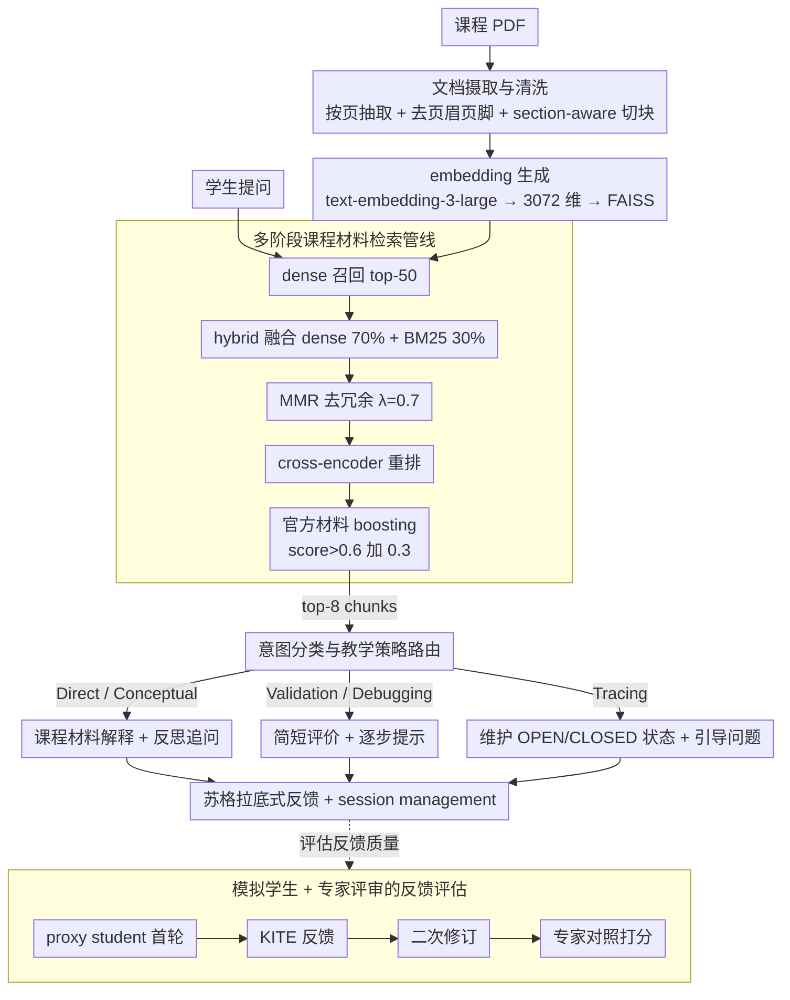

# Retrieval-Augmented Tutoring for Algorithm Tracing and Problem-Solving in AI Education

**会议**: ACL2026  
**arXiv**: [2605.12988](https://arxiv.org/abs/2605.12988)  
**代码**: 无公开代码  
**领域**: 信息检索 / AI教育 / 智能辅导系统  
**关键词**: RAG tutoring、算法学习、Socratic scaffolding、意图分类、模拟学生评测

## 一句话总结
本文提出 KITE，一个面向算法追踪和问题求解的课程材料 RAG 辅导系统，通过意图感知的苏格拉底式反馈和多阶段检索，在自动指标、模拟学生和专家评审中显示出较好的 grounding 与教学支架效果。

## 研究背景与动机
**领域现状**：学生已经广泛使用 ChatGPT 等 LLM 获取解释、反馈和解题帮助。RAG 为教育场景提供了一个自然方案：把回答 grounding 到课程 slides、教材和历史材料，减少脱离课程语境的错误解释。

**现有痛点**：课程 grounded 并不等于教学有效。一个 RAG 系统即使检索到相关内容，也可能直接给出完整答案，让学生绕过本应练习的推理过程；也可能无法区分“问概念”“调试错误”“验证算法 trace”等不同帮助需求。

**核心矛盾**：教育助手既要准确引用课程材料，又要以合适的方式支持学习。算法课程尤其需要学生自己完成 trace、debug 和 procedure application，因此系统不能只做 FAQ 式回答，而要提供分层提示、指导问题和错误定位。

**本文目标**：作者构建 KITE，让 RAG 检索与 pedagogical intent-aware response generation 结合；同时提出一个评估框架，既测非过程性回答的 groundedness，也用模拟学生和专家评审评估反馈是否帮助修正推理。

**切入角度**：论文将教育 RAG 从“给答案的问答工具”转为“按学生意图调节支持方式的 tutor”。它重视回答策略，而不只重视检索命中率。

**核心 idea**：用多阶段课程材料检索保证内容可靠，再用意图分类决定回答是直接解释、概念追问、验证、debug 还是算法追踪，从而把 RAG grounding 和 Socratic scaffolding 融合起来。

## 方法详解

### 整体框架
KITE 包含五个阶段：文档摄取与清洗、embedding 生成、多阶段检索、意图感知生成、session management。系统先把课程 PDF 按页抽取并去除页眉页脚等噪声，再按 section-aware chunking 切成约 500 字符、100 字符 overlap 的 chunks。每个 chunk 用 text-embedding-3-large 编码成 3072 维向量并存入 FAISS。学生提问时，系统先用 dense retrieval 找 top-50，再结合 BM25、MMR、cross-encoder reranking 和课程来源 boost，最终把 top-8 chunks 注入 GPT-5 prompt。生成侧先识别学生意图，再选择对应的辅导策略。除运行时管线外，论文还配套一条模拟学生 + 专家评审的评估管线，专门衡量反馈是否真的推动学生修订答案。

### 关键设计

**1. 多阶段课程材料检索管线：在课程材料里找到既语义相关又术语精确、还不冗余的证据**

算法题里塞满了术语、变量名、伪代码和步骤名，纯 dense retrieval 容易漏掉词面匹配，纯 BM25 又容易错过语义等价的表达，单一检索器很难同时兼顾。KITE 把检索拆成五步逐层收紧：先用 dense bi-encoder 召回 top-50；再做 hybrid 融合，把 dense 相似度权重设为 70%、BM25 设为 30%，让语义和算法术语都算数；接着用 MMR（$\lambda=0.7$）去掉冗余 chunk；然后用 cross-encoder/ms-marco-MiniLM-L-6-v2 重排；最后对官方课程材料做 source-based boosting——reranking score 大于 0.6 的 chunk 额外加 0.3 分，把权威来源往前提。层层过滤后取 top-8 注入 prompt，既提升 groundedness，又压住无关上下文的污染。

**2. 意图分类与教学策略路由：先判断学生想要什么帮助，再决定提示力度**

教育场景真正的风险不是答错，而是"答得太直接"——即使检索到了正确内容，一股脑给出完整解法也会让学生跳过本该练习的推理。KITE 因此先用关键词和 pattern-matching 把 query 分成 Direct Question、Conceptual Question、Algorithm Validation、Debugging、Algorithm Tracing 五类，外加一个 answer evaluation 模式，再按类别切换回答策略：直接/概念问题以课程材料为据解释，概念问题额外抛出反思追问；算法验证给简短评价、确认正确部分再补引导性问题；debugging 用逐步提示让学生自查；tracing 则按课程规则维护 OPEN/CLOSED、当前节点、路径和代价等状态。同一份检索证据，经过 intent routing 后会被包装成不同力度的支架，而不是千篇一律地泄露答案。

**3. 模拟学生 + 专家评审的反馈评估：衡量反馈"是否让学生答案变好"，而不是和参考答案有多像**

过程性任务的好 tutor 不该用"输出与参考答案最相似"来衡量，因为促进学习者修正推理才是目标。KITE 为此搭了一条 proxy student 管线：对 procedural 和 tracing 问题，先让 Meta-Llama-3.1-70B-Instruct 扮演学生独立作答，KITE 给反馈，学生模型再基于反馈修订第二轮答案；专家随后对照 Round 1、KITE feedback、Round 2，判断修订是否真的改进，并按 mistake remediation、scaffolding、guidance、coherence、tone 等维度打分。这种两轮对照让评估抓住"反馈推动了二次作答"这一行为信号，是课堂部署前一种低成本的安全筛查。

### 一个完整示例：一道算法 tracing 题怎么走完 KITE

假设学生上传一段 A* 搜索的手写 trace 并问"我这步对不对"。系统先在 FAISS 里对这道题做 dense 召回，从全部课程 chunk 中取出 top-50 候选；hybrid 阶段因为 query 里带着 "OPEN list"、"f = g + h" 这类术语，BM25 的 30% 权重把对应的算法定义页提了上来；MMR 去掉几段几乎重复的伪代码，cross-encoder 重排后，讲 A* 节点扩展规则的官方 slides 因为 score 大于 0.6 又被 boost 加了 0.3 分，最终 top-8 里以官方材料为主。意图分类把这条 query 判成 Algorithm Tracing，于是生成侧不直接给出完整 trace，而是按课程规则维护 OPEN/CLOSED 表和当前节点的 $f=g+h$ 代价，指出学生在某一步漏更新了某节点的 $g$ 值，并用引导性问题让学生自己补。评估时，proxy student 第一轮的 trace 是 partially correct，收到这条反馈后第二轮把漏掉的代价补齐、转为 correct——正好落进实验里最常见的 Partially Correct → Correct 改进类型。

### 损失函数 / 训练策略
KITE 本身不是训练新模型，而是系统集成。检索侧使用 text-embedding-3-large、FAISS、BM25、MMR 和 MiniLM cross-encoder；生成侧使用 GPT-5，并在 prompt 中注入 top-8 retrieved chunks。自动评估用 gpt-4o-mini 作为 RAGAs judge，embedding similarity 使用 text-embedding-3-small。

## 实验关键数据

### 主实验
评估数据来自大学 Introduction to AI 课程，共 109 个问题和 instructor-verified reference answer，其中 42 个 algorithmic questions、51 个 procedural questions、16 个 direct-retrieval questions。RAGAs 用于 58 个非过程性问题。

| RAGAs 指标 | Mean | Std. Dev. | 解释 |
|------------|------|-----------|------|
| Faithfulness | 0.8486 | 0.2103 | 大多数回答声明能被检索上下文支持 |
| Answer Relevance | 0.7558 | 0.2032 | 回答与原问题相关性较好 |
| Context Relevance | 0.9352 | 0.1905 | 检索到的上下文高度相关 |
| Answer Similarity | 0.7586 | 0.0923 | 与教师参考答案语义接近且稳定 |
| Factual Correctness | 0.4483 | 0.2477 | claim-level 指标偏低，受参考答案表述影响 |
| Answer Correctness | 0.6363 | 0.1810 | 综合 factual correctness 与 similarity |

专家评审覆盖 44 个模拟学生交互 triples，标注一致性较高，Cohen’s $\kappa=0.88$，raw agreement 为 98.15%。

| 专家评价维度 | Yes | No | N/A | 结论 |
|--------------|-----|----|-----|------|
| Mistake Remediation: Identifying | 63.63% | 6.82% | 29.55% | 不适用多为学生首轮已正确 |
| Mistake Remediation: Acknowledging | 63.63% | 6.82% | 29.55% | 适用时能识别并承认错误 |
| Scaffolding | 93.18% | 6.82% | 0% | 支架式支持强 |
| Guidance | 93.18% | 6.82% | 0% | 下一步指导清楚 |
| Coherence: Naturalness | 93.18% | 6.82% | 0% | 对话自然 |
| Tone: Encouraging | 93.18% | 6.82% | 0% | 语气支持性强 |

### 消融实验
论文没有做传统模块消融，但模拟学生的 Round 1 → Round 2 转移可以看作对 KITE feedback 效果的行为分析。在 27 个首轮未正确的交互中，24 个在 KITE 反馈后得到改进，改进率为 88.89%。

| 答案状态转移 | Count | 比例 | 解读 |
|--------------|-------|------|------|
| Incorrect → Correct | 1 | 2.27% | 少量完全纠正 |
| Incorrect → Partially Correct | 3 | 6.82% | 从错误推进到部分正确 |
| Already Correct | 17 | 38.64% | 首轮已正确，无需纠错 |
| Partially Correct → Correct | 14 | 31.82% | 最常见改进类型 |
| Partially Correct → Partially Correct with Improvement | 6 | 13.63% | 仍未完全正确但质量提升 |
| N/A | 3 | 6.82% | 不适合转移判断 |

### 关键发现
- KITE 的检索 grounding 很强：Context Relevance 0.9352、Faithfulness 0.8486，说明多阶段检索确实能为回答提供课程相关证据。
- Factual Correctness 只有 0.4483，但 Answer Similarity 达 0.7586，作者认为 RAGAs claim-level overlap 对教学性改写和补充解释不够友好。
- 专家认为 93.18% 的反馈具备良好 scaffolding、guidance、coherence 和 tone，说明 KITE 不只是能检索，还能以较合适的教学方式表达。
- 模拟学生在 88.89% 的未正确交互中得到改进，尤其是 Partially Correct → Correct 占 31.82%，显示反馈对补齐推理缺口有帮助。

## 亮点与洞察
- 论文的亮点是把教育 RAG 的评估从“回答是否对”扩展到“反馈是否帮助学生改进”。这更符合 tutor 系统的目标。
- KITE 的 intent taxonomy 简单但实用。Direct、Conceptual、Validation、Debugging、Tracing 基本覆盖算法课程常见帮助请求。
- 多阶段 retrieval pipeline 的参数选择很工程化：dense 70%、BM25 30%、MMR $\lambda=0.7$、score > 0.6 的官方材料 boost 0.3，这些细节对复现教育 RAG 很有参考价值。
- 模拟学生评估不是最终证据，但适合作为 classroom deployment 前的安全筛查，能发现反馈是否过度泄露答案或无法推动修订。

## 局限与展望
- RAGAs 的 Factual Correctness 依赖 claim decomposition 和单一参考答案，可能低估语义正确但表达不同的教学回答；未来应加入多个教师参考答案和人工 factuality 标注。
- 模拟学生只使用 Meta-Llama-3.1-70B-Instruct，不能代表真实学生的误解模式、动机和学习迁移。
- 专家评审样本为 44 个交互，规模较小，虽然一致性高，但还不足以证明真实课堂学习收益。
- KITE 当前是课程内、算法学习场景系统，迁移到数学证明、编程作业、医学教育等任务时，意图分类和反馈策略可能需要重设。
- 论文没有做真实学生前后测或长期使用分析，因此“学习效果”只能谨慎解释为模拟修订质量提升。

## 相关工作与启发
- **vs MoodleBot / Edison**: 这些系统强调课程 grounded Q&A 和 TA-in-the-loop 评估；KITE 更进一步区分学生意图，并针对 procedural/tracing 提供 scaffolded feedback。
- **vs AutoTutor**: AutoTutor 强调对话式提示和协作式修订，但不以课程材料 RAG grounding 为核心；KITE 将 Socratic tutoring 与 course-specific retrieval 结合。
- **vs KG-RAG / LPITutor**: 这些系统用知识图谱或 prompt strategy 改善教育问答；KITE 更关注算法推理任务中的 trace、debug 和 validation。
- **启发**: 教育 RAG 系统的 benchmark 应把“是否促进二次作答改进”纳入核心指标，而不是只看 answer correctness。

## 评分
- 新颖性: ⭐⭐⭐⭐☆ 系统组件本身多为已有技术，但 intent-aware tutoring 与模拟学生评估结合得较好。
- 实验充分度: ⭐⭐⭐☆☆ 自动指标、专家评审和模拟学生三线并行，但缺少真实学生实验和模块消融。
- 写作质量: ⭐⭐⭐⭐☆ 系统设计与评估流程清晰，局限讨论诚实。
- 价值: ⭐⭐⭐⭐☆ 对教育 RAG、课程助教系统和算法学习反馈设计有较强实践参考价值。

<!-- RELATED:START -->

## 相关论文

- [\[NeurIPS 2025\] Is PRM Necessary? Problem-Solving RL Implicitly Induces PRM Capability in LLMs](../../NeurIPS2025/information_retrieval/is_prm_necessary_problem-solving_rl_implicitly_induces_prm_capability_in_llms.md)
- [\[ICML 2026\] Position: Reliable AI Needs to Externalize Implicit Knowledge: A Human-AI Collaboration Perspective](../../ICML2026/information_retrieval/reliable_ai_needs_to_externalize_implicit_knowledge_a_human-ai_collaboration_per.md)
- [\[ACL 2026\] Utility-Oriented Visual Evidence Selection for Multimodal Retrieval-Augmented Generation](utility-oriented_visual_evidence_selection_for_multimodal_retrieval-augmented_ge.md)
- [\[ACL 2026\] S2G-RAG: Structured Sufficiency and Gap Judging for Iterative Retrieval-Augmented QA](s2g-rag_structured_sufficiency_and_gap_judging_for_iterative_retrieval-augmented.md)
- [\[ACL 2026\] MM-BizRAG: Rethinking Multimodal Retrieval-Augmented Generation for General Purpose Enterprise Q&A](mm-bizrag_rethinking_multimodal_retrieval-augmented_generation_for_general_purpo.md)

<!-- RELATED:END -->
