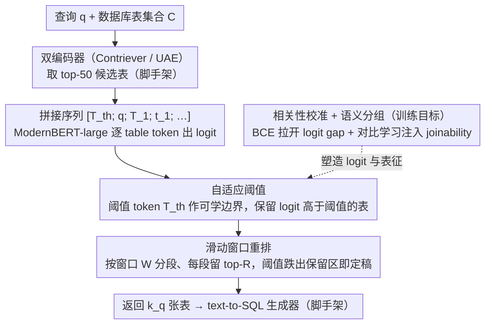

# Retrieve Only Relevant Tables Whether Few or Many: Adaptive Table Retrieval Method

**会议**: ACL2026 Findings  
**arXiv**: [2605.18766](https://arxiv.org/abs/2605.18766)  
**代码**: 文中称提供代码和数据（cache 未含具体 URL）  
**领域**: 信息检索 / 表格检索 / Text-to-SQL  
**关键词**: adaptive retrieval, table retrieval, text-to-SQL, thresholding, sliding-window reranking

## 一句话总结
这篇论文提出 Adaptive Table Retrieval (ATR)，用查询自适应阈值代替固定 top-k 表格检索，并结合相关性校准、表间语义分组和滑动窗口重排，在 Spider、BIRD、Spider 2.0 上同时提升检索召回、text-to-SQL 执行准确率和推理效率。

## 研究背景与动机
**领域现状**：在 text-to-SQL 和结构化 RAG 中，系统通常先从数据库的大量表中检索若干相关表，再把这些表交给 LLM 生成 SQL。主流表格检索器会计算 query-table 相似度，然后固定取 top-k。

**现有痛点**：固定 top-k 忽略了不同查询需要的表数量差异。简单查询可能只需要一两张表，取太多会引入噪声和 token 成本；复杂企业级查询可能需要几十甚至上百张表，取太少会漏掉必要证据。论文指出 Spider 2.0 中单个查询的 ground-truth tables 从 1 到 366 不等，固定 k 很难兼顾。

**核心矛盾**：表格检索的错误有两种相反形态：欠检索会漏掉 SQL 所需表，过检索会把无关 schema 放进生成器上下文，干扰 SQL 生成。固定 top-k 把这个 trade-off 交给一个全局超参，而不是让每个 query 自己决定需要多少表。

**本文目标**：作者希望设计一个不依赖迭代式 LLM 交互的 adaptive table retriever，让它能根据查询动态决定返回表数量，同时在大规模数据库上保持可扩展、低延迟。

**切入角度**：ATR 把“返回多少张表”变成一个可学习的阈值决策问题：每张表有一个 relevance logit，同时加入一个 adaptive threshold token，所有 logit 高于阈值的表被取回。

**核心 idea**：用 threshold token 学习 query-specific retrieval boundary，让相关表超过阈值、无关表低于阈值，再用 joinability-aware 的表表示学习和 sliding-window reranking 支撑大表库检索。

## 方法详解

### 整体框架
ATR 要解决的核心问题是"一个查询到底该取几张表"——固定 top-k 在简单查询上过检索、在复杂查询上欠检索。它把这个数量决策交给模型本身：给定自然语言查询 $q$ 和候选表集合 $C$，用 ModernBERT-large 作 encoder，把查询、一个阈值 token 和多张表的 schema 表示拼成输入序列 $[T_{th}; q; T_1; t_1; ...; T_n; t_n]$，其中每张表前有 table token $T_i$，阈值边界由 threshold token $T_{th}$ 承载。模型为每个 table token 和 threshold token 输出 logit，推理时只保留 logit 高于阈值 logit 的表，于是返回表数 $k_q$ 随查询自动变化。为支撑大表库，实际部署先用 bi-encoder（Contriever 或 UAE）取 top-50 候选，再对其做 reranking；为绕开 encoder 长度和 self-attention 的二次成本，reranking 用滑动窗口的方式分段完成，最终所有排在阈值之上的表构成检索结果。

### 关键设计
**1. Adaptive Thresholding：把"取几张表"从手调超参变成模型学到的决策边界**

固定 k 只能在 recall 和 noise 之间做一次全局折中，无法照顾不同查询的差异。ATR 在输入里插入一个阈值 token $T_{th}$ 作为可学习的分界线：训练时让相关表 token 的 logit 高于 $T_{th}$、无关表 token 的 logit 低于 $T_{th}$。损失由两项构成，$L_1$ 推高相关表相对阈值的概率、$L_2$ 把无关表压到阈值以下，合为 $L_{AT}=\alpha L_1+\beta L_2$。这样模型就能依据查询难度和 schema 相关性自动决定边界，在 Spider 2.0 这类 ground-truth 表数从 1 到 366 不等的场景下，既不漏表也不灌入噪声。

**2. Relevance Calibration 与 Semantic Grouping：同时学相关性和表间结构，取回连贯的表集合**

Text-to-SQL 往往需要一组可以互相 join 的表，而不是若干彼此独立、各自相关的单表，单看 query-table 相似度会取回结构上不连贯的结果。ATR 加了两个辅助目标：relevance calibration 用 BCE 拉开相关表与无关表的 logit gap，让阈值判别更干净；semantic grouping 用 contrastive loss 把可 join 的表嵌入拉近、不可 join 的推远，把 joinability 信号注入表征。三者合成总目标 $L_{ATR}=L_{AT}+\lambda L_{RC}+\gamma L_{SG}$。消融显示同时去掉这两项时 recall 掉得最多，印证了它们对结构连贯检索的贡献。

**3. Sliding-window Reranking：分段重排，让大表库检索不爆显存**

企业级 schema 动辄上百张表，一次性编码全部候选会同时触发 encoder 长度上限和 self-attention 的二次复杂度。ATR 给定窗口大小 $W$ 和保留数 $R$，每次只编码窗口内的表与阈值 token，保留 top-$R$ 后与下一段候选合并继续；一旦 threshold 的排名落到保留边界以下，排在它之前的表即被最终确定。如此把一次大 rerank 拆成多次可控的小 rerank，在 Spider 2.0 上把平均峰值显存从 340.57 MB 降到 66.52 MB（−80.5%），同时不牺牲检索质量。

### 损失函数 / 训练策略
ATR 只用 Spider、BIRD 的训练集训练，不碰 Spider 2.0 训练数据，因此 Spider 2.0 是重要的 out-of-domain 测试。检索侧报告 precision、recall、complete recall 和 F1；下游 text-to-SQL 把检索到的表交给 Llama-3.1-8B/70B-Instruct、Qwen2.5-Coder-7B/32B-Instruct、Gemma-3-4B/27B-IT 等生成 SQL，用 execution accuracy 评价。对照基线包括 Contriever、UAE、JAR、RankZephyr、Murre 等 fixed top-k 或 LLM reranker。

## 实验关键数据

### 主实验
| 数据集 | 方法 | Precision | Recall | Complete Recall | F1 |
|--------|------|-----------|--------|-----------------|----|
| Spider | JAR w/ UAE, k=3 | 48.4 | 96.5 | 94.1 | 62.3 |
| Spider | ATR w/ Contriever | 69.6 | 99.5 | 99.2 | 78.3 |
| Spider | ATR w/ UAE | 69.3 | 99.6 | 99.4 | 78.1 |
| BIRD | JAR w/ Contriever, k=3 | 54.4 | 87.4 | 76.3 | 65.0 |
| BIRD | ATR w/ Contriever | 54.0 | 98.2 | 96.0 | 65.8 |
| BIRD | ATR w/ UAE | 52.8 | 98.6 | 97.1 | 65.1 |
| Spider 2.0 | Murre, k=10 | 14.8 | 61.9 | 48.5 | 21.5 |
| Spider 2.0 | ATR w/ Contriever | 21.9 | 72.4 | 64.4 | 27.8 |
| Spider 2.0 | ATR w/ UAE | 19.9 | 75.4 | 68.7 | 26.7 |

### 消融实验
| 配置 | Spider R / CR | BIRD R / CR | Spider 2.0 R / CR | 说明 |
|------|---------------|-------------|-------------------|------|
| ATR | 99.5 / 99.2 | 98.2 / 96.0 | 72.4 / 64.4 | 完整模型 |
| w/o BCE relevance calibration | 99.0 / 98.7 | 97.5 / 95.8 | 68.2 / 60.8 | query-table 区分变弱 |
| w/o contrastive semantic grouping | 99.0 / 98.4 | 97.4 / 95.2 | 69.1 / 60.1 | 表间 joinability 信号缺失 |
| w/o both | 96.4 / 94.4 | 91.8 / 85.7 | 67.7 / 58.2 | 两个辅助目标同时去掉，下降最大 |

### 关键发现
- Retrieval 上，ATR 在 Spider 上 F1 达到 78.3/78.1，显著高于 fixed top-k baseline；在 Spider 2.0 上 complete recall 达到 64.4/68.7，说明 adaptive 机制对 required tables 数量变化大的场景更有用。
- Text-to-SQL 上，使用 Qwen2.5-Coder-32B 时，ATR 相比 JAR 在 Spider 和 BIRD 上分别提升 3.7 和 1.7 个执行准确率点；使用 7B 模型时提升扩大到 5.2 和 2.5 个点。
- 效率上，ATR 比自适应文档检索方法更快：在 Spider/BIRD 上，ATR 的 Acc./Time 为 71.5/2.2s 和 53.3/3.8s；Adaptive-RAG 为 62.8/6.3s 和 50.7/13.2s。
- Sliding-window memory profiling 显示，在 Spider 2.0 上平均峰值显存从 340.57 MB 降到 66.52 MB，减少 80.5%；最大峰值从 1027.88 MB 降到 284.44 MB，减少 72.3%。

## 亮点与洞察
- adaptive threshold 是这篇论文最直接有效的设计。它把“检索几张表”从手调超参变成模型输出的一部分，特别适合 Spider 2.0 这种 required tables 范围极宽的企业场景。
- 论文没有只追求召回，还展示了过检索对 SQL 执行准确率的伤害：无关表会给生成器增加错误 join、错误 column grounding 和长上下文噪声。
- semantic grouping 把表间 joinability 纳入表征学习，提醒我们结构化 RAG 不能只做 query-document 相似度，还要学习证据之间的结构关系。

## 局限与展望
- 作者承认 ATR 当前只针对结构化表格数据，没有扩展到文本、图像或混合数据类型的自适应检索。
- 训练只利用 Spider 和 BIRD，虽然 Spider 2.0 上有 out-of-domain 结果，但真实企业数据库 schema 可能更大、更脏、权限和业务约束更复杂。
- ATR 仍依赖 initial bi-encoder top-50 候选，如果第一阶段漏掉关键表，后续 adaptive threshold 无法恢复。
- 后续可以研究跨模态 adaptive retrieval、端到端联合训练 first-stage retriever 和 ATR reranker，以及把 threshold 决策与 SQL 生成器的不确定性联动。

## 相关工作与启发
- **vs Contriever / UAE**: 这些 bi-encoder 方法按 query-table 相似度固定取 top-k，简单高效但不能适应不同查询需要的表数量；ATR 在其 top-50 候选上做 adaptive rerank。
- **vs JAR**: JAR 也考虑表间 joinability，但仍受固定 k 约束；ATR 进一步学习 threshold boundary，动态决定保留集合大小。
- **vs FLARE / Adaptive-RAG / Iter-RetGen**: 这些自适应文档检索方法常通过生成器迭代触发检索，延迟高；ATR 不需要 LLM 交互，直接用 encoder 完成表格侧动态检索。
- **启发**: 对结构化 RAG 来说，“证据数量”本身就是模型应预测的变量；固定 top-k 更像是工程默认值，而不是合理任务假设。

## 评分
- 新颖性: ⭐⭐⭐⭐☆ adaptive threshold 思路不复杂，但用于表格检索并结合 joinability 和 sliding-window 后很实用。
- 实验充分度: ⭐⭐⭐⭐⭐ 检索、下游 SQL、adaptive baseline、消融、超参、显存和多生成器附录都覆盖到了。
- 写作质量: ⭐⭐⭐⭐☆ 动机和图示清楚，主表较大但信息完整。
- 价值: ⭐⭐⭐⭐⭐ 对 text-to-SQL、企业级数据库问答和结构化 RAG 都有直接工程价值。

<!-- RELATED:START -->

## 相关论文

- [\[ACL 2026\] CORAL: Adaptive Retrieval Loop for Culturally-Aligned Multilingual RAG](coral_adaptive_retrieval_loop_for_culturally-aligned_multilingual_rag.md)
- [\[CVPR 2025\] COBRA: COmBinatorial Retrieval Augmentation for Few-Shot Adaptation](../../CVPR2025/information_retrieval/cobra_combinatorial_retrieval_augmentation_for_few-shot_adaptation.md)
- [\[CVPR 2025\] Few-Shot Recognition via Stage-Wise Retrieval-Augmented Finetuning](../../CVPR2025/information_retrieval/few-shot_recognition_via_stage-wise_retrieval-augmented_finetuning.md)
- [\[ACL 2026\] REZE: Representation Regularization for Domain-adaptive Text Embedding Pre-finetuning](reze_representation_regularization_for_domain-adaptive_text_embedding_pre-finetu.md)
- [\[AAAI 2026\] N2N-GQA: Noise-to-Narrative for Graph-Based Table-Text Question Answering Using LLMs](../../AAAI2026/information_retrieval/n2n-gqa_noise-to-narrative_for_graph-based_table-text_question_answering_using_l.md)

<!-- RELATED:END -->
