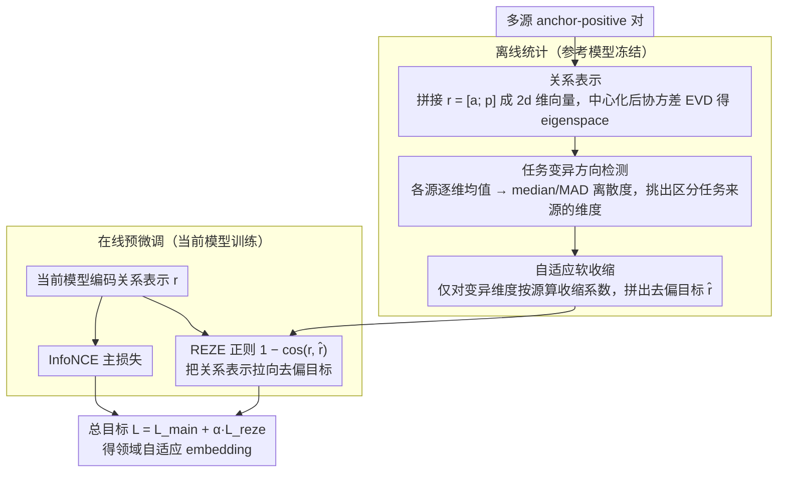

# REZE: Representation Regularization for Domain-adaptive Text Embedding Pre-finetuning

**会议**: ACL2026  
**arXiv**: [2604.17257](https://arxiv.org/abs/2604.17257)  
**代码**: 论文正文未给出公开仓库链接  
**领域**: 信息检索  
**关键词**: 文本向量、领域自适应、预微调、表示正则化、负迁移

## 一句话总结
REZE 在领域 embedding 预微调中对 anchor-positive 关系表示做 eigenspace 分解，用鲁棒统计识别任务特异偏移并软收缩，从而吸收共享领域知识、抑制异构任务带来的表示漂移。

## 研究背景与动机
**领域现状**：现代文本 embedding 模型通常经过大规模弱监督对比学习和预微调，能够服务检索、分类、语义相似度等任务。面向金融、代码、化学等专业领域时，常见做法是收集多个小规模领域数据集，统一成 anchor-positive pair，再进行 contrastive pre-finetuning。

**现有痛点**：这些领域数据往往异构且零散，任务类型可能包括 retrieval、classification、reranking、STS、clustering。直接混合预微调会把任务特异偏差一起注入 embedding space，导致表示几何发生不可控漂移，甚至让 PFT 低于直接 FT。

**核心矛盾**：领域预微调需要利用异构任务中的共享领域知识，但又要避免每个任务自己的数据格式、标签结构和偏差主导表示空间。传统 isotropy/post-hoc whitening 方法只在训练后重塑分布，不知道哪些方向来自任务冲突，可能进一步破坏有用几何结构。

**本文目标**：作者希望在预微调过程中显式控制 representation shift，让模型保留任务间共通语义，同时抑制 task-induced bias，并且不增加推理时开销。

**切入角度**：论文不直接处理单个句向量，而是把 anchor 与 positive embedding 拼接成 relation representation。作者认为共享领域知识应当在不同任务的关系结构中相对一致，而任务特异偏差会表现为某些 eigendimensions 上不同来源数据均值的离散。

**核心 idea**：在参考模型的关系表示 eigenspace 中，用 median/MAD 找出任务来源差异大的方向，对这些方向做 source-specific adaptive soft-shrinkage，再把得到的 debiased relation 作为预微调的正则目标。

## 方法详解
REZE 是一个用于 pre-finetuning 阶段的辅助正则化框架。它先在训练前用冻结的参考 embedding 模型构建一个全局 eigenspace，并计算每个数据来源在该空间中的偏移模式。训练时，模型仍用 InfoNCE 学习 anchor-positive 匹配，但额外受到一个 relation-level regularization 约束，使当前关系表示靠近去除任务偏差后的参考关系表示。

### 整体框架
输入是来自多个 source datasets 的 anchor-positive pair。离线阶段，REZE 用参考模型编码所有 pair，把 anchor 和 positive 拼接成 $r=[a;p]$，中心化后做协方差矩阵 EVD，得到 eigenspace。随后，对每个 source 在每个 eigendimension 上计算均值，并用 median-based dispersion 判断哪些维度主要区分任务来源。

在线预微调阶段，对于每个样本，REZE 根据其 source 取对应的 shrinkage matrix，把参考关系表示拉回任务间的鲁棒共识，再用 cosine dissimilarity 要求当前模型的关系表示接近这个 debiased target。最终训练目标是 InfoNCE 主损失加上 REZE 正则项。

### 关键设计

**1. 关系表示而非单句表示：把正则化对象从单个文本点换成 anchor-positive 的关系结构**

embedding 预微调的监督本质是“哪些文本应该相近”，而任务偏差也常常长在这种关系结构上——某类任务的 positive 更像标签、另一类任务的 positive 更像文档。如果只盯单个句向量的位置去正则，反而抓不住这种 pair-level 的偏移。REZE 因此对每个训练样本构造关系表示 $r_{s,i}=[a_{s,i};p_{s,i}]\in\mathbb{R}^{2d}$，把 anchor 和 positive 拼成一个 $2d$ 维向量，再在所有关系表示上估计全局均值、协方差和 eigenspace。这样正则化的目标和 contrastive learning 天然对齐：约束的不是“这句话该在哪里”，而是“这对文本之间的关系该长什么样”。

**2. 基于鲁棒统计的任务变异方向检测：用 median/MAD 找出哪些 eigendimension 主要在区分任务来源**

中心化之后 global mean 接近零，直接朝 mean 收缩既抓不到任务偏差、又会顺手破坏任务不变的语义；而 mean 本身也容易被某个离群任务拉偏。REZE 改用鲁棒统计：先对每个 source 算它在 eigenspace 里的均值 $\mu_s$，取各 source 均值的逐分量 median $m_j$ 作鲁棒中心，再用 $v_j=\frac{1}{S}\sum_s(\mu_{s,j}-m_j)^2$ 衡量第 $j$ 维上不同 source 的离散程度。离散大的维度，就是任务来源在彼此拉扯、而非共享语义的方向。检测只在累计解释 99% 方差的 active dimensions 内进行，避开低方差噪声维度。这样找到的中心是“多数任务共享的几何共识”，而不是被个别任务带跑的平均值。

**3. 自适应软收缩与训练期正则：对检出的任务变异方向做 source-specific 软收缩，再把去偏后的参考关系当训练目标**

硬删 top components 会连有用语义一起丢，post-hoc whitening 又是一刀切地重塑最终空间。REZE 只在某维度的 source 偏移超过 robust threshold 时，才为该 source、该维度算一个收缩系数 $\alpha_{s,j}$，把表示朝 median 附近的 band 拉回——没有任务冲突的方向原样保留。离线阶段据此为每个 source 拼出收缩矩阵 $A_s$，构造去偏目标 $\hat{r}^{(0)}=W A_s W^T(r^{(0)}-u)+u$（$W$ 是 eigenvector 矩阵、$u$ 是全局均值）；训练时再要求当前模型的关系表示靠近它，正则项为 $1-\cos(r_i,\hat{r}^{(0)}_i)$。因为收缩是 source 级、维度级的细粒度操作，它能精准压住表现出任务变异的方向，而不动整体几何。

### 损失函数 / 训练策略
主损失是标准 InfoNCE：让 batch 内 anchor 与对应 positive 相似，并把其他 positive 作为负样本。REZE 正则项是当前关系表示与 debiased reference relation 的 cosine dissimilarity。最终目标为 $L=L_{main}+\alpha L_{reze}$，默认温度 $\tau=0.05$，正则强度实验后采用 $\alpha=1.0$。由于 eigenspace、均值和 shrink 矩阵都在训练前计算，推理阶段没有额外开销。

## 实验关键数据

### 主实验
作者在 FinMTEB、Code(MTEB)、ChemTEB 三个专业 benchmark 上测试 E5、ModernBERT、GTE、Qwen3-Embedding 四类 backbone，并比较 FT、PFT、PFT+Whitening、PFT+NormalizingFlow、REZE。

| 模型 / 领域 | 样本数 | FT | PFT | REZE | 主要提升 |
|--------|------|------|----------|------|------|
| E5 / Code(MTEB) | 1000 | 0.4898 | 0.3565 | 0.5286 | 比 PFT +0.1721，比 FT +0.0388 |
| ModernBERT / FinMTEB | 1000 | 0.8247 | 0.8192 | 0.8373 | 稳定高于 FT 与 PFT |
| GTE / Code(MTEB) | 500 | 0.5239 | 0.5352 | 0.6167 | 对代码领域提升明显 |
| Qwen3-Embedding / Code(MTEB) | 100 | 0.4019 | 0.1214 | 0.4081 | 避免 PFT 崩溃 |
| Qwen3-Embedding / ChemTEB | 1000 | 0.6563 | 0.6765 | 0.6688 | 略低于 PFT，但优于 FT |

总体上，REZE 在大多数设置中优于标准 PFT 和 post-hoc isotropy 方法。尤其在 Qwen3 的 Code(MTEB) 上，PFT 从 0.4019 掉到 0.1214，而 REZE 保持在 0.4081，说明控制表示漂移对异构领域预微调很关键。

### 消融实验
论文分析正则权重、median vs mean、isotropy 和表示漂移。

| 配置 | 关键指标 | 说明 |
|------|---------|------|
| 默认 REZE | $\alpha=1.0$ | overall mean 稳定，低样本下尤其强 |
| 很大 $\alpha$ | 5 或 10 | 多数任务饱和或下降，过强正则会压制适应 |
| median aggregation | 多数 FinMTEB 任务更高 | 比 mean 更鲁棒，避免被离群 source 拉偏 |
| mean aggregation / ESGClassification | 0.8997 | 低于 median 0.9117 |
| mean aggregation / FINAL | 0.5331 | 低于 median 0.6172 |
| REZE vs PFT IsoScore | FinMTEB/Code 超过约 3 倍提升 | 表示维度使用更均衡 |

### 关键发现
- 简单 PFT 经常低于直接 FT，说明领域数据多并不自动带来收益；异构任务冲突会造成负迁移。
- Whitening 和 Normalizing Flow 在 ChemTEB 等低资源设置中明显退化，可能因为有限训练集估计的后处理统计不稳定，并放大低方差噪声方向。
- REZE 不是盲目追求 isotropy，而是把表示漂移控制在原始 embedding manifold 附近。这种“受控偏移”比训练后强行重塑空间更适合领域适配。
- batch 需要混合不同 source，才能让 REZE 的分布对齐效果发挥作用。它本质上是跨任务关系结构的正则化，而不是单任务增强。

## 亮点与洞察
- 本文非常明确地指出了 domain-adaptive embedding PFT 的核心风险：任务异构带来的 bias 可能大于领域知识收益。这个问题在实际企业检索和专业领域 embedding 中很常见。
- relation-level 正则化很巧妙。它不只是让单个句向量保持原位，而是让“anchor 与 positive 的关系”朝去偏参考结构靠近，更符合 contrastive embedding 的训练目标。
- median/MAD 的选择看似朴素，但和多源数据场景非常匹配。相比全局 whitening，它能分辨“某个 source 偏了”与“整体语义结构应当保留”。
- 结果显示，在低资源或异构强的领域，控制表示漂移可能比增加训练数据或后处理 isotropy 更重要。这对构建金融、代码、法律、医疗 embedding pipeline 都有启发。

## 局限与展望
- 评估领域虽然包括金融、代码和化学，但公开 benchmark 的专业深度仍有限。法律等高术语密度、强管辖语境的领域可能更能体现方法价值，也可能暴露新的问题。
- 模型规模只覆盖约 0.1B 到 0.6B 的 embedding backbone，没有验证更大模型或更大 batch contrastive training 下的趋势。
- REZE 需要在预微调前对 reference representations 做 EVD 和 source-level 统计。对超大规模语料或持续更新数据流，离线统计成本和增量更新机制需要进一步研究。
- 方法假设 source identifier 已知，且 source 之间的偏差可以通过均值离散刻画。真实数据中任务边界模糊、source 内部混杂时，可能需要更细粒度的聚类或动态 source 建模。

## 相关工作与启发
- **vs 标准 PFT**: PFT 只用 InfoNCE 吸收异构领域数据，容易把任务偏差一起学进去；REZE 在训练中加入 debiased relation target，控制这种漂移。
- **vs Whitening / Normalizing Flow**: 后处理方法改变最终 embedding 空间，但不参与训练过程，也不区分任务特异偏差；REZE 在预微调阶段主动约束表示轨迹。
- **vs All-but-the-top / isotropy 方法**: 这些方法常去掉高方差方向或追求均匀维度使用；REZE 只对 task-variant active dimensions 做软收缩，目标更具体。
- **启发**: 多任务 embedding 训练可以把“来源间关系结构是否一致”作为正则信号。未来可结合 gradient surgery、task routing 或 mixture-of-experts，进一步区分共享领域知识和任务噪声。

## 评分
- 新颖性: ⭐⭐⭐⭐☆ eigenspace + robust soft-shrinkage 的组合不复杂，但用于异构 embedding PFT 的问题定义和 relation-level 设计很有价值。
- 实验充分度: ⭐⭐⭐⭐☆ 覆盖 3 个领域、4 个 backbone、多个样本规模，并有几何分析；更大模型和更专业 benchmark 仍缺。
- 写作质量: ⭐⭐⭐⭐☆ 方法公式清楚，动机扎实；部分实验表格很大，读者需要结合任务选择协议理解平均分。
- 价值: ⭐⭐⭐⭐☆ 对专业检索和企业 embedding 适配非常实用，尤其适合多来源小数据的现实场景。

<!-- RELATED:START -->

## 相关论文

- [\[ACL 2026\] More Than Efficiency: Embedding Compression Improves Domain Adaptation in Dense Retrieval](more_than_efficiency_embedding_compression_improves_domain_adaptation_in_dense_r.md)
- [\[ACL 2026\] PL-MTEB: Polish Massive Text Embedding Benchmark](pl-mteb_polish_massive_text_embedding_benchmark.md)
- [\[ACL 2025\] Accelerating Adaptive Retrieval Augmented Generation via Instruction-Driven Representation Reduction of Retrieval Overlaps](../../ACL2025/information_retrieval/accelerating_adaptive_retrieval_augmented_generation_via_instruction-driven_repr.md)
- [\[ICLR 2026\] HUME: Measuring the Human-Model Performance Gap in Text Embedding Tasks](../../ICLR2026/information_retrieval/hume_measuring_the_human-model_performance_gap_in_text_embedding_tasks.md)
- [\[ACL 2026\] Domain-Specific Data Generation Framework for RAG Adaptation](domain-specific_data_generation_framework_for_rag_adaptation.md)

<!-- RELATED:END -->
