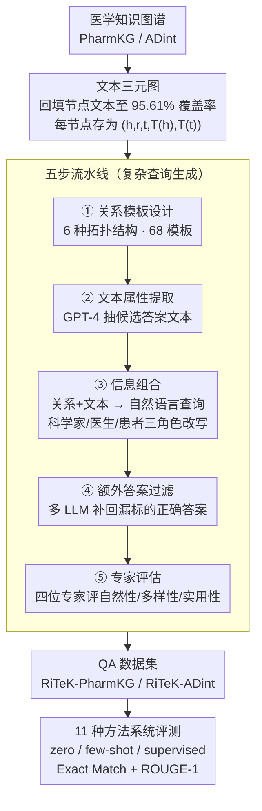

# RiTeK: A Dataset for Large Language Models Complex Reasoning over Textual Knowledge Graphs in Medicine

**会议**: ACL 2026  
**arXiv**: [2410.13987](https://arxiv.org/abs/2410.13987)  
**代码**: [https://github.com/ToneLi/Medical-Textual-KG-Reasoning-Benchmark](https://github.com/ToneLi/Medical-Textual-KG-Reasoning-Benchmark)  
**领域**: 医学图像  
**关键词**: 文本知识图谱, 医学问答, 复杂推理, 检索系统, 拓扑结构

## 一句话总结

RiTeK 构建了两个大规模医学文本知识图谱（TKG）和对应的复杂推理 QA 数据集，涵盖 6 种拓扑结构和丰富的文本描述，评估了 11 种检索方法并揭示了现有 LLM 驱动检索系统在医学 TKG 推理上的严重不足。

## 研究背景与动机

**领域现状**：回答复杂医学问题需要从医学文本知识图谱（TKG）中精确检索关系路径信息，以增强 LLM 的推理能力。TKG 将结构化的实体关系与非结构化的文本描述相结合，能够表达比传统 KG 更丰富的语义。

**现有痛点**：(1) 现有医学 TKG 稀缺且拓扑结构表达能力有限（如 STaRK-Prime 仅覆盖 3 种结构）；(2) 现有数据集通常只需 1-2 跳推理路径，过于简单，无法反映真实医学场景的复杂性；(3) 节点文本描述覆盖率低（STaRK-Prime 仅 15.29%），限制了语义理解；(4) 缺乏对现有 LLM 检索系统在医学 TKG 上的全面评估。

**核心矛盾**：真实医学查询涉及多跳推理、多约束条件和复杂拓扑结构，但现有数据集和检索系统均无法有效处理这种复杂性。

**本文目标**：(1) 构建拓扑结构丰富、文本描述完整的医学 TKG；(2) 生成融合关系信息和文本属性的复杂查询数据集；(3) 全面评估现有检索系统的能力和不足。

**切入角度**：从拓扑结构多样性和文本信息丰富度两个维度同时增强数据集质量，通过 6 种拓扑结构模板生成查询，并由医学专家验证自然性、多样性和实用性。

**核心 idea**：构建一个同时考验关系推理能力和语义对齐能力的医学 TKG 基准，暴露现有方法的瓶颈并指明改进方向。

## 方法详解

### 整体框架

RiTeK 不是一个新模型，而是一套医学复杂推理基准的构建方法，把"图谱怎么建"和"查询怎么生成"两件事拆开做。第一部分以 PharmKG、ADint 两个医学知识图谱为骨架，从 Ensembl、UMLS、Mondo Disease Ontology 等数据库回填节点的文本描述，得到结构与语义都完整的医学文本知识图谱（TKG）。第二部分在这张 TKG 上跑一条五步流水线——关系模板设计、文本属性提取、信息组合、额外答案过滤、专家评估——把图上的关系路径和节点文本融合成自然语言复杂查询。最终产出两套 QA 数据集，再用 11 种检索方法系统评测它们的难度。

### 关键设计

**1. 文本三元图：让关系约束和语义约束都能进查询。** RiTeK 没有直接沿用稀疏的医学 KG，而是为 PharmKG（3 类实体、29 种关系、50 万+ 三元组）和 ADint（102 类实体、15 种关系、100 万+ 三元组）逐一补齐节点文本，使 RiTeK-PharmKG 的节点文本覆盖率达到 95.61%，而对照的 STaRK-Prime 只有 15.29%。在表示上，每个节点被定义为文本三元图（Textual Triple Graph）中的 $(h, r, t, T(h), T(t))$，把关系三元组与头尾实体的文本属性统一成一个对象。

正因为覆盖率高，生成的查询才能同时挂上结构约束（沿哪条关系路径走）和语义约束（实体的文本特征长什么样），更贴近真实医学场景里患者或医生那种"既描述症状又限定病理类别"的复杂提问，而不是退化成单纯的图上查找。

**2. 五步流水线：把复杂查询的难度做密、做实。** 流水线第一步由医学专家为 6 种拓扑结构（多跳、带约束多跳等）设计关系模板，RiTeK-PharmKG 共 68 个模板、实例率达 11.33，远高于 STaRK 的 1.25–9.3——实例率越高，意味着每种拓扑结构被覆盖得越密。第二步选取候选答案实体并用 GPT-4 抽取其文本属性，第三步把关系信息与文本属性合成自然语言查询，并分别以医学科学家、医生、患者三种角色改写以增加语言风格多样性。

为保证答案集完整，第四步用多个 LLM 逐一验证其他候选实体是否也满足同一查询条件，把"漏标的正确答案"补回来；最后由四位医学专家对 1000 条样本评估自然性、多样性与实用性。多角色改写解决风格单一，多轮 LLM 过滤解决答案不全，专家评估则把控生成数据的可信度。

**3. 11 种方法的系统评测：暴露现有检索系统的瓶颈。** 数据集只有难度还不够，RiTeK 在 zero-shot、few-shot、supervised 三种设置下统一评测 11 种代表性方法，覆盖直接生成（GPT-4）、图搜索（Random Walk、MCTS）、提示策略（COT、TOT、GOT、TOG）、RAG 方法（G-retriever、KAR）以及监督方法（GCR、GNN-RAG），统一用 Exact Match 和 ROUGE-1 度量。

这种横跨"纯生成—图搜索—提示工程—检索增强—监督训练"的对照，能把方法在关系推理和文本语义对齐两条能力线上的强弱分别照出来，从而说明现有系统究竟卡在哪一步，而不仅仅给出一个总排名。

### 损失函数 / 训练策略

数据集构建本身不涉及模型训练；查询生成使用 GPT-4o-mini。评测中的监督方法（G-retriever、GCR、GNN-RAG）在 80% 训练集上微调，其余方法直接 zero-shot/few-shot 推理。

## 实验关键数据

### 主实验

**RiTeK-PharmKG zero-shot 结果 (Exact Match F1 %)**

| 方法 | EM F1 |
|------|-------|
| GPT-4 | 11.03 |
| GPT-4 + COT | 13.70 |
| GPT-4 + TOT | 7.22 |
| GPT-4 + GOT | 3.75 |
| GPT-4 + TOG | 31.14 |
| GPT-4 + KAR | 25.18 |
| G-retriever (supervised) | 37.62 |
| GCR (supervised) | 47.71 |
| GNN-RAG (supervised) | **49.72** |

**RiTeK-ADint zero-shot 结果 (Exact Match F1 %)**

| 方法 | EM F1 |
|------|-------|
| GPT-4 | 8.03 |
| GPT-4 + KAR | 27.29 |
| GNN-RAG (supervised) | **50.55** |

### 消融实验

**人工评估结果 (Positive/Acceptable %)**

| 维度 | RiTeK-PharmKG | RiTeK-ADint |
|------|---------------|-------------|
| 自然性 | 81.80/99.60 | 81.20/99.20 |
| 多样性 | 81.60/99.40 | 74.80/100 |
| 实用性 | 67.40/97.80 | 68.60/96.60 |

**数据集统计对比**

| 数据集 | 查询数 | 拓扑结构数 | 实例率 |
|--------|--------|-----------|--------|
| STaRK-Prime | 11,204 | 3 | 9.3 |
| RiTeK-PharmKG | 10,235 | 6 | 11.33 |
| RiTeK-ADint | 5,322 | 6 | 9.67 |

### 关键发现

- 所有 zero-shot 方法在复杂医学 TKG 推理上表现不佳，GPT-4 直接生成 EM F1 仅约 11%，说明 LLM 内在知识不足以应对复杂关系推理
- TOT 和 GOT 反而不如简单的 COT，表明结构化提示策略的逻辑框架在缺乏外部知识访问时适得其反
- KAR（结合文本语义和结构关系的知识感知方法）在 zero-shot 中表现最好，验证了结构+文本双重信息的重要性
- 即使是最强的监督方法 GNN-RAG，EM F1 也不到 50%，突显了医学 TKG 复杂推理的巨大挑战

## 亮点与洞察

- 数据集设计理念清晰：通过丰富拓扑结构和高文本覆盖率，将 TKG QA 从简单查找提升到真正的复杂推理
- 多角色模拟（科学家/医生/患者）使生成的查询贴近真实使用场景
- 95.61% 的文本覆盖率是对比 STaRK-Prime(15.29%)的巨大改善
- 评测结果为社区提供了清晰的方向：需要开发能同时处理结构推理和文本语义对齐的检索系统

## 局限与展望

- 使用 GPT-4 生成查询可能引入合成偏差，与真实用户查询仍有差距
- 仅评估英文医学查询，未覆盖多语言医学场景
- 大规模 TKG 上的延迟问题未深入探讨
- 未来可探索更高效的混合检索架构和专门针对医学 TKG 的预训练策略

## 相关工作与启发

- 相比 STaRK 系列，RiTeK 在医学领域提供了更丰富的拓扑结构和更高的文本覆盖
- TOG 在 few-shot 设置下表现优异，说明知识图谱上的束搜索 + 少量示例是有前景的方向
- GNN-RAG 的相对成功表明 GNN 在处理结构化路径信息上的优势

## 评分

- 新颖性: ⭐⭐⭐⭐ 在医学 TKG 领域填补了数据集空白，但方法论主要是数据集构建
- 实验充分度: ⭐⭐⭐⭐ 11 种检索方法的系统评测，含人工评估和多数据集对比
- 写作质量: ⭐⭐⭐⭐ 问题定义清晰，数据集构建流程详细，但部分表格信息冗余

<!-- RELATED:START -->

## 相关论文

- [\[ACL 2026\] How Large Language Models Balance Internal Knowledge with User and Document Assertions](how_large_language_models_balance_internal_knowledge_with_user_and_document_asse.md)
- [\[ACL 2025\] RARE: Retrieval-Augmented Reasoning Enhancement for Large Language Models](../../ACL2025/information_retrieval/rare_retrieval_augmented_reasoning.md)
- [\[ICLR 2026\] SynthWorlds: Controlled Parallel Worlds for Disentangling Reasoning and Knowledge in Language Models](../../ICLR2026/information_retrieval/synthworlds_controlled_parallel_worlds_for_disentangling_reasoning_and_knowledge.md)
- [\[ICLR 2026\] Query-Level Uncertainty in Large Language Models](../../ICLR2026/information_retrieval/query-level_uncertainty_in_large_language_models.md)
- [\[ICLR 2026\] G-reasoner: Foundation Models for Unified Reasoning over Graph-structured Knowledge](../../ICLR2026/information_retrieval/g-reasoner_foundation_models_for_unified_reasoning_over_graph-structured_knowled.md)

<!-- RELATED:END -->
