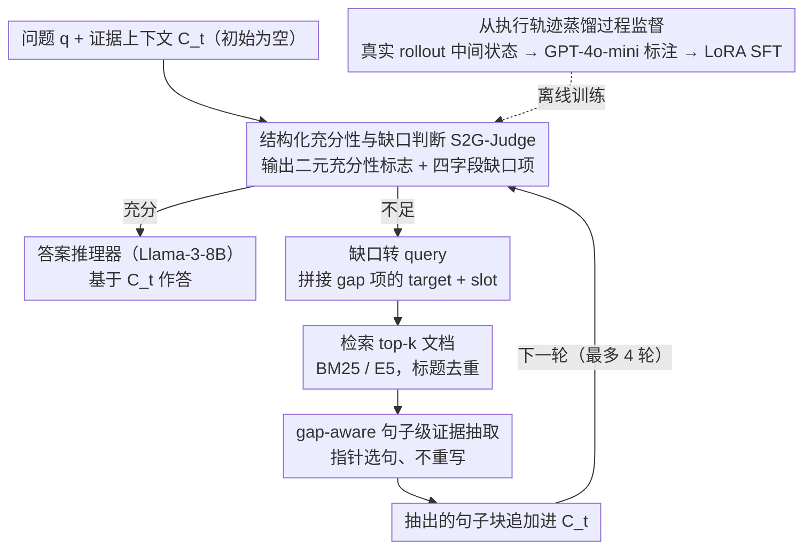

# S2G-RAG: Structured Sufficiency and Gap Judging for Iterative Retrieval-Augmented QA

**会议**: ACL2026  
**arXiv**: [2604.23783](https://arxiv.org/abs/2604.23783)  
**代码**: 未在论文中声明  
**领域**: 信息检索 / RAG / 多跳问答  
**关键词**: 迭代检索, 充分性判断, 信息缺口, 证据压缩, 多跳问答

## 一句话总结
S2G-RAG 把迭代 RAG 中“证据够不够”和“下一步缺什么”显式建模成结构化控制器 S2G-Judge，再用 gap-guided query 和句子级证据抽取减少噪声，在 HotpotQA BM25 设置下把 F1 从 SIM-RAG 的 43.3 提升到 56.5。

## 研究背景与动机
**领域现状**：RAG 已成为知识密集型问答的标准方案，单跳问题通常能靠一次检索解决，多跳问题则需要多轮检索和中间推理。已有方法包括 IR-CoT、FLARE、Self-RAG、SIM-RAG、RAG-Critic 等，它们通过推理 trace、不确定性、反思 token 或 critic 信号控制检索。

**现有痛点**：迭代 RAG 的关键瓶颈不是单次检索，而是控制。系统每一轮都要判断当前 evidence memory 是否足以回答；如果不足，还要明确下一轮该搜什么。控制不可靠时，模型要么从不完整证据链中过早作答，要么持续检索并积累冗余、干扰性文本。

**核心矛盾**：自由文本推理很灵活，但难审计、难稳定地转化成下一跳检索需求。多轮检索又会让上下文越来越长，导致后续判断和回答受到 distractor 干扰。

**本文目标**：作者希望把检索控制变成显式、可诊断、可训练的结构化预测问题，同时用句子级 evidence context 控制多轮上下文膨胀。

**切入角度**：S2G-RAG 设计一个轻量 S2G-Judge，在每一轮输出 sufficiency decision 和 structured gap items。gap items 被映射成下一轮 query，retrieved documents 再由 sentence-level extractor 选取关键句进入 evidence memory。

**核心 idea**：让 RAG 控制器先回答“现在够不够”，不够时再结构化指出“缺哪类信息”，从而把多跳检索从自由漂移变成可审计的缺口填补过程。

## 方法详解
S2G-RAG 的设计可以理解为 judge-first iterative RAG。它没有改搜索引擎，也没有重新训练答案生成器，而是在检索器和 reasoner 之间加入一个结构化控制层，以及一个避免证据记忆膨胀的句子抽取层。

### 整体框架

给定问题 $q$ 和语料库 $D$，系统维护一段不断累积的证据上下文 $C_t$，初始 $C_0$ 为空。每一轮先让轻量控制器 S2G-Judge 读取 $(q, C_t)$，输出一个二元充分性标志 $s_t$ 和一组结构化缺口项 $G_t$：若 $s_t$ 为 true 就停止检索、交给 answer reasoner 作答；若为 false 则把 $G_t$ 翻译成下一轮 query，检索 top-k 文档，再经 evidence extractor 抽出句子级证据块 $E_t$ 追加进 $C_t$，进入下一轮。整条流水线把"多轮检索该不该停、停不下来时该搜什么"这件原本靠自由文本反思的事，变成可审计的判断—填缺口循环。默认 answer reasoner 是 Llama-3-8B-Instruct，S2G-Judge 是 LoRA 微调的 Llama-3.2-3B-Instruct，最多 4 轮、每轮 top-k=6 并做 title-based 去重；稀疏检索用 BM25，稠密检索用 E5-base-v2。

### 关键设计

**1. 结构化充分性与缺口判断：把"够不够 / 缺什么"做成可填的字段。** 控制器每轮显式回答两件事——当前证据是否足以作答，以及若不足还缺哪类信息。缺口被规约成带四个字段的 gap item：`category`、`target`、`slot`、`description`，其中 category 取自 bridge_entity、attribute、relation、evidence_span、other 五类；一旦 sufficiency 判为 true，gap set 即为空。

这种结构化设计直接对应多跳问答的典型失败模式：已经找到桥接实体却缺它的某个属性，或找到实体却缺连接两实体的关系证据。相比一段自由文本 reflection，带类别和槽位的缺口项更容易被稳定地映射成下一轮检索 query，也更容易诊断"系统到底卡在哪一跳"。

**2. 从执行轨迹蒸馏过程监督：让 judge 适应它真正会看到的中间状态。** 训练数据不是理想化的证据链，而是先用同一套迭代检索与证据积累流程跑出真实 rollout，逐轮记录 $(q, C_t)$；再由强教师 GPT-4o-mini 在 context-only 约束下为每个中间状态标注 sufficiency 与 gap items，并过滤掉低置信、教师自相矛盾的样本，最后用 LoRA SFT 训出 S2G-Judge。

之所以要从执行轨迹而非干净标注里蒸馏，是因为真实迭代 RAG 的中间 context 往往夹带冗余和 distractor。让 judge 在部署时会遇到的状态分布上学习，它对"含噪证据到底够不够"的判断才不会在线上失真。

**3. gap-aware 句子级证据上下文：用指针抽取压住多轮噪声。** 为避免每轮检索把整篇文档不断拼进上下文，extractor 把当轮文档切成带标题来源的句子候选池，由 LLM 依据问题和当前 gap items 只输出句子索引，系统再按索引取回原句追加到证据上下文——抽取器只做 pointer selection，不重写任何证据。

指针式抽取一举两得：保留了证据的 provenance、规避了改写阶段引入 hallucination 的风险；而把 gap items 喂给抽取器，又能让它优先挑出能填补当前缺口的句子，使证据上下文既紧凑又对路。

### 一个完整示例

以一个 2-hop 问题"某电影的导演出生在哪个城市"为例：$C_0$ 为空，S2G-Judge 判 $s_0=$ false，输出一个 category=bridge_entity、target=该电影、slot=导演的缺口项；系统据此构造 query 检索到"导演是 X"，抽取该句进 $C_1$。第二轮 judge 读 $(q, C_1)$ 仍判不足，输出 category=attribute、target=X、slot=出生城市；检索回填"X 出生于 Y 城"，抽句进 $C_2$。第三轮 judge 判 $s_2=$ true、gap set 为空，停止检索，answer reasoner 基于 $C_2$ 给出"Y 城"。整个过程的每一跳都对应一个可读的缺口项，便于审计究竟在哪一步补齐了证据。

### 损失函数 / 训练策略
S2G-Judge 用标准自回归交叉熵训练结构化输出，输入是 $(q, C_t)$，目标是教师标注的 sufficiency 与 gap schema，监督信号全部来自多轮执行轨迹而非人工逐轮标注。推理时 query construction 优先拼接 gap item 的 target 与 slot，缺失时回退到 description；默认只使用第一个有效 gap item，以保持 query 简洁。

## 实验关键数据

### 主实验
主结果在 TriviaQA、HotpotQA、2WikiMultiHopQA 上报告 EM/F1，并分别比较 BM25 和 E5 检索设置。

| 检索 | 方法 | TriviaQA EM/F1 | HotpotQA EM/F1 | 2Wiki EM/F1 | 主要结论 |
|------|------|----------------|----------------|-------------|----------|
| BM25 | IR-CoT | 56.9 / 68.9 | 28.6 / 41.5 | 23.5 / 32.4 | 多轮推理检索基线 |
| BM25 | SIM-RAG | 70.7 / 75.6 | 32.7 / 43.3 | 34.1 / 40.2 | critic 控制较强 |
| BM25 | S2G-RAG | 72.0 / 77.9 | 43.3 / 56.5 | 41.7 / 48.6 | 多跳提升最大 |
| E5 | Standard RAG | 58.8 / 68.3 | 25.1 / 35.3 | 10.6 / 21.0 | 单轮检索不足 |
| E5 | RAG-Critic | 65.0 / 75.9 | 40.0 / 51.2 | 27.9 / 34.0 | 强 learned-control baseline |
| E5 | S2G-RAG | 71.1 / 78.0 | 42.0 / 53.5 | 39.0 / 45.3 | 对不同 retriever 都有效 |

相对 SIM-RAG，S2G-RAG 在 BM25 HotpotQA 上提升 +10.6 EM 和 +13.2 F1，在 2Wiki 上提升 +7.6 EM 和 +8.4 F1。TriviaQA 是单跳为主，提升较小但仍有收益，说明句子级 evidence context 能缓解额外检索带来的噪声。

### 消融实验

| 变体 | HotpotQA EM | HotpotQA F1 | 说明 |
|------|-------------|-------------|------|
| Full S2G-RAG | 43.3 | 56.5 | 完整系统 |
| w/o SFT | 39.2 | 50.8 | 用未微调 judge，下降 4.1 EM / 5.7 F1 |
| w/o S2G-Judge | 27.5 | 37.6 | 去掉结构化控制，下降最大 |
| w/o Extractor | 39.5 | 52.5 | 直接拼接原始检索文本，噪声和延迟增加 |

| 证据压缩方法 | EM | F1 | 压缩比 | 说明 |
|--------------|----|----|--------|------|
| LLM summarization | 36.9 | 48.1 | 0.3816 | 摘要会丢证据或改写信息 |
| ReComp extractive | 41.4 | 53.8 | 0.4948 | 保真较好但不如本文 |
| ReComp abstractive | 34.9 | 46.4 | 0.1917 | 最短但 QA 损失大 |
| 句子指针抽取 | 43.3 | 56.5 | 0.3461 | 最佳准确率与压缩折中 |

### 关键发现
- S2G-Judge 是最关键模块。去掉它导致 HotpotQA F1 从 56.5 跌到 37.6，说明多跳检索控制比单纯检索更多文档更重要。
- sufficiency 判断偏保守，false positive rate 为 6.44%，但有 31.60% 已满足 retrieval truth 的样本仍被判为 insufficient。这降低过早作答风险，但也说明校准还有空间。
- 句子级 evidence context 相比原始全文拼接可带来约 4.5x-6.4x 压缩；在 HotpotQA BM25 下，完整系统相比无 extractor 的 per-sample latency 从 1.9552 秒降到 1.6085 秒，同时 F1 更高。

## 亮点与洞察
- “sufficiency + gap” 是很适合迭代 RAG 的接口。它比单纯 query rewriting 更可诊断，也比让生成器自由反思更容易约束。
- trajectory distillation 的训练分布设计很实际。控制器看到的是系统真实 rollout 产生的中间 evidence memory，而不是理想化标注，因此更贴近部署状态。
- 句子指针抽取兼顾压缩和可审计性。相比 abstractive summarization，它不改写证据，降低了压缩阶段引入 hallucination 的风险。
- 论文展示了模块化 RAG 的一个方向：retriever、controller、extractor、reasoner 可以解耦改进，而不必把所有能力塞进同一个大模型。

## 局限与展望
- gap schema 为了稳定性牺牲表达力，复杂问题可能需要多实体 join、时间约束或更结构化的中间程序，当前四字段 schema 未必足够。
- sentence-level extraction 有 compactness-recall trade-off，可能遗漏跨句证据或 disambiguation 所需上下文。
- sufficiency 判断偏保守，虽然能减少证据不足时作答，但会增加检索轮次和延迟。后续需要更好的 calibration。
- 论文没有直接用 RL 或 actor-critic 优化端到端系统目标，而是使用蒸馏训练控制器。未来可以把 S2G 输出作为辅助 reward 或中间变量接入学习型检索策略。

## 相关工作与启发
- **vs IR-CoT**: IR-CoT 用中间推理作为检索线索，S2G-RAG 则显式预测缺口字段，检索需求更结构化。
- **vs FLARE / Self-RAG**: 这些方法通过不确定性或 reflection token 控制检索，S2G-RAG 的 sufficiency 和 gap schema 更容易审计和训练。
- **vs SIM-RAG**: SIM-RAG 评估临时答案是否可接受，S2G-RAG 进一步要求指出缺失信息，并把它转成下一轮 query。
- **vs RAG-Critic**: RAG-Critic 提供错误反馈和修正流程，S2G-RAG 更轻量，强调多轮 evidence state 的结构化控制。

## 评分
- 新颖性: ⭐⭐⭐⭐☆ sufficiency/gap schema 不复杂，但抓住了迭代 RAG 控制的核心瓶颈。
- 实验充分度: ⭐⭐⭐⭐☆ 覆盖三数据集、两类 retriever、多个强 baseline 和丰富消融；若有更多真实长文档任务会更完整。
- 写作质量: ⭐⭐⭐⭐⭐ 动机、系统设计和分析实验层层对应，读起来很清楚。
- 价值: ⭐⭐⭐⭐⭐ 对多跳 RAG 系统工程很有参考价值，尤其是可审计控制和证据记忆压缩两个设计。

<!-- RELATED:START -->

## 相关论文

- [\[ACL 2025\] Mitigating Lost-in-Retrieval Problems in RAG Multi-Hop QA](../../ACL2025/information_retrieval/mitigating_lost-in-retrieval_problems_in_retrieval_augmented_multi-hop_question_.md)
- [\[ACL 2026\] VideoStir: Understanding Long Videos via Spatio-Temporally Structured and Intent-Aware RAG](videostir_understanding_long_videos_via_spatio-temporally_structured_and_intent-.md)
- [\[ACL 2026\] CRAFT: Training-Free Cascaded Retrieval for Tabular QA](craft_training-free_cascaded_retrieval_for_tabular_qa.md)
- [\[ACL 2026\] UnIte: Uncertainty-based Iterative Document Sampling for Domain Adaptation in Information Retrieval](unite_uncertainty-based_iterative_document_sampling_for_domain_adaptation_in_inf.md)
- [\[ACL 2025\] SGIC: A Self-Guided Iterative Calibration Framework for RAG](../../ACL2025/information_retrieval/sgic_a_self-guided_iterative_calibration_framework_for_rag.md)

<!-- RELATED:END -->
