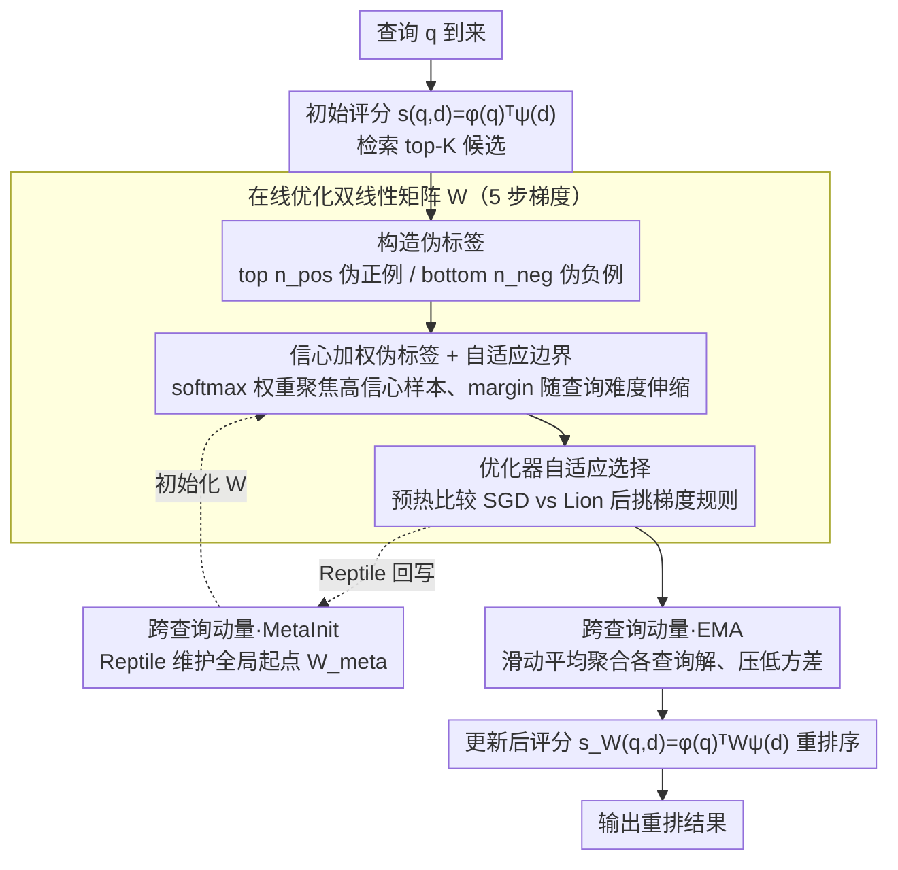

# Test-Time Training for Zero-Resource Dense Retrieval Reranking

**会议**: ACL2026  
**arXiv**: [2606.01070](https://arxiv.org/abs/2606.01070)  
**代码**: 无  
**领域**: 信息检索  
**关键词**: 零样本重排序, 测试时自适应, 密集检索, 双线性评分矩阵

## 一句话总结
提出 DART，通过在推理时用双线性矩阵自适应地调整密集检索器的评分函数，利用检索结果本身作为伪标签实现零样本无标注重排序，在 BEIR 基准上平均提升 2.1% NDCG@10，延迟控制在 10ms 以内。

## 研究背景与动机

**领域现状**：在现代信息检索系统中，两阶段级联架构已成为标准做法：第一阶段用快速的密集检索器（bi-encoder）从全库快速候选检索，第二阶段用精确但缓慢的重排序器（cross-encoder 或 LLM）进一步精化排序。密集检索器以其毫秒级延迟和强大的召回率成为首选，但重排序环节却面临严峻的零资源挑战。

**现有痛点**：监督重排序方法（cross-encoder、LLM 重排序器）需要昂贵的人工标注数据和海量计算资源。ColBERT 等虽然效果好，但延迟往往在 200–500ms 甚至更高，严重制约了实时应用。无标注设置下，从业者往往被迫放弃重排序步骤，直接使用密集检索的原始排序，这在仅索引向量的向量数据库系统中尤其常见。同时，无监督 PRF（伪相关反馈）虽然不需训练数据，但在大多数 BEIR 数据集上表现不稳定甚至恶化检索结果。

**核心矛盾**：想要零资源无标注重排序，要么选择有监督方法（需大量数据和时间），要么依赖无监督启发式（不可靠），鱼和熊掌难以兼得。

**本文目标**：找到一个轻量、廉价、快速、可靠的零资源重排序方案，既不需外部资源，也不需离线训练。

**切入角度**：观察到一个关键但被忽视的信号——检索器本身的排序列表中蕴含着任务相关的有用信息：排名靠前的文档很可能相关（伪正例），排名靠后的文档很可能不相关（伪负例）。虽然这些伪标签噪声较大，但它们是查询特定的、随处可得的。

**核心 idea**：与其改变查询或文档的表示，不如直接在推理时为每个查询个性化地调整评分函数，这样既能保持预训练密集检索器的能力，又能学习查询特定的调整。这是 Test-Time Training（TTT）的思想在检索重排序中的首次应用。

## 方法详解

### 整体框架

DART 将零资源重排序问题建模为在线优化：对于每个到来的查询 $q$，先用初始评分函数 $s(q,d)=\phi(q)^\top\psi(d)$ 检索出 top-$K$ 文档，然后基于这些文档中的伪标签（top $n_{\text{pos}}$ 个作为伪正例，bottom $n_{\text{neg}}$ 个作为伪负例），通过梯度步数优化一个双线性变换矩阵 $W$，从而将评分函数升级为 $s_W(q,d)=\phi(q)^\top W\psi(d)$。优化完成后，用更新后的矩阵对检索结果重排序。为了提升稳定性和泛化性，还维护跨查询的动量状态（MetaInit 和 EMA），使得后续查询能从前面查询的适应经验中受益。

### 关键设计

**1. 信心加权伪标签 + 自适应边界，驱动双线性评分矩阵在线优化**

DART 不去碰查询和文档的表示，而是把评分函数从固定余弦相似度升级为 $s_W(q,d)=\phi(q)^\top W\psi(d)$，让一个可学习的 $d\times d$ 矩阵 $W$ 动态调节各语义维度对当前查询的权重，并把 $W$ 初始化为单位阵 $I$ 以保证启动即等价于原始检索。难点在于伪标签本身有噪声——把 top 文档当正例、bottom 当负例并不可靠，一视同仁地学只会放大噪声。为此正例按 $w_i^+ = \exp(s_i/T)/\sum_{i'}\exp(s_{i'}/T)$、负例按 $w_j^- = \exp(-s_j/T)/\sum_j\exp(-s_j/T)$ 做 softmax 加权，自动把梯度聚焦到高信心样本上。同时边界不再固定，而是随查询难度伸缩 $\text{margin}(q) = \alpha_{\text{mar}} + \beta_{\text{mar}}(1-s_{\text{top1}})$：top-1 分数高（容易查询）就放低要求，分数低（困难查询）才要求更大间隔、做更激进的调整，从而避免一刀切 margin 对不同难度查询的错配。

**2. 跨查询动量（MetaInit + EMA）：把单查询的弱信号攒成稳定方向**

每个查询只有约 top-100 文档可用，优化信号很弱，单独学极易过拟合查询自身的噪声。DART 维护两套互补的矩阵状态来跨查询平滑参数演化：MetaInit 学一个全局起点 $W_{\text{meta}}$，每处理完一个查询用 Reptile 规则更新 $W_{\text{meta}}^{(t)} = W_{\text{meta}}^{(t-1)} + \beta_{\text{meta}}(W^\star(t) - W_{\text{meta}}^{(t-1)})$，让下一个查询从已适应的起点出发、加快收敛；EMA 则对最终用于重排的矩阵做滑动平均 $W_{\text{ema}} = \alpha_{\text{ema}}W_{\text{ema}} + (1-\alpha_{\text{ema}})W^\star$，把多个查询的解聚合起来压低单查询方差。二者本质都是把分散在查询流上的学习信号攒成一个更稳的方向，实验中 EMA 最有效，在所有数据集上都带来正收益。

**3. 优化器自适应选择（SGD vs Lion）：按伪标签质量挑梯度规则**

不同数据集的稀疏度和领域差异，使伪标签质量参差不齐，没有哪个优化器能通吃。DART 在处理前 50–100 个查询时让 SGD-with-momentum 和 Lion 并行跑，比较二者的平均伪标签损失，选损失更低的那个用于后续查询：噪声大的数据集 SGD 更稳，伪标签干净的数据集则 Lion 基于梯度符号的更新更占优（在 SCIDOCS 上单步带来 +4.1%）。代价是一次性的预热开销，作者建议在无法预热时默认用 SGD。

## 实验关键数据

### 主实验

在六个 BEIR 基准数据集上评估：

| 数据集 | NFCorpus | SCIDOCS | FiQA | ArguAna | TREC-COVID | SciFact | 平均 | 平均相对收益 | 延迟 |
|--------|----------|---------|------|---------|------------|---------|------|-----------|------|
| 密集检索 (BGE-small) | 0.337 | 0.197 | 0.385 | 0.595 | 0.665 | 0.720 | 0.483 | 0.0% | <1ms |
| BM25 重排序 | 0.302 | 0.156 | 0.220 | 0.371 | 0.685 | 0.588 | 0.387 | −21.2% | <2ms |
| PRF-Vec (n=3) | 0.347 | 0.203 | 0.371 | 0.602 | 0.663 | 0.710 | 0.483 | +0.3% | <2ms |
| **DART (本文)** | **0.354** | **0.205** | **0.389** | **0.605** | **0.670** | **0.719** | **0.490** | **+2.1%** | **<10ms** |

DART 在 5/6 数据集上超越密集检索基线，最大收益在 NFCorpus 上（+5.0%）。BM25 重排序灾难级别（−21.2%）说明词法方法的不适配。与近期无监督 LLM 方法相比，DART 仅需 <10ms 延迟（比它们的 200ms 快 20 倍以上）就达到最强表现。

### 消融实验

| 配置 | NFCorpus | SCIDOCS | FiQA | ArguAna | 平均收益 |
|------|----------|---------|------|---------|---------|
| 密集检索 | 0.337 | 0.197 | 0.385 | 0.595 | 0.0% |
| Base（仅信心加权） | 0.346 | 0.199 | 0.363 | 0.595 | +0.5% |
| + AdaMargin | 0.350 | 0.201 | 0.362 | 0.595 | +3.9% |
| + EMA | 0.351 | 0.199 | 0.378 | 0.596 | +4.0% |
| + MetaInit | 0.348 | 0.197 | 0.362 | 0.599 | +3.3% |
| + EMA + AdaMargin | 0.355 | 0.203 | 0.378 | 0.597 | +5.3% |
| + 全部（含 Lion） | 0.354 | 0.205 | 0.389 | 0.605 | +5.0% |

**关键发现**：

- **EMA 最有效**，在所有四个数据集上都带来正收益。
- **AdaMargin 对 NFCorpus 贡献最大**——该数据集查询难度分布宽。
- **Lion 在 SCIDOCS 上带来 +4.1% 单步提升**，证实它在伪标签干净时优势明显。
- **三个组件互补**，全组件组合实现最优平均收益。

## 亮点与洞察

- **巧妙的伪标签可靠性设计**：不是粗暴二值化伪标签，而是用柔和的信心权重 $\exp(s_i/T)$ 自动加权，思路可迁移到其他伪标签场景（域自适应、主动学习）。
- **查询难度自适应的边界**：$\text{margin}(q) = \alpha_{\text{mar}} + \beta_{\text{mar}}(1-s_{\text{top1}})$ 优雅地将查询难度量化为单个标量并以此调节学习强度。
- **低秩结构的发现**：DART 学到的变换矩阵 $\Delta W$ 具有明显低秩性（前三个奇异值累积解释 28.4% 方差），说明网络自动地只在任务相关的小维度子空间内调整。
- **严格延迟约束下的实用创新**：<10ms 限制下仅用 5 步梯度和矩阵乘法就达到效果，展现了高效计算与效果的完美平衡。
- **零资源设置下的新高度**：在绝对禁区（无标注、无外部资源、无离线训练）中实现与强监督方法可比的效果。

## 局限与展望

**作者承认的局限**：

- **优化器选择的预热成本**：需要 50–100 个查询比较两个优化器；作者建议默认 SGD。
- **扩展性瓶颈**：当前实现优化 $d \times d$ 矩阵，$d \geq 768$ 时内存和计算开销二次方增长；论文提议用低秩参数化 $W = I + AB^\top$ 但未来实现。

**自己的观察**：

- 检索器本身严重失效的领域（如 SciFact 的 −0.1%）伪标签质量极差，改进有限。
- 跨查询动量假设查询流相似性，对会话主题剧烈变化场景可能失效。
- 没有研究 listwise 损失等其他损失函数设计。

**具体改进思路**：

- 实现低秩参数化支持更大嵌入维度。
- 研究会话级或会话簇级的适应。
- 探索矩阵 $W$ 知识蒸馏到固定参数，用于不支持梯度的边界系统。

## 相关工作与启发

- **vs 传统伪相关反馈 (PRF)**：PRF 通过修改查询表示利用伪相关文档，而 DART 保持表示不变只调整评分函数。互补思路，DART 更精准灵活。
- **vs 无监督域自适应 (GPL、AugTriever)**：它们需要离线训练和数据生成，DART 完全在线、零离线成本。
- **vs LLM 重排序器**：LLM 文本理解强但 200–500ms 延迟对实时系统不适用。DART 通过轻量参数适应换取低延迟。
- **vs TTT 在视觉领域应用**：TTT++ 在图像分类验证了测试时参数适应，DART 首次成功迁移到检索排序。

## 评分

- **新颖性**: ⭐⭐⭐⭐⭐ 首次将 Test-Time Training 应用于检索重排序，巧妙地利用检索结果本身作为伪标签实现零资源适应。
- **实验充分度**: ⭐⭐⭐⭐⭐ 六个 BEIR 数据集跨域验证，完整消融实验，深入的低秩结构分析。
- **写作质量**: ⭐⭐⭐⭐ 逻辑清晰，动机充分，方法表述精确，算法伪代码完整。
- **价值**: ⭐⭐⭐⭐⭐ 直接解决工业界极为常见的场景，方案简洁、开销低、效果稳定，具有强烈的实用价值。

<!-- RELATED:START -->

## 相关论文

- [\[NeurIPS 2025\] Retrieval is Not Enough: Enhancing RAG Reasoning through Test-Time Critique and Optimization](../../NeurIPS2025/information_retrieval/retrieval_is_not_enough_enhancing_rag_reasoning_through_test-time_critique_and_o.md)
- [\[ACL 2026\] CRAFT: Training-Free Cascaded Retrieval for Tabular QA](craft_training-free_cascaded_retrieval_for_tabular_qa.md)
- [\[ACL 2026\] ChunQiuTR: Time-Keyed Temporal Retrieval in Classical Chinese Annals](chunqiutr_time-keyed_temporal_retrieval_in_classical_chinese_annals.md)
- [\[ICML 2026\] BlitzRank: Principled Zero-shot Ranking Agents with Tournament Graphs](../../ICML2026/information_retrieval/blitzrank_principled_zero-shot_ranking_agents_with_tournament_graphs.md)
- [\[ACL 2026\] More Than Efficiency: Embedding Compression Improves Domain Adaptation in Dense Retrieval](more_than_efficiency_embedding_compression_improves_domain_adaptation_in_dense_r.md)

<!-- RELATED:END -->
