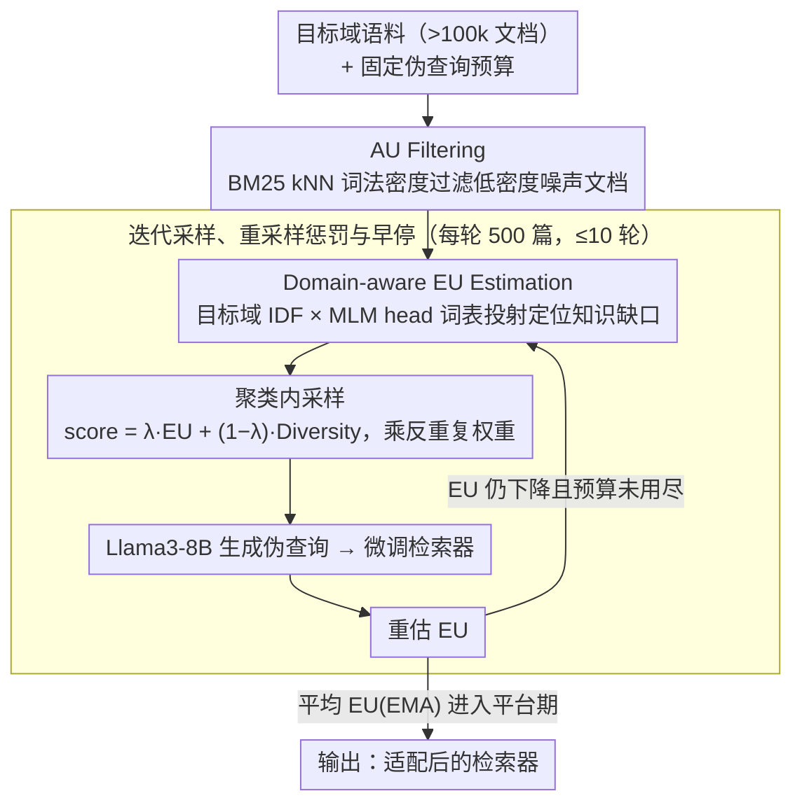

# UnIte: Uncertainty-based Iterative Document Sampling for Domain Adaptation in Information Retrieval

**会议**: ACL2026  
**arXiv**: [2604.25142](https://arxiv.org/abs/2604.25142)  
**代码**: https://github.com/ldilab/UnIte  
**领域**: 信息检索  
**关键词**: 无监督领域适配, 文档采样, 检索增强, 不确定性估计, BEIR

## 一句话总结
UnIte 把神经检索器的无监督领域适配瓶颈从“生成更多伪查询”转向“更聪明地选文档”，先用 aleatoric uncertainty 过滤低密度噪声文档，再用随模型训练动态变化的 epistemic uncertainty 迭代采样高价值文档，在 BEIR 大语料上用更少伪查询稳定超过 DUQGen。

## 研究背景与动机
**领域现状**：神经检索器通常在 MS-MARCO 等源域上预训练，到新领域时会出现明显泛化下降。无监督领域适配的一条主流路线是 pseudo-query generation：从目标域文档生成伪查询，再用 query-document pair 微调检索器。

**现有痛点**：大规模语料往往超过 100k 文档，不可能给所有文档都调用 LLM 或 query generator。于是“采哪些文档生成伪查询”变成核心预算瓶颈。随机采样效率低，DUQGen 用聚类提升覆盖率，但它主要优化 diversity，容易采到两个低价值区域：低密度 outlier 文档，以及当前检索器已经很有信心的高置信区域。

**核心矛盾**：领域适配需要的是既可靠又有学习价值的文档。低密度 outlier 可能是噪声或离题内容，会带来负迁移；高置信文档虽然代表常见主题，但模型已经学会，继续训练收益有限。一个好采样器应同时避开高 aleatoric uncertainty 的噪声，并优先选择高 epistemic uncertainty 的知识缺口。

**本文目标**：在固定伪查询预算下，选择更有训练价值的目标域文档，使检索器用更小样本量获得更高 nDCG@10，并能随着模型适配进程动态更新采样策略。

**切入角度**：作者把不确定性拆成 data-level AU 和 model-level EU。AU 用模型无关的 BM25 lexical kNN 距离估计，避免把“模型没学会”误判成“数据本身异常”；EU 则用当前检索器的文档表示与目标域 IDF 分布之间的错配来衡量。

**核心 idea**：先过滤高 AU outliers，再在每轮训练后重新估计 EU，用“高 EU + 高 diversity + 反重复采样惩罚”的策略迭代采样文档，直到平均 EU 进入平台期。

## 方法详解

### 整体框架

UnIte 要解决的是一个预算受限的采样问题：给定一个超过 100k 文档的目标域语料和固定的伪查询预算，挑出最值得拿来生成伪查询、微调检索器的那几千篇文档。它的做法是把"该选哪些文档"拆成数据层和模型层两个判断——先用一次模型无关的 AU 过滤把语料里的低密度噪声文档剔掉，再进入一个"估 EU → 采样 → 生成伪查询 → 微调检索器 → 重估 EU"的迭代循环，每训练一轮就重新衡量哪些区域还有知识缺口，把后续预算动态转向这些区域。

整个循环以平均 EU 的 EMA 作为停止信号：EU 先随训练下降表示模型正在填补缺口，一旦反弹就说明新样本开始冗余或过拟合，此时即便没用满 5k 预算也提前停下。

### 关键设计

**1. AU Filtering：用模型无关的词法密度先把噪声剔掉**

大语料里夹杂着离题、残缺或主题边缘的文档，把它们拿去生成伪查询会带来负迁移，但这种"数据本身的异常"不应该交给正在被适配的模型来判断——否则模型还没学会的目标域内容会被误删。UnIte 因此把 aleatoric uncertainty 完全建立在语料统计上：对每篇文档计算它到第 $k$ 个近邻的词法距离 $D_k(d)=1/(\epsilon + \mathrm{BM25}(d,n_k))$，再做 modified z-score 归一化，凡 $z(d)>z_{thr}$ 的文档判为低密度离群点并过滤掉，实验中取 $k=3$、$z_{thr}=1.5$。BM25 只看词频共现而不依赖任何 embedding，这让 AU 和后面要估的模型层不确定性能干净地分开，不会互相污染。

**2. Domain-aware EU Estimation：用目标域 IDF 定位模型的知识缺口**

过滤掉噪声之后，真正值得训练的是模型当前还没掌握的文档，但传统的 entropy 或 MC-dropout 只看模型自身预测方差，根本不知道目标域里哪些词重要。UnIte 的 epistemic uncertainty 把目标域分布显式塞了进来：先在目标域上预计算 token 级 IDF，再让当前检索器的 MLM head 把文档表示投射成词表概率并取 top-1000 token，比较那些高 IDF 词的重要性与模型实际预测概率之间的错配。模型越是预测不出目标域的高 IDF 关键词，就说明它对该文档所在的知识区域 EU 越高、越值得拿来训练，这让不确定性信号直接对齐了 domain adaptation 的学习价值，而非泛泛的模型方差。

**3. 迭代采样、重采样惩罚与早停**

EU 不是静态量——第一轮高价值的 cluster 训练几轮后可能已经被学会，一次性静态采样会在这些 dominant cluster 上反复浪费预算。UnIte 因此每轮只采 500 篇、最多 10 轮，在 DUQGen 风格的聚类内用 $score=\lambda \widehat{EU}+(1-\lambda)\widehat{Diversity}$ 排序兼顾缺口与覆盖（取 $\lambda=0.5$），并给每个 cluster 的预算乘上反重复权重 $w_i=|C_i|/(P_i+\epsilon)$，历史上采得越多的 cluster 权重越低，逼着算法把后续预算转向仍有缺口的区域。停止条件则用 EMA 平滑后的平均 EU（$\alpha=0.4$）：一旦进入平台期就早停，这既省训练样本又能避免在已学会的区域上过拟合。

### 损失函数 / 训练策略

UnIte 本身只是采样策略，不改变检索器的训练目标。它对每篇被选中的文档用 Llama3-8B-Instruct 生成一个伪查询（temperature 0.8、top-p 0.9），再用各检索器原生的标准目标做微调。实验覆盖 DPR、coCondenser、COCO-DR 和 Qwen3-Embedding-4B 等单向量检索器，主指标是 BEIR 上的 nDCG@10。核心实验都跑在单张 NVIDIA RTX 3090 上，DPR 训练 5k 样本约 10 分钟，而 UnIte 早停后通常只用到 3-5k 样本。

## 实验关键数据

### 主实验
作者在五个大规模 BEIR 数据集上评测：TREC-COVID、Robust04、Quora、TREC-NEWS 和 HotpotQA。下表摘取 Table 1 的整体平均结果。

| Retriever | DUQGen AVG | UnIte AVG | 相对 DUQGen 提升 | 代表性提升 |
|-----------|------------|-----------|------------------|------------|
| DPR | 46.61 | 49.06 | +2.45 | TREC-COVID +4.04，TREC-NEWS +5.08 |
| coCondenser | 54.94 | 55.69 | +0.75 | Robust04 +1.53，TREC-NEWS +3.14 |
| COCO-DR | 62.01 | 62.27 | +0.26 | TREC-COVID +0.86，TREC-NEWS +0.47 |
| Qwen3-Embedding-4B | 69.31 | 72.80 | +3.49 | TREC-COVID +3.00，Quora +4.72，TREC-NEWS +4.86 |

UnIte 的提升在小模型 DPR 和大模型 Qwen3 上更明显，说明“模型当前知识缺口”这个信号能随模型容量放大。COCO-DR 本身较强，绝对提升较小，但平均仍为正。

### 消融实验
论文重点消融 AU、EU 和 resampling penalty。AU / EU 的图示结果显示：去掉 EU 后 Robust04 上甚至会比 zero-shot 低约 4 nDCG@10；同时去掉 AU 和 EU 后，在 TREC-COVID / Robust04 上相对 UnIte 峰值差约 5 / 9 nDCG@10。表格结果如下。

| 配置 | TC nDCG@10 | QR nDCG@10 | TN nDCG@10 | 说明 |
|------|------------|------------|------------|------|
| w/ Resampling Penalty | 61.73 | 74.95 | 30.39 | 完整动态预算分配 |
| w/o Resampling Penalty | 54.39 | 73.42 | 21.83 | cluster 预算静态，容易重复采 dominant cluster |
| 提升 | +7.34 | +1.53 | +8.56 | 惩罚项对 TC / TN 特别关键 |

| EU 估计方法 | TC | RB | TN | AVG | 结论 |
|------------|----|----|----|-----|------|
| UnIte domain-aware EU | 55.54 | 31.38 | 23.33 | 36.75 | 引入目标域 IDF 分布 |
| MC-Dropout | 52.79 | 28.27 | 21.60 | 34.22 | 只看模型方差，领域感弱 |
| Entropy | 54.10 | 25.83 | 22.70 | 34.21 | 容易忽略 domain mismatch |

| 方法 | DPR ΔnDCG@10 / 1k | 平均采样量 | Qwen3 ΔnDCG@10 / 1k | 平均采样量 |
|------|--------------------|------------|----------------------|------------|
| DUQGen | 3.56 | 5k | 0.83 | 5k |
| UnIte | 4.50 | 4.5k | 2.45 | 4.5k |

### 关键发现
- 只追求 diversity 不够。DUQGen 会采到低密度 outlier 和高置信区域，前者造成噪声，后者学习信号弱。
- AU 和 EU 需要分开估计。BM25 kNN 负责数据层 outlier，IDF + 模型词表投射负责模型层知识缺口，二者混在 dense embedding 里会互相污染。
- 早停不仅省训练样本，也能防过拟合。平均 EU 的局部低点与 TREC-COVID 上的 nDCG@10 峰值对齐，说明 uncertainty plateau 是合理的无监督停止信号。
- 计算开销可接受。AU filtering 一次约 120 秒，EU 每轮约 150 秒；即使加上采样开销，早停到约 4k 样本后仍比固定 5k 的基线节省训练时间。

## 亮点与洞察
- 这篇论文最有价值的地方是把 active learning 的 uncertainty taxonomy 很干净地映射到 IR domain adaptation：AU 是“别拿来训练”的噪声，EU 是“现在最值得学”的缺口。
- EU 估计不只是 entropy，而是“模型预测的词表分布”和“目标域 IDF 重要性”之间的错配。这比纯模型不确定性更像检索里的领域适配信号。
- 迭代采样比一次性采样更符合微调过程。模型每训练一轮，哪些文档有价值都会改变；静态选择在 budget 小时尤其浪费。
- 该方法可以迁移到 RAG 数据构建或 reranker hard-negative 选择：先过滤低密度噪声，再根据当前模型对目标域术语的掌握程度选样本。

## 局限与展望
- 方法主要针对单向量检索器。对 ColBERT、MonoT5 这类 late-interaction 或 reranker，论文只是用 pooling 和共享词表头近似，和原生训练目标不完全匹配。
- 目标域分布目前只用 IDF 统计，难以表达主题结构、实体关系或 query intent；后续可探索 topic-conditioned statistics 或 document-frequency variants。
- 重采样惩罚能减少 dominant cluster 过采样，但不保证 rare minority topics 被充分覆盖，偏斜领域中可能仍漏掉少数但重要的主题。
- 实验集中在英文 BEIR，跨语言检索、专利 / 法律 / 医疗等更复杂语料还需要验证。
- 伪查询质量仍依赖 Llama3-8B-Instruct；如果生成器在某领域不可靠，采样再好也会被 query noise 限制。

## 相关工作与启发
- **vs GPL**: GPL 依赖随机采样文档，再用 cross-encoder 标注伪相关性；UnIte 不强调更贵标注，而是先把文档选择变得更高效。
- **vs DUQGen**: DUQGen 用外部 Contriever 做 diversity clustering，覆盖面更好但不了解当前 retriever 的学习状态；UnIte 在 diversity 外加入动态 EU 和 AU 过滤。
- **vs Quality sampling**: 质量估计模型试图判断文档是否适合生成查询，但不显式考虑目标域分布和检索器知识缺口；UnIte 的信号更贴近 adaptation objective。
- **vs active learning uncertainty sampling**: 传统 entropy / MC-dropout 只看模型不确定性，容易把 outlier 当成高价值样本；UnIte 先分离 AU，再用 domain-aware EU 选择可学习样本。

## 评分
- 新颖性: ⭐⭐⭐⭐☆ 把 AU / EU taxonomy 系统用于检索领域适配采样，设计扎实但核心组件多来自已有 IR 与 active learning 思路。
- 实验充分度: ⭐⭐⭐⭐☆ 覆盖 5 个大语料、4 个检索器和多组消融；对多向量 / reranker 的适配仍偏初步。
- 写作质量: ⭐⭐⭐⭐☆ 动机非常清楚，方法与消融互相支撑；个别表格排版较乱，符号说明可更紧凑。
- 价值: ⭐⭐⭐⭐⭐ 对预算受限的 IR domain adaptation 很实用，也为 RAG 语料选择提供了可复用框架。

<!-- RELATED:START -->

## 相关论文

- [\[ACL 2026\] Domain-Specific Data Generation Framework for RAG Adaptation](domain-specific_data_generation_framework_for_rag_adaptation.md)
- [\[ACL 2026\] More Than Efficiency: Embedding Compression Improves Domain Adaptation in Dense Retrieval](more_than_efficiency_embedding_compression_improves_domain_adaptation_in_dense_r.md)
- [\[ACL 2026\] S2G-RAG: Structured Sufficiency and Gap Judging for Iterative Retrieval-Augmented QA](s2g-rag_structured_sufficiency_and_gap_judging_for_iterative_retrieval-augmented.md)
- [\[CVPR 2025\] Preserving Clusters in Prompt Learning for Unsupervised Domain Adaptation](../../CVPR2025/information_retrieval/preserving_clusters_in_prompt_learning_for_unsupervised_domain_adaptation.md)
- [\[ACL 2026\] Feedback Adaptation for Retrieval-Augmented Generation](feedback_adaptation_for_retrieval-augmented_generation.md)

<!-- RELATED:END -->
