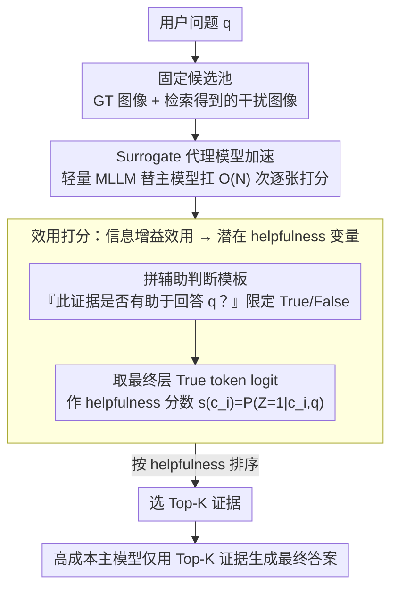

# Utility-Oriented Visual Evidence Selection for Multimodal Retrieval-Augmented Generation

**会议**: ACL2026  
**arXiv**: [2605.13277](https://arxiv.org/abs/2605.13277)  
**代码**: https://github.com/Hcnaeg/utility-mrag  
**领域**: information_retrieval  
**关键词**: 多模态RAG, 视觉证据选择, 信息增益, 轻量代理模型, 检索重排  

## 一句话总结
本文把多模态 RAG 的图像选择从“语义相似度排序”改成“对最终回答是否有用”的效用估计，并用轻量多模态代理模型高效预测证据 helpfulness，在 MRAG-Bench 和 Visual-RAG 上同时提升回答质量和推理效率。

## 研究背景与动机
**领域现状**：多模态 RAG 通常先检索一批候选图像，再把 Top-K 图像交给多模态大模型生成答案。现有视觉证据选择大多沿用文本 RAG 的思路，用 CLIP、SigLIP、BGE-VL 或 MLLM reranker 估计 query-image 的语义相关性。

**现有痛点**：相关图像未必有用。论文用一个犬种识别例子说明，某张图可能因为“伸舌头”等显著属性和问题图很相似而得分很高，但它属于错误犬种，对回答真正需要的判别信息没有帮助。相似度检索强调“像不像”，RAG 生成需要的是“能不能改变模型对答案的判断”。

**核心矛盾**：视觉证据选择面临两个层面的错位。第一，语义相关性和下游效用不一致，相关图像可能冗余、误导或缺少判别特征。第二，直接在答案空间估计效用又很难，因为 MLLM 的输出分布是隐式的、开放式答案有语言噪声，重复生成或采样代价也很高。

**本文目标**：作者希望建立一个更原则化的视觉证据选择准则，直接衡量候选图像对模型回答的帮助程度；同时，这个准则不能依赖昂贵的主模型逐个生成答案，否则无法扩展到真实候选池。

**切入角度**：论文从信息论出发，把证据效用定义为“给定候选证据后，模型对答案分布的不确定性或信念发生了多大变化”。随后作者发现直接算答案空间的信息增益不可行，于是引入一个二值潜变量：这张证据是否 helpful。

**核心 idea**：用潜在 helpfulness 概率 $P(Z=1|C=c,q)$ 近似答案空间效用，并让小型多模态代理模型承担候选图像排序，主模型只接收最终选出的证据。

## 方法详解
这篇论文的关键在于把“证据选择”重新定义。传统检索器通常回答“这张图和问题是否相关”，而本文的问题是“这张图是否会让目标模型更容易答对”。这两个问题在很多多模态场景中并不等价，尤其是细粒度识别、视觉常识和开放式问答。

作者先给出理想目标：如果候选证据 $c$ 真正有用，那么模型在看到它之后，对输出 $Y$ 的分布应该发生有意义的变化。这个变化可以用信息增益衡量，即 $IG(Y;C=c|q)=D_{KL}(P_{Y|C=c,q}||P_{Y|q})$。但这个定义只适合理论分析，因为真实 MLLM 没有显式输出分布，开放式答案空间巨大，而且不同表述方式会给 KL 或不确定性估计带来噪声。

为了解决这个问题，论文把答案空间效用投影到一个更小的潜变量空间。潜变量 $Z$ 是一个 Bernoulli 变量，表示候选证据对回答是否有帮助。作者证明，在“候选证据至少不明显有害”和“回答分布随 helpfulness 单调变化”等温和假设下，按 $IG(Z;C=c)$ 排序可以保持按 $IG(Y;C=c)$ 排序的最优解；进一步，在可行候选集合内，按 $IG(Z;C=c)$ 排序又等价于按 $P(Z=1|C=c,q)$ 排序。这样，原本难以计算的答案分布比较，变成了一个二分类式 helpfulness 评分问题。

### 整体框架
完整 pipeline 是 retrieve-select-generate。首先，系统用已有检索器构造固定候选池，其中包含 benchmark 给出的 ground-truth 图像和额外检索到的干扰图像。其次，轻量 surrogate MLLM 对每个 query-image pair 做 helpfulness 判断，计算候选图像的分数并排序。最后，高成本主模型只拿 Top-K 证据生成最终答案。

在实现上，作者构造一个辅助问题，例如“这张证据是否有助于回答用户问题？”，并把输出空间限制为 True / False。对于候选图像 $c_i$，模型输入是由原问题、候选图像和辅助判断指令组成的模板 $I=Template(q,c_i,q_{aux})$。helpfulness 分数直接取最终层对 True token 的 logit，即 $s(c_i)=\ell(v^+|I)$。这个设计避免了生成长答案，也不需要额外训练。

### 关键设计

**1. 从相关性到信息增益效用：把目标从“图像和查询像不像”换成“它能不能改变模型的回答”**

多模态 RAG 的失败常常来自那种“看起来相关但答题无用”的图——一张伸着舌头的狗和问题图很像、相似度很高，却属于错误犬种，对真正需要的判别信息毫无帮助。沿用文本 RAG 的相似度排序根本抓不住这种错位。论文因此把高效用证据定义为“能显著改变模型对答案后验信念”的证据，用信息增益 $IG(Y;C=c|q)=D_{KL}(P_{Y|C=c,q}\|P_{Y|q})$ 来刻画这种变化。它衡量的是证据是否提供了判别信息，于是能自然解释为什么某些低相似度却带关键线索的图反而更该被选进上下文。

**2. 潜在 helpfulness 变量：把不可计算的答案空间效用降维成一个二值判断**

$IG(Y;C=c|q)$ 只适合理论分析——真实 MLLM 没有显式输出分布，开放式答案空间巨大，措辞差异还会给 KL 估计灌进噪声。论文把答案空间效用投影到一个 Bernoulli 潜变量 $Z$ 上，$Z=1$ 表示候选证据对当前 query 有帮助。作者证明：在“候选证据至少不明显有害”“回答分布随 helpfulness 单调变化”等温和假设下，按 $IG(Z;C=c)$ 排序能保持按 $IG(Y;C=c)$ 排序的最优解；进一步，在可行候选集合内，按 $IG(Z;C=c)$ 排序又等价于按 $P(Z=1|C=c,q)$ 排序。这样原本要比较答案分布的难题，就塌缩成一个 helpfulness 二分类评分。实现上系统构造一个辅助问题“这张证据是否有助于回答用户问题？”，把输出限制为 True/False，对候选 $c_i$ 用模板 $I=\text{Template}(q,c_i,q_{aux})$ 输入，直接取最终层对 True token 的 logit 作分数 $s(c_i)=\ell(v^+|I)$，既不用生成长答案、也不用额外训练。

**3. Surrogate-accelerated 执行：把 $O(N)$ 次候选打分从大主模型转移到小代理模型**

真实 RAG 的候选池可能很大，让 8B–12B 主模型逐张判断甚至逐张生成答案，代价高到无法扩展。论文提出 utility transferability hypothesis：如果一张图对小模型明显无助或矛盾，它很可能对大模型也无助。于是用 Qwen3-VL-2B、Ovis2.5-2B 这类轻量模型承担全部候选排序，主模型只在选出的 Top-K 上做一次最终生成。判断“是否 helpful”本来就比“完整回答问题”简单，因此把效用导向的筛选交给小模型，既保留了选证据的原则性，又让整套系统在生产中真正可部署。

### 损失函数 / 训练策略
本文是训练-free 方法，没有监督训练或梯度更新。核心“训练策略”其实是推理时的评分协议：固定候选池，使用辅助 helpfulness prompt，对 True / False logits 做比较，再把 Top-K 图像交给主模型。实验覆盖 Qwen3-VL、MiniCPM-V4.5、Gemma3、Ovis2.5、InternVL3.5 等多种主模型，并比较 CLIP-style retriever、MLLM retriever、answer-level uncertainty、verbalized UQ 和 listwise ranking。

## 实验关键数据

### 主实验
主实验在 MRAG-Bench 和 Visual-RAG 上评估 Top-K 证据选择。MRAG-Bench 使用 exact-match accuracy，Visual-RAG 使用 LLM-as-Judge。下表摘取 K=1 时若干代表性方法，可以看到本文方法在多数模型和数据集上超过强检索/重排基线。

| 方法 | 参数量 | MRAG Qwen3-VL-8B | MRAG MiniCPM-V4.5 | Visual-RAG Qwen3-VL-8B | Visual-RAG Ovis2.5-9B |
|------|--------|------------------|-------------------|-------------------------|------------------------|
| Zero-shot | 无图像 | 59.35 | 57.95 | 52.41 | 52.67 |
| GME | 2.2B | 64.38 | 65.19 | 55.88 | 67.51 |
| LamRA-Rank | 8B | 63.34 | 62.97 | 58.42 | 58.16 |
| Ours, Qwen3-VL-2B surrogate | 2.1B | 65.56 | 65.41 | 59.89 | 68.85 |
| Ours, Ovis2.5-2B surrogate | 2.6B | 64.97 | 64.08 | 61.36 | 69.12 |

完整表中，本文方法在 Visual-RAG 上最高带来 +16.18 的绝对提升，并且很多情况下接近 GT oracle，甚至个别设置略高于人工标注图像输入。这说明“人工相关图像”不一定就是某个具体 MLLM 最有用的证据。

### 消融实验
论文重点比较了潜在 helpfulness 目标和 answer-level uncertainty 目标。下表摘取部分结果，括号表示 answer-level 方法相对本文方法的差距。

| 数据集 / 主模型 | Top-K | Ours | Answer-level Estimation | 差距 |
|-----------------|-------|------|-------------------------|------|
| MRAG-Bench / Qwen3-VL-8B | Top-1 | 65.71 | 63.27 | -2.44 |
| MRAG-Bench / MiniCPM-V4.5 | Top-3 | 66.89 | 64.15 | -2.74 |
| Visual-RAG / Qwen3-VL-8B | Top-1 | 62.43 | 57.49 | -4.94 |
| Visual-RAG / Ovis2.5-9B | Top-1 | 70.05 | 54.81 | -15.24 |
| Visual-RAG / InternVL3.5-8B | Top-3 | 58.16 | 54.68 | -3.48 |
| Visual-RAG / Gemma3-12B | Top-5 | 60.03 | 57.09 | -2.94 |

计算成本实验也很关键。以 Qwen3-VL 家族为例，discriminative estimation 在 2.1B surrogate 上 decode latency 约 3 ms，而 answer-level UQ 约 101 ms；在 8.1B 主模型上，两者 decode latency 分别约 15 ms 和 443 ms。论文总结 $Z$ 目标比 $Y$ 目标在 decode FLOPs 上超过 20 倍更高效。

| 模型家族 | 方法 | 小模型 decode latency | 大模型 decode latency | 主要含义 |
|----------|------|----------------------|----------------------|----------|
| Qwen3-VL | Discriminative Estimation | 3 ms | 15 ms | 只判断 helpfulness，输出短 |
| Qwen3-VL | Answer-level UQ | 101 ms | 443 ms | 需要答案级估计，生成开销大 |
| Ovis2.5 | Discriminative Estimation | 3 ms | 15 ms | 小代理适合批量候选打分 |
| Ovis2.5 | Answer-level UQ | 101 ms | 443 ms | 成本随采样和候选数放大 |

### 关键发现
- 语义相关性不是稳定的 RAG 目标。Zero-shot 在一些情况下能超过检索增强 baseline，说明错误证据会给模型带来负增益。
- latent helpfulness 比答案级不确定性更适合证据排序。开放式 Visual-RAG 上差距更大，因为答案级方法更容易被生成噪声和措辞差异干扰。
- 轻量 surrogate 和大模型排序高度一致。论文报告 surrogate 与 main model 的平均差距在 MRAG-Bench 上约 0.38，在 Visual-RAG 上约 0.18，严重 false positive 只约 2% 到 3.5%。
- 代理排序可以跨尺度迁移。Qwen2.5-VL 3B / 7B 作为 72B 的 surrogate 时，GT hit rate 趋势保持一致，支持小模型替大模型筛候选的假设。
- 方法不依赖额外训练。它直接利用现有 MLLM 对“是否有帮助”的判别能力，因此工程接入成本比训练专用 retriever 更低。

## 亮点与洞察
- 这篇论文把多模态 RAG 的关键问题说得很准：检索不是为了找“像”的图，而是为了找能改变回答的图。这个视角能解释很多“检索分数很高但回答更差”的现象。
- latent helpfulness 是一个优雅的降维。它保留了信息增益的理论味道，却把实际计算变成一个非常便宜的 True / False logit 打分。
- surrogate 加速不只是工程技巧，也和任务性质匹配。判断一张图是否 helpful 往往比完整回答问题简单，因此小模型可以承担大部分候选筛选工作。
- 这套框架很容易迁移。文本证据、视频片段、音频片段甚至工具结果都可以定义类似的 helpfulness probe，然后用代理模型做效用排序。
- 个别设置接近或超过 GT oracle 很有启发。人工标注的“相关图像”不一定符合特定模型的推理习惯，模型中心的效用选择可能更适配生成器本身。

## 局限与展望
- 理论假设仍较理想。候选证据“至少不有害”和 helpfulness 与答案分布单调相关，在真实噪声候选池中不总成立，尤其面对误导性图像或对抗样本时需要更强防护。
- surrogate 的选择仍是经验问题。虽然 2B 模型效果很好，但不同主模型、任务和候选池可能需要不同 surrogate，未来可以做动态选择或校准。
- 实验主要是 QA 型多模态 RAG。论文也承认，长文生成、对话、captioning、交错文本-图像检索、视频和音频证据选择还未充分验证。
- helpfulness prompt 仍可能受表述影响。作者做了 prompt 变体鲁棒性实验，但真实系统中不同语言、领域术语和用户意图可能让二值判断变得模糊。
- 方法选择证据但不修正生成器。即便选到有用图像，主模型仍可能幻觉或忽略证据，因此它最好和引用校验、答案后验验证或拒答机制结合。

## 相关工作与启发
- **vs CLIP / SigLIP 检索**: 这些方法关注共享嵌入空间中的相似度，速度快但不理解下游生成目标；本文直接评估候选图像是否能帮助回答，更贴近 RAG 的终端指标。
- **vs MLLM reranker**: LamRA-Rank、GME、VLM2Vec 等方法用更强模型做相关性或匹配估计，效果较好但仍未必等价于效用；本文把 scoring prompt 设计成 helpfulness 判别，目标更明确。
- **vs answer-level uncertainty**: 答案级方法通过平均 token 概率、MC sampling 或一致性估计回答可靠性，但在候选证据排序中混入生成噪声；本文把证据效用从答案生成中解耦出来。
- **vs adaptive RAG / retrieve-or-not**: 一些方法决定是否检索，本文更细粒度地决定检索到的视觉证据哪一个真正该进入上下文。
- **启发**: 可以把 helpfulness score 和传统相似度做双阶段系统，先用相似度召回，再用 utility reranking 精排；也可以训练一个专门的效用蒸馏模型，用本文的 surrogate 打分作为弱监督。

## 评分
- 新颖性: ⭐⭐⭐⭐☆ 从信息增益到 latent helpfulness 的转化很漂亮，问题定义比模型结构创新更有价值。
- 实验充分度: ⭐⭐⭐⭐⭐ 覆盖两套 benchmark、多类主模型、多类检索基线、效率、代理迁移和误差分析，证据比较完整。
- 写作质量: ⭐⭐⭐⭐☆ 理论和系统动机清楚，但主表很大，阅读时需要自己提炼关键比较。
- 价值: ⭐⭐⭐⭐⭐ 对实际多模态 RAG 很有用，尤其适合需要在成本和回答质量之间取平衡的生产系统。

<!-- RELATED:START -->

## 相关论文

- [\[ACL 2026\] Learning to Extract Rational Evidence via Reinforcement Learning for Retrieval-Augmented Generation](learning_to_extract_rational_evidence_via_reinforcement_learning_for_retrieval-a.md)
- [\[ACL 2026\] MM-BizRAG: Rethinking Multimodal Retrieval-Augmented Generation for General Purpose Enterprise Q&A](mm-bizrag_rethinking_multimodal_retrieval-augmented_generation_for_general_purpo.md)
- [\[ICLR 2026\] RAVENEA: A Benchmark for Multimodal Retrieval-Augmented Visual Culture Understanding](../../ICLR2026/information_retrieval/ravenea_a_benchmark_for_multimodal_retrieval-augmented_visual_culture_understand.md)
- [\[ACL 2025\] SetR: Shifting from Ranking to Set Selection for Retrieval Augmented Generation](../../ACL2025/information_retrieval/setr_set_selection_rag.md)
- [\[NeurIPS 2025\] Windsock is Dancing: Adaptive Multimodal Retrieval-Augmented Generation](../../NeurIPS2025/information_retrieval/windsock_is_dancing_adaptive_multimodal_retrieval-augmented_generation.md)

<!-- RELATED:END -->
