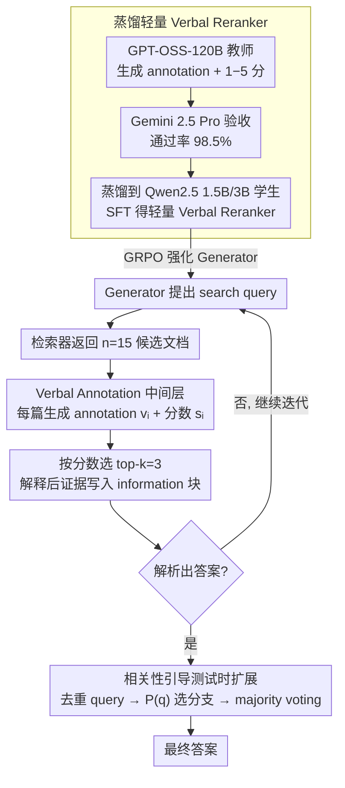

# Verbal-R3: Verbal Reranker as the Missing Bridge between Retrieval and Reasoning

**会议**: ACL2026  
**arXiv**: [2605.01399](https://arxiv.org/abs/2605.01399)  
**代码**: https://github.com/0k9d0h1/VerbalR3  
**领域**: 信息检索  
**关键词**: 检索增强生成, 重排序, Verbal Annotation, 强化学习, 测试时扩展  

## 一句话总结
Verbal-R3 把传统 reranker 从“只给相关性分数”的模块升级为“给分数并生成解释性 Verbal Annotation”的桥接模块，再用它训练和引导 RAG 推理器，在多跳问答中同时提升答案准确率和测试时扩展效率。

## 研究背景与动机
**领域现状**：RAG 系统一般先检索候选文档，再把原始段落拼进 LLM 上下文，让模型基于外部信息回答问题。为了提高检索质量，很多系统会加一个 reranker，把第一阶段检索出的文档重新排序，再选择 top-k 文档送给生成器。

**现有痛点**：传统 reranker 的输出通常只是相关性分数或文档排序。这个排序对“选哪些文档”有帮助，但没有告诉生成器“文档为什么相关、哪一部分支持答案、哪些内容应该忽略”。在多跳问题里，原始检索上下文越来越长、噪声越来越多，生成器即使拿到了包含答案的文档，也可能无法正确利用它。

**核心矛盾**：RAG 的瓶颈不只是 retrieval accuracy，而是 context utilization。检索模块关心 query-document 匹配，推理模块关心证据链与问题逻辑；二者之间缺少一个把“相关文档”翻译成“可推理证据”的中间表示。

**本文目标**：作者希望构建一个轻量 Verbal Reranker，既能像 reranker 一样给每个文档打相关性分数，又能生成面向推理器的自然语言分析，帮助生成器过滤噪声、理解证据，并在测试时把计算预算优先分配给更有希望的查询分支。

**切入角度**：论文先做了一个动机实验：在 Search-R1 中直接塞原文、塞 paraphrase、塞 Verbal Annotation 三者对比。结果显示，单纯改写文本甚至会伤害性能，而解释 query 与文档逻辑关系的 Verbal Annotation 明显提高 EM/F1 和 Context Utilization Efficacy。这说明问题不在“文本是否顺滑”，而在“证据是否被显式结构化”。

**核心 idea**：让 reranker 输出“相关性分数 + 面向推理的 verbal annotation”，再把这个模块蒸馏成小模型并嵌入 iterative RAG，使检索结果在进入生成器前先被解释成可用证据。

## 方法详解
Verbal-R3 可以理解成一个两模块 RAG 框架：Generator 负责迭代推理、提出检索 query、整合信息并生成答案；Verbal Reranker 负责对每个 query-document pair 产出 Verbal Annotation 和 1 到 5 的相关性分数。与普通 RAG 相比，它不只是把 top-k 文档拼进上下文，而是把 top-k “解释后的文档证据”拼进上下文，并在测试时用相关性分数控制哪些推理分支值得继续展开。

### 整体框架
训练分三段。第一段，使用 GPT-OSS-120B 作为教师模型，为大量 query-document 对生成 Verbal Annotation 和标量相关性分数；再用 Gemini 2.5 Pro 检查合成标注质量，论文报告通过率为 98.5%。第二段，把这些合成三元组蒸馏到 Qwen2.5-Instruct 1.5B/3B 学生模型，得到可部署的轻量 Verbal Reranker。第三段，把 Verbal Reranker 接入 Generator 的交互轨迹中，用 GRPO 对 Generator 做强化学习，使它学会提出更好的检索 query、读取 verbal annotations，并按指定格式输出最终答案。

推理时，Generator 先根据问题产生一个 search query；检索器返回 $n=15$ 个候选文档；Verbal Reranker 分别对每个文档生成 annotation $v_i$ 和分数 $s_i$；系统按分数和 score token logit 选 top-k，默认 $k=3$，把结果以 `<information>` 块写入 Generator 上下文。这个过程持续到解析出最终答案或达到最大轮数。

### 关键设计

**1. Verbal Annotation 作为检索与推理的中间层：让 reranker 不止给分，还给一段“为什么相关、哪部分支持答案、哪些该忽略”的解释**

多跳问题里检索上下文越来越长、噪声越来越多，生成器即使拿到了含答案的文档，也常常用不对它——瓶颈不在 retrieval accuracy，而在 context utilization。Verbal Reranker 因此对每个 query-document 对产出两类输出：一段自然语言的 critique/annotation，和一个 1–5 的相关性分数。这段 annotation 不是摘要、也不是 paraphrase，而是显式说明文档与 query 的逻辑关系、并点出其中的噪声或缺口，等于把“可能相关的文本”翻译成“可推理的证据脚手架”。动机实验也印证了这一点：往 Search-R1 里塞 paraphrase 甚至会掉点，而塞 Verbal Annotation 明显提升 EM/F1 和 Context Utilization Efficacy——问题从来不在文本顺不顺，而在证据有没有被显式结构化。

**2. 大模型教师到轻量 Verbal Reranker 的蒸馏：把 120B 的判断能力压进 1.5B/3B，让迭代检索付得起**

Verbal Annotation 的价值来自高质量判断，但 iterative RAG 每轮都要调一次 reranker，部署时绝不能每次都唤 120B。论文先用 prompt search 让 GPT-OSS-120B 产出更具判别性（而非泛泛总结）的 annotation，再用 Gemini 2.5 Pro 验收合成标注质量（通过率 98.5%），据此构造大规模 query-document-annotation-score 数据，对 Qwen2.5-Instruct 1.5B/3B 学生做 SFT，训练目标是最大化输出序列 $y_{VR}=(v,s)$ 的似然。蒸馏让小模型继承大模型“文档为什么有用”的判断模式，同时保住 iterative RAG 所需的高吞吐。

**3. 相关性引导的测试时扩展：把 reranker 分数复用成“哪个分支值得继续推理”的价值信号**

普通多数投票把所有轨迹同等展开，会在低质量分支上白白烧掉大量 reranker 调用。Verbal-R3 让相关性分数兼任分支调度：每轮生成多个 query 后先抽取 unique query、去重避免重复检索，对每个 query 取其候选文档的最高相关性分数 $s_{max,q}$，再按 $P(q)=(s_{max,q}/s_{best})^\alpha$ 选下一轮要展开的分支（论文取 $\alpha=7.5$、总轨迹预算 $N=5$），最后对已收集的答案做 majority voting。这样有限的计算预算就被集中到“已经找到好证据”的 query 上，reranker 也从一个前处理模块变成了推理树展开的价值估计器。

### 一个完整示例：一道两跳问题怎么走完

以“某部电影的导演出生在哪个国家”这类两跳问题为例。Generator 先产出第一跳 search query（“这部电影的导演是谁”），检索器返回 $n=15$ 个候选文档；Verbal Reranker 给每篇生成 annotation $v_i$ 和 1–5 分 $s_i$——直接点明导演姓名的那篇被打成 5 分、附注“这段确认了导演身份”，只提到演员表的几篇则被打低分、注明“与导演无关”。系统按分数取 top-$k=3$，把这些“解释后的证据”以 `<information>` 块写回 Generator 上下文。第二跳同理检索导演的出生地。当某一轮 Generator 同时抛出多个 query 时，系统先去重，再按 $P(q)=(s_{max,q}/s_{best})^{7.5}$ 把有限的 $N=5$ 条轨迹预算优先分给拿到高分证据的那个分支，最高分只有 2、3 分的分支基本不再展开；最终在收集到的答案里做 majority voting 输出结果。整条链路里，相关性分数同时干了两件事：选 top-k 文档、选值得继续的分支。

### 损失函数 / 训练策略
Verbal Reranker 采用 SFT：输入 $x_{VR}=(i_{VR}, q, d)$，输出 $y_{VR}=(v,s)$，优化目标是 $L_{SFT}=-E_{(x,y)\sim D}\sum_t \log p_\theta(y_t|x,y_{<t})$。Generator 的强化学习沿用 Search-R1/GRPO 风格，只对 Generator 自己生成的 token 计算策略梯度，reranker 输出作为环境信息写入轨迹。奖励是分层设计：最终答案正确且格式正确给 outcome reward；答案正确但格式错会扣 format；答案错但格式正确给 format；格式无法解析时视情况给 answer reward 或 0。这个设计同时约束事实正确性和 RAG 轨迹格式。

## 实验关键数据

### 主实验
实验覆盖 7 个 QA benchmark：单跳 NQ、TriviaQA、PopQA，多跳 2WikiMultiHopQA、Bamboogle、MuSiQue、HotpotQA；单独的 reranking 能力还在 BEIR 上评估。基础检索器使用 E5，Generator 使用 Qwen2.5-3B/7B，默认 Verbal Reranker 为 3B，检索 $n=15$、保留 $k=3$。

| 方法/模块 | 平均 EM | 平均 F1 | 关键结论 |
|-----------|---------|---------|----------|
| Search-R1 3B | 38.75 | 46.31 | 强 RAG baseline，但直接使用检索文本 |
| Search-R1 3B + Verbal Annotation | 41.92 | 49.86 | 动机实验中加入 annotation 后明显提升 |
| Verbal-R3 3B | 45.36 | 54.66 | 相对 Search-R1 3B，EM +17.1%，F1 +18.0% |
| Verbal-R3 7B | 48.30 | 57.28 | 相对 Search-R1 7B，EM +15.3%，F1 +14.3% |
| Ours 3B Verbal Reranker 单轮 RAG | 30.19 | 38.84 | 在单轮 QA reranking 设置中优于 MonoT5/RankLLaMA/Rank1 |

### 消融实验

| 配置 | 关键指标 | 说明 |
|------|---------|------|
| Search-R1 w/o VA | EM 38.75，F1 46.31，CUE-R 64.77，CUE-L 69.04 | 只有原始检索上下文，生成器利用证据的效率有限 |
| Search-R1 w/ VA | EM 41.92，F1 49.86，CUE-R 70.76，CUE-L 74.10 | retrieval accuracy 变化不大，但 context utilization 明显提高 |
| Verbal-R3 w/o VA | EM 42.73，F1 51.75，CUE-R 65.21，CUE-L 69.76 | 只保留 reranking/筛文档，仍能提升检索质量 |
| Verbal-R3 Full | EM 45.36，F1 54.66，CUE-R 67.54，CUE-L 71.64 | annotation 进一步提升证据利用与最终答案质量 |

| 测试时扩展策略 | Verbal-R3 3B 平均 EM/F1 | 3B reranker 调用 | Verbal-R3 7B 平均 EM/F1 | 7B reranker 调用 |
|----------------|----------------------|----------------|----------------------|----------------|
| No M.V. | 45.36 / 54.66 | 2.27 | 48.30 / 57.28 | 1.82 |
| Naive M.V. w/o U.Q.E. | 47.26 / 56.33 | 11.28 | 49.93 / 59.02 | 9.11 |
| Naive M.V. w/ U.Q.E. | 46.69 / 55.88 | 6.52 | 49.23 / 58.35 | 4.63 |
| Relevance-Guide | 47.18 / 56.45 | 6.18 | 50.12 / 59.25 | 4.21 |

### 关键发现
- Verbal Annotation 的主要收益不是提高“是否检索到答案”的概率，而是提高“检索到答案后能否用对”的概率。CUE-R/CUE-L 的提升比 RA 的提升更明显。
- 3B Verbal Reranker 在单轮 RAG 设置中已经超过更大的传统 reranker baseline，说明自然语言解释输出本身提供了额外价值。
- 多跳任务收益更大：论文报告 Verbal-R3 3B 在多跳任务上的平均 F1 提升约 26.91%，明显高于单跳任务的 9.67%。这符合直觉，因为多跳检索积累的噪声更多，更需要 annotation 做证据筛选。
- Relevance-guided scaling 在 3B/7B 上分别比不去重的 naive majority voting 少 45.2%/53.8% reranker 调用，同时保持或提升平均指标。

## 亮点与洞察
- 论文最有启发的是重新定义 reranker 的接口：分数解决“排序”，annotation 解决“可用性”。这比只追求 nDCG 更贴近 RAG 最终目标，因为生成器需要的是可推理证据，而不只是相关文档。
- 动机实验很扎实地区分了 paraphrase 和 verbal annotation。前者只是风格迁移，甚至可能丢证据；后者是逻辑桥接，能明确告诉模型为什么这段文本支持当前 query。
- 相关性分数被复用到测试时扩展，是一个漂亮的资源调度设计。reranker 不再只是前处理模块，而是变成推理树展开的价值估计器。

## 局限与展望
- Verbal Reranker 的训练依赖 GPT-OSS-120B 生成标注，并用 Gemini 2.5 Pro 做质量验证；虽然部署时是小模型，但数据构造阶段仍有强教师依赖。
- annotation 会增加每次 reranker 输出的 token，论文提到 $n=15$ 时平均每次约 990 个 reranker token。尽管 relevance-guided scaling 能省调用，低延迟场景仍需进一步压缩 annotation 长度。
- 任务主要是 QA/RAG benchmark，尚不清楚这种 verbal annotation 对开放式长文生成、法律/医学证据推理或多模态 RAG 是否同样稳定。
- Verbal Annotation 由模型生成，本身可能包含误导性解释；如果 reranker 对错误文档给出看似合理的 annotation，生成器可能更信它。

## 相关工作与启发
- **vs 标准 RAG**: 标准 RAG 直接拼接 retrieved passages，Verbal-R3 在文档进入生成器前加入解释层，使上下文更像“证据说明书”。
- **vs MonoT5 / RankLLaMA / Rank1**: 这些 reranker 主要优化相关性排序；Verbal Reranker 同时生成 relevance score 和 annotation，因此能服务排序和推理两个目标。
- **vs Search-R1**: Search-R1 已经能迭代检索和推理，但使用原始检索结果；Verbal-R3 在同样的搜索式框架中加入 Verbal Reranker，并训练 Generator 适配这种证据格式。
- **vs Majority Voting**: 普通 majority voting 盲目展开多个轨迹；本文用 reranker 分数决定哪些分支值得继续，计算预算更集中。

## 评分
- 新颖性: ⭐⭐⭐⭐⭐ 把 reranker 变成“解释型证据桥接器”，并把分数用于测试时扩展，接口设计很有启发。
- 实验充分度: ⭐⭐⭐⭐☆ 覆盖多类 QA、reranker baseline、消融和 scaling；但真实延迟/成本与 annotation 错误传播还可更细。
- 写作质量: ⭐⭐⭐⭐☆ 动机实验到方法主线顺，表格丰富；方法部分符号和训练细节略密。
- 价值: ⭐⭐⭐⭐⭐ 对 RAG 系统非常实用，尤其适合多跳问答和 agentic retrieval 中“检索到了但不会用”的问题。

<!-- RELATED:START -->

## 相关论文

- [\[ICLR 2026\] Embedding-Based Context-Aware Reranker](../../ICLR2026/information_retrieval/embedding-based_context-aware_reranker.md)
- [\[ACL 2025\] Gumbel Reranking: Differentiable End-to-End Reranker Optimization](../../ACL2025/information_retrieval/gumbel_reranking.md)
- [\[ACL 2026\] ChatR1: Reinforcement Learning for Conversational Reasoning and Retrieval Augmented Question Answering](chatr1_reinforcement_learning_for_conversational_reasoning_and_retrieval_augment.md)
- [\[ACL 2026\] A Survey of Reasoning-Intensive Retrieval: Progress and Challenges](a_survey_of_reasoning-intensive_retrieval_progress_and_challenges.md)
- [\[ACL 2026\] Agentic Conversational Search with Contextualized Reasoning via Reinforcement Learning](agentic_conversational_search_with_contextualized_reasoning_via_reinforcement_le.md)

<!-- RELATED:END -->
