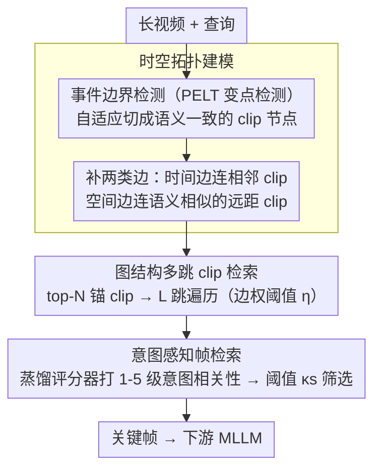

# VideoStir: Understanding Long Videos via Spatio-Temporally Structured and Intent-Aware RAG

**会议**: ACL 2026  
**arXiv**: [2604.05418](https://arxiv.org/abs/2604.05418)  
**代码**: [https://github.com/RomGai/VideoStir](https://github.com/RomGai/VideoStir)  
**领域**: 信息检索  
**关键词**: 长视频理解, 检索增强生成, 时空图结构, 意图感知检索, 多跳推理

## 一句话总结

VideoStir 提出了一种结构化且意图感知的长视频 RAG 框架，通过将视频建模为时空图进行多跳 clip 检索 + 训练意图相关性评分器进行帧级筛选，在不依赖辅助文本工具的前提下达到了与 SOTA 长视频 RAG 方法可比的性能。

## 研究背景与动机

**领域现状**：长视频理解是多模态智能的核心前沿任务。当前方法要么扩展上下文窗口进行均匀采样（易遗漏关键细节或被冗余信息淹没），要么使用 RAG 检索关键片段压缩上下文。

**现有痛点**：
- **时空结构解耦**：现有 RAG 方法将视频展平为独立片段，破坏了固有的时空结构，导致分散在不同时间点但上下文相关的事件无法被关联检索
- **意图建模不足**：主流方法依赖 CLIP 等对比嵌入计算语义相似度，只能匹配"看起来相似"的内容而非"对回答查询意图真正重要"的内容（如查询"录音员用打印机做什么？"，语义检索会选打印机画面而非实际目的相关的场景）

**核心矛盾**：展平检索丢失结构→遗漏上下文关联证据；语义匹配偏向表面相似→遗漏意图相关但语义不重叠的关键线索。

**本文目标**：从两个维度改进长视频 RAG——(1) 从展平到结构化：重建视频时空拓扑；(2) 从语义到意图：超越表面语义匹配，建模查询意图与视觉线索的对齐。

**切入角度**：类比人类情景记忆——先粗粒度定位相关情节（clip 检索），再细粒度审视细节（帧检索）。在 clip 级别用图结构保持时空关联，在帧级别用 MLLM 推理意图相关性。

**核心 idea**：将视频建模为时空图（节点=语义一致的 clip，边=时间邻近/空间相似），通过多跳遍历聚合结构化证据；再用蒸馏训练的意图相关性评分器在帧级别精细筛选。

## 方法详解

### 整体框架

VideoStir 处理的是长视频 QA：输入一段长视频和一个查询，输出送给下游 MLLM 的少量关键帧。它把人类"先粗定位情节、再细看细节"的回忆方式拆成两级——先把视频建成一张保留时空拓扑的图（节点是语义一致的 clip），在 clip 级别用多跳遍历沿时间线和语义空间聚合上下文相关的证据，再在帧级别用一个蒸馏出来的意图相关性评分器，把"看起来相似"的帧和"真正对回答查询有用"的帧区分开。整条链路不依赖 OCR、字幕生成等任何辅助文本工具，只吃原生视觉输入。

### 关键设计

**1. 时空拓扑建模：把展平的 clip 重新缠回一张图**

把长视频展平成独立片段会破坏它固有的时空结构，让分散在不同时间点却上下文相关的事件再也无法被一起检索到。VideoStir 用事件边界检测器（在帧嵌入上做 PELT 变点检测）把视频自适应切成语义一致的 clip 节点，构成图 $\mathcal{G}=(\mathcal{V}, \mathcal{E})$，再补上两类边：时间边连接相邻 clip 以保持叙事连续性，空间边则按 clip 嵌入的余弦相似度连接那些时间上相隔很远、语义上却相关的 clip。这两类边把本该相连的时空上下文重新缠回去，让后续的多跳检索可以同时沿时间线和语义空间扩展，而不是只能在一维时间轴上滑窗。

**2. 图结构多跳 clip 检索：补齐查询直接匹配遗漏的上下文**

一个查询往往只直接命中事件的一小部分，但完整推理需要它周边时间相邻、语义相关的上下文。VideoStir 先选出 top-N（默认 3）个与查询最相似的锚 clip，再从锚节点出发在图上做 L 跳（默认 2）遍历，按边权阈值 $\eta$（默认 0.4）过滤掉弱连接，收集整个时空邻域。借助 clip 之间预先建好的关联，多跳遍历能把查询单点匹配漏掉的证据补回来——这正是展平检索做不到的。

**3. 意图感知帧检索 + IR-600K 数据集：从"语义相似"升级到"意图相关"**

CLIP 这类对比模型优化的是语义对齐，于是查询"录音员用打印机做什么"时它会去匹配打印机的画面，而不是真正回答目的的场景，经常选到"看起来相关却对回答无用"的帧。MLLM 有推理能力能判断一帧对查询意图的贡献，但直接用大模型推理太慢，VideoStir 因此走蒸馏路线：用 Qwen2.5-VL-72B 当教师，对 60.5 万个 query-frame 对标注 1-5 级的意图相关性，蒸馏出一个仅 3.7M LoRA 参数的 Qwen2.5-VL-3B 学生评分器（这批标注即构成 IR-600K 数据集）。推理时对每个候选帧计算概率加权的期望得分，只保留超过阈值 $\kappa_s$ 的帧，从而在帧级别筛掉语义相似但意图无关的线索。

### 损失函数 / 训练策略

评分器以交叉熵训练，只优化 LoRA 参数：

$$\mathcal{L}_{CE} = -\sum_{\ell=1}^{5} \mathbf{1}[\ell=y_t] \log P_\theta(\ell\mid q, x_t, \mathcal{P}_{intent})$$

其中 $\ell$ 遍历 1-5 级相关性、$y_t$ 是教师标注、$\mathcal{P}_{intent}$ 是意图提示。优化器用 AdamW（lr=5e-5）配 cosine schedule，训练 1 个 epoch、batch size 128。

## 实验关键数据

### 主实验

| 基准MLLM | 方法 | LV-Bench | MLVU | Video-MME-Long |
|---------|------|----------|------|------------|
| LLaVA-Video 7B | Native | 56.6 | 70.8 | - |
| LLaVA-Video 7B | +Video-RAG | 58.7 (+3.7%) | 72.4 (+2.3%) | - |
| LLaVA-Video 7B | **+VideoStir** | **60.3 (+6.5%)** | **73.1 (+3.2%)** | - |
| LLaVA-Video 72B | Native | 61.9 | 73.1 | 61.5 |
| LLaVA-Video 72B | +Video-RAG | 65.4 (+5.7%) | 73.8 (+1.0%) | 62.3 (+1.3%) |
| LLaVA-Video 72B | **+VideoStir** | **66.0 (+6.6%)** | **74.1 (+1.4%)** | 62.1 (+1.0%) |

### 消融实验

| 配置 | Overall↑ | Retrieval Acc.↑ | 说明 |
|------|---------|----------------|------|
| Full | **64.5** | **92.2** | 完整模型 |
| w/o 意图评分器 (用 PE) | 58.1 | 79.8 | 语义匹配不足以捕捉意图 |
| w/o 概率加权期望 | 54.2 | 71.6 | 离散分数不如分布式评分 |
| w/o 时空图 | 56.4 | 74.8 | 展平检索丢失结构信息 |
| w/o 空间边 | 57.2 | 79.3 | 语义关联的远距 clip 被遗漏 |
| w/o 时间边 | 59.8 | 83.4 | 叙事连续性被破坏 |

### 关键发现
- VideoStir 不使用任何辅助文本工具（OCR、字幕生成等），仅靠原生视觉输入即达 SOTA
- 意图评分器比最强语义匹配（PE）提升 6.4%/12.4%（Overall/Retrieval Acc.），意图建模至关重要
- LoRA 微调（3.7M 参数）几乎匹配全参数微调（3.0B 参数）的性能，蒸馏策略高效
- 图结构中空间边和时间边都有贡献，但去除空间边的影响更大，说明远距语义关联很关键

## 亮点与洞察
- "从语义匹配到意图感知"的范式转变定位准确——语义相似 ≠ 对回答有用，这一洞察对所有 RAG 系统都有启发
- 时空图 + 多跳检索的设计优雅：重建视频的内在拓扑结构而非暴力搜索，类比人类的情景记忆回忆过程
- IR-600K 数据集本身是贡献：首个面向"意图级别帧-查询对齐"的数据集，可复用于未来研究
- 评分器蒸馏策略实用：从 72B 教师到 3B 学生，LoRA 仅 3.7M 参数，既保持质量又适合部署

## 局限与展望
- 时空图构建和多跳检索引入了额外的系统延迟，端到端延迟优化是重要方向
- 事件边界检测器的质量直接影响图结构，对复杂交错叙事可能不够鲁棒
- 在 Video-MME-Long 上 VideoStir 的提升不如 Video-RAG 显著（部分 MLLM 上），说明某些场景下辅助文本信息仍有价值
- 目前仅在 QA 任务上评估，对视频摘要、时间定位等其他任务的适用性需验证

## 相关工作与启发
- **vs Video-RAG**: Video-RAG 用辅助文本工具增强检索，VideoStir 仅靠原生视觉输入，更简洁且性能可比
- **vs DrVideo/Vgent（Agent 方法）**: Agent 方法推理开销大，VideoStir 通过图结构 + 轻量评分器更高效
- **vs AKS（关键帧选择）**: AKS 优化语义相似度 + 时间均匀性，VideoStir 引入意图级别的帧筛选

## 评分
- 新颖性: ⭐⭐⭐⭐ 时空图 + 意图评分器的组合解决了长视频 RAG 的两个核心痛点
- 实验充分度: ⭐⭐⭐⭐ 多基准、多 MLLM backbone、详细消融、评分器训练策略分析
- 写作质量: ⭐⭐⭐⭐ 问题分析→两个 gap→两个 shift 的叙事结构清晰有力

<!-- RELATED:START -->

## 相关论文

- [\[ACL 2026\] All Languages Matter: Understanding and Mitigating Language Bias in Multilingual RAG](all_languages_matter_understanding_and_mitigating_language_bias_in_multilingual_.md)
- [\[ACL 2026\] Disco-RAG: Discourse-Aware Retrieval-Augmented Generation](disco-rag_discourse-aware_retrieval-augmented_generation.md)
- [\[ICLR 2026\] Beyond RAG vs. Long-Context: Learning Distraction-Aware Retrieval for Efficient Knowledge Grounding](../../ICLR2026/information_retrieval/beyond_rag_vs_long-context_learning_distraction-aware_retrieval_for_efficient_kn.md)
- [\[ACL 2025\] The Distracting Effect: Understanding Irrelevant Passages in RAG](../../ACL2025/information_retrieval/the_distracting_effect_understanding_irrelevant_passages_in_rag.md)
- [\[ACL 2026\] S2G-RAG: Structured Sufficiency and Gap Judging for Iterative Retrieval-Augmented QA](s2g-rag_structured_sufficiency_and_gap_judging_for_iterative_retrieval-augmented.md)

<!-- RELATED:END -->
